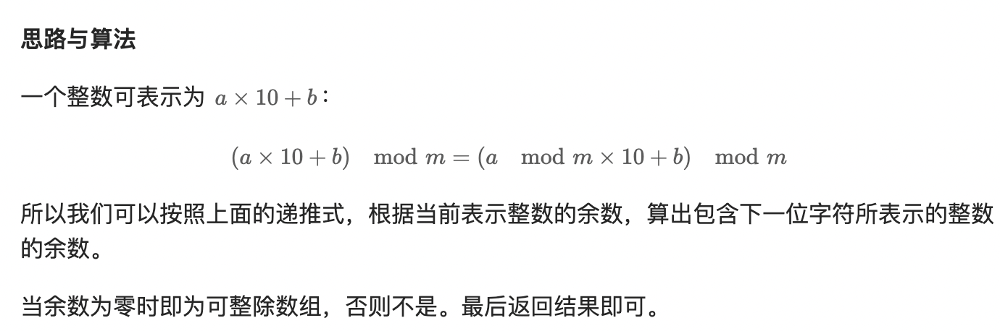

# 2575. 找出字符串的可整除数组

> 难度：<span style="color: #ffb800; font-weight: 500">中等</span>
>
> 地址：https://leetcode.cn/problems/find-the-divisibility-array-of-a-string/

给你一个下标从 **0** 开始的字符串 `word`，长度为 `n`，由从 `0` 到 `9` 的数字组成。另给你一个正整数 `m`。

`word` 的 **可整除数组** `div` 是一个长度为 `n` 的整数数组，并满足：

如果 `word[0,...,i]` 所表示的 **数值** 能被 `m` 整除，`div[i] = 1`
否则，`div[i] = 0`
返回 `word` 的可整除数组。

**示例 1：**

> **<font color=#000>输入</font>**：word = "998244353", m = 3
>
> **<font color=#000>输出</font>**：[1,1,0,0,0,1,1,0,0]
>
> **<font color=#000>解释</font>**：仅有 4 个前缀可以被 3 整除："9"、"99"、"998244" 和 "9982443" 。

**示例 2：**

> **<font color=#000>输入</font>**：word = "1010", m = 10
>
> **<font color=#000>输出</font>**：[0,1,0,1]
>
> **<font color=#000>解释</font>**：仅有 2 个前缀可以被 10 整除："10" 和 "1010" 。

**提示：**

-   `1 <= n <= 10^5`
-   `word.length == n`
-   `word` 由数字 `0` 到 `9` 组成
-   `1 <= m <= 10^9`

**题解：**

**方法一：模运算**



```js
/**
 * @param {string} word
 * @param {number} m
 * @return {number[]}
 */
var divisibilityArray = function (word, m) {
    const res = [];
    let val = 0;
    for (const w of word) {
        val = (val * 10 + (w.charCodeAt(0) - '0'.charCodeAt(0))) % m;
        res.push(val === 0 ? 1 : 0);
    }
    return res;
};
```
