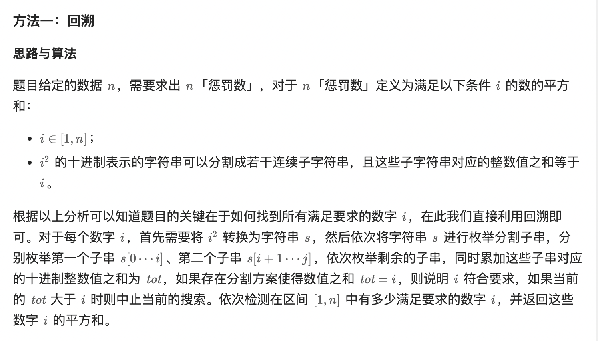

# 2698. 求一个整数的惩罚数

> 难度：<span style="color: #ffb800; font-weight: 500">中等</span>
>
> 地址：https://leetcode.cn/problems/find-the-punishment-number-of-an-integer/

给你一个正整数 `n` ，请你返回 `n` 的 **惩罚数** 。

`n` 的 **惩罚数** 定义为所有满足以下条件 `i` 的数的平方和：

-   `1 <= i <= n`
-   `i * i` 的十进制表示的字符串可以分割成若干连续子字符串，且这些子字符串对应的整数值之和等于 i 。

**示例 1：**

> **<font color=#000>输入</font>**：n = 10
>
> **<font color=#000>输出</font>**：182
>
> **<font color=#000>解释</font>**：总共有 3 个整数 i 满足要求：
> \- 1 ，因为 1 \* 1 = 1
> \- 9 ，因为 9 \* 9 = 81 ，且 81 可以分割成 8 + 1 。
> \- 10 ，因为 10 \* 10 = 100 ，且 100 可以分割成 10 + 0 。
> 因此，10 的惩罚数为 1 + 81 + 100 = 182

**示例 2：**

> **<font color=#000>输入</font>**：n = 37
>
> **<font color=#000>输出</font>**：1478
>
> **<font color=#000>解释</font>**：总共有 4 个整数 i 满足要求：
> \- 1 ，因为 1 \* 1 = 1
> \- 9 ，因为 9 \* 9 = 81 ，且 81 可以分割成 8 + 1 。
> \- 10 ，因为 10 \* 10 = 100 ，且 100 可以分割成 10 + 0 。
> \- 36 ，因为 36 \* 36 = 1296 ，且 1296 可以分割成 1 + 29 + 6 。
> 因此，37 的惩罚数为 1 + 81 + 100 + 1296 = 1478

**提示：**

-   `1 <= n <= 1000`

**题解：**



```js
/**
 * @param {number} n
 * @return {number}
 */
var punishmentNumber = function (n) {
    const dfs = (s, pos, tot, target) => {
        if (pos == s.length) {
            return tot == target;
        }
        let sum = 0;
        for (let i = pos; i < s.length; i++) {
            sum = sum * 10 + parseInt(s[i]);
            if (tot + sum > target) {
                break;
            }
            if (dfs(s, i + 1, tot + sum, target)) {
                return true;
            }
        }
        return false;
    };
    let ans = 0;
    for (let i = 1; i <= n; i++) {
        let s = (i * i).toString();
        if (dfs(s, 0, 0, i)) {
            ans += i * i;
        }
    }
    return ans;
};
```
