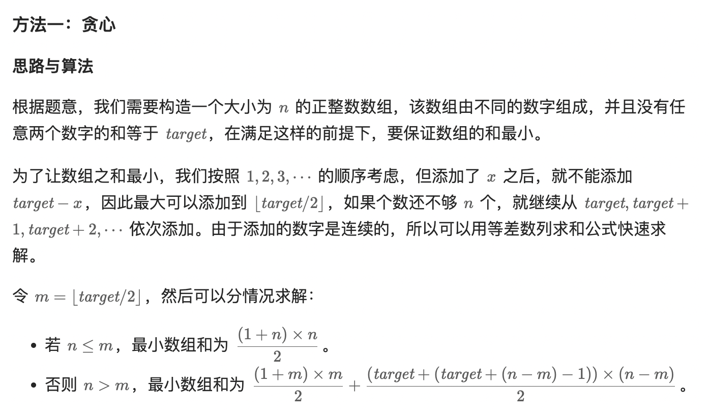

# 2834. 找出美丽数组的最小和

> 难度：<span style="color: #ffb800; font-weight: 500">中等</span>
>
> 地址：https://leetcode.cn/problems/find-the-minimum-possible-sum-of-a-beautiful-array/

给你两个正整数：`n` 和 `target` 。

如果数组 `nums` 满足下述条件，则称其为 **美丽数组** 。

-   `nums.length == n`.
-   `nums` 由两两互不相同的正整数组成。
-   在范围 `[0, n-1]` 内，**不存在** 两个 **不同** 下标 `i` 和 `j` ，使得 `nums[i] + nums[j] == target` 。
-   返回符合条件的美丽数组所可能具备的 `最小` 和，并对结果进行取模 `10^9 + 7`。

**示例 1：**

> **<font color=#000>输入</font>**：n = 2, target = 3
>
> **<font color=#000>输出</font>**：4
>
> **<font color=#000>解释</font>**：nums = [1,3] 是美丽数组。

-   nums 的长度为 n = 2 。
-   nums 由两两互不相同的正整数组成。
-   不存在两个不同下标 i 和 j ，使得 nums[i] + nums[j] == 3 。
    可以证明 4 是符合条件的美丽数组所可能具备的最小和。

**示例 2：**

> **<font color=#000>输入</font>**：n = 3, target = 3
>
> **<font color=#000>输出</font>**：8
>
> **<font color=#000>解释</font>**：nums = [1,3,4] 是美丽数组。

-   nums 的长度为 n = 3 。
-   nums 由两两互不相同的正整数组成。
-   不存在两个不同下标 i 和 j ，使得 nums[i] + nums[j] == 3 。
    可以证明 8 是符合条件的美丽数组所可能具备的最小和。

**示例 3：**

> **<font color=#000>输入</font>**：n = 1, target = 1
>
> **<font color=#000>输出</font>**：1
>
> **<font color=#000>解释</font>**：nums = [1] 是美丽数组。

**提示：**

-   `1 <= n <= 10^9`
-   `1 <= target <= 10^9`

**题解：**

**方法一：贪心**



```js
/**
 * @param {number} n
 * @param {number} target
 * @return {number}
 */
var minimumPossibleSum = function (n, target) {
    const mod = 1000000007;
    const m = Math.floor(target / 2);
    if (n <= m) {
        return (((1 + n) * n) / 2) % mod;
    }
    return (
        (((1 + m) * m) / 2 + ((target + target + (n - m) - 1) * (n - m)) / 2) %
        mod
    );
};
```
