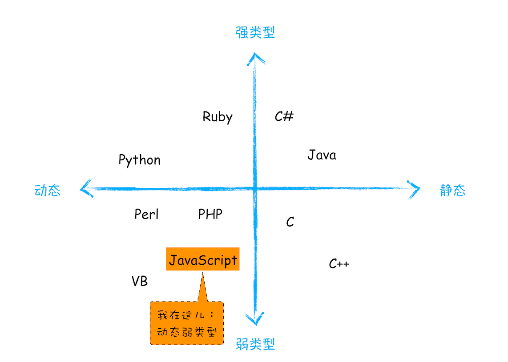
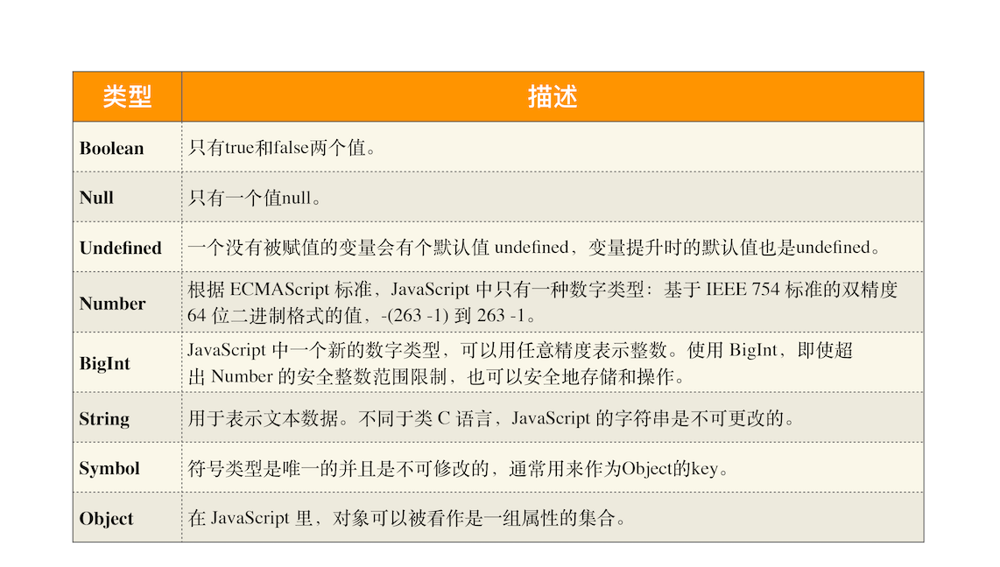
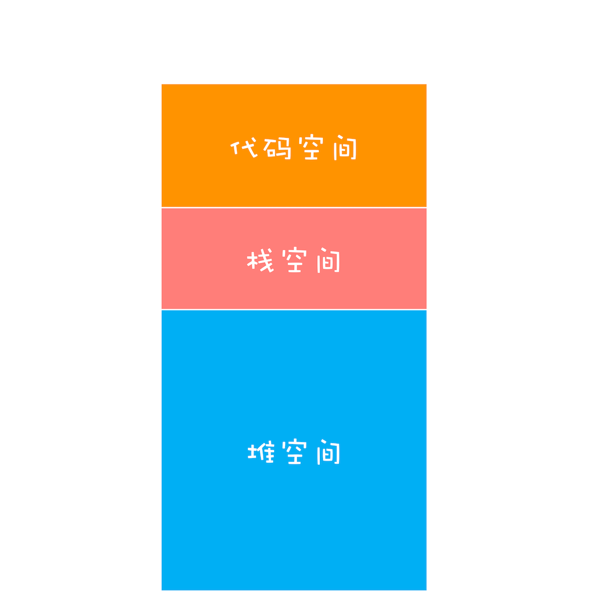
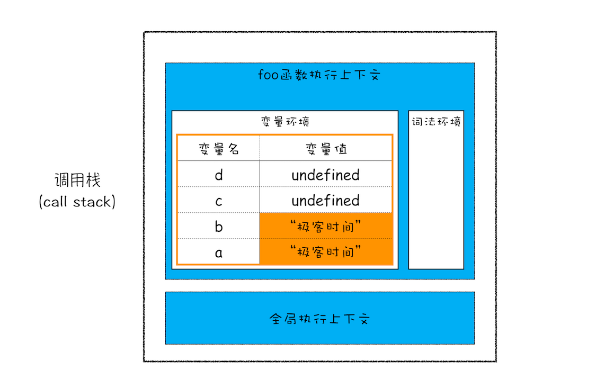
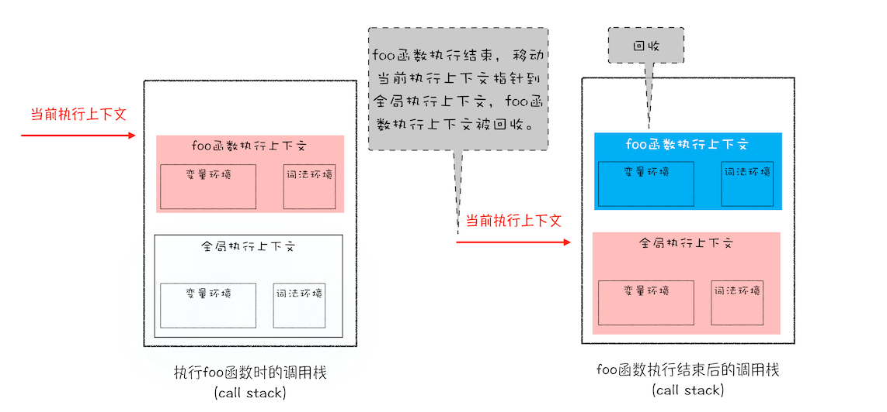
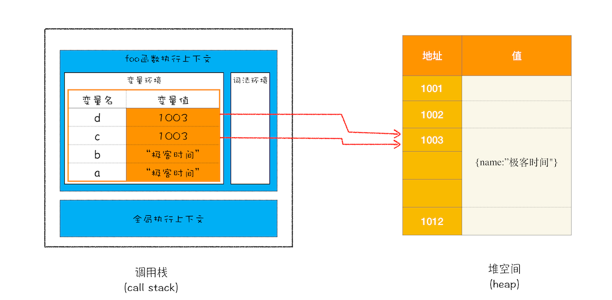
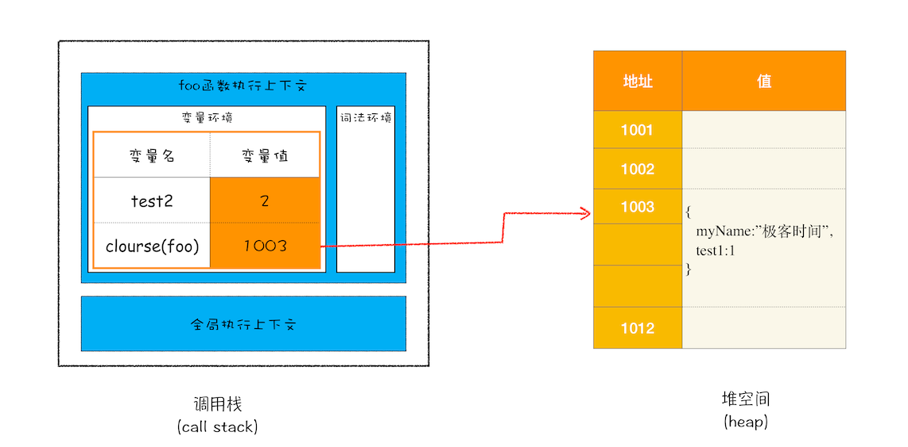

# 12 | 栈空间和堆空间：数据是如何存储的？


<audio preload="none" controls loop style="width: 100%;">
  <source src="../mp3/12-栈空间和堆空间：数据是如何存储的？.mp3" type="audio/mpeg">
  <!-- 如果浏览器不支持，则会呈现下面内容 -->
  <p>你的浏览器不支持HTML5音频，你可以<a href="../mp3/12-栈空间和堆空间：数据是如何存储的？.mp3">下载</a>这个音频文件</p>
</audio>

对于前端开发者来说，JavaScript 的内存机制是一个不被经常提及的概念 ，因此很容易被忽视。特别是一些非计算机专业的同学，对内存机制可能没有非常清晰的认识，甚至有些同学根本就不知道 JavaScript 的内存机制是什么。

但是如果你想成为行业专家，并打造高性能前端应用，那么你就必须要搞清楚 **JavaScript 的内存机制**了。

其实，要搞清楚 JavaScript 的内存机制并不是一件很困难的事，在接下来的三篇文章（数据在内存中的存放、JavaScript 处理垃圾回收以及 V8 执行代码）中，我们将通过内存机制的介绍，循序渐进带你走进 JavaScript 内存的世界。

今天我们讲述第一部分的内容——JavaScript 中的数据是如何存储在内存中的。虽然 JavaScript 并不需要直接去管理内存，但是在实际项目中为了能避开一些不必要的坑，你还是需要了解数据在内存中的存储方式的。

## 让人疑惑的代码

首先，我们先看下面这两段代码：

```js
function foo() {
  var a = 1;
  var b = a;
  a = 2;
  console.log(a);
  console.log(b);
}
foo();
function foo() {
  var a = { name: "极客时间" };
  var b = a;
  a.name = "极客邦";
  console.log(a);
  console.log(b);
}
foo();
```

若执行上述这两段代码，你知道它们输出的结果是什么吗？下面我们就来一个一个分析下。

执行第一段代码，打印出来 a 的值是 2，b 的值是 1，这没什么难以理解的。

接着，再执行第二段代码，你会发现，仅仅改变了 a 中 name 的属性值，但是最终 a 和 b 打印出来的值都是{name:"极客邦"}。这就和我们预期的不一致了，因为我们想改变的仅仅是 a 的内容，但 b 的内容也同时被改变了。

要彻底弄清楚这个问题，我们就得先从“JavaScript 是什么类型的语言”讲起。

## JavaScript 是什么类型的语言

每种编程语言都具有内建的数据类型，但它们的数据类型常有不同之处，使用方式也很不一样，比如 C 语言在定义变量之前，就需要确定变量的类型，你可以看下面这段 C 代码：

```c
int main() {
  int a = 1;
  char* b = "极客时间";
  bool c = true;
  return 0;
}
```

上述代码声明变量的特点是：在声明变量之前需要先定义变量类型。**我们把这种在使用之前就需要确认其变量数据类型的称为静态语言**。

**相反地，我们把在运行过程中需要检查数据类型的语言称为动态语言**。比如我们所讲的 JavaScript 就是动态语言，因为在声明变量之前并不需要确认其数据类型。

虽然 C 语言是静态，但是在 C 语言中，我们可以把其他类型数据赋予给一个声明好的变量，如：

```js
c = a;
```

前面代码中，我们把 int 型的变量 a 赋值给了 bool 型的变量 c，这段代码也是可以编译执行的，因为在赋值过程中，C 编译器会把 int 型的变量悄悄转换为 bool 型的变量，我们通常把这种偷偷转换的操作称为**隐式类型转换**。而**支持隐式类型转换的语言称为弱类型语言，不支持隐式类型转换的语言称为强类型语言**。在这点上，C 和 JavaScript 都是弱类型语言。

对于各种语言的类型，你可以参考下图：



<div style="text-align: center; font-size: 12px; color: #999; margin-bottom: 8px;">语言类型图</div>

## JavaScript 的数据类型

现在我们知道了，JavaScript 是一种弱类型的、动态的语言。那这些特点意味着什么呢？
弱类型，意味着你不需要告诉 JavaScript 引擎这个或那个变量是什么数据类型，JavaScript 引擎在运行代码的时候自己会计算出来。
动态，意味着你可以使用同一个变量保存不同类型的数据。
那么接下来，我们再来看看 JavaScript 的数据类型，你可以看下面这段代码：

```js
var bar;
bar = 12;
bar = "极客时间";
bar = true;
bar = null;
bar = { name: "极客时间" };
```

从上述代码中你可以看出，我们声明了一个 bar 变量，然后可以使用各种类型的数据值赋予给该变量。
在 JavaScript 中，如果你想要查看一个变量到底是什么类型，可以使用“typeof”运算符。具体使用方式如下所示：

```js
var bar;
console.log(typeof bar); //undefined
bar = 12;
console.log(typeof bar); //number
bar = "极客时间";
console.log(typeof bar); //string
bar = true;
console.log(typeof bar); //boolean
bar = null;
console.log(typeof bar); //object
bar = { name: "极客时间" };
console.log(typeof bar); //object
```

执行这段代码，你可以看到打印出来了不同的数据类型，有 undefined、number、boolean、object 等。那么接下来我们就来谈谈 JavaScript 到底有多少种数据类型。
其实 JavaScript 中的数据类型一种有 8 种，它们分别是：



了解这些类型之后，还有三点需要你注意一下。

第一点，使用 typeof 检测 Null 类型时，返回的是 Object。这是当初 JavaScript 语言的一个 Bug，一直保留至今，之所以一直没修改过来，主要是为了兼容老的代码。

第二点，Object 类型比较特殊，它是由上述 7 种类型组成的一个包含了 key-value 对的数据类型。如下所示：

```js
let myObj = {
name:'极客时间',
update:function(){....}
}
```

从中你可以看出来，Object 是由 key-value 组成的，其中的 vaule 可以是任何类型，包括函数，这也就意味着你可以通过 Object 来存储函数，Object 中的函数又称为方法，比如上述代码中的 update 方法。

第三点，我们把前面的 7 种数据类型称为**原始类型**，把最后一个对象类型称为**引用类型**，之所以把它们区分为两种不同的类型，是因为它们在内存中存放的位置不一样。到底怎么个不一样法呢？接下来，我们就来讲解一下 JavaScript 的原始类型和引用类型到底是怎么储存的。

## 内存空间

要理解 JavaScript 在运行过程中数据是如何存储的，你就得先搞清楚其存储空间的种类。下面是我画的 JavaScript 的内存模型，你可以参考下：



<div style="text-align: center; font-size: 12px; color: #999; margin-bottom: 8px;">JavaScript 内存模型</div>

从图中可以看出， 在 JavaScript 的执行过程中， 主要有三种类型内存空间，分别是**代码空间**、**栈空间**和**堆空间**。

其中的代码空间主要是存储可执行代码的，这个我们后面再做介绍，今天主要来说说栈空间和堆空间。

### 栈空间和堆空间

这里的栈空间就是我们之前反复提及的调用栈，是用来存储执行上下文的。为了搞清楚栈空间是如何存储数据的，我们还是先看下面这段代码：

```js
function foo() {
  var a = "极客时间";
  var b = a;
  var c = { name: "极客时间" };
  var d = c;
}
foo();
```

前面文章我们已经讲解过了，当执行一段代码时，需要先编译，并创建执行上下文，然后再按照顺序执行代码。那么下面我们来看看，当执行到第 3 行代码时，其调用栈的状态，你可以参考下面这张调用栈状态图：



<div style="text-align: center; font-size: 12px; color: #999; margin-bottom: 8px;">执行到第 3 行时的调用栈状态图</div>

从图中可以看出来，当执行到第 3 行时，变量 a 和变量 b 的值都被保存在执行上下文中，而执行上下文又被压入到栈中，所以你也可以认为变量 a 和变量 b 的值都是存放在栈中的。

接下来继续执行第 4 行代码，由于 JavaScript 引擎判断右边的值是一个引用类型，这时候处理的情况就不一样了，JavaScript 引擎并不是直接将该对象存放到变量环境中，而是将它分配到堆空间里面，分配后该对象会有一个在“堆”中的地址，然后再将该数据的地址写进 c 的变量值，最终分配好内存的示意图如下所示：


<div style="text-align: center; font-size: 12px; color: #999; margin-bottom: 8px;">对象类型是“堆”来存储</div>

从上图你可以清晰地观察到，对象类型是存放在堆空间的，在栈空间中只是保留了对象的引用地址，当 JavaScript 需要访问该数据的时候，是通过栈中的引用地址来访问的，相当于多了一道转手流程。

好了，现在你应该知道了**原始类型的数据值都是直接保存在“栈”中的，引用类型的值是存放在“堆”中的**。不过你也许会好奇，为什么一定要分“堆”和“栈”两个存储空间呢？所有数据直接存放在“栈”中不就可以了吗？

答案是不可以的。这是因为 JavaScript 引擎需要用栈来维护程序执行期间上下文的状态，如果栈空间大了话，所有的数据都存放在栈空间里面，那么会影响到上下文切换的效率，进而又影响到整个程序的执行效率。比如文中的 foo 函数执行结束了，JavaScript 引擎需要离开当前的执行上下文，只需要将指针下移到上个执行上下文的地址就可以了，foo 函数执行上下文栈区空间全部回收，具体过程你可以参考下图：



<div style="text-align: center; font-size: 12px; color: #999; margin-bottom: 8px;">调用栈中切换执行上下文状态</div>

所以**通常情况下，栈空间都不会设置太大，主要用来存放一些原始类型的小数据**。而引用类型的数据占用的空间都比较大，所以这一类数据会被存放到堆中，**堆空间很大，能存放很多大的数据**，不过缺点是分配内存和回收内存都会占用一定的时间。

解释了程序在执行过程中为什么需要堆和栈两种数据结构后，我们还是回到示例代码那里，看看它最后一步将变量 c 赋值给变量 d 是怎么执行的？

在 JavaScript 中，赋值操作和其他语言有很大的不同，**原始类型的赋值会完整复制变量值，而引用类型的赋值是复制引用地址**。

所以 d=c 的操作就是把 c 的引用地址赋值给 d，你可以参考下图：



<div style="text-align: center; font-size: 12px; color: #999; margin-bottom: 8px;">引用赋值</div>

从图中你可以看到，变量 c 和变量 d 都指向了同一个堆中的对象，所以这就很好地解释了文章开头的那个问题，通过 c 修改 name 的值，变量 d 的值也跟着改变，归根结底它们是同一个对象。

### 再谈闭包

现在你知道了作用域内的原始类型数据会被存储到栈空间，引用类型会被存储到堆空间，基于这两点的认知，我们再深入一步，探讨下闭包的内存模型。

这里以《10 | 作用域链和闭包 ：代码中出现相同的变量，JavaScript 引擎是如何选择的？》中关于闭包的一段代码为例：

```js
function foo() {
  var myName = "极客时间";
  let test1 = 1;
  const test2 = 2;
  var innerBar = {
    setName: function (newName) {
      myName = newName;
    },
    getName: function () {
      console.log(test1);
      return myName;
    },
  };
  return innerBar;
}
var bar = foo();
bar.setName("极客邦");
bar.getName();
console.log(bar.getName());
```

当执行这段代码的时候，你应该有过这样的分析：由于变量 myName、test1、test2 都是原始类型数据，所以在执行 foo 函数的时候，它们会被压入到调用栈中；当 foo 函数执行结束之后，调用栈中 foo 函数的执行上下文会被销毁，其内部变量 myName、test1、test2 也应该一同被销毁。

但是在那篇文章中，我们介绍了当 foo 函数的执行上下文销毁时，由于 foo 函数产生了闭包，所以变量 myName 和 test1 并没有被销毁，而是保存在内存中，那么应该如何解释这个现象呢？

要解释这个现象，我们就得站在内存模型的角度来分析这段代码的执行流程。

1. 当 JavaScript 引擎执行到 foo 函数时，首先会编译，并创建一个空执行上下文。

2. 在编译过程中，遇到内部函数 setName，JavaScript 引擎还要对内部函数做一次快速的词法扫描，发现该内部函数引用了 foo 函数中的 myName 变量，由于是内部函数引用了外部函数的变量，所以 JavaScript 引擎判断这是一个闭包，于是在堆空间创建换一个“closure(foo)”的对象（这是一个内部对象，JavaScript 是无法访问的），用来保存 myName 变量。

3. 接着继续扫描到 getName 方法时，发现该函数内部还引用变量 test1，于是 JavaScript 引擎又将 test1 添加到“closure(foo)”对象中。这时候堆中的“closure(foo)”对象中就包含了 myName 和 test1 两个变量了。

4. 由于 test2 并没有被内部函数引用，所以 test2 依然保存在调用栈中。

通过上面的分析，我们可以画出执行到 foo 函数中“return innerBar”语句时的调用栈状态，如下图所示：



<div style="text-align: center; font-size: 12px; color: #999; margin-bottom: 8px;">闭包的产生过程</div>

从上图你可以清晰地看出，当执行到 foo 函数时，闭包就产生了；当 foo 函数执行结束之后，返回的 getName 和 setName 方法都引用“closure(foo)”对象，所以即使 foo 函数退出了，“ closure(foo)”依然被其内部的 getName 和 setName 方法引用。所以在下次调用 bar.setName 或者 bar.getName 时，创建的执行上下文中就包含了“closure(foo)”。

总的来说，产生闭包的核心有两步：第一步是需要预扫描内部函数；第二步是把内部函数引用的外部变量保存到堆中。

## 总结

好了，今天就讲到这里，下面我来简单总结下今天的要点。
我们介绍了 JavaScript 中的 8 种数据类型，它们可以分为两大类——**原始类型和引用类型**。

其中，原始类型的数据是存放在**栈**中，引用类型的数据是存放在**堆**中的。堆中的数据是通过引用和变量关联起来的。也就是说，JavaScript 的变量是没有数据类型的，值才有数据类型，变量可以随时持有任何类型的数据。

然后我们分析了，在 JavaScript 中将一个原始类型的变量 a 赋值给 b，那么 a 和 b 会相互独立、互不影响；但是将引用类型的变量 a 赋值给变量 b，那会导致 a、b 两个变量都同时指向了堆中的同一块数据。
最后，我们还站在内存模型的视角分析了闭包的产生过程。

## 思考时间

在实际的项目中，经常需要完整地拷贝一个对象，也就是说拷贝完成之后两个对象之间就不能互相影响。那该如何实现呢？

结合下面这段代码，你可以分析下它是如何将对象 jack 拷贝给 jack2，然后在完成拷贝操作时两个 jack 还互不影响的呢。

```js
let jack = {
  name: "jack.ma",
  age: 40,
  like: {
    dog: {
      color: "black",
      age: 3,
    },
    cat: {
      color: "white",
      age: 2,
    },
  },
};
function copy(src) {
  let dest;
  //实现拷贝代码，将 src 的值完整地拷贝给 dest
  //在这里实现
  return dest;
}
let jack2 = copy(jack);
//比如修改 jack2 中的内容，不会影响到 jack 中的值
jack2.like.dog.color = "green";
console.log(jack.like.dog.color); //打印出来的应该是 "black"
```

<!-- 1、从内存模型角度分析执行代码的执行流程第二步看，在堆空间创建closure(foo)对象，它是存储在foo函数的执行上下文中的。
那么closure(foo)创建开始时是空对象，执行第三步的时候，才会逐渐把变量添加到其中。
2、当foo函数执行结束后，foo的执行上下文是不是销毁了？如果销毁了，产生一下两个疑问：
a、如果foo函数执行上下文销毁了，closure(foo)并没有销毁，那foo函数执行上下文是怎么销毁的呢？就比如销毁一个盒子，盒子毁里，里面的东西应该也是毁掉的
b、既然closure(foo)既然没有销毁，那它存储在堆中的什么地方呢？必定它所依赖的foo执行上下文已经不存在了
作者回复: 关于foo函数执行上下文销毁过程：foo函数执行结束之后，当前执行状态的指针下移到栈中的全局执行上下文的位置，foo函数的执行上下文的那块数据就挪出来，这也就是foo函数执行上下文的销毁过程，这个文中有提到，你可以参考“调用栈中切换执行上下文状态“图。
第二个问题：innerBar返回后，含有setName和getName对象，这两个对象里面包含了堆中的closure(foo)的引用。虽然foo执行上下文销毁了，foo函数中的对closure(foo)的引用也断开了，但是setName和getName里面又重新建立起来了对closure(foo)引用。
你可以：
1:打开“开发者工具”
2:在控制台执行上述代码
3:然后选择“Memory”标签，点击"take snapshot" 获取V8的堆内存快照。
4:然后“command+f"(mac) 或者 "ctrl+f"(win),搜索“setName”，然后你就会发现setName对象下面包含了 raw_outer_scope_info_or_feedback_metadata，对闭包的引用数据就在这里面。


Marvin
2019-08-31
function copy(dest){
if(typeof dest === 'object'){
if(!dest) return dest; // null
var obj = dest.constructor(); // Object/Array
for(var key in dest){
obj[key] = copy(dest[key])
}
return obj;
} else {
return dest;
}
}
作者回复: 挺好 继续


尝试者说
2019-12-14
这门课程是我看过最好的课程，真的时候做到了深入浅出、行云流水、水银泻地般的境界。老师你多多开开前端的其他课程啊，保证很多人愿意来听课的。
作者回复: 多谢哈，在准备V8的课程了

共 3 条评论

37

烈日烹雪
2019-10-31
老师，第二遍看时有了个疑问 字符串存在栈里，但是字符串与其他原始类型不同，不一定只占几个字节的长度。如果字符串特别长，长到好几M，也会存在栈里吗？

柒月
2019-08-31
最近面试老问这个问题，什么是深拷贝和浅拷贝以及如何实现一个深拷贝？
1、JSON.parse(JSON.stringify(obj))
2、递归遍历对象
3、Object.assigin() 这种方法只能拷贝一层，有嵌套的情况就不适用了。

sellardoor
2020-07-17
字符串，symbol，bigint虽然是原始类型，但是实际还是存放在堆空间的。
比如字符串的大小可能很大，考虑性能还是存放在堆空间。
具体浏览器控制台 => memory => 打印快照，在heal里搜索string，可以发现字符串在堆空间
这个问题，网上基本都是错的，也很少有文档数据介绍，最新的绿皮书有提到

李懂
2019-08-31
这里讲解的真好，闭包果然不是在栈中存储的，消除了我一直以来的疑惑，上下文销毁后闭包去哪了！
现在还有个问题，setname方法是通过什么引用闭包的，是存在内部变量么？
共 5 条评论

18

ChaoZzz
2019-08-31
1. JSON.parse(JSON.stringify(...))
function copy(src){
let dest;
dest = JSON.parse(JSON.stringify(src));
return dest;
}
缺点：无法拷贝函数
2. Object.assign({}, source)
function copy(src){
let dest;
dest = Object.assign({}, src);
return dest;
}
缺点：只能拷贝一层
3. function copy(src) {
let dest;
if (typeof src !== 'object') return ;
dest = src instanceof Array ? [] : {};
for (let key of Object.keys(src)) {
dest[key] = typeof src[key] === 'object' ? deepCopy(src[key]) : src[key];
}
return dest;
}

Lx
2019-08-31
老师，后续是否会谅解下devtools做内存分析？基本用法会，但具体分析问题不知道怎么弄……

伟伟
2020-04-14
终于理解闭包了，这名字是谁起的？叫圈多好，或者叫代码圈

XWL
2019-09-18
老师，我有几个疑问：
1、Function 函数类型也是继承于Object，声明函数后是不是也是存在堆空间中的，那么浏览器编译函数时是不是会同时创建执行上下文和向堆空间中压入一个值
2、function a(){
var b = 1;
var c = {
d: 2
};
}
当 a 的执行上下文销毁后，c 对象在堆空间中的引用会跟着销毁么，将 c 返回出去或不返回，会不会是不一样的情况
展开
作者回复: 函数就是一种特别的对象，所以会保存在堆上，编译函数时，这个函数的已经存在于堆中了！
第二个问题返回了c对象的话，那么说明全局环境对c对象有引用，既然有引用那么就不会被垃圾回收器标记出来，所以c对象也就不会回收！



10

Kids See Ghost
2022-01-15
想指出几个问题。还希望作者别把这条留言屏蔽掉：
1. “原始类型的数据是存放在栈中，引用类型的数据是存放在堆中的” 这是不对的，至少v8不是这样。除了小的整数之外(Smi), 其他类型，包括string，都是在Heap上。另外像数字类型，很多时候也是在Heap上。具体参考: https://v8.dev/blog/react-cliff
"For small integers in the 31-bit signed integer range, V8 uses a special representation called Smi. Anything that is not a Smi is represented as a HeapObject, which is the address of some entity in memory. "
这里v8的文档里面也有讲： https://developer.chrome.com/docs/devtools/memory-problems/memory-101/#javascript_object_representation
"原始类型的赋值会完整复制变量值，而引用类型的赋值是复制引用地址。" 这也是错的。因为string interning的存在，string literals都存在constant pool里，`const a = 'foo'; const b = `foo` 这里内存里面不会有两个字符串`foo`, 被复制不是string的值，而是constant pool pointer.
这些在v8的design doc里面有讲。https://docs.google.com/document/d/11T2CRex9hXxoJwbYqVQ32yIPMh0uouUZLdyrtmMoL44/edit#

A君
2020-08-10
引擎在编译时做词法分析时，如果发现内部函数引用了外部函数的变量，就认为它是闭包，会在堆中创建一个closure对象，并把其中访问的所有变量都放进这个对象里，然后把这个closure对象的地址返回给上级上下文的变量。

手撕蚊子
2020-03-25
文中图：《闭包的产生过程》中，clourse(foo)中的变量test1是由let声明的
在没有闭包的时候，按照第九章的解释，test1应存于foo执行上下文的词法环境中，
那在其处于闭包对象的条件下，怎么维持这种块级作用域的生效呢？
以下这段代码在chrome里打断点，scope里面是没有生成Closure而是一个Block,请问怎么理解这个问题呢？
function foo() {
let x = 1
{
let x = 2
function bar(params) {
return x
}
}
console.log('a', x)
return bar
}
const fn = foo()
console.log('b', fn())

浪里行舟
2019-09-19
老师，专栏的配图怎么画出来的
作者回复: macos的keynote

共 4 条评论

4

Slowdive
2020-04-10
闭包是放入了堆空间，这是在foo的编译阶段。在执行setname时编译setname，这时候之前放入堆里的闭包又是怎么被找到的呢？

mfist
2019-08-31
1. dest = JSON.parse(JSON.stringify(src))
2. function copy(src){
let type = typeof src
if('object' === type){
let result = Object.create(null)
for(let i in src){
if(typeof src[i] === 'object'){
result[i] = copy(src[i])
}else{
result[i] = src[i]
}
}
return result
}
return src
}
3. 今日总结
javascript的内存机制主要包括数据的存放、垃圾回收、代码的执行三个部分 这一节主要介绍数据的存放，javascript作为一种动态弱类型语言（动态静态是指使用之前是否确定数据类型，强弱类型是指是否支持隐式类型转换）其在内存空间存储有三个部分：代码空间（存储可执行代码）、栈空间（存储基本数据类型）、堆空间（对象）。闭包(Closure)中的变量存放在哪里呢？内部函数引用外部函数变量时候引擎会在堆空间中创建一个closure对象存放闭包变量。

luwei
2020-06-25
如果字符串是存储在栈内的，并且根据数据类型那里的介绍，js中的字符串是不可变的，那么var a = 'aaa'; a = 'bbb' 这个操作在栈内的操作是什么样的

张萌
2020-05-18
// 深拷贝函数
function deepclone(obj) {
if (typeof obj !== 'object' || obj == null) {
return obj;
}
const result = obj instanceof Array ? [] : {};
for (const key in obj) {
if (obj.hasOwnProperty(key)) {
result[key] = deepclone(obj[key]);
}
}
return result;
} -->
