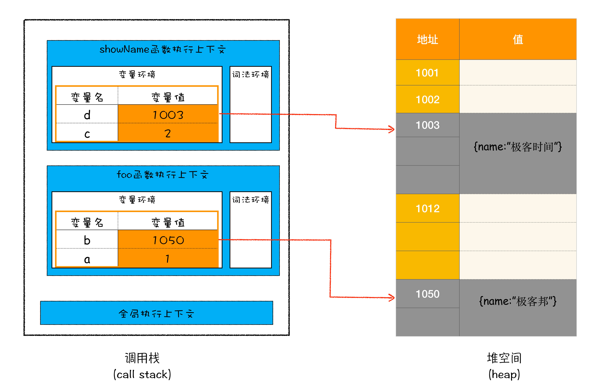
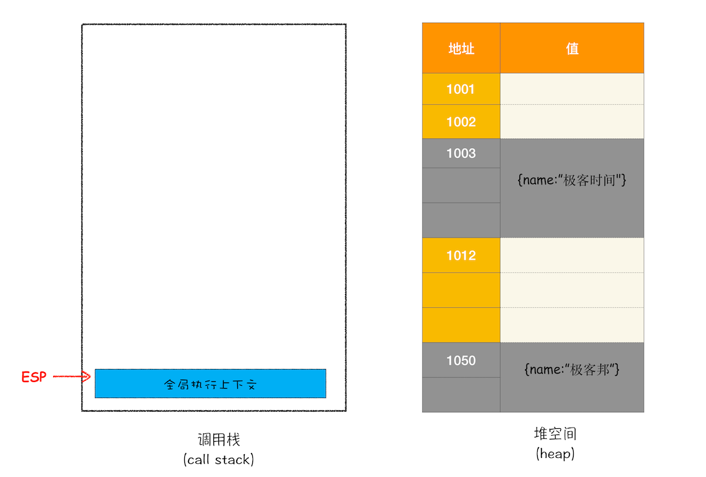
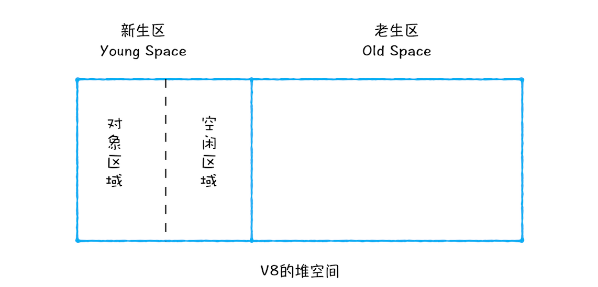
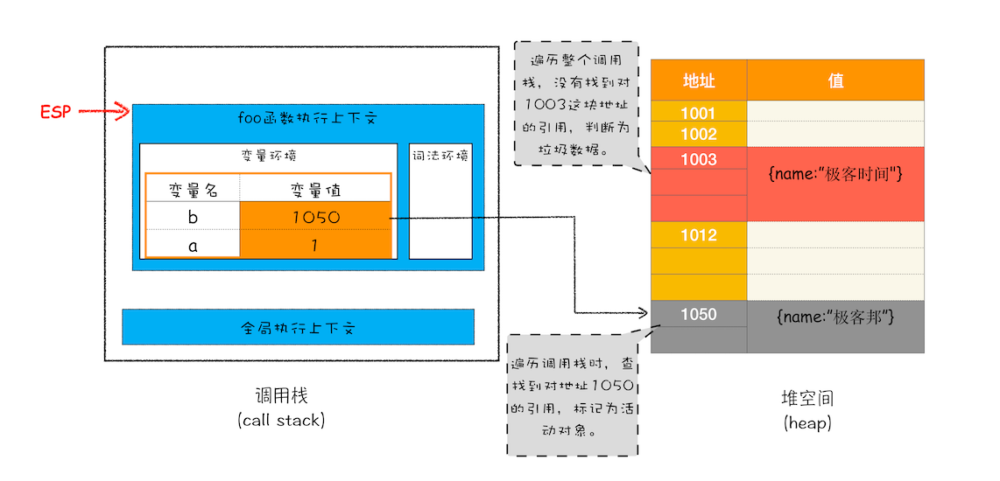
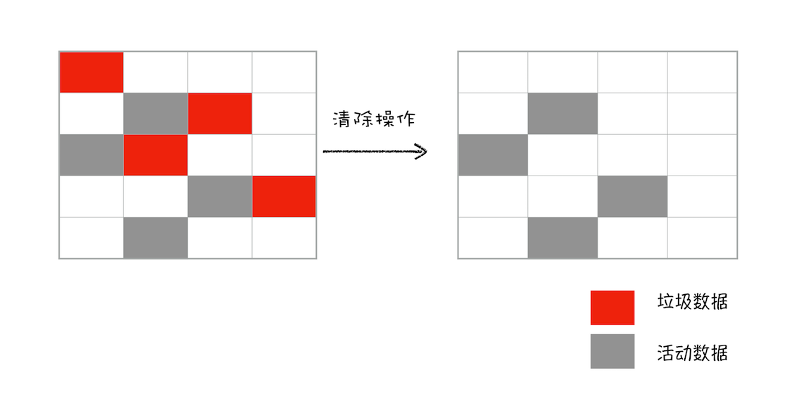
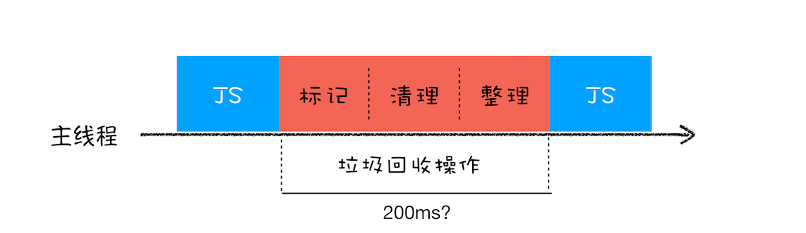
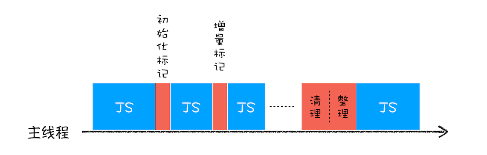

# 13 | 垃圾回收：垃圾数据是如何自动回收的？


<audio preload="none" controls loop style="width: 100%;">
  <source src="../mp3/13-垃圾回收：垃圾数据是如何自动回收的？.mp3" type="audio/mpeg">
  <!-- 如果浏览器不支持，则会呈现下面内容 -->
  <p>你的浏览器不支持HTML5音频，你可以<a href="../mp3/13-垃圾回收：垃圾数据是如何自动回收的？.mp3">下载</a>这个音频文件</p>
</audio>

在上一篇文章中，我们提到了 JavaScript 中的数据是如何存储的，并通过例子分析了**原始数据类型是存储在栈空间中的，引用类型的数据是存储在堆空间中的**。通过这种分配方式，我们解决了数据的内存分配的问题。

不过有些数据被使用之后，可能就不再需要了，我们把这种数据称为**垃圾数据**。如果这些垃圾数据一直保存在内存中，那么内存会越用越多，所以我们需要**对这些垃圾数据进行回收，以释放有限的内存空间**。

## 不同语言的垃圾回收策略

通常情况下，垃圾数据回收分为**手动回收**和**自动回收**两种策略。

如 C/C++ 就是使用手动回收策略，何时分配内存、何时销毁内存都是由代码控制的，你可以参考下面这段 C 代码：

```C
//在堆中分配内存
char* p = (char*)malloc(2048); //在堆空间中分配 2048 字节的空间，并将分配后的引用地址保存到 p 中

//使用 p 指向的内存
{
//....
}

//使用结束后，销毁这段内存
free(p)；
p = NULL；
```

从上面这段 C 代码可以看出来，要使用堆中的一块空间，我们需要先调用 mallco 函数分配内存，然后再使用；当不再需要这块数据的时候，就要手动调用 free 函数来释放内存。如果这段数据已经不再需要了，但是又没有主动调用 free 函数来销毁，那么这种情况就被称为**内存泄漏**。

另外一种使用的是自动垃圾回收的策略，如 JavaScript、Java、Python 等语言，**产生的垃圾数据是由垃圾回收器来释放的**，并不需要手动通过代码来释放。

对于 JavaScript 而言，也正是这个“自动”释放资源的特性带来了很多困惑，也让一些 JavaScript 开发者误以为可以不关心内存管理，这是一个很大的误解。

那么在本文，我们将围绕“JavaScript 的数据是如何回收的”这个话题来展开探讨。因为数据是存储在栈和堆两种内存空间中的，所以接下来我们就来分别介绍“栈中的垃圾数据”和“堆中的垃圾数据”是如何回收的。

## 调用栈中的数据是如何回收的

首先是调用栈中的数据，我们还是通过一段示例代码的执行流程来分析其回收机制，具体如下：

```js
function foo() {
  var a = 1;
  var b = { name: "极客邦" };
  function showName() {
    var c = 2;
    var d = { name: "极客时间" };
  }
  showName();
}
foo();
```

当执行到第 6 行代码时，其调用栈和堆空间状态图如下所示：



<div style="text-align: center; font-size: 12px; color: #999; margin-bottom: 8px;">执行到 showName 函数时的内存模型</div>

从图中可以看出，原始类型的数据被分配到栈中，引用类型的数据会被分配到堆中。当 foo 函数执行结束之后，foo 函数的执行上下文会从堆中被销毁掉，那么它是怎么被销毁的呢？下面我们就来分析一下。

在上篇文章中，我们简单介绍过了，如果执行到 showName 函数时，那么 JavaScript 引擎会创建 showName 函数的执行上下文，并将 showName 函数的执行上下文压入到调用栈中，最终执行到 showName 函数时，其调用栈就如上图所示。与此同时，还有一个**记录当前执行状态的指针（称为 ESP）**，指向调用栈中 showName 函数的执行上下文，表示当前正在执行 showName 函数。

接着，当 showName 函数执行完成之后，函数执行流程就进入了 foo 函数，那这时就需要销毁 showName 函数的执行上下文了。ESP 这时候就帮上忙了，JavaScript 会将 ESP 下移到 foo 函数的执行上下文，**这个下移操作就是销毁 showName 函数执行上下文的过程**。

你可能会有点懵，ESP 指针向下移动怎么就能把 showName 的执行上下文销毁了呢？具体你可以看下面这张移动 ESP 前后的对比图：


<div style="text-align: center; font-size: 12px; color: #999; margin-bottom: 8px;">从栈中回收 showName 执行上下文</div>

从图中可以看出，当 showName 函数执行结束之后，ESP 向下移动到 foo 函数的执行上下文中，上面 showName 的执行上下文虽然保存在栈内存中，但是已经是无效内存了。比如当 foo 函数再次调用另外一个函数时，这块内容会被直接覆盖掉，用来存放另外一个函数的执行上下文。

所以说，当一个函数执行结束之后，**JavaScript 引擎会通过向下移动 ESP 来销毁该函数保存在栈中的执行上下文**。

## 堆中的数据是如何回收的

通过上面的讲解，我想现在你应该已经知道，当上面那段代码的 foo 函数执行结束之后，ESP 应该是指向全局执行上下文的，那这样的话，showName 函数和 foo 函数的执行上下文就处于无效状态了，不过保存在堆中的两个对象依然占用着空间，如下图所示：



<div style="text-align: center; font-size: 12px; color: #999; margin-bottom: 8px;">foo 函数执行结束后的内存状态</div>

从图中可以看出，1003 和 1050 这两块内存依然被占用。**要回收堆中的垃圾数据，就需要用到 JavaScript 中的垃圾回收器了**。

所以，接下来我们就来通过 Chrome 的 JavaScript 引擎 V8 来分析下堆中的垃圾数据是如何回收的。

### 代际假说和分代收集

不过在正式介绍 V8 是如何实现回收之前，你需要先学习下代际假说（The Generational Hypothesis）的内容，这是垃圾回收领域中一个重要的术语，后续垃圾回收的策略都是建立在该假说的基础之上的，所以很是重要。

**代际假说**有以下两个特点：

- 第一个是大部分对象在内存中存在的时间很短，简单来说，就是很多对象一经分配内存，很快就变得不可访问；

* 第二个是不死的对象，会活得更久。

其实这两个特点不仅仅适用于 JavaScript，同样适用于大多数的动态语言，如 Java、Python 等。
有了代际假说的基础，我们就可以来探讨 V8 是如何实现垃圾回收的了。

通常，垃圾回收算法有很多种，但是并没有哪一种能胜任所有的场景，你需要权衡各种场景，根据对象的生存周期的不同而使用不同的算法，以便达到最好的效果。

所以，在 V8 中会把堆分为**新生代**和**老生代**两个区域，**新生代中存放的是生存时间短的对象，老生代中存放的生存时间久的对象**。

新生区通常只支持 1 ～ 8M 的容量，而老生区支持的容量就大很多了。对于这两块区域，V8 分别使用两个不同的垃圾回收器，以便更高效地实施垃圾回收。

- 副垃圾回收器，主要负责新生代的垃圾回收。

* 主垃圾回收器，主要负责老生代的垃圾回收。

### 垃圾回收器的工作流程

现在你知道了 V8 把堆分成两个区域——新生代和老生代，并分别使用两个不同的垃圾回收器。其实**不论什么类型的垃圾回收器，它们都有一套共同的执行流程**。

第一步是标记空间中活动对象和非活动对象。所谓活动对象就是还在使用的对象，非活动对象就是可以进行垃圾回收的对象。

第二步是回收非活动对象所占据的内存。其实就是在所有的标记完成之后，统一清理内存中所有被标记为可回收的对象。

第三步是做内存整理。一般来说，频繁回收对象后，内存中就会存在大量不连续空间，我们把这些不连续的内存空间称为**内存碎片**。当内存中出现了大量的内存碎片之后，如果需要分配较大连续内存的时候，就有可能出现内存不足的情况。所以最后一步需要整理这些内存碎片，但这步其实是可选的，因为有的垃圾回收器不会产生内存碎片，比如接下来我们要介绍的副垃圾回收器。

那么接下来，我们就按照这个流程来分析新生代垃圾回收器（副垃圾回收器）和老生代垃圾回收器（主垃圾回收器）是如何处理垃圾回收的。

### 副垃圾回收器

副垃圾回收器主要负责新生区的垃圾回收。而通常情况下，大多数小的对象都会被分配到新生区，所以说这个区域虽然不大，但是垃圾回收还是比较频繁的。

新生代中用 **Scavenge 算法**来处理。所谓 Scavenge 算法，是把新生代空间对半划分为两个区域，一半是对象区域，一半是空闲区域，如下图所示：



<div style="text-align: center; font-size: 12px; color: #999; margin-bottom: 8px;">新生区要划分为对象区域和空闲区域</div>

新加入的对象都会存放到对象区域，当对象区域快被写满时，就需要执行一次垃圾清理操作。

在垃圾回收过程中，首先要对对象区域中的垃圾做标记；标记完成之后，就进入垃圾清理阶段，副垃圾回收器会把这些存活的对象复制到空闲区域中，同时它还会把这些对象有序地排列起来，所以这个复制过程，也就相当于完成了内存整理操作，复制后空闲区域就没有内存碎片了。

完成复制后，对象区域与空闲区域进行角色翻转，也就是原来的对象区域变成空闲区域，原来的空闲区域变成了对象区域。这样就完成了垃圾对象的回收操作，同时这种**角色翻转的操作还能让新生代中的这两块区域无限重复使用下去**。

由于新生代中采用的 Scavenge 算法，所以每次执行清理操作时，都需要将存活的对象从对象区域复制到空闲区域。但复制操作需要时间成本，如果新生区空间设置得太大了，那么每次清理的时间就会过久，所以**为了执行效率，一般新生区的空间会被设置得比较小**。

也正是因为新生区的空间不大，所以很容易被存活的对象装满整个区域。为了解决这个问题，JavaScript 引擎采用了**对象晋升策略**，也就是经过两次垃圾回收依然还存活的对象，会被移动到老生区中。

### 主垃圾回收器

主垃圾回收器主要负责老生区中的垃圾回收。除了新生区中晋升的对象，一些大的对象会直接被分配到老生区。因此老生区中的对象有两个特点，一个是对象占用空间大，另一个是对象存活时间长。

由于老生区的对象比较大，若要在老生区中使用 Scavenge 算法进行垃圾回收，复制这些大的对象将会花费比较多的时间，从而导致回收执行效率不高，同时还会浪费一半的空间。因而，主垃圾回收器是采用**标记 - 清除（Mark-Sweep）**的算法进行垃圾回收的。下面我们来看看该算法是如何工作的。

首先是标记过程阶段。标记阶段就是从一组根元素开始，递归遍历这组根元素，在这个遍历过程中，能到达的元素称为**活动对象**，没有到达的元素就可以判断为**垃圾数据**。

比如最开始的那段代码，当 showName 函数执行退出之后，这段代码的调用栈和堆空间如下图所示：



<div style="text-align: center; font-size: 12px; color: #999; margin-bottom: 8px;">标记过程</div>

从上图你可以大致看到垃圾数据的标记过程，当 showName 函数执行结束之后，ESP 向下移动，指向了 foo 函数的执行上下文，这时候如果遍历调用栈，是不会找到引用 1003 地址的变量，也就意味着 1003 这块数据为垃圾数据，被标记为红色。由于 1050 这块数据被变量 b 引用了，所以这块数据会被标记为活动对象。这就是大致的标记过程。

接下来就是垃圾的清除过程。它和副垃圾回收器的垃圾清除过程完全不同，你可以理解这个过程是清除掉红色标记数据的过程，可参考下图大致理解下其清除过程：



<div style="text-align: center; font-size: 12px; color: #999; margin-bottom: 8px;">标记清除过程</div>

上面的标记过程和清除过程就是标记 - 清除算法，不过对一块内存多次执行标记 - 清除算法后，会产生大量不连续的内存碎片。而碎片过多会导致大对象无法分配到足够的连续内存，于是又产生了另外一种算法——**标记 - 整理（Mark-Compact）**，这个标记过程仍然与标记 - 清除算法里的是一样的，但后续步骤不是直接对可回收对象进行清理，而是让所有存活的对象都向一端移动，然后直接清理掉端边界以外的内存。你可以参考下图：


<div style="text-align: center; font-size: 12px; color: #999; margin-bottom: 8px;">标记整理过程</div>

### 全停顿

现在你知道了 V8 是使用副垃圾回收器和主垃圾回收器处理垃圾回收的，不过由于 JavaScript 是运行在主线程之上的，一旦执行垃圾回收算法，都需要将正在执行的 JavaScript 脚本暂停下来，待垃圾回收完毕后再恢复脚本执行。我们把这种行为叫做**全停顿（Stop-The-World）**。

比如堆中的数据有 1.5GB，V8 实现一次完整的垃圾回收需要 1 秒以上的时间，这也是由于垃圾回收而引起 JavaScript 线程暂停执行的时间，若是这样的时间花销，那么应用的性能和响应能力都会直线下降。主垃圾回收器执行一次完整的垃圾回收流程如下图所示：



<div style="text-align: center; font-size: 12px; color: #999; margin-bottom: 8px;">全停顿</div>

在 V8 新生代的垃圾回收中，因其空间较小，且存活对象较少，所以全停顿的影响不大，但老生代就不一样了。如果在执行垃圾回收的过程中，占用主线程时间过久，就像上面图片展示的那样，花费了 200 毫秒，在这 200 毫秒内，主线程是不能做其他事情的。比如页面正在执行一个 JavaScript 动画，因为垃圾回收器在工作，就会导致这个动画在这 200 毫秒内无法执行的，这将会造成页面的卡顿现象。

为了降低老生代的垃圾回收而造成的卡顿，V8 将标记过程分为一个个的子标记过程，同时让垃圾回收标记和 JavaScript 应用逻辑交替进行，直到标记阶段完成，我们把这个算法称为**增量标记（Incremental Marking）算法**。如下图所示：



<div style="text-align: center; font-size: 12px; color: #999; margin-bottom: 8px;">增量标记</div>

使用增量标记算法，可以把一个完整的垃圾回收任务拆分为很多小的任务，这些小的任务执行时间比较短，可以穿插在其他的 JavaScript 任务中间执行，这样当执行上述动画效果时，就不会让用户因为垃圾回收任务而感受到页面的卡顿了。

## 总结

好了，今天就讲到这里，下面我们就来总结下今天的主要内容。

首先我们介绍了不同语言的垃圾回收策略，然后又说明了栈中的数据是如何回收的，最后重点讲解了 JavaScript 中的垃圾回收器是如何工作的。

从上面的分析你也能看出来，无论是垃圾回收的策略，还是处理全停顿的策略，往往都没有一个完美的解决方案，你需要花一些时间来做权衡，而这需要牺牲当前某几方面的指标来换取其他几个指标的提升。

其实站在工程师的视角，我们经常需要在满足需求的前提下，权衡各个指标的得失，把系统设计得尽可能适应最核心的需求。

生活中处理事情的原则也与之类似，古人很早就说过“两害相权取其轻，两利相权取其重”，所以与其患得患失，不如冷静地分析哪些才是核心诉求，然后果断决策牺牲哪些以使得利益最大化。

## 思考时间

今天留给你的思考题是：你是如何判断 JavaScript 中内存泄漏的？可以结合一些你在工作中避免内存泄漏的方法。

<!--
1. 如何判断内存泄漏的？一般是感官上的长时间运行页面卡顿，猜可能会有内存泄漏。通过 DynaTrace（IE）profiles 等工具一段时间收集数据，观察对象的使用情况。然后判断是否存在内存泄漏。修改后验证
2. 工作中避免内存泄漏方法：确定不使用的临时变量置为 null，当前 es6 普及场景下少使用闭包也是一种方法。
   今日总结
   垃圾回收策略一般分为手动回收和自动回收，java python JavaScript 等高级预言为了减轻程序员负担和出错概率采用了自动回收策略。JavaScript 的原始类型数据和引用数据是分别存储在栈和椎中的，由于栈和堆分配空间大小差异，垃圾回收方式也不一样。栈中分配空间通过 ESP 的向下移动销毁保存在栈中数据；堆中垃圾回收主要通过副垃圾回收器（新生代）和主垃圾回收器（老生代）负责的，副垃圾回收器采用 scavenge 算法将区域分为对象区域和空闲区域，通过两个区域的反转让新生代区域无限使用下去。主垃圾回收器采用 Mark-Sweep（Mark-Compact Incremental Marking 解决不同场景下问题的算法改进）算法进行空间回收的。无论是主副垃圾回收器的策略都是标记-清除-整理三个大的步骤。另外还有新生代的晋升策略（两次未清除的），大对象直接分配在老生代。
   作者回复: 总结很好，还可以通过 Chrome 开发者工具中的 Performance 来观察。

dellyoung
2020-03-29
栈和堆
栈垃圾回收
当函数执行结束，JS 引擎通过向下移动 ESP 指针（记录调用栈当前执行状态的指针），来销毁该函数保存在栈中的执行上下文（变量环境、词法环境、this、outer）。
堆垃圾回收
一、代际假说
1、大部分对象存活时间很短
2、不被销毁的对象，会活的更久
二、分类
V8 中会把堆分为新生代和老生代两个区域，新生代中存放的是生存时间短的对象，老生代中存放的生存时间久的对象。
三、新生代
算法：Scavenge 算法
原理：
1、把新生代空间对半划分为两个区域，一半是对象区域，一半是空闲区域。
2、新加入的对象都会存放到对象区域，当对象区域快被写满时，就需要执行一次垃圾清理操作。
3、先对对象区域中的垃圾做标记，标记完成之后，把这些存活的对象复制到空闲区域中
4、完成复制后，对象区域与空闲区域进行角色翻转，也就是原来的对象区域变成空闲区域，原来的空闲区域变成了对象区域。
对象晋升策略：
经过两次垃圾回收依然还存活的对象，会被移动到老生区中。
四、老生代
算法：标记 - 清除（Mark-Sweep）算法
原理：
1、标记：标记阶段就是从一组根元素开始，递归遍历这组根元素，在这个遍历过程中，能到达的元素称为活动对象，没有到达的元素就可以判断为垃圾数据。
2、清除：将垃圾数据进行清除。
碎片：
对一块内存多次执行标记 - 清除算法后，会产生大量不连续的内存碎片。而碎片过多会导致大对象无法分配到足够的连续内存。
算法：标记 - 整理（Mark-Compact）算法
原理：
1、标记：和标记 - 清除的标记过程一样，从一组根元素开始，递归遍历这组根元素，在这个遍历过程中，能到达的元素标记为活动对象。
2、整理：让所有存活的对象都向内存的一端移动
3、清除：清理掉端边界以外的内存
优化算法：增量标记（Incremental Marking）算法
原理：
1、为了降低老生代的垃圾回收而造成的卡顿
2、V8 把一个完整的垃圾回收任务拆分为很多小的任务
1、让垃圾回收标记和 JavaScript 应用逻辑交替进行

忘忧草的约定
2019-09-04
老师请问：经过内存整理之后活动对象在堆中的内存地址就变化了，主线程还处于垃圾回收阶段，此时内存变化是如何更新到相应执行上下文中的呢

ytd
2019-09-04
做了这么长时间的前端开发，第一次关注内存泄漏的问题，以后得多关注这方面了。通过 chrome 的 Perfomance 面板记录页面的活动，然后在页面上进行各种交互操作，过一段时间后（时间越长越好），停止记录，生成统计数据，然后看 timeline 下部的内存变化趋势图，如果是有规律的周期平稳变化，则不存在内存泄漏，如果整体趋势上涨则说明存在内存泄漏。另外，想问下老师，这个内存变化趋势只是 js 堆内存的变化吗？因为我发现在统计图表下部分了几类：JS Heap、Documents、Nodes、Listeners、GPU Memory，JS Heap 是占用最多的，其次是 Nodes，再次是 Listeners。


25

一步

2019-09-03
对于栈中的垃圾回收，是通过移动 ESP 指针来实现的，是不需要通过 V8 的垃圾回收机制的吗？
作者回复: 是的 栈中的过期数据直接通过 esp 给抹掉，效率非常高。

Hurry
2019-09-03
使用 chrome 的 Performance 面板，观察内存变化 如何多次垃圾回收后，整体趋势是向上，就存在内部泄漏的可能！
作者回复: 这是一个很好的方法

一步

2019-09-03
对于新生代，副垃圾回收器是怎么进行标记的，文章也就一句话带过了，是和老生代标记算法一样吗？从一组跟元素开始，然后开始遍历的
作者回复: 新生区和老生区标记过程是同一个过程，之后新生代把存活的数据移动到空闲区，老生代把死去的对象加到空闲列表中。

芒果
2019-11-06
大道至简，看完了浏览器的垃圾回收，让我联想到了 jvm 的垃圾回收，发现 2 者思想上基本都差不多。
作者回复: 现代虚拟机都是抄来抄去的



16

屈悦微
2019-12-06
这篇文章写得很有深度，反复看了几遍，收获颇多，但是仍有一个问题，望作者百忙之中能解答
在本篇中作者介绍了的垃圾回收机制是，标记对象的机制
但在《javascript 高级程序设计》中还介绍了引用计数的机制
我产生以下两个疑问
1.v8 有没有使用引用计数的机制？ 2.如果有，何时使用引用计数，何时使用标记对象？
展开 
作者回复: 引用计数有问题，会导致内存泄漏，所以现在流行的垃圾回收器都没有采用引用计数的方式！

郝仁杰
2019-09-03
trim 之后，数据在堆上的地址发生变化，v8 是如何更新对应栈上的引用的
作者回复: JavaScript 中的原始字符串是不可变的（immutable），也就是说，一旦一个字符串创建了，它在内存中的值就不可能改变，这和其他语言是有区别的。
所以当你调用 trim 方法后，v8 引擎返回给你的是一个新字符串，并不是之前的字符串了。

咖飞的白
2020-01-13
请教老师几个问题：

1. JS 执行代码时是在执行声明语句时就分配内存还是赋值时分配？若是执行声明语句时就分配，那如何知道是大对象(存储在老生代)还是新对象(存储在新生代)？
   作者回复: 声明变量是在编译阶段完成的，这时赋值语句还没执行！
   比如 var a = 6
   首先编译阶段确定有变量 a 了，并给 a 赋值 undefined；
   接下来执行代码，在执行过程中，会将 6 赋给 a，这时候 a 等于 6！
   由于 6 是原生类型，通常情况下，会在栈上分配该变量！
   如果 var a = Object
   将对象赋给 a 时，在编译阶段 a 依然等于 undefined，在执行过程中，会在堆中创建一块内存，存放 Object 的值，然后栈中有个指向堆中 Object 地址的指针

Jerry 银银
2020-01-06
学 Java 虚拟机的垃圾回收机制，再来看这篇文章，可谓是：“天下垃圾一样收”！
Java 虚拟机垃圾回收使用的也是分代收集的策略，主要也是新生代和老年代。而分代收集的思想依据是二八原则：80%的对象即生即死。
共 1 条评论 

12

tick
2019-09-03
标记的过程具体是什么样的呢？我理解老师讲的是，一个指针指向堆里，每次移动一块内存，一个指针遍历栈中，然后看栈中是否引用这块堆中的内存，但感觉这样效率很低
作者回复: 比如全局 window 对象看成是一个树状结构，垃圾回收时，V8 会先遍历这颗树，能遍历到的元素说明还存活的，标记为活动对象！没有被标记到的说明已经没有被引用了。
同时 V8 还维护了一个空闲列表，也就是没有被使用的空闲空间列表，垃圾清理过程就是把没有标记的添加到空闲列表中！
这样就完成了“标记-清除”操作

YBB
2019-09-05
有个问题想请教下，副回收器的触发频率会高于主回收器吗？还是两者是同步触发的？
作者回复: 会的，副垃圾回收器执行速度快，而且容易满，所以回收频率会比主垃圾回收器高。

于你
2019-09-07
老师，我最近听了一门课，那个老师说现代的浏览器用闭包不会造成内存泄漏，因为垃圾回收是用的标记清除
作者回复: 对，没有被引用的闭包会被自动回收，不过如果没用的闭包还保存在全局变量中，依然会内存泄漏！

heora
2021-03-14
老师，问一个问题，WeakMap 和 WeakSet 是如何被回收的？最近面试被问到这个问题，面试官说它不计入垃圾回收机制，但是不应该是都是自动进行垃圾回收的嘛？
共 3 条评论 

8

JC.彦
2020-04-13
既然 v8 有自动垃圾回收机制，为啥还会有内存泄露，只是闭包引起的吗？如何解决内存泄露问题？
数组占用内存过高就说明代码写的不好，这是什么原因？

江霖
2019-12-11
老师我有个问题，副垃圾回收器的回收机制是对象区域满的时候，那么主垃圾回收器呢？
代码空间占用的内存什么时间回收呢

韦恩先生
2019-09-06
增量标记会受到中间穿插的 js 应用逻辑影响么？会造成标记结果不全或者错误么？
作者回复: 不全没关系，新产生的垃圾下次再回收，分配内存使用空闲列表里面的。

Lx
2019-09-03
我想问下，标记清除和标记整理是两个同等级的算法策略吗？目前 v8 使用的是两者结合，还是只有一种？
作者回复: 标记清除和标记整理可以看成是垃圾回收的两个阶段吧，v8 在实现垃圾回收过程中，两种算法都用上了。 -->
