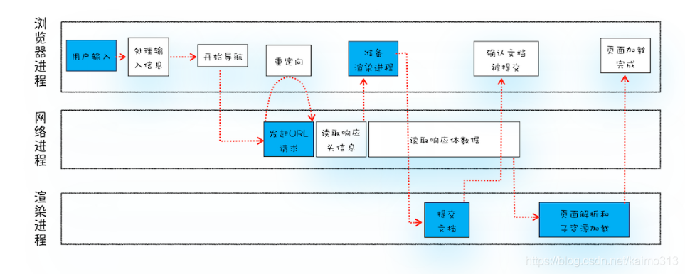
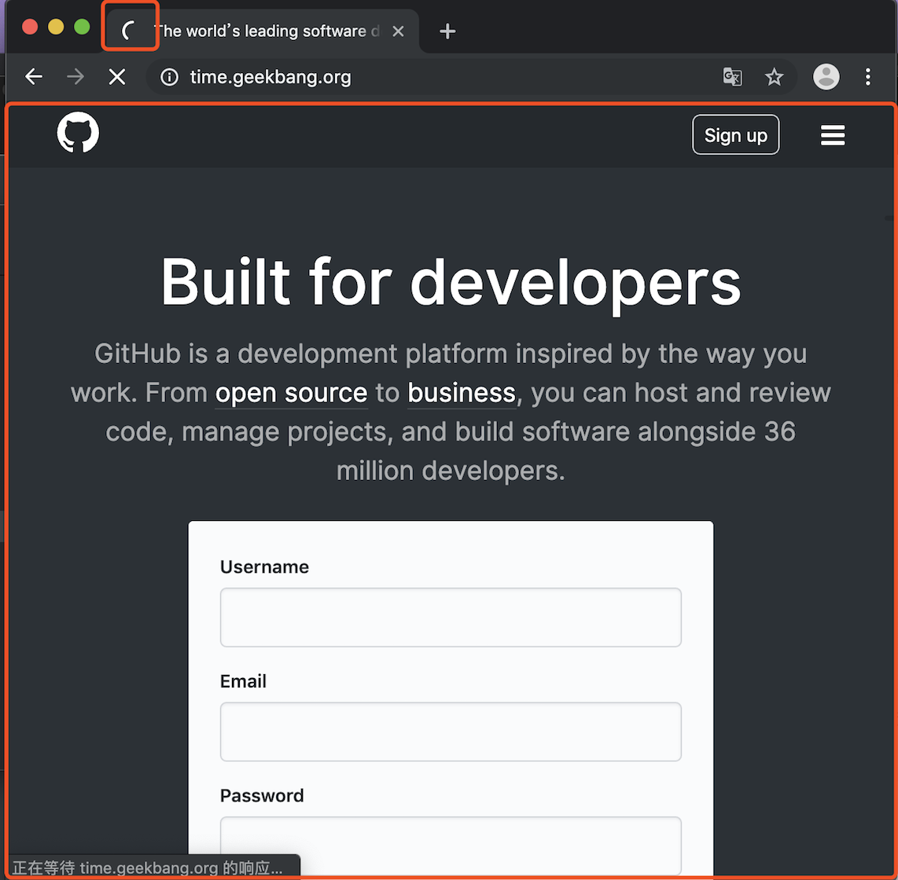
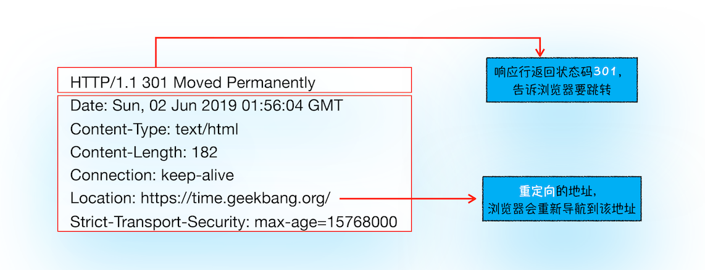
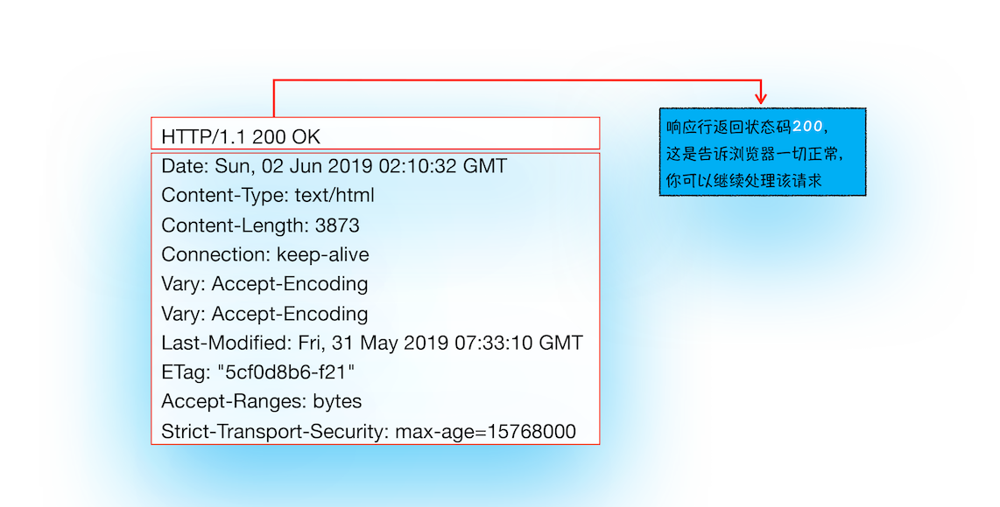
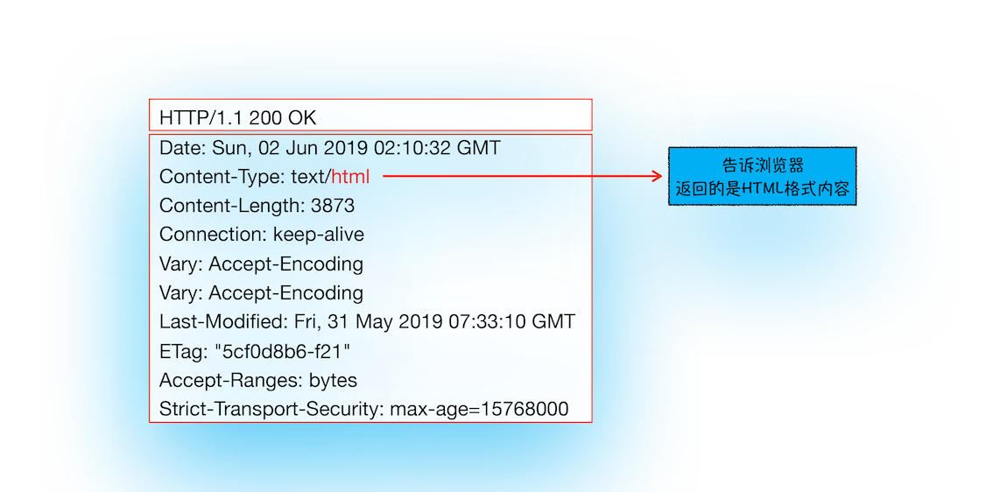
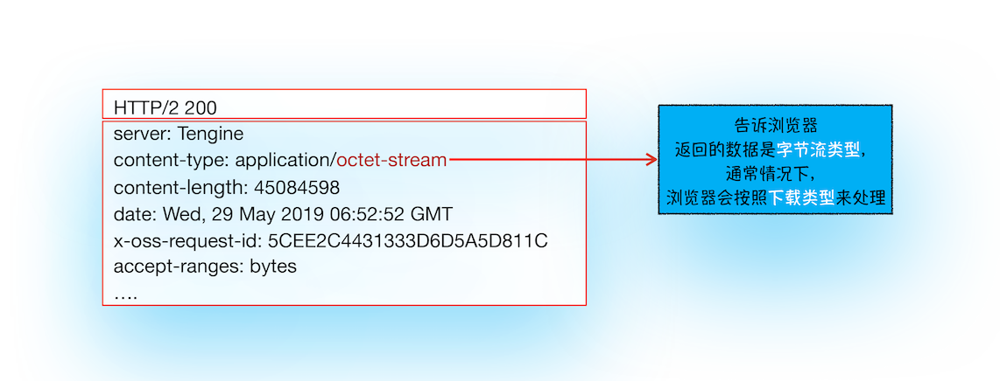
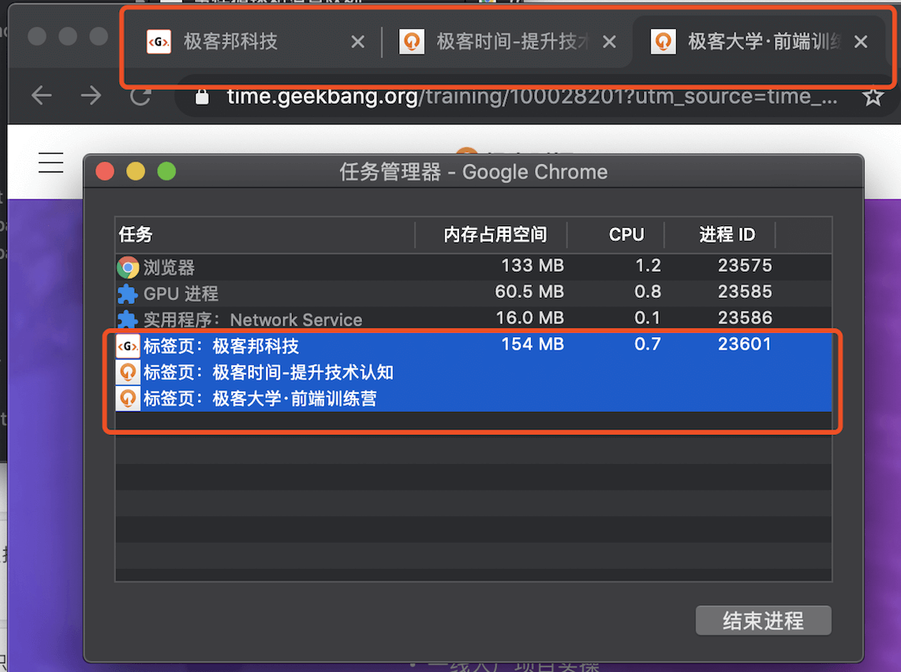
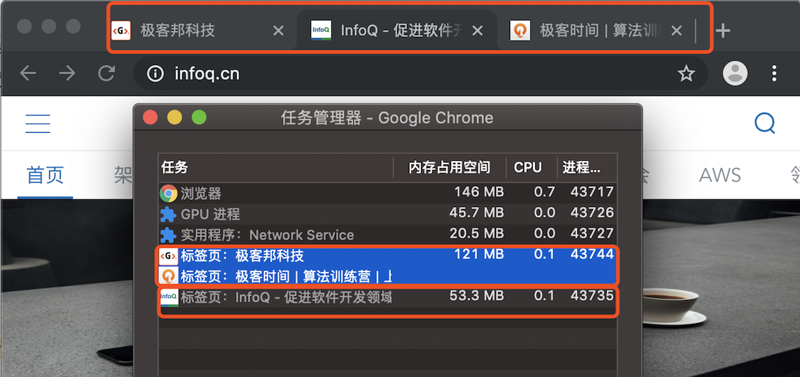
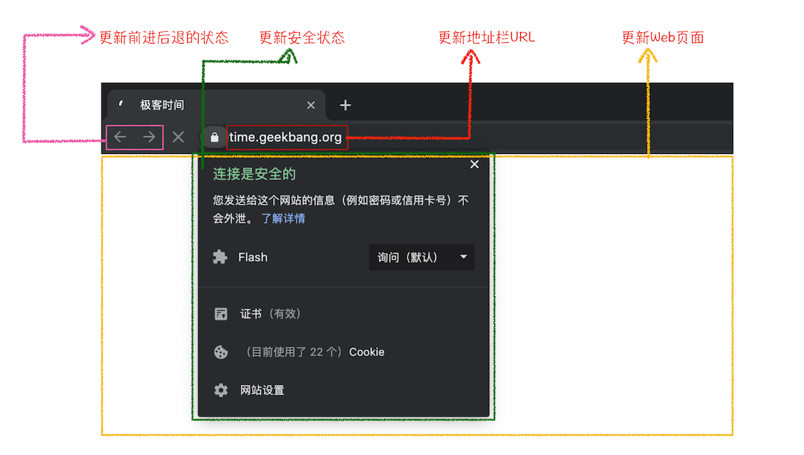

# 04 | 导航流程：从输入 URL 到页面展示，这中间发生了什么？


“在浏览器里，从输入 URL 到页面展示，这中间发生了什么？ ”这是一道经典的面试题，能比较全面地考察应聘者知识的掌握程度，其中涉及到了网络、操作系统、Web 等一系列的知识。所以我在面试应聘者时也必问这道题，但遗憾的是大多数人只能回答其中部分零散的知识点，并不能将这些知识点串联成线，无法系统而又全面地回答这个问题。

那么今天我们就一起来探索下这个流程，下图是我梳理出的“从输入 URL 到页面展示完整流程示意图”：



从图中可以看出，整个过程需要各个进程之间的配合，所以在开始正式流程之前，我们还是先来快速回顾下浏览器进程、渲染进程和网络进程的主要职责。

- 浏览器进程主要负责用户交互、子进程管理和文件储存等功能。
- 网络进程是面向渲染进程和浏览器进程等提供网络下载功能。
- 渲染进程的主要职责是把从网络下载的 HTML、JavaScript、CSS、图片等资源解析为可以显示和交互的页面。因为渲染进程所有的内容都是通过网络获取的，会存在一些恶意代码利用浏览器漏洞对系统进行攻击，所以运行在渲染进程里面的代码是不被信任的。这也是为什么 Chrome 会让渲染进程运行在安全沙箱里，就是为了保证系统的安全

回顾了浏览器的进程架构后，我们再结合上图来看下这个完整的流程，可以看出，整个流程包含了许多步骤，我把其中几个核心的节点用蓝色背景标记出来了。这个过程可以大致描述为如下：

- 首先，用户从浏览器进程里输入请求信息；
- 然后，网络进程发起 URL 请求；
- 服务器响应 URL 请求之后，浏览器进程就又要开始准备渲染进程了；
- 渲染进程准备好之后，需要先向渲染进程提交页面数据，我们称之为提交文档阶段；
- 渲染进程接收完文档信息之后，便开始解析页面和加载子资源，完成页面的渲染。

这其中，用户发出 URL 请求到页面开始解析的这个过程，就叫做导航。下面我们来详细分析下这些步骤，同时也就解答了开头所说的那道经典的面试题。

## 从输入 URL 到页面展示

知道了浏览器的几个主要进程的职责之后，那么接下来，我们就从浏览器的地址栏开始讲起。

### 1. 用户输入

当用户在地址栏中输入一个查询关键字时，地址栏会判断输入的关键字是搜索内容，还是请求的 URL。

- 如果是搜索内容，地址栏会使用浏览器默认的搜索引擎，来合成新的带搜索关键字的 URL。
- 如果判断输入内容符合 URL 规则，比如输入的是 time.geekbang.org，那么地址栏会根据规则，把这段内容加上协议，合成为完整的 URL，如 https://time.geekbang.org。

当用户输入关键字并键入回车之后，浏览器便进入下图的状态：



从图中可以看出，当浏览器刚开始加载一个地址之后，标签页上的图标便进入了加载状态。但此时图中页面显示的依然是之前打开的页面内容，并没立即替换为极客时间的页面。因为需要等待提交文档阶段，页面内容才会被替换。

#2. URL 请求过程
接下来，便进入了页面资源请求过程。这时，浏览器进程会通过进程间通信（IPC）把 URL 请求发送至网络进程，网络进程接收到 URL 请求后，会在这里发起真正的 URL 请求流程。那具体流程是怎样的呢？

首先，网络进程会查找本地缓存是否缓存了该资源。如果有缓存资源，那么直接返回资源给浏览器进程；如果在缓存中没有查找到资源，那么直接进入网络请求流程。这请求前的第一步是要进行 DNS 解析，以获取请求域名的服务器 IP 地址。如果请求协议是 HTTPS，那么还需要建立 TLS 连接。

接下来就是利用 IP 地址和服务器建立 TCP 连接。连接建立之后，浏览器端会构建请求行、请求头等信息，并把和该域名相关的 Cookie 等数据附加到请求头中，然后向服务器发送构建的请求信息。

服务器接收到请求信息后，会根据请求信息生成响应数据（包括响应行、响应头和响应体等信息），并发给网络进程。等网络进程接收了响应行和响应头之后，就开始解析响应头的内容了。（为了方便讲述，下面我将服务器返回的响应头和响应行统称为响应头。）

#### （1）重定向

在接收到服务器返回的响应头后，网络进程开始解析响应头，如果发现返回的状态码是 301 或者 302，那么说明服务器需要浏览器重定向到其他 URL。这时网络进程会从响应头的 Location 字段里面读取重定向的地址，然后再发起新的 HTTP 或者 HTTPS 请求，一切又重头开始了。

比如，我们在终端里输入以下命令：

```bash
curl -I http://time.geekbang.org/
```

`curl -I + URL` 的命令是接收服务器返回的响应头的信息。执行命令后，我们看到服务器返回的响应头信息如下：



从图中可以看出，极客时间服务器会通过重定向的方式把所有 HTTP 请求转换为 HTTPS 请求。也就是说你使用 HTTP 向极客时间服务器请求时，服务器会返回一个包含有 301 或者 302 状态码响应头，并把响应头的 Location 字段中填上 HTTPS 的地址，这就是告诉了浏览器要重新导航到新的地址上。

下面我们再使用 HTTPS 协议对极客时间发起请求，看看服务器的响应头信息是什么样子的。

```bash
curl -I https://time.geekbang.org/
```

我们看到服务器返回如下信息：



从图中可以看出，服务器返回的响应头的状态码是 200，这是告诉浏览器一切正常，可以继续往下处理该请求了。

好了，以上是重定向内容的介绍。现在你应该理解了，**在导航过程中，如果服务器响应行的状态码包含了 301、302 一类的跳转信息，浏览器会跳转到新的地址继续导航；如果响应行是 200，那么表示浏览器可以继续处理该请求**。

#### （2）响应数据类型处理

在处理了跳转信息之后，我们继续导航流程的分析。URL 请求的数据类型，有时候是一个下载类型，有时候是正常的 HTML 页面，那么浏览器是如何区分它们呢？

答案是 Content-Type。**Content-Type 是 HTTP 头中一个非常重要的字段，它告诉浏览器服务器返回的响应体数据是什么类型**，然后浏览器会根据 Content-Type 的值来决定如何显示响应体的内容。

这里我们还是以极客时间为例，看看极客时间官网返回的 Content-Type 值是什么。在终端输入以下命令：

```bash
curl -I https://time.geekbang.org/
```

返回信息如下图：



从图中可以看到，响应头中的 Content-type 字段的值是 text/html，这就是告诉浏览器，服务器返回的数据是 HTML 格式。

接下来我们再来利用 curl 来请求极客时间安装包的地址，如下所示：

```bash
curl -I https://res001.geekbang.org/apps/geektime/android/2.3.1/official/geektime_2.3.1_20190527-2136_offical.apk
```

请求后返回的响应头信息如下：



从返回的响应头信息来看，其 Content-Type 的值是 application/octet-stream，显示数据是**字节流类型**的，通常情况下，浏览器会按照**下载类型**来处理该请求。

需要注意的是，如果服务器配置 Content-Type 不正确，比如将 text/html 类型配置成 application/octet-stream 类型，那么浏览器可能会曲解文件内容，比如会将一个本来是用来展示的页面，变成了一个下载文件。

所以，不同 Content-Type 的后续处理流程也截然不同。如果 Content-Type 字段的值被浏览器判断为**下载类型**，**那么该请求会被提交给浏览器的下载管理器，同时该 URL 请求的导航流程就此结束。但如果是 HTML，那么浏览器则会继续进行导航流程**。由于 Chrome 的页面渲染是运行在渲染进程中的，所以接下来就需要准备渲染进程了。

### 3. 准备渲染进程

默认情况下，Chrome 会为每个页面分配一个渲染进程，也就是说，每打开一个新页面就会配套创建一个新的渲染进程。但是，也有一些例外，在某些情况下，浏览器会让多个页面直接运行在同一个渲染进程中。

比如我从极客时间的首页里面打开了另外一个页面——算法训练营，我们看下图的 Chrome 的任务管理器截图：



从图中可以看出，打开的这三个页面都是运行在同一个渲染进程中，进程 ID 是 23601。

**那什么情况下多个页面会同时运行在一个渲染进程中呢？**

要解决这个问题，我们就需要先了解下什么是同一站点（same-site）。具体地讲，我们将“**同一站点**”定义为**根域名**（例如，geekbang.org）加上**协议**（例如，https:// 或者 http://），还包含了该根域名下的所有子域名和不同的端口，比如下面这三个：

```js
https://time.geekbang.org
https://www.geekbang.org
https://www.geekbang.org:8080
```

它们都是属于**同一站点**，因为它们的协议都是 HTTPS，而且根域名也都是 geekbang.org。

Chrome 的默认策略是，每个标签对应一个渲染进程。但**如果从一个页面打开了另一个新页面，而新页面和当前页面属于同一站点的话，那么新页面会复用父页面的渲染进程**。官方把这个默认策略叫 process-per-site-instance。

那若新页面和当前页面不属于同一站点，情况又会发生什么样的变化呢？比如我通过极客邦页面里的链接打开 InfoQ 的官网（https://www.infoq.cn/ ）， 因为 infoq.cn 和 geekbang.org 不属于同一站点，所以 infoq.cn 会使用一个新的渲染进程，你可以参考下图：



从图中任务管理器可以看出：由于极客邦和极客时间的标签页拥有**相同的协议和根域名**，所以它们属于**同一站点**，并运行在同一个渲染进程中；而 infoq.cn 的根域名不同于 geekbang.org，也就是说 InfoQ 和极客邦不属于同一站点，因此它们会运行在两个不同的渲染进程之中。

总结来说，打开一个新页面采用的**渲染进程策略**就是：

通常情况下，打开新的页面都会使用单独的渲染进程；
如果从 A 页面打开 B 页面，且 A 和 B 都属于同一站点的话，那么 B 页面复用 A 页面的渲染进程；如果是其他情况，浏览器进程则会为 B 创建一个新的渲染进程。
渲染进程准备好之后，还不能立即进入文档解析状态，因为此时的文档数据还在网络进程中，并没有提交给渲染进程，所以下一步就进入了提交文档阶段。

### 4. 提交文档

首先要明确一点，这里的“文档”是指 URL 请求的响应体数据。“提交文档”的消息是由浏览器进程发出的。

所谓提交文档，就是指浏览器进程将网络进程接收到的 HTML 数据提交给渲染进程，具体流程是这样的：

- 首先当浏览器进程接收到网络进程的响应头数据之后，便向渲染进程发起“提交文档”的消息；
- 渲染进程接收到“提交文档”的消息后，会和网络进程建立传输数据的“管道”；
- 等文档数据传输完成之后，渲染进程会返回“确认提交”的消息给浏览器进程；
- 浏览器进程在收到“确认提交”的消息后，会更新浏览器界面状态，包括了安全状态、地址栏的 URL、前进后退的历史状态，并更新 Web 页面。

其中，当渲染进程确认提交之后，更新内容如下图所示：



这也就解释了为什么在浏览器的地址栏里面输入了一个地址后，之前的页面没有立马消失，而是要加载一会儿才会更新页面。

到这里，一个完整的导航流程就“走”完了，这之后就要进入渲染阶段了。

### 5. 渲染阶段

一旦文档被提交，渲染进程便开始页面解析和子资源加载了，关于这个阶段的完整过程，我会在下一篇文章中来专门介绍。这里你只需要先了解一旦页面生成完成，渲染进程会发送一个消息给浏览器进程，浏览器接收到消息后，会停止标签图标上的加载动画。如下所示：


至此，一个完整的页面就生成了。那文章开头的“从输入 URL 到页面展示，这中间发生了什么？”这个过程极其“串联”的问题也就解决了。

## 总结

好了，今天就到这里，下面我来简单总结下这篇文章的要点：

- 服务器可以根据响应头来控制浏览器的行为，如跳转、网络数据类型判断。
  Chrome 默认采用每个标签对应一个渲染进程，但是如果两个页面属于同一站点，那这两个标签会使用同一个渲染进程。

* 浏览器的导航过程涵盖了从用户发起请求到提交文档给渲染进程的中间所有阶段。

导航流程很重要，它是网络加载流程和渲染流程之间的一座桥梁，如果你理解了导航流程，那么你就能完整串起来整个页面显示流程，这对于你理解浏览器的工作原理起到了点睛的作用

[What happens when...](https://github.com/alex/what-happens-when)

## 问答

### 问答一

**Q**：请问老师，https://linkmarket.aliyun.com 内新开的页面都是新开一个渲染进程，能帮忙解释下吗

**A**：我看了下代码，因为连接里面使用了`rel="noopener noreferrer"`这个属性。

这个涉及到安全了，要完整解释起来就话长了，我长话短说，先看阿里这个网站的连接是下面这种形式：
`<a target="_blank" rel="noopener noreferrer" class="hover" href="https://linkmarket.aliyun.com/hardware_store?spm=a2c3t.11219538.iot-navBar.62.4b5a51e7u2sXtw" data-spm-anchor-id="a2c3t.11219538.iot-navBar.62">硬件商城</a>`

使用 noopener noreferrer 就是告诉浏览器，新打开的子窗口不需要访问父窗口的任何内容，这是为了防止一些钓鱼网站窃取父窗口的信息。

浏览器在打开新页面时，解析到含有 noopener noreferrer 时，就知道他们不需要共享页面内容，所以这时候浏览器就会让新链接在一个新页面中打开了。

### 问答二

**Q**：“从输入 URL 到页面展示，这中间发生了什么？”

**A**：

1. 用户输入 url 并回车

2. 浏览器进程检查 url，组装协议，构成完整的 url

3. 浏览器进程通过进程间通信（IPC）把 url 请求发送给网络进程

4. 网络进程接收到 url 请求后检查本地缓存是否缓存了该请求资源，如果有则将该资源返回给浏览器进程

5. **如果没有，网络进程向 web 服务器发起 http 请求（网络请求），请求流程如下**：

- 进行 DNS 解析，获取服务器 ip 地址，端口（端口是通过 dns 解析获取的吗？）
- 利用 ip 地址和服务器建立 tcp 连接
- 构建请求头信息
- 发送请求头信息
- 服务器响应后，网络进程接收响应头和响应信息，并解析响应内容

6. **网络进程解析响应流程**

- 检查状态码，如果是 301/302，则需要重定向，从 Location 中自动读取地址，重新进行第 4 步 （301/302 跳转也会读取本地缓存吗？），如果是 200，则继续处理请求。
- 200 响应处理：检查响应类型 Content-Type，如果是字节流类型，则将该请求提交给下载管理器，该导航流程结束，不再进行后续的渲染，如果是 html 则通知浏览器进程准备渲染进程准备进行渲染。

7. **准备渲染进程**

- 浏览器进程检查当前 url 是否和之前打开的渲染进程根域名是否相同，如果相同，则复用原来的进程，如果不同，则开启新的渲染进程

8. **传输数据、更新状态**

- 渲染进程准备好后，浏览器向渲染进程发起“提交文档”的消息，渲染进程接收到消息和网络进程建立传输数据的“管道”
- 渲染进程接收完数据后，向浏览器发送“确认提交”
- 浏览器进程接收到确认消息后更新浏览器界面状态：安全、地址栏 url、前进后退的历史状态、更新 web 页面

**A**：

1. 用户输入 URL，浏览器会根据用户输入的信息判断是搜索还是网址，如果是搜索内容，就将搜索内容+默认搜索引擎合成新的 URL；如果用户输入的内容符合 URL 规则，浏览器就会根据 URL 协议，在这段内容上加上协议合成合法的 URL
2. 用户输入完内容，按下回车键，浏览器导航栏显示 loading 状态，但是页面还是呈现前一个页面，这是因为新页面的响应数据还没有获得
3. 浏览器进程浏览器构建请求行信息，会通过进程间通信（IPC）将 URL 请求发送给网络进程
   GET /index.html HTTP1.1
4. 网络进程获取到 URL，先去本地缓存中查找是否有缓存文件，如果有，拦截请求，直接 200 返回；否则，进入网络请求过程
5. 网络进程请求 DNS 返回域名对应的 IP 和端口号，如果之前 DNS 数据缓存服务缓存过当前域名信息，就会直接返回缓存信息；否则，发起请求获取根据域名解析出来的 IP 和端口号，如果没有端口号，http 默认 80，https 默认 443。如果是 https 请求，还需要建立 TLS 连接。
6. Chrome 有个机制，同一个域名同时最多只能建立 6 个 TCP 连接，如果在同一个域名下同时有 10 个请求发生，那么其中 4 个请求会进入排队等待状态，直至进行中的请求完成。如果当前请求数量少于 6 个，会直接建立 TCP 连接。
7. TCP 三次握手建立连接，http 请求加上 TCP 头部——包括源端口号、目的程序端口号和用于校验数据完整性的序号，向下传输
8. 网络层在数据包上加上 IP 头部——包括源 IP 地址和目的 IP 地址，继续向下传输到底层
9. 底层通过物理网络传输给目的服务器主机
10. 目的服务器主机网络层接收到数据包，解析出 IP 头部，识别出数据部分，将解开的数据包向上传输到传输层
11. 目的服务器主机传输层获取到数据包，解析出 TCP 头部，识别端口，将解开的数据包向上传输到应用层
12. 应用层 HTTP 解析请求头和请求体，如果需要重定向，HTTP 直接返回 HTTP 响应数据的状态 code301 或者 302，同时在请求头的 Location 字段中附上重定向地址，浏览器会根据 code 和 Location 进行重定向操作；如果不是重定向，首先服务器会根据 请求头中的 If-None-Match 的值来判断请求的资源是否被更新，如果没有更新，就返回 304 状态码，相当于告诉浏览器之前的缓存还可以使用，就不返回新数据了；否则，返回新数据，200 的状态码，并且如果想要浏览器缓存数据的话，就在相应头中加入字段：
    Cache-Control:Max-age=2000
    响应数据又顺着应用层——传输层——网络层——网络层——传输层——应用层的顺序返回到网络进程
13. 数据传输完成，TCP 四次挥手断开连接。如果，浏览器或者服务器在 HTTP 头部加上如下信息，TCP 就一直保持连接。保持 TCP 连接可以省下下次需要建立连接的时间，提示资源加载速度
    Connection:Keep-Alive
14. 网络进程将获取到的数据包进行解析，根据响应头中的 Content-type 来判断响应数据的类型，如果是字节流类型，就将该请求交给下载管理器，该导航流程结束，不再进行；如果是 text/html 类型，就通知浏览器进程获取到文档准备渲染
15. 浏览器进程获取到通知，根据当前页面 B 是否是从页面 A 打开的并且和页面 A 是否是同一个站点（根域名和协议一样就被认为是同一个站点），如果满足上述条件，就复用之前网页的进程，否则，新创建一个单独的渲染进程
16. 浏览器会发出“提交文档”的消息给渲染进程，渲染进程收到消息后，会和网络进程建立传输数据的“管道”，文档数据传输完成后，渲染进程会返回“确认提交”的消息给浏览器进程
17. 浏览器收到“确认提交”的消息后，会更新浏览器的页面状态，包括了安全状态、地址栏的 URL、前进后退的历史状态，并更新 web 页面，此时的 web 页面是空白页
18. 渲染进程对文档进行页面解析和子资源加载，HTML 通过 HTM 解析器转成 DOM Tree（二叉树类似结构的东西），CSS 按照 CSS 规则和 CSS 解释器转成 CSSOM TREE，两个 tree 结合，形成 render tree（不包含 HTML 的具体元素和元素要画的具体位置），通过 Layout 可以计算出每个元素具体的宽高颜色位置，结合起来，开始绘制，最后显示在屏幕中新页面显示出来
