# 05 | 渲染流程（上）：HTML、CSS 和 JavaScript，是如何变成页面的？


<audio src="../mp3/05-渲染流程（上）：HTML、CSS和JavaScript，是如何变成页面的？.mp3" preload="none" controls loop style="width: 100%;">
  你的浏览器不支持 audio 标签。
</audio>

在上一篇文章中我们介绍了导航相关的流程，那导航被提交后又会怎么样呢？就进入了渲染阶段。这个阶段很重要，了解其相关流程能让你“看透”页面是如何工作的，有了这些知识，你可以解决一系列相关的问题，比如能熟练使用开发者工具，因为能够理解开发者工具里面大部分项目的含义，能优化页面卡顿问题，使用 JavaScript 优化动画流程，通过优化样式表来防止强制同步布局，等等。

既然它的功能这么强大，那么今天，我们就来好好聊聊**渲染流程**。

通常，我们编写好 HTML、CSS、JavaScript 等文件，经过浏览器就会显示出漂亮的页面（如下图所示），但是你知道它们是如何转化成页面的吗？这背后的原理，估计很多人都答不上来。

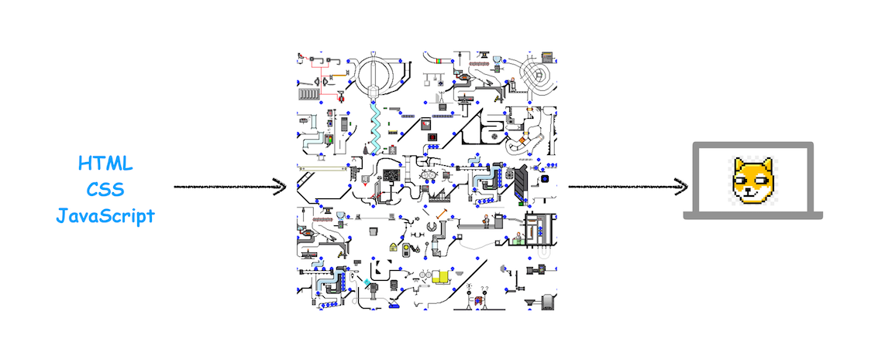

<div style="text-align: center; font-size: 12px; color: #999; margin-bottom: 8px;">渲染流程示意图</div>

从图中可以看出，左边输入的是 HTML、CSS、JavaScript 数据，这些数据经过中间渲染模块的处理，最终输出为屏幕上的像素。

这中间的**渲染模块**就是我们今天要讨论的主题。为了能更好地理解下文，你可以先结合下图快速抓住 HTML、CSS 和 JavaScript 的含义：

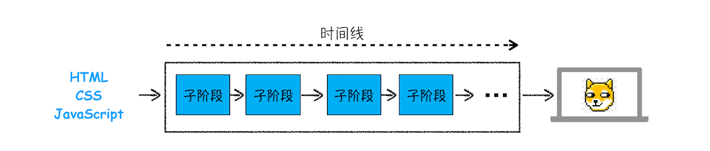

<div style="text-align: center; font-size: 12px; color: #999; margin-bottom: 8px;">HTML、CSS 和 JavaScript 关系图</div>

从上图可以看出，**HTML 的内容是由标记和文本组成**。标记也称为**标签**，每个标签都有它自己的语义，浏览器会根据标签的语义来正确展示 HTML 内容。比如上面的`<p>`标签是告诉浏览器在这里的内容需要创建一个新段落，中间的文本就是段落中需要显示的内容。

如果需要改变 HTML 的字体颜色、大小等信息，就需要用到 CSS。CSS 又称为**层叠样式表，是由选择器和属性组成**，比如图中的 p 选择器，它会把 HTML 里面`<p>`标签的内容选择出来，然后再把选择器的属性值应用到`<p>`标签内容上。选择器里面有个 color 属性，它的值是 red，这是告诉渲染引擎把`<p>`标签的内容显示为红色。

至于 **JavaScript（简称为 JS），使用它可以使网页的内容“动”起来**，比如上图中，可以通过 JavaScript 来修改 CSS 样式值，从而达到修改文本颜色的目的。

搞清楚 HTML、CSS 和 JavaScript 的含义后，那么接下来我们就正式开始分析渲染模块了。

由于渲染机制过于复杂，所以渲染模块在执行过程中会被划分为很多子阶段，输入的 HTML 经过这些子阶段，最后输出像素。我们把这样的一个处理流程叫做**渲染流水线**，其大致流程如下图所示：


<div style="text-align: center; font-size: 12px; color: #999; margin-bottom: 8px;">渲染流水线示意图</div>

按照渲染的时间顺序，流水线可分为如下几个子阶段：构建 DOM 树、样式计算、布局阶段、分层、绘制、分块、光栅化和合成。内容比较多，我会用两篇文章来为你详细讲解这各个子阶段。接下来，在介绍每个阶段的过程中，你应该重点关注以下三点内容：

- 开始每个子阶段都有其输入的内容；

* 然后每个子阶段有其处理过程；

- 最终每个子阶段会生成输出内容。

理解了这三部分内容，能让你更加清晰地理解每个子阶段。

## 构建 DOM 树

为什么要构建 DOM 树呢？**这是因为浏览器无法直接理解和使用 HTML，所以需要将 HTML 转换为浏览器能够理解的结构——DOM 树**。

这里我们还需要简单介绍下什么是**树结构**，为了更直观地理解，你可以参考下面我画的几个树结构：

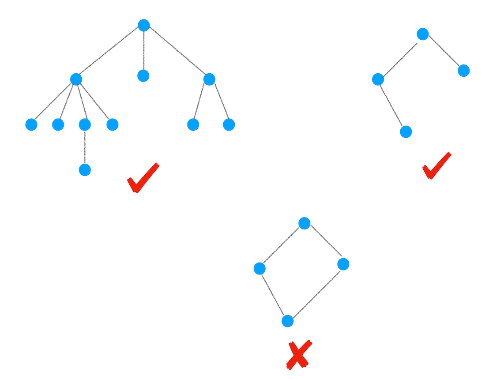

<div style="text-align: center; font-size: 12px; color: #999; margin-bottom: 8px;">树结构示意图</div>

从图中可以看出，树这种结构非常像我们现实生活中的“树”，其中每个点我们称为**节点**，相连的节点称为**父子节点**。树结构在浏览器中的应用还是比较多的，比如下面我们要介绍的渲染流程，就在频繁地使用树结构。

接下来咱们还是言归正传，来看看 DOM 树的构建过程，你可以参考下图：

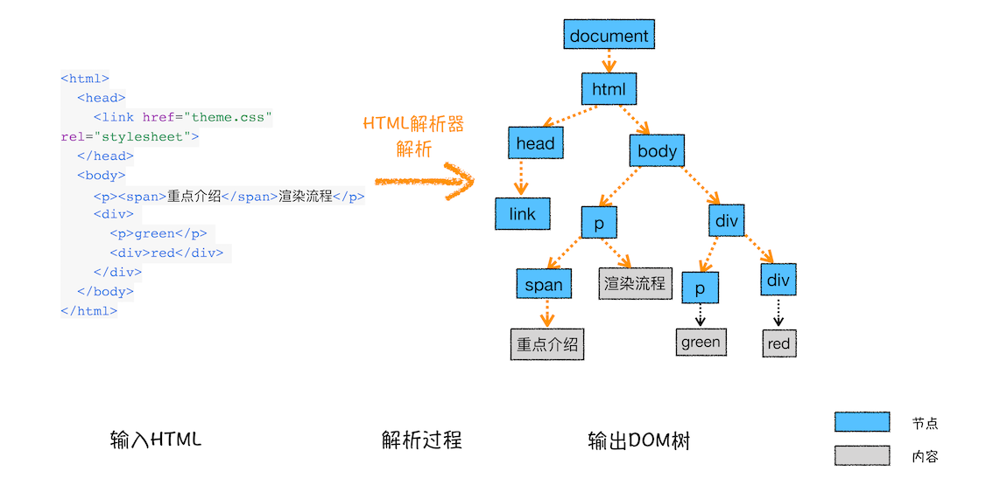

<div style="text-align: center; font-size: 12px; color: #999; margin-bottom: 8px;">DOM 树构建过程示意图</div>

从图中可以看出，构建 DOM 树的输入内容是一个非常简单的 HTML 文件，然后经由 HTML 解析器解析，最终输出树状结构的 DOM。

为了更加直观地理解 DOM 树，你可以打开 Chrome 的“开发者工具”，选择“Console”标签来打开控制台，然后在控制台里面输入“document”后回车，这样你就能看到一个完整的 DOM 树结构，如下图所示：

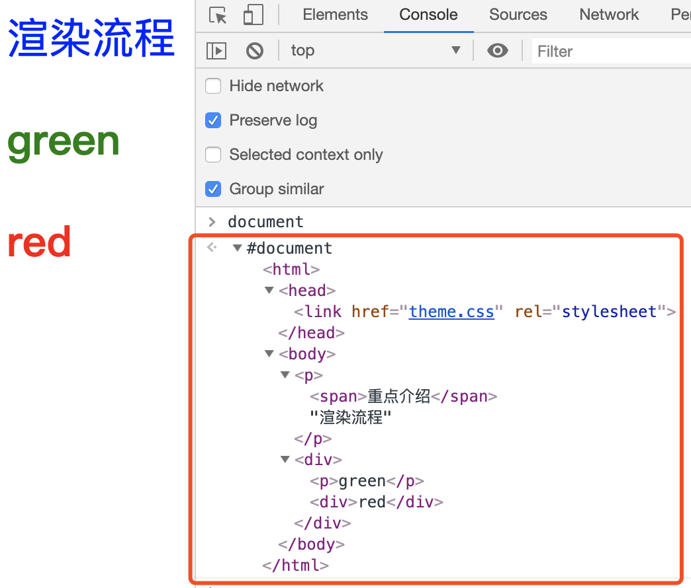

<div style="text-align: center; font-size: 12px; color: #999; margin-bottom: 8px;">DOM 可视化</div>

图中的 document 就是 DOM 结构，你可以看到，DOM 和 HTML 内容几乎是一样的，但是和 HTML 不同的是，DOM 是保存在内存中树状结构，可以通过 JavaScript 来查询或修改其内容。

那下面就来看看如何通过 JavaScript 来修改 DOM 的内容，在控制台中输入：

```
document.getElementsByTagName("p")[0].innerText = "black";
```

这行代码的作用是把第一个`<p>`标签的内容修改为 black，具体执行结果你可以参考下图：

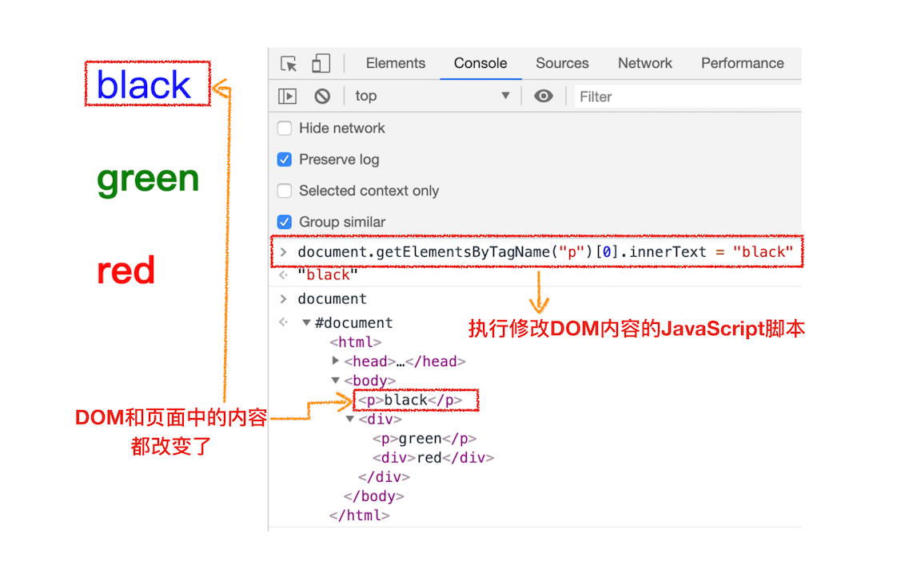

<div style="text-align: center; font-size: 12px; color: #999; margin-bottom: 8px;">通过 JavaScript 修改 DOM</div>

从图中可以看出，在执行了一段修改第一个`<p>`标签的 JavaScript 代码后，DOM 的第一个 p 节点的内容成功被修改，同时页面中的内容也被修改了。

好了，现在我们已经生成 DOM 树了，但是 DOM 节点的样式我们依然不知道，要让 DOM 节点拥有正确的样式，这就需要样式计算了。

## 样式计算（Recalculate Style）

样式计算的目的是为了计算出 DOM 节点中每个元素的具体样式，这个阶段大体可分为三步来完成。

### 1. 把 CSS 转换为浏览器能够理解的结构

那 CSS 样式的来源主要有哪些呢？你可以先参考下图：

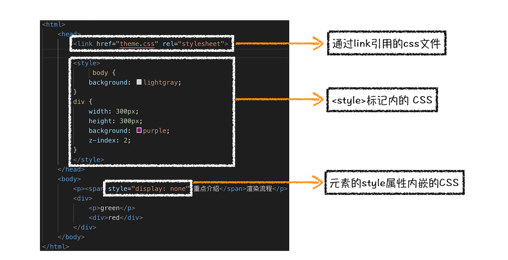

<div style="text-align: center; font-size: 12px; color: #999; margin-bottom: 8px;">HTML 加载 CSS 的三种方式</div>

从图中可以看出，CSS 样式来源主要有三种：

- 通过 link 引用的外部 CSS 文件

- `<style>`标记内的 CSS

- 元素的 style 属性内嵌的 CSS

和 HTML 文件一样，浏览器也是无法直接理解这些纯文本的 CSS 样式，所以**当渲染引擎接收到 CSS 文本时，会执行一个转换操作，将 CSS 文本转换为浏览器可以理解的结构——styleSheets**。

为了加深理解，你可以在 Chrome 控制台中查看其结构，只需要在控制台中输入 document.styleSheets，然后就看到如下图所示的结构：

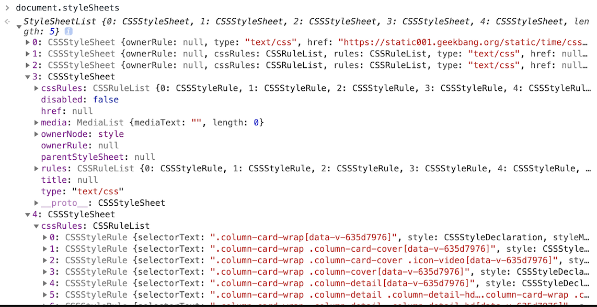

<div style="text-align: center; font-size: 12px; color: #999; margin-bottom: 8px;">styleSheets</div>

从图中可以看出，这个样式表包含了很多种样式，已经把那三种来源的样式都包含进去了。当然样式表的具体结构不是我们今天讨论的重点，你只需要知道渲染引擎会把获取到的 CSS 文本全部转换为 styleSheets 结构中的数据，并且该结构同时具备了查询和修改功能，这会为后面的样式操作提供基础。

### 2. 转换样式表中的属性值，使其标准化

现在我们已经把现有的 CSS 文本转化为浏览器可以理解的结构了，那么**接下来就要对其进行属性值的标准化操作**。

要理解什么是属性值标准化，你可以看下面这样一段 CSS 文本：

```css
body {
  font-size: 2em;
}
p {
  color: blue;
}
span {
  display: none;
}
div {
  font-weight: bold;
}
div p {
  color: green;
}
div {
  color: red;
}
```

可以看到上面的 CSS 文本中有很多属性值，如 2em、blue、bold，这些类型数值不容易被渲染引擎理解，所以需要将所有值转换为渲染引擎容易理解的、标准化的计算值，这个过程就是属性值标准化。

那标准化后的属性值是什么样子的？

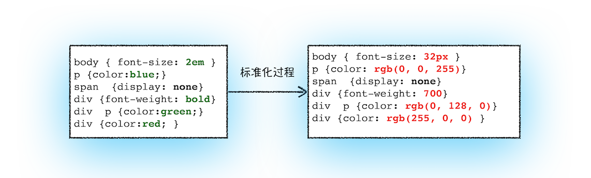

<div style="text-align: center; font-size: 12px; color: #999; margin-bottom: 8px;">标准化属性值</div>

从图中可以看到，2em 被解析成了 32px，red 被解析成了 rgb(255,0,0)，bold 被解析成了 700……

### 3. 计算出 DOM 树中每个节点的具体样式

现在样式的属性已被标准化了，接下来就需要计算 DOM 树中每个节点的样式属性了，如何计算呢？

这就涉及到 CSS 的继承规则和层叠规则了。

首先是 CSS 继承。**CSS 继承就是每个 DOM 节点都包含有父节点的样式**。这么说可能有点抽象，我们可以结合具体例子，看下面这样一张样式表是如何应用到 DOM 节点上的。

```css
body {
  font-size: 20px;
}
p {
  color: blue;
}
span {
  display: none;
}
div {
  font-weight: bold;
  color: red;
}
div p {
  color: green;
}
```

这张样式表最终应用到 DOM 节点的效果如下图所示：

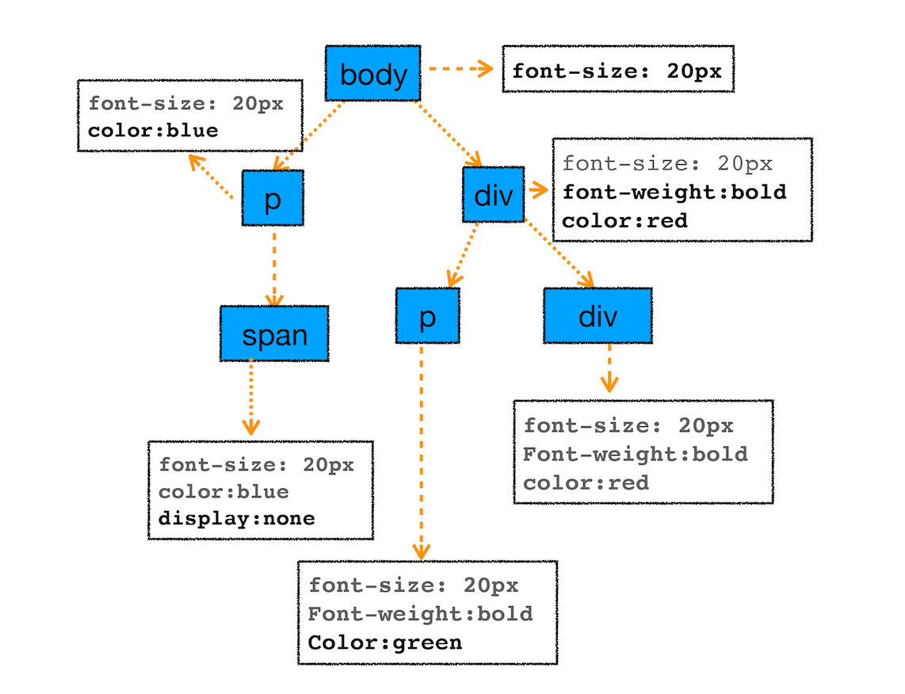

<div style="text-align: center; font-size: 12px; color: #999; margin-bottom: 8px;">计算后 DOM 的样式</div>

从图中可以看出，所有子节点都继承了父节点样式。比如 body 节点的 font-size 属性是 20，那 body 节点下面的所有节点的 font-size 都等于 20。

为了加深你对 CSS 继承的理解，你可以打开 Chrome 的“开发者工具”，选择第一个“element”标签，再选择“style”子标签，你会看到如下界面：

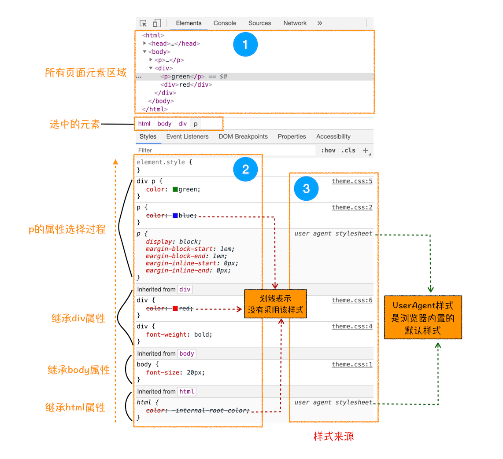

<div style="text-align: center; font-size: 12px; color: #999; margin-bottom: 8px;">样式的继承过程界面</div>

这个界面展示的信息很丰富，大致可描述为如下。

- 首先，可以选择要查看的**元素的样式（位于图中的区域 2 中）**，在图中的第 1 个区域中点击对应的元素，就可以在下面的区域查看该元素的样式了。比如这里我们选择的元素是`<p>`标签，位于 html.body.div. 这个路径下面。

* 其次，可以从**样式来源（位于图中的区域 3 中）**中查看样式的具体来源信息，看看是来源于样式文件，还是来源于 UserAgent 样式表。**这里需要特别提下 UserAgent 样式，它是浏览器提供的一组默认样式，如果你不提供任何样式，默认使用的就是 UserAgent 样式**。

- 最后，可以通过区域 2 和区域 3 来查看样式继承的具体过程。

以上就是 CSS 继承的一些特性，样式计算过程中，会根据 DOM 节点的继承关系来合理计算节点样式。

样式计算过程中的第二个规则是样式层叠。**层叠是 CSS 的一个基本特征，它是一个定义了如何合并来自多个源的属性值的算法。它在 CSS 处于核心地位，CSS 的全称“层叠样式表”正是强调了这一点**。关于层叠的具体规则这里就不做过多介绍了，网上资料也非常多，你可以自行搜索学习。

总之，样式计算阶段的目的是为了计算出 DOM 节点中每个元素的具体样式，在计算过程中需要遵守 CSS 的继承和层叠两个规则。这个阶段最终输出的内容是每个 DOM 节点的样式，并被保存在 ComputedStyle 的结构内。

如果你想了解每个 DOM 元素最终的计算样式，可以打开 Chrome 的“开发者工具”，选择第一个“element”标签，然后再选择“Computed”子标签，如下图所示：

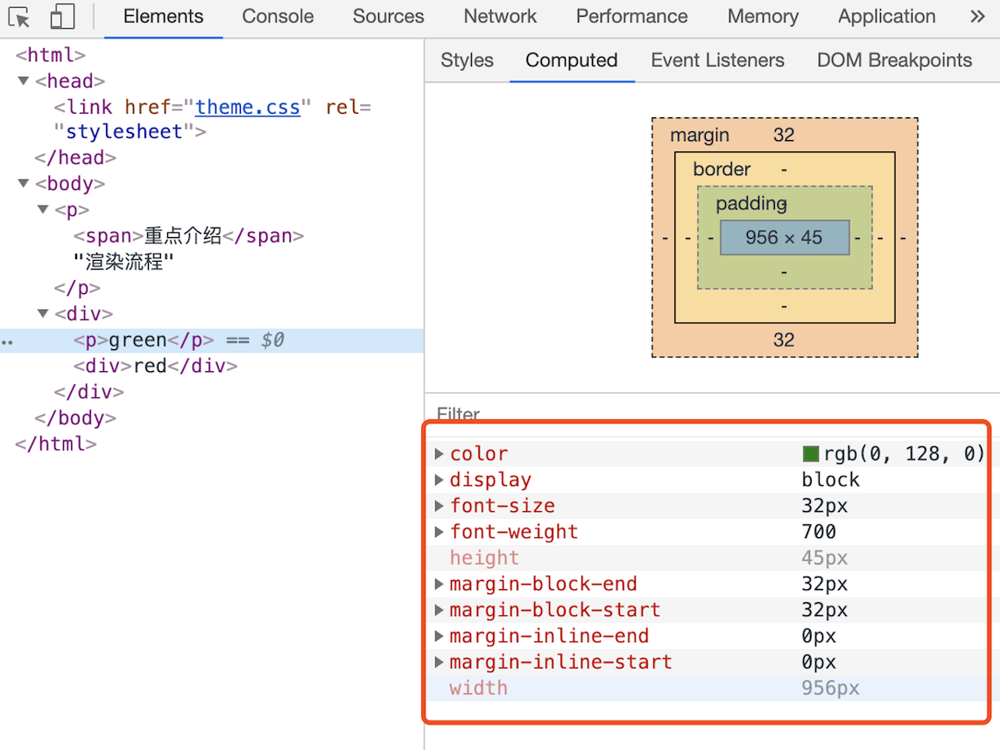

<div style="text-align: center; font-size: 12px; color: #999; margin-bottom: 8px;">DOM 元素最终计算的样式</div>

上图红色方框中显示了 html.body.div.p 标签的 ComputedStyle 的值。你想要查看哪个元素，点击左边对应的标签就可以了。

## 布局阶段

现在，我们有 DOM 树和 DOM 树中元素的样式，但这还不足以显示页面，因为我们还不知道 DOM 元素的几何位置信息。**那么接下来就需要计算出 DOM 树中可见元素的几何位置，我们把这个计算过程叫做布局**。

Chrome 在布局阶段需要完成两个任务：创建布局树和布局计算。

### 1. 创建布局树

你可能注意到了 DOM 树还含有很多不可见的元素，比如 head 标签，还有使用了 display:none 属性的元素。所以**在显示之前，我们还要额外地构建一棵只包含可见元素布局树**。

我们结合下图来看看布局树的构造过程：

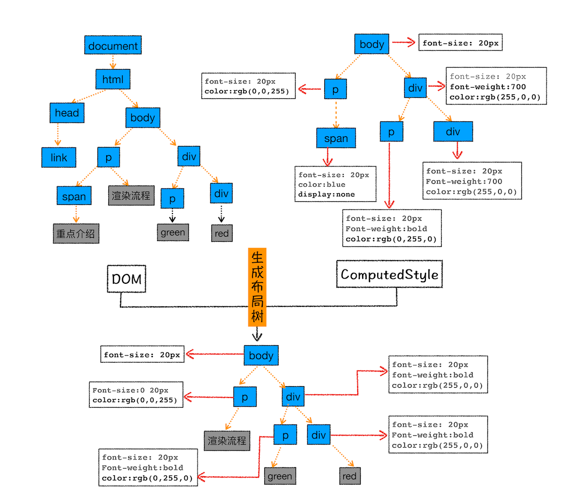

<div style="text-align: center; font-size: 12px; color: #999; margin-bottom: 8px;">布局树构造过程示意图</div>

从上图可以看出，DOM 树中所有不可见的节点都没有包含到布局树中。

为了构建布局树，浏览器大体上完成了下面这些工作：

- 遍历 DOM 树中的所有可见节点，并把这些节点加到布局树中；

* 而不可见的节点会被布局树忽略掉，如 head 标签下面的全部内容，再比如 body.p.span 这个元素，因为它的属性包含 dispaly:none，所以这个元素也没有被包进布局树。

### 2. 布局计算

现在我们有了一棵完整的布局树。那么接下来，就要计算布局树节点的坐标位置了。布局的计算过程非常复杂，我们这里先跳过不讲，等到后面章节中我再做详细的介绍。

在执行布局操作的时候，会把布局运算的结果重新写回布局树中，所以布局树既是输入内容也是输出内容，这是布局阶段一个不合理的地方，因为在布局阶段并没有清晰地将输入内容和输出内容区分开来。针对这个问题，Chrome 团队正在重构布局代码，下一代布局系统叫 LayoutNG，试图更清晰地分离输入和输出，从而让新设计的布局算法更加简单。

## 总结

好了，今天正文就到这里，我画了下面这张比较完整的渲染流水线，你可以结合这张图来回顾下今天的内容。
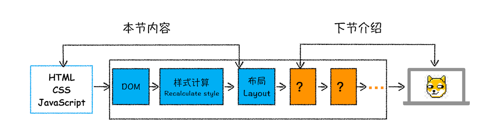

<div style="text-align: center; font-size: 12px; color: #999; margin-bottom: 8px;">渲染流水线图</div>

从图中可以看出，本节内容我们介绍了渲染流程的前三个阶段：DOM 生成、样式计算和布局。要点可大致总结为如下：

- 浏览器不能直接理解 HTML 数据，所以第一步需要将其转换为浏览器能够理解的 DOM 树结构；

* 生成 DOM 树后，还需要根据 CSS 样式表，来计算出 DOM 树所有节点的样式；

- 最后计算 DOM 元素的布局信息，使其都保存在布局树中。

到这里我们的每个节点都拥有了自己的样式和布局信息，那么后面几个阶段就要利用这些信息去展示页面了，由于篇幅限制，剩下的这些阶段我会在下一篇文章中介绍。

## 思考时间

最后，给你留个思考题：如果下载 CSS 文件阻塞了，会阻塞 DOM 树的合成吗？会阻塞页面的显示吗？

回答：
当从服务器接收 HTML 页面的第一批数据时，DOM 解析器就开始工作了，在解析过程中，如果遇到了 JS 脚本，如下所示：

```html
<html>
  <body>
    极客时间
    <script>
      document.write("--foo");
    </script>
  </body>
</html>
```

那么 DOM 解析器会先执行 JavaScript 脚本，执行完成之后，再继续往下解析。

那么第二种情况复杂点了，我们内联的脚本替换成 js 外部文件，如下所示：

```html
<html>
  <body>
    极客时间
    <script type="text/javascript" src="foo.js"></script>
  </body>
</html>
```

这种情况下，当解析到 JavaScript 的时候，会先暂停 DOM 解析，并下载 foo.js 文件，下载完成之后执行该段 JS 文件，然后再继续往下解析 DOM。这就是 JavaScript 文件为什么会阻塞 DOM 渲染。

我们再看第三种情况，还是看下面代码：

```html
<html>
  <head>
    <style type="text/css" src="theme.css"></style>
  </head>
  <body>
    <p>极客时间</p>
    <script>
      let e = document.getElementsByTagName("p")[0];
      e.style.color = "blue";
    </script>
  </body>
</html>
```

当我在 JavaScript 中访问了某个元素的样式，那么这时候就需要等待这个样式被下载完成才能继续往下执行，所以在这种情况下，CSS 也会阻塞 DOM 的解析。

所以 JS 和 CSS 都有可能会阻塞 DOM 解析，关于详细信息我们会在后面的章节中详细介绍。

文章：

[How browsers work](https://www.html5rocks.com/zh/tutorials/internals/howbrowserswork/)

**Q**：
document.styleSheets 接口只会返回引入和嵌入文档的样式表吧，不会返回内联样式，mdn 有说明：https://developer.mozilla.org/zh-CN/docs/Web/API/Document/stylesheets

**Q**：
布局树构造过程示意图误导性太强了。计算样式阶段并不会生成"ComputedStyle"树，而是遍历 styleSheets 里的规则和 DOM 树，计算出每个 DOM 节点样式，放在每个 DOM 节点的 ComputedStyle 属性里。
参考：
https://www.youtube.com/watch?v=m-J-tbAlFic
https://www.youtube.com/watch?v=PwYxv-43iM4&list=PL9ioqAuyl6ULtk9hyUKX__VH1EBE5r4me&index=1
