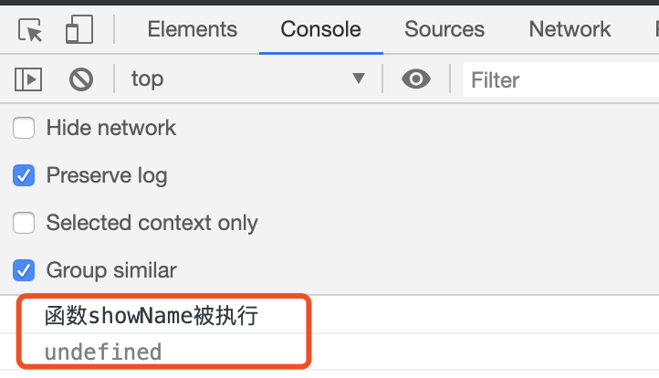
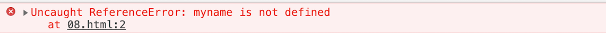
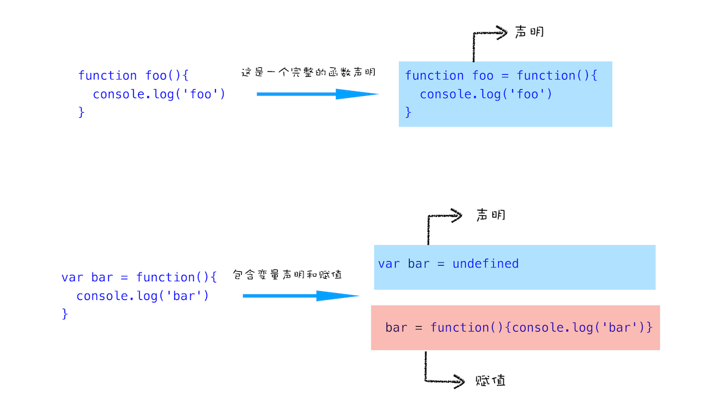
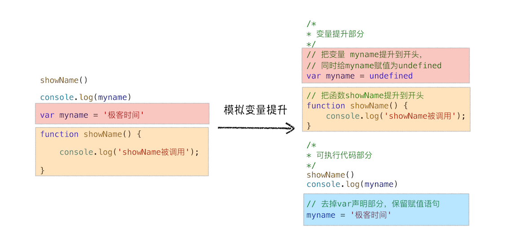
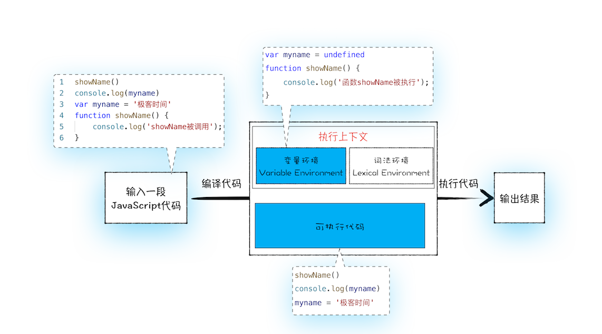

# 07 | 变量提升：JavaScript 代码是按顺序执行的吗？


<audio preload="none" controls loop style="width: 100%;">
  <source src="../mp3/07-变量提升：JavaScript代码是按顺序执行的吗？.mp3" type="audio/mpeg">
  <!-- 如果浏览器不支持，则会呈现下面内容 -->
  <p>你的浏览器不支持HTML5音频，你可以<a href="../mp3/07-变量提升：JavaScript代码是按顺序执行的吗？.mp3">下载</a>这个音频文件</p>
</audio>

讲解完宏观视角下的浏览器后，从这篇文章开始，我们就进入下一个新的模块了，这里我会对 JavaScript 执行原理做深入介绍。

今天在该模块的第一篇文章，我们主要讲解**执行上下文**相关的内容。那为什么先讲执行上下文呢？它这么重要吗？可以这么说，**只有理解了 JavaScrip 的执行上下文，你才能更好地理解 JavaScript 语言本身**，比如变量提升、作用域和闭包等。不仅如此，理解执行上下文和调用栈的概念还能助你成为一名更合格的前端开发者。

不过由于我们专栏不是专门讲 JavaScript 语言的，所以我并不会对 JavaScript 语法本身做过多介绍。本文主要是从 JavaScript 的顺序执行讲起，然后一步步带你了解 JavaScript 是怎么运行的。

接下来咱们先看段代码，你觉得下面这段代码输出的结果是什么？

```js
showName();
console.log(myname);
var myname = "极客时间";
function showName() {
  console.log("函数showName被执行");
}
```

使用过 JavaScript 开发的程序员应该都知道，JavaScript 是按顺序执行的。若按照这个逻辑来理解的话，那么：
当执行到第 1 行的时候，由于函数 showName 还没有定义，所以执行应该会报错；
同样执行第 2 行的时候，由于变量 myname 也未定义，所以同样也会报错。
然而实际执行结果却并非如此， 如下图：



<div style="text-align: center; font-size: 12px; color: #999; margin-bottom: 8px;">Chrome 在声明之前使用函数和变量的执行结果</div>

第 1 行输出“函数 showName 被执行”，第 2 行输出“undefined”，这和前面想象中的顺序执行有点不一样啊！
通过上面的执行结果，你应该已经知道了函数或者变量可以在定义之前使用，那如果使用没有定义的变量或者函数，JavaScript 代码还能继续执行吗？为了验证这点，我们可以删除第 3 行变量 myname 的定义，如下所示：

```js
showName();
console.log(myname);
function showName() {
  console.log("函数showName被执行");
}
```

然后再次执行这段代码时，JavaScript 引擎就会报错，结果如下：



<div style="text-align: center; font-size: 12px; color: #999; margin-bottom: 8px;">Chrome 使用了未定义的变量——执行报错</div>

从上面两段代码的执行结果来看，我们可以得出如下三个结论。

1. 在执行过程中，若使用了未声明的变量，那么 JavaScript 执行会报错。
2. 在一个变量定义之前使用它，不会出错，但是该变量的值会为 undefined，而不是定义时的值。
3. 在一个函数定义之前使用它，不会出错，且函数能正确执行。

第一个结论很好理解，因为变量没有定义，这样在执行 JavaScript 代码时，就找不到该变量，所以 JavaScript 会抛出错误。

但是对于第二个和第三个结论，就挺让人费解的：

- 变量和函数为什么能在其定义之前使用？这似乎表明 JavaScript 代码并不是一行一行执行的。

* 同样的方式，变量和函数的处理结果为什么不一样？比如上面的执行结果，提前使用的 showName 函数能打印出来完整结果，但是提前使用的 myname 变量值却是 undefined，而不是定义时使用的“极客时间”这个值。

## 变量提升（Hoisting）

要解释这两个问题，你就需要先了解下什么是变量提升。

不过在介绍变量提升之前，我们先通过下面这段代码，来看看什么是 JavaScript 中的**声明**和**赋值**。

```js
var myname = "极客时间";
```

这段代码你可以把它看成是两行代码组成的：

```js
var myname; //声明部分
myname = "极客时间"; //赋值部分
```

如下图所示：


<div style="text-align: center; font-size: 12px; color: #999; margin-bottom: 8px;">如何理解`var myname = '极客时间'`</div>

上面是**变量**的声明和赋值，那接下来我们再来看看**函数**的声明和赋值，结合下面这段代码：

```js
function foo() {
  console.log("foo");
}
var bar = function () {
  console.log("bar");
};
```

第一个函数 foo 是一个完整的函数声明，也就是说没有涉及到赋值操作；第二个函数是先声明变量 bar，再把 function(){console.log('bar')}赋值给 bar。为了直观理解，你可以参考下图：



<div style="text-align: center; font-size: 12px; color: #999; margin-bottom: 8px;">函数的声明和赋值</div>

好了，理解了声明和赋值操作，那接下来我们就可以聊聊什么是变量提升了。

**所谓的变量提升，是指在 JavaScript 代码执行过程中，JavaScript 引擎把变量的声明部分和函数的声明部分提升到代码开头的“行为”。变量被提升后，会给变量设置默认值，这个默认值就是我们熟悉的 undefined**。

下面我们来模拟下实现：

```js
/*
 * 变量提升部分
 */
// 把变量 myname提升到开头，
// 同时给myname赋值为undefined
var myname = undefined;
// 把函数showName提升到开头
function showName() {
  console.log("showName被调用");
}
/*
 * 可执行代码部分
 */
showName();
console.log(myname);
// 去掉var声明部分，保留赋值语句
myname = "极客时间";
```

为了模拟变量提升的效果，我们对代码做了以下调整，如下图：



<div style="text-align: center; font-size: 12px; color: #999; margin-bottom: 8px;">模拟变量提升示意图</div>

从图中可以看出，对原来的代码主要做了两处调整：

- 第一处是把声明的部分都提升到了代码开头，如变量 myname 和函数 showName，并给变量设置默认值 undefined；

* 第二处是移除原本声明的变量和函数，如 var myname = '极客时间'的语句，移除了 var 声明，整个移除 showName 的函数声明。

通过这两步，就可以实现变量提升的效果。你也可以执行这段模拟变量提升的代码，其输出结果和第一段代码应该是完全一样的。
通过这段模拟的变量提升代码，相信你已经明白了可以在定义之前使用变量或者函数的原因——**函数和变量在执行之前都提升到了代码开头**。

## JavaScript 代码的执行流程

从概念的字面意义上来看，“变量提升”意味着变量和函数的声明会在物理层面移动到代码的最前面，正如我们所模拟的那样。但，这并不准确。**实际上变量和函数声明在代码里的位置是不会改变的，而且是在编译阶段被 JavaScript 引擎放入内存中**。对，你没听错，一段 JavaScript 代码在执行之前需要被 JavaScript 引擎编译，**编译**完成之后，才会进入**执行**阶段。大致流程你可以参考下图：


<div style="text-align: center; font-size: 12px; color: #999; margin-bottom: 8px;">JavaScript 的执行流程图</div>

### 1. 编译阶段

那么编译阶段和变量提升存在什么关系呢？

为了搞清楚这个问题，我们还是回过头来看上面那段模拟变量提升的代码，为了方便介绍，可以把这段代码分成两部分。

**第一部分：变量提升部分的代码**。

```js
var myname = undefined;
function showName() {
  console.log("函数 showName 被执行");
}
```

**第二部分：执行部分的代码**。

```js
showName();
console.log(myname);
myname = "极客时间";
```

下面我们就可以把 JavaScript 的执行流程细化，如下图所示：



<div style="text-align: center; font-size: 12px; color: #999; margin-bottom: 8px;">JavaScript 执行流程细化图</div>

从上图可以看出，输入一段代码，经过编译后，会生成两部分内容：**执行上下文（Execution context）和可执行代码**。

**执行上下文是 JavaScript 执行一段代码时的运行环境**，比如调用一个函数，就会进入这个函数的执行上下文，确定该函数在执行期间用到的诸如 this、变量、对象以及函数等。

关于执行上下文的细节，我会在下一篇文章《08 | 调用栈：为什么 JavaScript 代码会出现栈溢出？》做详细介绍，现在你只需要知道，在执行上下文中存在一个变量环境的对象（Viriable Environment），该对象中保存了变量提升的内容，比如上面代码中的变量 myname 和函数 showName，都保存在该对象中。

你可以简单地把变量环境对象看成是如下结构：

```js
VariableEnvironment:
myname -> undefined,
showName ->function : {console.log(myname)}
```

了解完变量环境对象的结构后，接下来，我们再结合下面这段代码来分析下是如何生成变量环境对象的。

```js
showName();
console.log(myname);
var myname = "极客时间";
function showName() {
  console.log("函数 showName 被执行");
}
```

我们可以一行一行来分析上述代码：

- 第 1 行和第 2 行，由于这两行代码不是声明操作，所以 JavaScript 引擎不会做任何处理；

* 第 3 行，由于这行是经过 var 声明的，因此 JavaScript 引擎将在环境对象中创建一个名为 myname 的属性，并使用 undefined 对其初始化；

- 第 4 行，JavaScript 引擎发现了一个通过 function 定义的函数，所以它将函数定义存储到堆 (HEAP）中，并在环境对象中创建一个 showName 的属性，然后将该属性值指向堆中函数的位置（不了解堆也没关系，JavaScript 的执行堆和执行栈我会在后续文章中介绍）。

这样就生成了变量环境对象。接下来 JavaScript 引擎会把声明以外的代码编译为字节码，至于字节码的细节，我也会在后面文章中做详细介绍，你可以类比如下的模拟代码：

```js
showName();
console.log(myname);
myname = "极客时间";
```

好了，现在有了执行上下文和可执行代码了，那么接下来就到了执行阶段了。

### 2. 执行阶段

JavaScript 引擎开始执行“可执行代码”，按照顺序一行一行地执行。下面我们就来一行一行分析下这个执行过程：

- 当执行到 showName 函数时，JavaScript 引擎便开始在变量环境对象中查找该函数，由于变量环境对象中存在该函数的引用，所以 JavaScript 引擎便开始执行该函数，并输出“函数 showName 被执行”结果。

* 接下来打印“myname”信息，JavaScript 引擎继续在变量环境对象中查找该对象，由于变量环境存在 myname 变量，并且其值为 undefined，所以这时候就输出 undefined。

- 接下来执行第 3 行，把“极客时间”赋给 myname 变量，赋值后变量环境中的 myname 属性值改变为“极客时间”，变量环境如下所示：

```js
VariableEnvironment:
myname -> "极客时间",
showName ->function : {console.log(myname)}
```

好了，以上就是一段代码的编译和执行流程。实际上，编译阶段和执行阶段都是非常复杂的，包括了词法分析、语法解析、代码优化、代码生成等，这些内容我会在《14 | 编译器和解释器：V8 是如何执行一段 JavaScript 代码的？》那节详细介绍，在本篇文章中你只需要知道 JavaScript 代码经过编译生成了什么内容就可以了。

## 代码中出现相同的变量或者函数怎么办？

现在你已经知道了，在执行一段 JavaScript 代码之前，会编译代码，并将代码中的函数和变量保存到执行上下文的变量环境中，那么如果代码中出现了重名的函数或者变量，JavaScript 引擎会如何处理？

我们先看下面这样一段代码：

```js
function showName() {
  console.log("极客邦");
}
showName();
function showName() {
  console.log("极客时间");
}
showName();
```

在上面代码中，我们先定义了一个 showName 的函数，该函数打印出来“极客邦”；然后调用 showName，并定义了一个 showName 函数，这个 showName 函数打印出来的是“极客时间”；最后接着继续调用 showName。那么你能分析出来这两次调用打印出来的值是什么吗？

我们来分析下其完整执行流程：

- **首先是编译阶段**。遇到了第一个 showName 函数，会将该函数体存放到变量环境中。接下来是第二个 showName 函数，继续存放至变量环境中，但是变量环境中已经存在一个 showName 函数了，此时，**第二个 showName 函数会将第一个 showName 函数覆盖掉**。这样变量环境中就只存在第二个 showName 函数了。

* **接下来是执行阶段**。先执行第一个 showName 函数，但由于是从变量环境中查找 showName 函数，而变量环境中只保存了第二个 showName 函数，所以最终调用的是第二个函数，打印的内容是“极客时间”。第二次执行 showName 函数也是走同样的流程，所以输出的结果也是“极客时间”。

综上所述，**一段代码如果定义了两个相同名字的函数，那么最终生效的是最后一个函数**。

## 总结

好了，今天就到这里，下面我来简单总结下今天的主要内容：

- JavaScript 代码执行过程中，需要先做变量提升，而之所以需要实现变量提升，是因为 JavaScript 代码在执行之前需要先编译。

* 在编译阶段，变量和函数会被存放到变量环境中，变量的默认值会被设置为 undefined；在代码执行阶段，JavaScript 引擎会从变量环境中去查找自定义的变量和函数。

- 如果在编译阶段，存在两个相同的函数，那么最终存放在变量环境中的是最后定义的那个，这是因为后定义的会覆盖掉之前定义的。

以上就是今天所讲的主要内容，当然，学习这些内容并不是让你掌握一些 JavaScript 小技巧，其主要目的是让你清楚 JavaScript 的执行机制：**先编译，再执行**。

如果你了解了 JavaScript 执行流程，那么在编写代码时，你就能避开一些陷阱；在分析代码过程中，也能通过分析 JavaScript 的执行过程来定位问题。

## 思考时间

最后，看下面这段代码：

```js
showName();
var showName = function () {
  console.log(2);
};
function showName() {
  console.log(1);
}
```

你能按照 JavaScript 的执行流程，来分析最终输出结果吗？

结果分析：

```js
// 输出 1
// 编译阶段:
var showName;
function showName() {
  console.log(1);
}
// 执行阶段:
showName(); //输出 1
showName = function () {
  console.log(2);
};
//如果后面再有 showName 执行的话，就输出 2 因为这时候函数引用已经变了
```

## 问答

**Q**：
head 头部引入的 js 文件，也是先编译的吗？

**A**：
我先来解释下页面在含有 JavaScript 的情况下 DOM 解析流程，然后再来解释你这个问题。
当从服务器接收 HTML 页面的第一批数据时，DOM 解析器就开始工作了，在解析过程中，如果遇到了 JS 脚本，如下所示：

```html
<html>
  <body>
    极客时间
    <script>
      document.write("--foo");
    </script>
  </body>
</html>
```

那么 DOM 解析器会先执行 JavaScript 脚本，执行完成之后，再继续往下解析。
那么第二种情况复杂点了，我们内联的脚本替换成 js 外部文件，如下所示：

```html
<html>
  <body>
    极客时间
    <script type="text/javascript" src="foo.js"></script>
  </body>
</html>
```

这种情况下，当解析到 JavaScript 的时候，会先暂停 DOM 解析，并下载 foo.js 文件，下载完成之后执行该段 JS 文件，然后再继续往下解析 DOM。这就是 JavaScript 文件为什么会阻塞 DOM 渲染。
我们再看第三种情况，还是看下面代码：

```html
<html>
  <head>
    <style type="text/css" src="theme.css"></style>
  </head>
  <body>
    <p>极客时间</p>
    <script>
      let e = document.getElementsByTagName("p")[0];
      e.style.color = "blue";
    </script>
  </body>
</html>
```

当我在 JavaScript 中访问了某个元素的样式，那么这时候就需要等待这个样式被下载完成才能继续往下执行，所以在这种情况下，CSS 也会阻塞 DOM 的解析。
所以这时候如果头部包含了 js 文件，那么同样也会暂停 DOM 解析，等带该 JavaScript 文件下载后，便开始编译执行该文件，执行结束之后，才开始继续 DOM 解析。
<!-- 
爱吃锅巴的沐泡
2019-08-20
答案：1
编译阶段:
var showName = undefined
function showName() {console.log(1)}
执行阶段:
showName() //输出 1
showName = function() {console.log(2)}
分析：首先遇到声明的变量 showName，并在变量环境中存一个 showName 属性，赋值为 undefined; 又遇到声明的函数，也存一个 showName 的属性，但是发现之前有这个属性了，就将其覆盖掉，并指向堆中的声明的这个函数地址。所以在执行阶段调用 showName()会输出 1;执行 showName = function() {console.log(2)}这句话是把堆中的另一个函数地址赋值给了 showName 属性，也就改变了其属性值，所以如果再调用 showName()，那个会输出 2. 这是不是体现了函数是对象，函数名是指针。
疑问：如果同名的变量和函数名，变量环境中是分别保存还是如何处理的？
作者回复: 下面是关于同名变量和函数的两点处理原则：
1:如果是同名的函数，JavaScript 编译阶段会选择最后声明的那个。
2:如果变量和函数同名，那么在编译阶段，变量的声明会被忽略

he
2019-08-21
函数提升要比变量提升的优先级要高一些，且不会被变量声明覆盖，但是会被变量赋值之后覆盖。
作者回复: 对

共 10 条评论 

74

shezhenbiao
2019-08-25
老师好，请教您一个问题。
debugger;
(function(){
console.log(g)
if(true){
console.log('hello world');
function g(){ return true; }
}
})();
这个函数步进调试时，发现打印 g 时值是 undefined 而不是提示 not defined，说明 if 中 g 函数确实是提升了，但是为何不是 g()而是 undefined？然后走完 function g(){ return true; }这一步后 console.log(g)中的 g 才变为 g()。这里条件声明函数的变量提升有点搞不明白。
作者回复:
ES 规定函数只不能在块级作用域中声明，
function foo(){
if(true){
console.log('hello world');
function g(){ return true; }
}
}
也就是说，上面这行代码执行会报错，但是个大浏览器都没有遵守这个标准。
接下来到了 ES6 了，ES6 明确支持块级作用域，ES6 规定块级作用域内部声明的函数，和通过 let 声明变量的行为类似。
规定的是理想的，但是还要照顾实现，要是完全按照 let 的方式来修订，会影响到以前老的代码，所以为了向下兼容，个大浏览器基本是按照下面的方式来实现的：
function foo(){
if(true){
console.log('hello world');
var g = function(){return true;}
}
}
这就解释了你的疑问，不过还是不建议在块级作用域中定义函数，很多时候，简单的才是最好的。

William
2019-08-21
老师，如果把两个函数调换个儿。那么先声明 function，然后把 showName 赋值 undefined，undefined 不会覆盖函数声明。这是为什么？
console.log(showName.toString())
function showName() {
console.log(1)
}
var showName = function() {
console.log(2)
}
打印的是函数体，而非 undefined，证明 undefined 不会覆盖函数声明！！
展开 
作者回复: 对 是这样的，下面是关于同名变量和函数的两点处理原则：
1:如果是同名的函数，JavaScript 编译阶段会选择最后声明的那个。
2:如果变量和函数同名，那么在编译阶段，变量的声明会被忽略。

林展翔
2019-08-20
老师，可以请教下吗，在编译完成之后是单单生成了字节码，再到执行过程中变成对应平台的机器码？ 还是编译过程已经生成了对应平台的机器码， 执行阶段就直接去执行相应的机器码？
作者回复: 先是生成字节码，然后解释器可以直接执行字节码，输出结果。 但是通常 Javascript 还有个编译器，会把那些频繁执行的字节码编译为二进制，这样那些经常被运行的函数就可以快速执行了，通常又把这种解释器和编译器混合使用的技术称为 JIT

Geek_East
2019-11-28
lexical scope 发生在编译阶段，会产生变量提升的效果；
JavaScript 的 Dynamic Scope 发生在执行阶段，会产生 this binding, prototype chaining search 的过程；
变量提升只提升声明(left hand）不提升赋值(right hand)
function 的声明主要有: function declaration, function expression
其中 function declaration 会将方法体也提升，而 function expression 同变量提升一样，只会提升声明；
变量提升在有 let 或者 const 的 block 中会出现 Temporal Dead Zone Error, 效果好似没有提升；
另外要注意 block 内部的 var 变量能够穿透 block 提升到 global scope.
更多 JS 请了解：
https://geekeast.github.io/jsscope.html
作者回复: 很赞



25

林高鸿
2019-08-20
老师，ES6 后不用 var，所以可否理解 Hoisting 为“权宜之计/设计失误”呢？
作者回复:
你也可以理解为涉及失误，因为设计之初的目的就是想让网页动起来，JavaScript 创造者 Brendan Eich 并没有打算把语言设计太复杂。
所以只引入了函数级作用域和全局作用域，一些快级作用域都被华丽地忽略掉了。
这样如果变量或者函数在 if 块，while 块里面，因为他们没有作用域，所以在编译阶段，就干脆把这些变量和函数提升到开头，这样设计语言的复杂性就大大降低了，但是这也埋下了混乱的种子。
随着 JavaScript 的流行，人们发现问题越来越多，中间的历史就展开了，最终推出了 es6，在语言层面做了非常大的调整，但是为了保持想下兼容，就必须新的规则和旧的规则都同时支持，这样也导致了语言层面不必要的复杂性。
虽然 JavaScript 语言本身问题很多，但是它已经是整个开发生态中的不可或缺的一环了，因此，不要因为它的问题多就不想去学它，我认为判断要学不学习一门语言要看所能产生的价值，JavaScript 就这样一门存在很多缺陷却是非常有价值的语言。

YBB
2019-08-26
老师我想问下，一段 javascript 代码进入编译阶段是会对函数体内的代码也进行编译，还是只是将函数体的代码存储在堆，在执行中遇到该函数再去编译？
作者回复: 记住一点就行：函数只有在调用的时候才会被编译。

趁你还年轻 233
2019-11-11
var showName;
function showName() {
console.log(1)
}
showName();
showName = function() {
console.log(2)
};
这样声明没有问题，可以正常输出 1。
为什么下面的代码会报错呢：Uncaught TypeError: showName is not a function
var showName = undefined;
function showName() {
console.log(1)
}
showName();
showName = function() {
console.log(2)
};
作者回复: 因为在执行过程 showName 先被替换为 undefined
然后再执行 showName（），这时 showName 的值是 undefined 了，所以提示错误

林展翔
2019-08-20
x = 10 + 20;
console.log(x);
若对 x 未进行定义, 直接赋值, 可以输出
若按照课程理解并假设
编译阶段会有一个
x = undefine
但是
console.log(x);
x = 10 + 20;
console.log(x);
会出现报错 x is not defined
在这个地方 我的理解有什么问题吗 还是说 原来就没有 x = undefine 操作, 只是在 x = 10 + 20; 给 x 赋值了一下.
作者回复: 需要通过 var x 声明才会在编译期间提升

共 4 条评论 

7

六个周
2019-08-20
通过这篇文章我学到了一个知识点：
清楚 了 JavaScript 的执行机制：先编译，再执行。

Geek_94875e
2020-04-28
我觉得在编译阶段变量提升这可能再加上一些描述会比较好一点
1：变量提升只针对 var 和 function，对于 let 和 const 就不会
2：var 和 function 的提升优先级是一样的，按先后顺序，只是提升的时候执行的逻辑不一样 1.在提升的时候，如果没有定义对应的变量，就在 vo 里面定义变量 2.如果定义了，就不在重复定义 3.如果是函数，就设置对应的值为函数体
展开 

阿感
2020-03-22
showName();
var showName = function() { console.log(2)};
function showName() { console.log(1)}
showName();
输出 1，2。
分析：
（1）JavaScript 的执行机制：先编译，再执行
（2）变量环境的对象（Viriable Environment），该对象中保存了变量提升的内容
（3）
对于 var 声明:
经过 var 声明的， JavaScript 引擎将在环境对象中创建一个名为 xxxx 的属性，并使用 undefined 对其初始化;
对于函数声明：
JavaScript 引擎发现了一个通过 function 定义的函数，所以它将函数定义存储到堆 (HEAP）中，并在环境对象中创建一个 xxxx 的属性，然后将该属性值指向堆中函数的位置;
（4）没经过 var 声明，如 a = 1；这样的不会提升；es6 的 let const 也没有变量提升。
(5)同名函数声明，后面覆盖前面的；如果变量和函数同名，那么在编译阶段，变量的声明会被忽略（函数声明优先级高）
(6)注意声明提前后，执行代码到底是什么。可能会导致虽然声明提前的时候，函数优先级高覆盖了同名变量，但是执行的时候却被改变指向，输出非函数值结果。
编译阶段：
本来 var showName = undefined，同名函数优先级更高，所以变量对象里保存的是 function showName() { console.log(1)}；
执行阶段：
先看看执行部分的代码
showName();
showName = function() { console.log(2)};
（这里原来函数的位置整个被提升了）
showName();
所以第一个 showName();执行，从变量对象里找到函数 showName，输出 1；
接着 showName 被赋值 function() { console.log(2)};改变了指向。
再执行 showName();那么就输出新指向的了，也就是 2。

Luke
2019-09-09
当从服务器接收 HTML 页面的第一批数据时，DOM 解析器就开始工作了，在解析过程中，如果遇到了 JS 脚本，如下所示：

<html>
<body>
极客时间
<script>
document.write("--foo")
</script>
</body>
</html>
那么DOM解析器会先执行JavaScript脚本，执行完成之后，再继续往下解析。
那么第二种情况复杂点了，我们内联的脚本替换成js外部文件，如下所示：
<html>
<body>
极客时间
<script type="text/javascript" src="foo.js"></script>
</body>
</html>
这种情况下，当解析到JavaScript的时候，会先暂停DOM解析，并下载foo.js文件，下载完成之后执行该段JS文件，然后再继续往下解析DOM。这就是JavaScript文件为什么会阻塞DOM渲染。
我们再看第三种情况，还是看下面代码：
<html>
<head>
<style type="text/css" src = "theme.css" />
</head>
<body>
<p>极客时间</p>
<script>
let e = document.getElementsByTagName('p')[0]
e.style.color = 'blue'
</script>
</body>
</html>
当我在JavaScript中访问了某个元素的样式，那么这时候就需要等待这个样式被下载完成才能继续往下执行，所以在这种情况下，CSS也会阻塞DOM的解析。
所以这时候如果头部包含了js文件，那么同样也会暂停DOM解析，等带该JavaScript文件下载后，便开始编译执行该文件，执行结束之后，才开始继续DOM解析。
-------------
老师，最后一种情况，如果js中没有访问元素的样式，那么js还要继续等待CSS 加载解析完成吗？在这种情况下，chrome 和firefox 的处理是不是不太一样？chrome 会并行加载解析css，而firefox 会等待css加载解析完成后再执行js？


3

杨陆伟
2019-08-20
showName()
function showName(){
console.log(1)
}
var showName=function(){
console.log(2)
}
showName()
第二个 showName 打印为 2，为什么这个 showName 找的是变量而不是函数，或者此时变量环境中已经没有了 showName 函数，只有 showName 变量？谢谢
作者回复: 是的，变量环境中只保存一个

KeilingZhuang
2020-09-29
这个专栏真是宝藏。搜了一堆文章和译文都没看明白，这篇文章一看就懂，谢谢大佬^\_^ 棒棒哒

Lester
2019-11-13
如果变量和函数同名，那么在编译阶段，变量的声明会被忽略，执行的时候还是后面的是什么就是什么，而不会因为同名，就一定是函数。
作者回复: 对的

子非鱼
2019-08-22
老师我有个问题，正常情况 domcontentloaded 事件是在浏览器下载并解析完 html 才触发，如果有内嵌外部 js 文件，也要等到 js 加载并执行完才触发。但如果页面是被二次访问并且 html 和引入的外部 js 都命中了缓存，则是否也要等到 js 被完全执行才触发呢？
作者回复: 需要的，因为不管是否缓存了，都需要执行 JS
→ -->
