<!-- <script setup>
import VpImg from '../../components/vp-img.vue';
</script> -->

# 08 | 调用栈：为什么 JavaScript 代码会出现栈溢出？


<!-- :::demo vp-img
<VpImg src="../../public/browser/js-execution-mechanism/08/cover-picture-08.png" text=""></VpImg>
::: -->

<audio preload="none" controls loop style="width: 100%;">
  <source src="../mp3/08-调用栈：为什么JavaScript代码会出现栈溢出？.mp3" type="audio/mpeg">
  <!-- 如果浏览器不支持，则会呈现下面内容 -->
  <p>你的浏览器不支持HTML5音频，你可以<a href="../mp3/08-调用栈：为什么JavaScript代码会出现栈溢出？.mp3">下载</a>这个音频文件</p>
</audio>

在上篇文章中，我们讲到了，当一段代码被执行时，JavaScript 引擎先会对其进行编译，并创建执行上下文。但是并没有明确说明到底什么样的代码才算符合规范。

那么接下来我们就来明确下，哪些情况下代码才算是“一段”代码，才会在执行之前就进行编译并创建执行上下文。一般说来，有这么三种情况：

1. 当 JavaScript 执行全局代码的时候，会编译全局代码并创建全局执行上下文，而且在整个页面的生存周期内，全局执行上下文只有一份。

2. 当调用一个函数的时候，函数体内的代码会被编译，并创建函数执行上下文，一般情况下，函数执行结束之后，创建的函数执行上下文会被销毁。

3. 当使用 eval 函数的时候，eval 的代码也会被编译，并创建执行上下文。

好了，又进一步理解了执行上下文，那本节我们就在这基础之上继续深入，一起聊聊**调用栈**。学习调用栈至少有以下三点好处：

1. 可以帮助你了解 JavaScript 引擎背后的工作原理；

2. 让你有调试 JavaScript 代码的能力；

3. 帮助你搞定面试，因为面试过程中，调用栈也是出境率非常高的题目。

比如你在写 JavaScript 代码的时候，有时候可能会遇到栈溢出的错误，如下图所示：

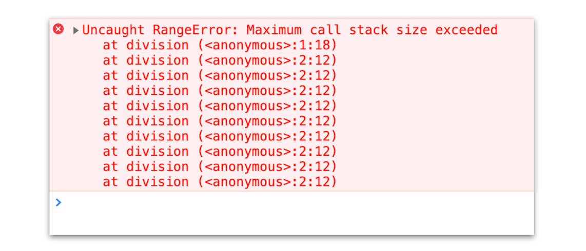

<div style="text-align: center; font-size: 12px; color: #999; margin-bottom: 8px;">栈溢出的错误</div>

<!-- :::demo vp-img
<VpImg src="../../public/browser/js-execution-mechanism/08/image.png" text="栈溢出的错误"></VpImg>
::: -->

那为什么会出现这种错误呢？这就涉及到了**调用栈**的内容。你应该知道 JavaScript 中有很多函数，经常会出现在一个函数中调用另外一个函数的情况，**调用栈就是用来管理函数调用关系的一种数据结构**。因此要讲清楚调用栈，你还要先弄明白**函数调用**和**栈结构**。

## 什么是函数调用

函数调用就是运行一个函数，具体使用方式是使用函数名称跟着一对小括号。下面我们看个简单的示例代码：

```js
var a = 2;
function add() {
  var b = 10;
  return a + b;
}
add();
```

这段代码很简单，先是创建了一个 add 函数，接着在代码的最下面又调用了该函数。

那么下面我们就利用这段简单的代码来解释下函数调用的过程。

在执行到函数 add() 之前，JavaScript 引擎会为上面这段代码创建全局执行上下文，包含了声明的函数和变量，你可以参考下图：

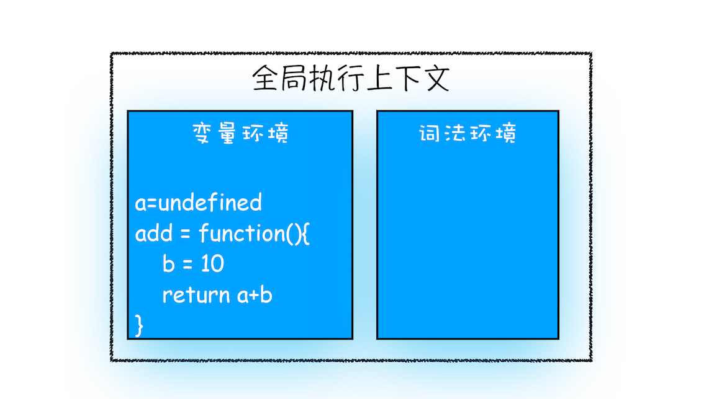

<div style="text-align: center; font-size: 12px; color: #999; margin-bottom: 8px;">全局执行上下文</div>

<!-- :::demo vp-img
<VpImg src="../../public/browser/js-execution-mechanism/08/image-1.png" text="全局执行上下文"></VpImg>
::: -->

从图中可以看出，代码中全局变量和函数都保存在全局上下文的变量环境中。

执行上下文准备好之后，便开始执行全局代码，当执行到 add 这儿时，JavaScript 判断这是一个函数调用，那么将执行以下操作：

- 首先，从**全局执行上下文**中，取出 add 函数代码。

* 其次，对 add 函数的这段代码进行编译，并创建**该函数的执行上下文**和**可执行代码**。

- 最后，执行代码，输出结果。

完整流程你可以参考下图：

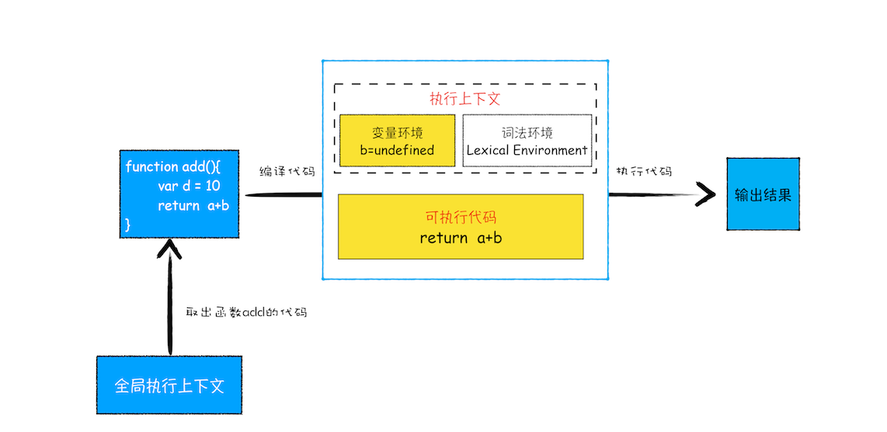

<div style="text-align: center; font-size: 12px; color: #999; margin-bottom: 8px;">函数调用过程</div>

就这样，当执行到 add 函数的时候，我们就有了两个执行上下文了——全局执行上下文和 add 函数的执行上下文。

也就是说在执行 JavaScript 时，可能会存在多个执行上下文，那么 JavaScript 引擎是如何管理这些执行上下文的呢？

答案是**通过一种叫栈的数据结构来管理的**。那什么是栈呢？它又是如何管理这些执行上下文呢？

## 什么是栈

关于栈，你可以结合这么一个贴切的例子来理解，一条单车道的单行线，一端被堵住了，而另一端入口处没有任何提示信息，堵住之后就只能后进去的车子先出来，这时这个堵住的单行线就可以被看作是一个**栈容器**，车子开进单行线的操作叫做**入栈**，车子倒出去的操作叫做**出栈**。

在车流量较大的场景中，就会发生反复的入栈、栈满、出栈、空栈和再次入栈，一直循环。

所以，栈就是类似于一端被堵住的单行线，车子类似于栈中的元素，栈中的元素满足**后进先出**的特点。你可以参看下图：

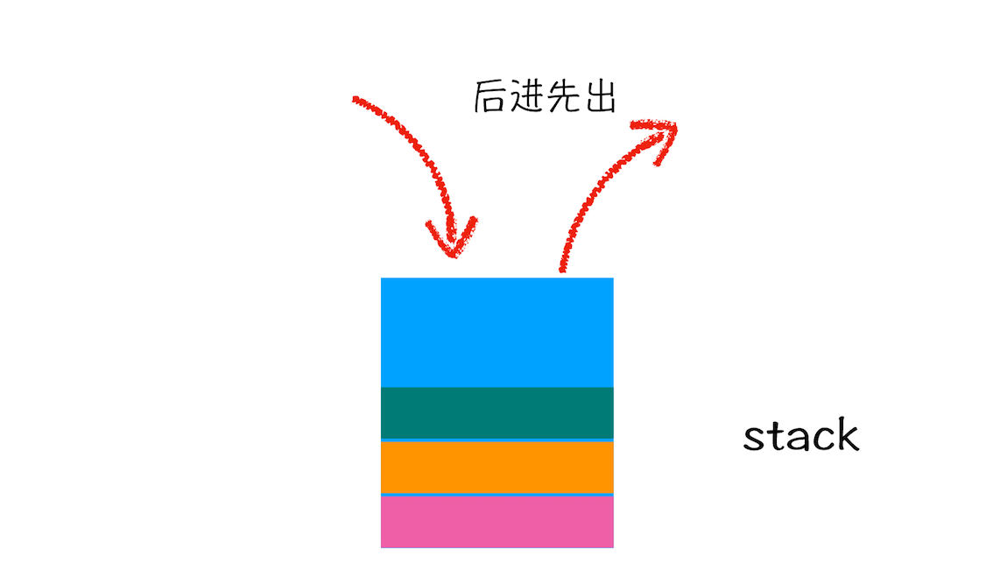

<div style="text-align: center; font-size: 12px; color: #999; margin-bottom: 8px;">栈示意图</div>

## 什么是 JavaScript 的调用栈

JavaScript 引擎正是利用栈的这种结构来管理执行上下文的。在执行上下文创建好后，JavaScript 引擎会将执行上下文压入栈中，通常把这种用来管理执行上下文的栈称为**执行上下文栈**，又称**调用栈**。

为便于你更好地理解调用栈，下面我们再来看段稍微复杂点的示例代码：

```js
var a = 2;
function add(b, c) {
  return b + c;
}
function addAll(b, c) {
  var d = 10;
  result = add(b, c);
  return a + result + d;
}
addAll(3, 6);
```

在上面这段代码中，你可以看到它是在 addAll 函数中调用了 add 函数，那在整个代码的执行过程中，调用栈是怎么变化的呢？

下面我们就一步步地分析在代码的执行过程中，调用栈的状态变化情况。

**第一步，创建全局上下文，并将其压入栈底**。如下图所示：

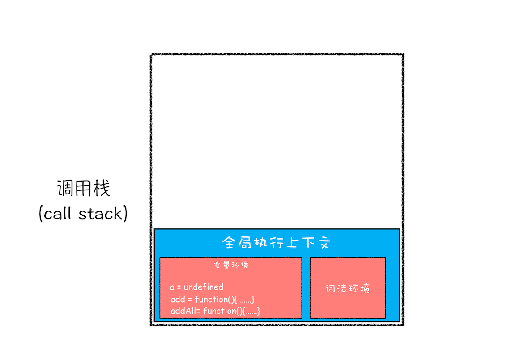

<div style="text-align: center; font-size: 12px; color: #999; margin-bottom: 8px;">全局执行上下文压栈</div>

从图中你也可以看出，变量 a、函数 add 和 addAll 都保存到了全局上下文的变量环境对象中。

全局执行上下文压入到调用栈后，JavaScript 引擎便开始执行全局代码了。首先会执行 a=2 的赋值操作，执行该语句会将全局上下文变量环境中 a 的值设置为 2。设置后的全局上下文的状态如下图所示：

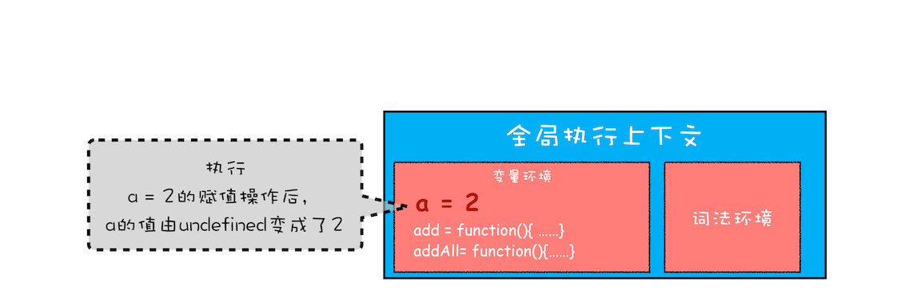

<div style="text-align: center; font-size: 12px; color: #999; margin-bottom: 8px;">赋值操作改变执行上下文中的值</div>

接下来，**第二步是调用 addAll 函数**。当调用该函数时，JavaScript 引擎会编译该函数，并为其创建一个执行上下文，最后还将该函数的执行上下文压入栈中，如下图所示：

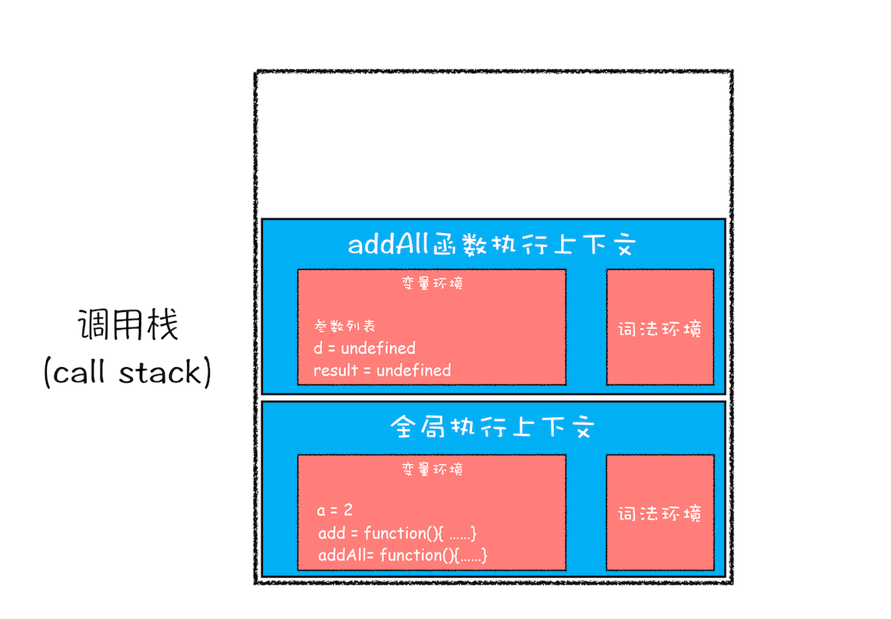

<div style="text-align: center; font-size: 12px; color: #999; margin-bottom: 8px;">执行 addAll 函数时的调用栈</div>

addAll 函数的执行上下文创建好之后，便进入了函数代码的执行阶段了，这里先执行的是 d=10 的赋值操作，执行语句会将 addAll 函数执行上下文中的 d 由 undefined 变成了 10。

然后接着往下执行，**第三步，当执行到 add 函数**调用语句时，同样会为其创建执行上下文，并将其压入调用栈，如下图所示：

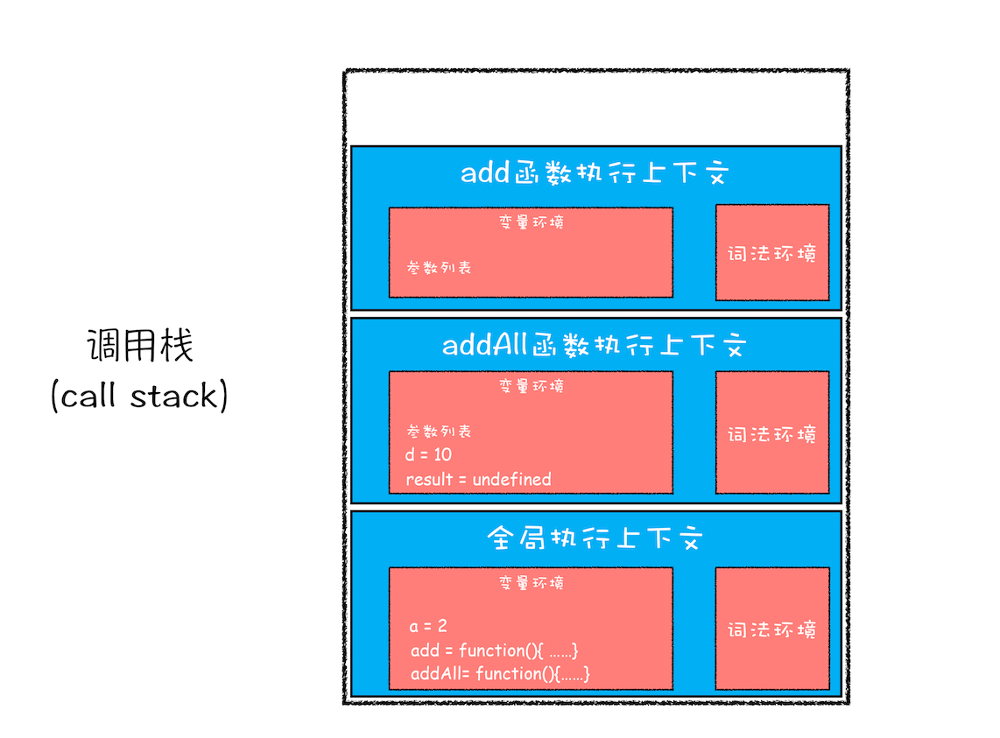

<div style="text-align: center; font-size: 12px; color: #999; margin-bottom: 8px;">执行 add 函数时的调用栈</div>

当 add 函数返回时，该函数的执行上下文就会从栈顶弹出，并将 result 的值设置为 add 函数的返回值，也就是 9。如下图所示：

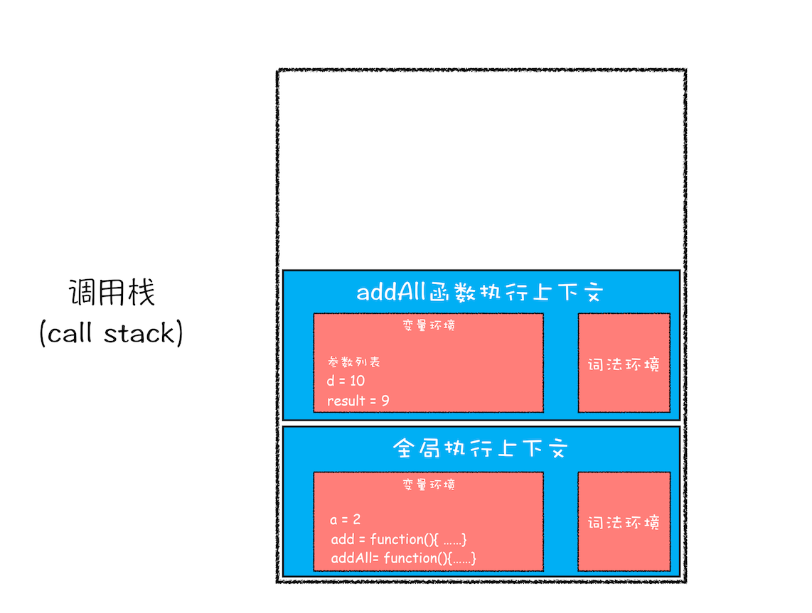

<div style="text-align: center; font-size: 12px; color: #999; margin-bottom: 8px;">add 函数执行结束时的调用栈</div>

紧接着 addAll 执行最后一个相加操作后并返回，addAll 的执行上下文也会从栈顶部弹出，此时调用栈中就只剩下全局上下文了。最终如下图所示：

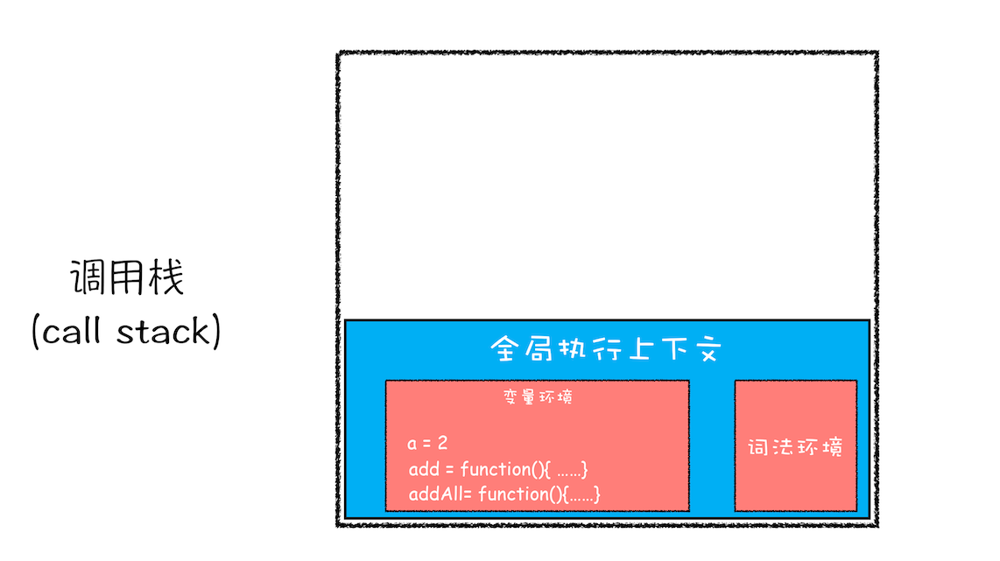

<div style="text-align: center; font-size: 12px; color: #999; margin-bottom: 8px;">addAll 函数执行结束时的调用栈</div>

至此，整个 JavaScript 流程执行结束了。

好了，现在你应该知道了**调用栈是 JavaScript 引擎追踪函数执行的一个机制**，当一次有多个函数被调用时，通过调用栈就能够追踪到哪个函数正在被执行以及各函数之间的调用关系。

## 在开发中，如何利用好调用栈

鉴于调用栈的重要性和实用性，那么接下来我们就一起来看看在实际工作中，应该如何查看和利用好调用栈。

### 1. 如何利用浏览器查看调用栈的信息

当你执行一段复杂的代码时，你可能很难从代码文件中分析其调用关系，这时候你可以在你想要查看的函数中加入断点，然后当执行到该函数时，就可以查看该函数的调用栈了。
这么说可能有点抽象，这里我们拿上面的那段代码做个演示，你可以打开“开发者工具”，点击“Source”标签，选择 JavaScript 代码的页面，然后在第 3 行加上断点，并刷新页面。你可以看到执行到 add 函数时，执行流程就暂停了，这时可以通过右边“call stack”来查看当前的调用栈的情况，如下图：

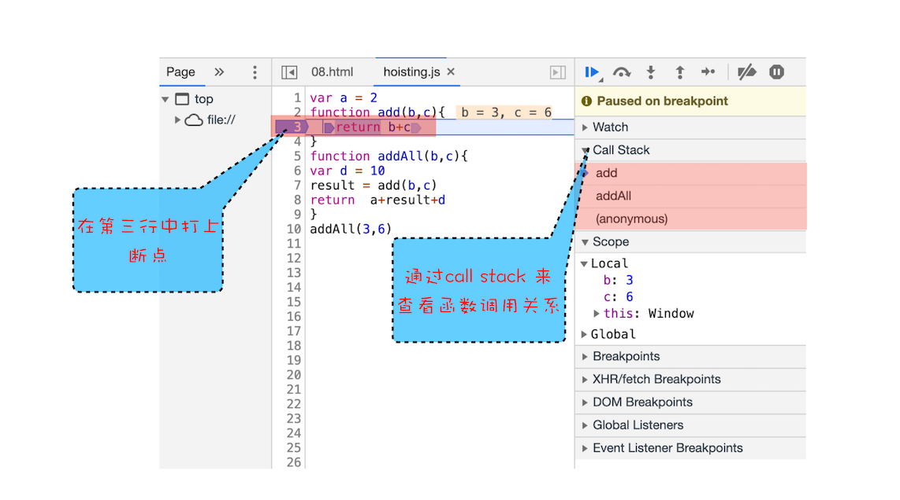

<div style="text-align: center; font-size: 12px; color: #999; margin-bottom: 8px;">函数调用过程</div>

从图中可以看出，右边的“call stack”下面显示出来了函数的调用关系：栈的最底部是 anonymous，也就是全局的函数入口；中间是 addAll 函数；顶部是 add 函数。这就清晰地反映了函数的调用关系，所以**在分析复杂结构代码，或者检查 Bug 时，调用栈都是非常有用的**。

除了通过断点来查看调用栈，你还可以使用 console.trace() 来输出当前的函数调用关系，比如在示例代码中的 add 函数里面加上了 console.trace()，你就可以看到控制台输出的结果，如下图：

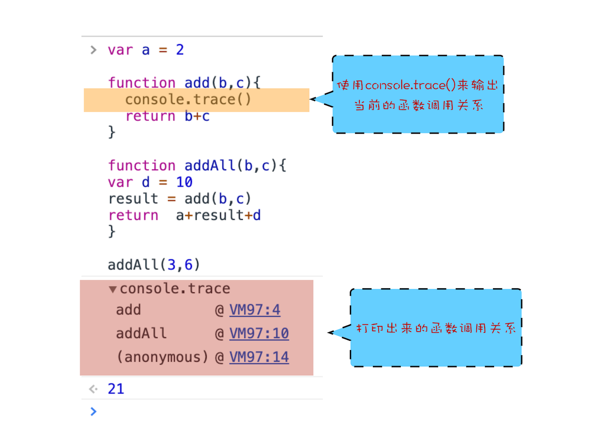

<div style="text-align: center; font-size: 12px; color: #999; margin-bottom: 8px;">使用 trace 函数输出当前调用栈信息</div>

### 2. 栈溢出（Stack Overflow）

现在你知道了调用栈是一种用来管理执行上下文的数据结构，符合后进先出的规则。不过还有一点你要注意，**调用栈是有大小的**，当入栈的执行上下文超过一定数目，JavaScript 引擎就会报错，我们把这种错误叫做**栈溢出**。

特别是在你写递归代码的时候，就很容易出现栈溢出的情况。比如下面这段代码：

```js
function division(a, b) {
  return division(a, b);
}
console.log(division(1, 2));
```

当执行时，就会抛出栈溢出错误，如下图：

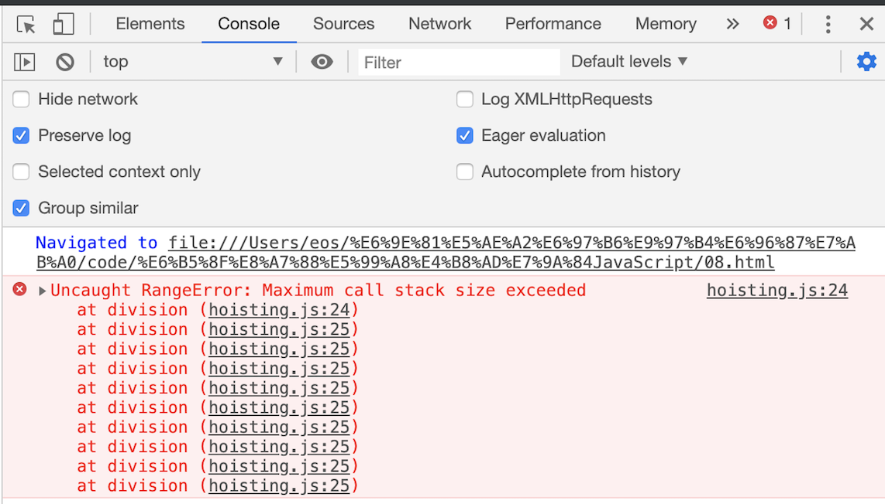

<div style="text-align: center; font-size: 12px; color: #999; margin-bottom: 8px;">栈溢出错误</div>

从上图你可以看到，抛出的错误信息为：超过了最大栈调用大小（Maximum call stack size exceeded）。

那为什么会出现这个问题呢？这是因为当 JavaScript 引擎开始执行这段代码时，它首先调用函数 division，并创建执行上下文，压入栈中；然而，这个函数是**递归的，并且没有任何终止条件**，所以它会一直创建新的函数执行上下文，并反复将其压入栈中，但栈是有容量限制的，超过最大数量后就会出现栈溢出的错误。

理解了栈溢出原因后，你就可以使用一些方法来避免或者解决栈溢出的问题，比如把递归调用的形式改造成其他形式，或者使用加入定时器的方法来把当前任务拆分为其他很多小任务。

## 总结

好了，今天的内容就讲到这里，下面来总结下今天的内容。

- 每调用一个函数，JavaScript 引擎会为其创建执行上下文，并把该执行上下文压入调用栈，然后 JavaScript 引擎开始执行函数代码。

* 如果在一个函数 A 中调用了另外一个函数 B，那么 JavaScript 引擎会为 B 函数创建执行上下文，并将 B 函数的执行上下文压入栈顶。

- 当前函数执行完毕后，JavaScript 引擎会将该函数的执行上下文弹出栈。

* 当分配的调用栈空间被占满时，会引发“堆栈溢出”问题。

栈是一种非常重要的数据结构，不光应用在 JavaScript 语言中，其他的编程语言，如 C/C++、Java、Python 等语言，在执行过程中也都使用了栈来管理函数之间的调用关系。所以栈是非常基础且重要的知识点，你必须得掌握。

## 思考时间

最后，我给你留个思考题，你可以看下面这段代码：

```js
function runStack(n) {
  if (n === 0) return 100;
  return runStack(n - 2);
}
runStack(50000);
```

这是一段递归代码，可以通过传入参数 n，让代码递归执行 n 次，也就意味着调用栈的深度能达到 n，当输入一个较大的数时，比如 50000，就会出现栈溢出的问题，那么你能优化下这段代码，以解决栈溢出的问题吗？

<!--
## 问答

徐承银
2019-08-22
不进栈，就不会栈溢出了。function runStack (n) {
if (n === 0) return 100;
return setTimeout(function(){runStack( n- 2)},0);
}
runStack(50000)

FreezeSoul
2020-03-19
评论比文章更丰富系列

黄晓杰
2019-09-11
老师，我有一个疑问，调用栈是后进先出，那么当存在闭包时，某个函数的执行上下文还存在，那么其他函数的出栈是否受影响？
作者回复: 执行上下文已经没了，只不过内部函数引用的变量还保存在堆上，所以不影响栈的操作，后面一节有分析这个问题！

ytd
2019-08-22
改成循环不会栈溢出了，不过就有可能陷入死循环：
// 优化
function runStack(n) {
while (true) {
if (n === 0) {
return 100;
}
if (n === 1) { // 防止陷入死循环
return 200;
}
n = n - 2;
}
}
console.log(runStack(50000));
共 4 条评论 

31

Geek_8476da
2019-09-10
我测试出了栈的深度为 12574

黄榆
2019-09-03
https://kangax.github.io/compat-table/es6/ 这个网站可以看到各平台对作为 es6 特性的尾调用优化的支持情况，表格里面显示：桌面浏览器中只有 safari 12 支持尾调用优化。我自己使用 safari 12 测试，严格模式下运行作者代码能正常得出结果。https://node.green/#ESNEXT-strawman--stage-0--syntactic-tail-calls 这个网站则显示，目前版本的 node.js 不支持尾递归优化

mfist
2019-08-22

1. 改成尾递归调用（需要在严格模式下面生效）
   function runStack (n, result=100) {
   if (n === 0) return result;
   return runStack( n- 2, result);
   }
   runStack(50000, 100)
2. 改成循环调用，不使用递归函数，就不存在堆栈溢出
   作者回复: 有尝试过尾优化会生效吗？

yetta_xy
2019-09-07
老师您好，有个疑问。
addAll 函数中的 result 变量没有用 var 声明，直接赋值的，这个变量应该存在于全局上下文的环境变量对象中吧？
共 5 条评论 

16

一步

2019-08-24
关于调用栈的大小，不用的平台，比如浏览器，nodejs 怎么查看设置的，还是硬编码的？
作者回复: 调用栈有两个指标，最大栈容量和最大调用深度，满足其中任意一个就会栈溢出，不过具体多大和多深，这个没有研究过，你可以拿我留的作业那段代码去各平台测试下，应该很快就能测试出来最大调用深度。

pyhhou
2019-08-23
思考题当中的函数，如果输入参数是正偶数，那么不管数值多大，最后结果都是 100，除此之外，如果输入参数是负数或者是正奇数，甚至说是浮点数，那么使用递归方式调用会导致栈溢出，使用循环方式去实现会导致死循环，如果仅仅是基于当前的输入参数（50000）改写的话：
function runStack (n) {
return 100;
}
runStack(50000);
当然也可以把递归改成循环的写法，但是要注意的是这时的输入参数仅限定于正偶数，否则会死循环：
function runStack (n) {
while (n !== 0) {
n -= 2;
}
return 100;
}
runStack(50000);
作者回复: 可能我的题目出得不太好，误解我出题目的意思了，我的意思是 runStack 要执行 50000 次的，但是要避免栈溢出，改成斐波那契数列的列子可能好点。

AICC
2019-08-27
老师会在什么地方讲解每节内容留下的思考题？比如像这节的尾调用问题，是否存在尾调用优化，至少目前看到的尝试方式在 chrome 上都会出现栈溢出，有说是 v8 移除了 TCO,即尾调用优化，参考：https://stackoverflow.com/questions/42788139/es6-tail-recursion-optimisation-stack-overflow
还有目前 google 提供的优化方式，但在 chrome 上目前还不支持，如下
function factorial(n, acc = 1) {
if (n === 1) return acc;
return continue factorial(n - 1, acc \* n)
}
展开 

Claire
2019-08-23
运用尾递归，其实尾递归也会产生栈溢出问题，但是查资料看，很多编译器已经优化了尾递归，当编译器检测到一个函数调用是尾递归的时候，它就覆盖当前的活动记录而不是在栈中去创建一个新的
作者回复: 有测试过吗？这个特性我跟踪了很久，但是是都没效果的，所以这块内容我在课程里面也没提了



7

许童童
2019-08-22
将递归改成迭代就好了，还可以使用尾递归优化。感觉老师这道题改成斐波那契数列会更好。
function runStack (n) {
while (n > 0) {
n -= 2
}
return 100
}
runStack(50000)
作者回复: 是的 改成斐波那契数列会好点。
不过尾部优化似乎是没效果的

心飞扬
2019-11-14
addAll 函数中的 result 并不在变量环境中，而是执行完 add 后才被放在 this 中
作者回复: 是的

melon
2019-10-17
老师没有提函数的入参和返回值，函数的入参和返回值是不是也在函数上下文的变量环境里呢？

轩爷
2019-09-15
亲测，Chrome【版本 77.0.3865.75（正式版本）（64 位）】和 Firefox【67.0.4 (64 位)】都不支持尾调用优化，只有 Safari【版本 12.1.2 (14607.3.9)】支持


6

‏5102
2020-08-24
思考题：基于迭代、模拟栈、异步的解决方案
// 使用迭代循环来代替栈
function runStack(n) {
while (n !== 0) n -= 2;
return console.log(100) && 100;
}
// 使用数组来模拟栈
function runStack(n) {
const stack = [n]
while (n !== 0) {
n -= 2
if (n !== 0) {
stack.push(n)
} else {
return console.log(100) && 100;
}
}
}
// 使用异步来分块处理，注意异步队列也有上限，分块粒度不能太细
function runStack(n, count = 0) {
if (n === 0) return console.log(100) && 100;
if (count > 5000) return setTimeout(runStack, 0, n - 2);
return runStack(n - 2, count + 1)
}
runStack(50000)
至于尾递归，很多浏览器都不支持，不然可以直接使用尾递归

tomision
2020-02-09
加入定时器的方法来把当前任务拆分为其他很多小任务：
function runStackPromise(n) {
if (n === 0) return Promise.resolve(100)
return Promise.resolve(n - 2).then(runStackPromise)
}
runStackPromise(500000).then(console.log)

曾侃
2019-09-30
老师好，第三张图函数调用过程是不是有点问题，函数的可执行代码里面是不是应该包含 b = 10？

NMS 丶 No3
2021-03-08
评论的为啥都这么复杂啊！直接这样不就好了 ...
其实要解决的问题就是不要递归入栈，所以我们把变量的声明都定义在一个栈里面，这样就不会重复入栈，就能解决问题了。
function runStack (n) {
while (n !== 0) {
n = n - 2
}
return 100;
}
runStack(50000) -->
