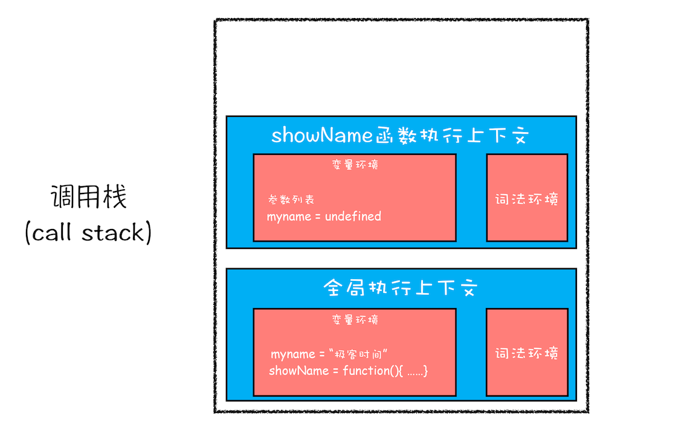
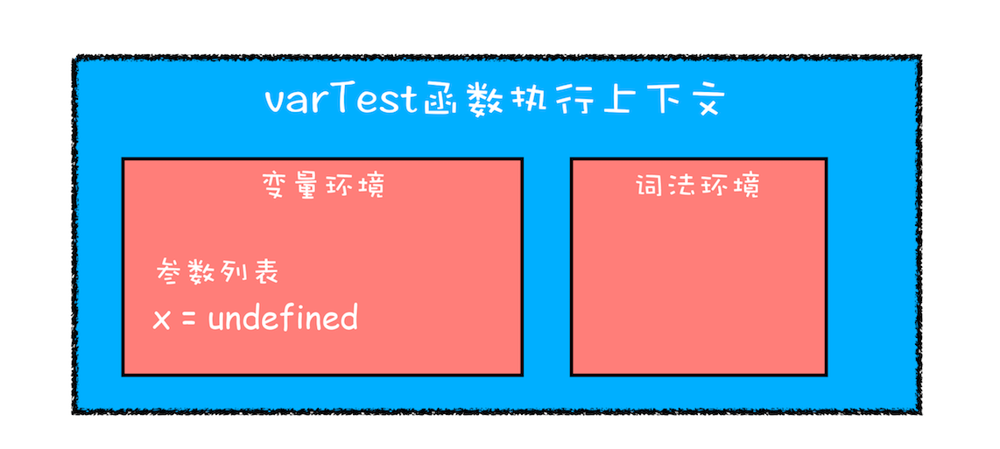
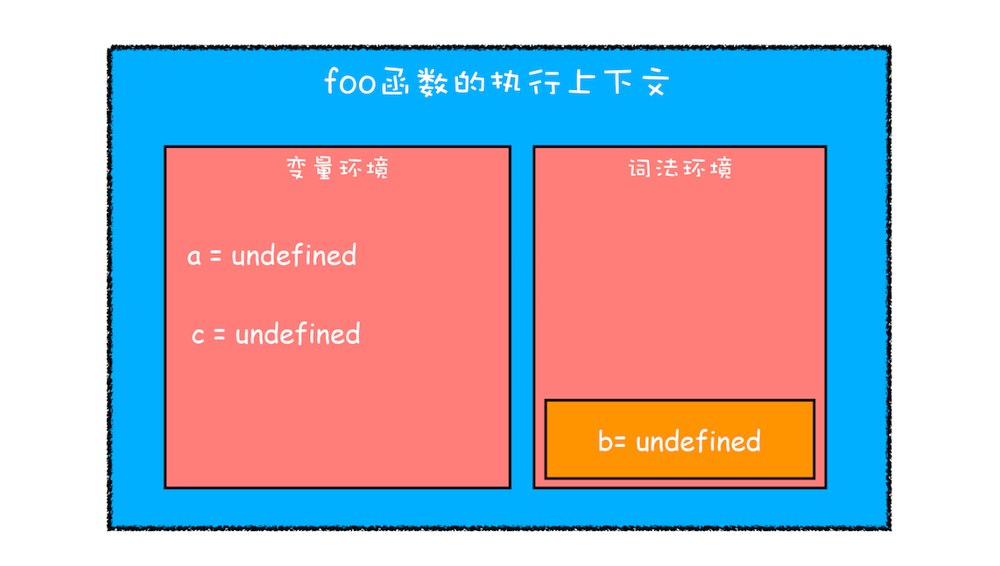
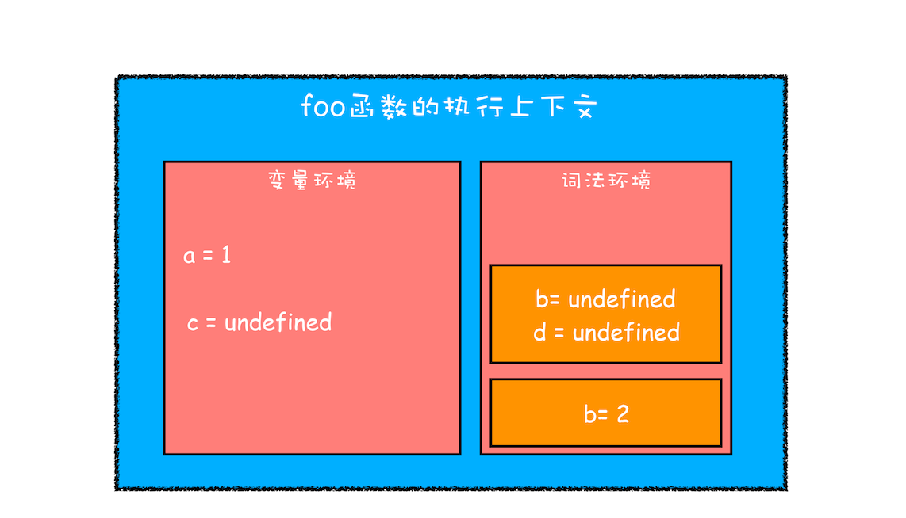
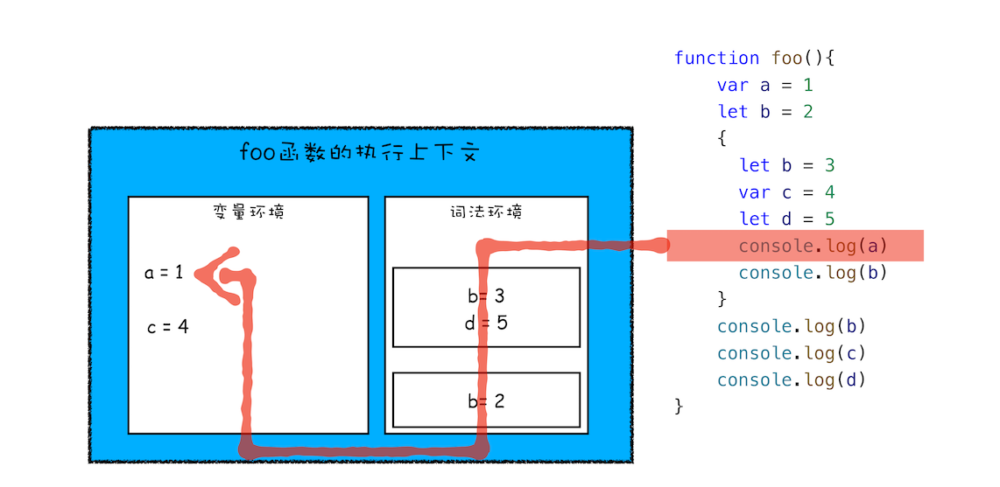
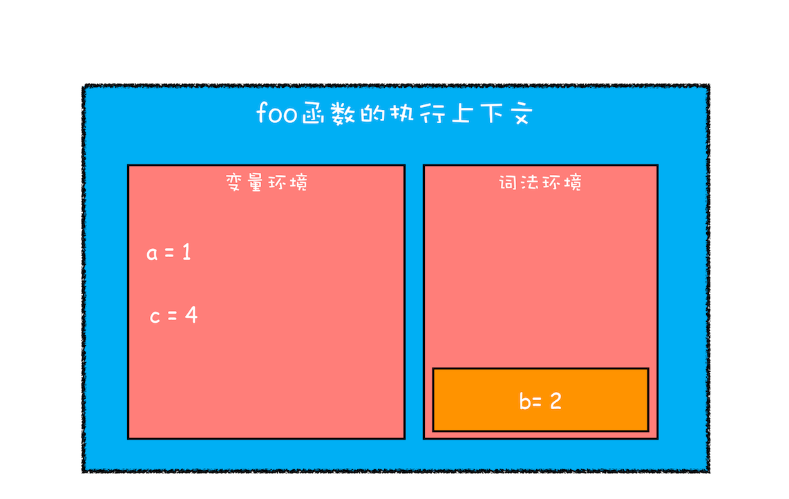

# 09 | 块级作用域：var 缺陷以及为什么要引入 let 和 const？


<audio preload="none" controls loop style="width: 100%;">
  <source src="../mp3/09-块级作用域：var缺陷以及为什么要引入let和const？.mp3" type="audio/mpeg">
  <!-- 如果浏览器不支持，则会呈现下面内容 -->
  <p>你的浏览器不支持HTML5音频，你可以<a href="../mp3/09-块级作用域：var缺陷以及为什么要引入let和const？.mp3">下载</a>这个音频文件</p>
</audio>

在前面[《07 | 变量提升：JavaScript 代码是按顺序执行的吗？》](07%20%7C%20%E5%8F%98%E9%87%8F%E6%8F%90%E5%8D%87%EF%BC%9AJavaScript%E4%BB%A3%E7%A0%81%E6%98%AF%E6%8C%89%E9%A1%BA%E5%BA%8F%E6%89%A7%E8%A1%8C%E7%9A%84%E5%90%97%EF%BC%9F.md)这篇文章中，我们已经讲解了 JavaScript 中变量提升的相关内容，**正是由于 JavaScript 存在变量提升这种特性，从而导致了很多与直觉不符的代码，这也是 JavaScript 的一个重要设计缺陷**。

虽然 ECMAScript6（以下简称 ES6）已经通过引入块级作用域并配合 let、const 关键字，来避开了这种设计缺陷，但是由于 JavaScript 需要保持向下兼容，所以变量提升在相当长一段时间内还会继续存在。这也加大了你理解概念的难度，因为既要理解新的机制，又要理解变量提升这套机制，关键这两套机制还是同时运行在“一套”系统中的。

但如果抛开 JavaScript 的底层去理解这些，那么你大概率会很难深入理解其概念。俗话说，“断病要断因，治病要治根”，所以为了便于你更好地理解和学习，今天我们这篇文章会先“**探病因**”——分析为什么在 JavaScript 中会存在变量提升，以及变量提升所带来的问题；然后再来“**开药方**”——介绍如何通过**块级作用域并配合 let 和 const 关键字**来修复这种缺陷。

## 作用域（scope）

为什么 JavaScript 中会存在变量提升这个特性，而其他语言似乎都没有这个特性呢？要讲清楚这个问题，我们就得先从作用域讲起。

**作用域是指在程序中定义变量的区域，该位置决定了变量的生命周期。通俗地理解，作用域就是变量与函数的可访问范围，即作用域控制着变量和函数的可见性和生命周期。**

在 ES6 之前，ES 的作用域只有两种：全局作用域和函数作用域。

- **全局作用域**中的对象在代码中的任何地方都能访问，其生命周期伴随着页面的生命周期。

* **函数作用域**就是在函数内部定义的变量或者函数，并且定义的变量或者函数只能在函数内部被访问。函数执行结束之后，函数内部定义的变量会被销毁。

在 ES6 之前，JavaScript 只支持这两种作用域，相较而言，其他语言则都普遍支持**块级作用域**。块级作用域就是使用一对大括号包裹的一段代码，比如函数、判断语句、循环语句，甚至单独的一个{}都可以被看作是一个块级作用域。

为了更好地理解块级作用域，你可以参考下面的一些示例代码：

```js
//if 块
if (1) {
}
//while 块
while (1) {}
//函数块
function foo() {}

//for 循环块
for (let i = 0; i < 100; i++) {}
//单独一个块
{
}
```

简单来讲，如果一种语言支持块级作用域，那么其代码块内部定义的变量在代码块外部是访问不到的，并且等该代码块中的代码执行完成之后，代码块中定义的变量会被销毁。你可以看下面这段 C 代码：

```c
char* myname = "极客时间";
void showName() {
  printf("%s \n",myname);
  if(0){
    char* myname = "极客邦";
  }
}
int main() {
  showName();
  return 0;
}
```

上面这段 C 代码执行后，最终打印出来的是上面全局变量 myname 的值，之所以这样，是因为 C 语言是支持块级作用域的，所以 if 块里面定义的变量是不能被 if 块外面的语句访问到的。

和 Java、C/C++ 不同，**ES6 之前是不支持块级作用域的**，因为当初设计这门语言的时候，并没有想到 JavaScript 会火起来，所以只是按照最简单的方式来设计。没有了块级作用域，再把作用域内部的变量统一提升无疑是最快速、最简单的设计，不过这也直接导致了函数中的变量无论是在哪里声明的，在编译阶段都会被提取到执行上下文的变量环境中，所以这些变量在整个函数体内部的任何地方都是能被访问的，这也就是 JavaScript 中的变量提升。

## 变量提升所带来的问题

由于变量提升作用，使用 JavaScript 来编写和其他语言相同逻辑的代码，都有可能会导致不一样的执行结果。那为什么会出现这种情况呢？主要有以下两种原因。

### 1. 变量容易在不被察觉的情况下被覆盖掉

比如我们重新使用 JavaScript 来实现上面那段 C 代码，实现后的 JavaScript 代码如下：

```js
var myname = "极客时间";
function showName() {
  console.log(myname);
  if (0) {
    var myname = "极客邦";
  }
  console.log(myname);
}
showName();
```

执行上面这段代码，打印出来的是 undefined，而并没有像前面 C 代码那样打印出来“极客时间”的字符串。为什么输出的内容是 undefined 呢？我们再来分析一下。

首先当刚执行到 showName 函数调用时，执行上下文和调用栈的状态是怎样的？具体分析过程你可以回顾[《08 | 调用栈：为什么 JavaScript 代码会出现栈溢出？》](08%20%7C%20%E8%B0%83%E7%94%A8%E6%A0%88%EF%BC%9A%E4%B8%BA%E4%BB%80%E4%B9%88JavaScript%E4%BB%A3%E7%A0%81%E4%BC%9A%E5%87%BA%E7%8E%B0%E6%A0%88%E6%BA%A2%E5%87%BA%EF%BC%9F.md)这篇文章的分析过程，这里我就直接展示出来了，最终的调用栈状态如下图所示：



<div style="text-align: center; font-size: 12px; color: #999; margin-bottom: 8px;">开始执行 showName 函数时的调用栈</div>

showName 函数的执行上下文创建后，JavaScript 引擎便开始执行 showName 函数内部的代码了。首先执行的是：

```js
console.log(myname);
```

执行这段代码需要使用变量 myname，结合上面的调用栈状态图，你可以看到这里有两个 myname 变量：一个在全局执行上下文中，其值是“极客时间”；另外一个在 showName 函数的执行上下文中，其值是 undefined。那么到底该使用哪个呢？

相信做过 JavaScript 开发的同学都能轻松回答出来答案：“当然是**先使用函数执行上下文里面的变量**啦！”的确是这样，这是因为在函数执行过程中，JavaScript 会优先从当前的执行上下文中查找变量，由于变量提升，当前的执行上下文中就包含了变量 myname，而值是 undefined，所以获取到的 myname 的值就是 undefined。

这输出的结果和其他大部分支持块级作用域的语言都不一样，比如上面 C 语言输出的就是全局变量，所以这会很容易造成误解，特别是在你会一些其他语言的基础之上，再来学习 JavaScript，你会觉得这种结果很不自然。

### 2. 本应销毁的变量没有被销毁

接下来我们再来看下面这段让人误解更大的代码：

```js
function foo() {
  for (var i = 0; i < 7; i++) {}
  console.log(i);
}
foo();
```

如果你使用 C 语言或者其他的大部分语言实现类似代码，在 for 循环结束之后，i 就已经被销毁了，但是在 JavaScript 代码中，i 的值并未被销毁，所以最后打印出来的是 7。

这同样也是由变量提升而导致的，在创建执行上下文阶段，变量 i 就已经被提升了，所以当 for 循环结束之后，变量 i 并没有被销毁。

这依旧和其他支持块级作用域的语言表现是不一致的，所以必然会给一些人造成误解。

## ES6 是如何解决变量提升带来的缺陷

上面我们介绍了变量提升而带来的一系列问题，为了解决这些问题，**ES6 引入了 let 和 const 关键字**，从而使 JavaScript 也能像其他语言一样拥有了块级作用域。

关于 let 和 const 的用法，你可以参考下面代码：

```js
let x = 5;
const y = 6;
x = 7;
y = 9; //报错，const 声明的变量不可以修改
```

从这段代码你可以看出来，两者之间的区别是，使用 let 关键字声明的变量是可以被改变的，而使用 const 声明的变量其值是不可以被改变的。但不管怎样，两者都可以生成块级作用域，为了简单起见，在下面的代码中，我统一使用 let 关键字来演示。

那么接下来，我们就通过实际的例子来分析下，ES6 是如何通过块级作用域来解决上面的问题的。

你可以先参考下面这段存在变量提升的代码：

```js
function varTest() {
  var x = 1;
  if (true) {
    var x = 2; // 同样的变量!
    console.log(x); // 2
  }
  console.log(x); // 2
}
```

在这段代码中，有两个地方都定义了变量 x，第一个地方在函数块的顶部，第二个地方在 if 块的内部，由于 var 的作用范围是整个函数，所以在编译阶段，会生成如下的执行上下文：



<div style="text-align: center; font-size: 12px; color: #999; margin-bottom: 8px;">varTest 函数的执行上下文</div>

从执行上下文的变量环境中可以看出，最终只生成了一个变量 x，函数体内所有对 x 的赋值操作都会直接改变变量环境中的 x 值。

所以上述代码最后通过 console.log(x) 输出的是 2，而对于相同逻辑的代码，其他语言最后一步输出的值应该是 1，因为在 if 块里面的声明不应该影响到块外面的变量。

既然支持块级作用域和不支持块级作用域的代码执行逻辑是不一样的，那么接下来我们就来改造上面的代码，让其支持块级作用域。

这个改造过程其实很简单，只需要把 var 关键字替换为 let 关键字，改造后的代码如下：

```js
function letTest() {
  let x = 1;
  if (true) {
    let x = 2; // 不同的变量
    console.log(x); // 2
  }
  console.log(x); // 1
}
```

执行这段代码，其输出结果就和我们的预期是一致的。这是因为 let 关键字是支持块级作用域的，所以在编译阶段，JavaScript 引擎并不会把 if 块中通过 let 声明的变量存放到变量环境中，这也就意味着在 if 块通过 let 声明的关键字，并不会提升到全函数可见。所以在 if 块之内打印出来的值是 2，跳出语块之后，打印出来的值就是 1 了。这种就非常**符合我们的编程习惯了：作用域块内声明的变量不影响块外面的变量**。

## JavaScript 是如何支持块级作用域的

现在你知道了 ES 可以通过使用 let 或者 const 关键字来实现块级作用域，不过你是否有过这样的疑问：“在同一段代码中，ES6 是如何做到既要支持变量提升的特性，又要支持块级作用域的呢？”

那么接下来，我们就要**站在执行上下文的角度**来揭开答案。

你已经知道 JavaScript 引擎是通过变量环境实现函数级作用域的，那么 ES6 又是如何在函数级作用域的基础之上，实现对块级作用域的支持呢？你可以先看下面这段代码：

```js
function foo() {
  var a = 1;
  let b = 2;
  {
    let b = 3;
    var c = 4;
    let d = 5;
    console.log(a);
    console.log(b);
  }
  console.log(b);
  console.log(c);
  console.log(d);
}
foo();
```

当执行上面这段代码的时候，JavaScript 引擎会先对其进行编译并创建执行上下文，然后再按照顺序执行代码，关于如何创建执行上下文我们在前面的文章中已经分析过了，但是现在的情况有点不一样，我们引入了 let 关键字，let 关键字会创建块级作用域，那么 let 关键字是如何影响执行上下文的呢？

接下来我们就来一步步分析上面这段代码的执行流程。

**第一步是编译并创建执行上下文**，下面是我画出来的执行上下文示意图，你可以参考下：



<div style="text-align: center; font-size: 12px; color: #999; margin-bottom: 8px;">刚执行时 foo 函数的执行上下文</div>

通过上图，我们可以得出以下结论：

- 函数内部通过 var 声明的变量，在编译阶段全都被存放到**变量环境**里面了。

* 通过 let 声明的变量，在编译阶段会被存放到**词法环境（Lexical Environment）**中。

- 在函数的作用域块内部，通过 let 声明的变量并没有被存放到词法环境中。

接下来，**第二步继续执行代码**，当执行到代码块里面时，变量环境中 a 的值已经被设置成了 1，词法环境中 b 的值已经被设置成了 2，这时候函数的执行上下文就如下图所示：



<div style="text-align: center; font-size: 12px; color: #999; margin-bottom: 8px;">执行 foo 函数内部作用域块时的执行上下文</div>

从图中可以看出，当进入函数的作用域块时，作用域块中通过 let 声明的变量，会被存放在词法环境的一个单独的区域中，这个区域中的变量并不影响作用域块外面的变量，比如在作用域外面声明了变量 b，在该作用域块内部也声明了变量 b，当执行到作用域内部时，它们都是独立的存在。

其实，在词法环境内部，维护了一个小型栈结构，栈底是函数最外层的变量，进入一个作用域块后，就会把该作用域块内部的变量压到栈顶；当作用域执行完成之后，该作用域的信息就会从栈顶弹出，这就是词法环境的结构。需要注意下，我这里所讲的变量是指通过 let 或者 const 声明的变量。

再接下来，当执行到作用域块中的 console.log(a)这行代码时，就需要在词法环境和变量环境中查找变量 a 的值了，具体查找方式是：沿着词法环境的栈顶向下查询，如果在词法环境中的某个块中查找到了，就直接返回给 JavaScript 引擎，如果没有查找到，那么继续在变量环境中查找。

这样一个变量查找过程就完成了，你可以参考下图：



<div style="text-align: center; font-size: 12px; color: #999; margin-bottom: 8px;">变量查找过程</div>

从上图你可以清晰地看出变量查找流程，不过要完整理解查找变量或者查找函数的流程，就涉及到作用域链了，这个我们会在下篇文章中做详细介绍。

当作用域块执行结束之后，其内部定义的变量就会从词法环境的栈顶弹出，最终执行上下文如下图所示：



<div style="text-align: center; font-size: 12px; color: #999; margin-bottom: 8px;">作用域执行完成示意图</div>

通过上面的分析，想必你已经理解了词法环境的结构和工作机制，块级作用域就是通过词法环境的栈结构来实现的，而变量提升是通过变量环境来实现，通过这两者的结合，JavaScript 引擎也就同时支持了变量提升和块级作用域了。

## 总结

好了，今天的内容就讲到这里，下面我来简单总结下今天的内容。

由于 JavaScript 的变量提升存在着变量覆盖、变量污染等设计缺陷，所以 ES6 引入了块级作用域关键字来解决这些问题。
之后我们还通过对变量环境和词法环境的介绍，分析了 JavaScript 引擎是如何同时支持变量提升和块级作用域的。

既然聊到了作用域，那最后我们再简单聊下编程语言吧。经常有人争论什么编程语言是世界上最好的语言，但如果站在语言本身来说，我觉得这种争论没有意义，因为语言是工具，而工具是用来创造价值的，至于能否创造价值或创造多大价值不完全由语言本身的特性决定。这么说吧，即便一门设计不那么好的语言，它也可能拥有非常好的生态，比如有完善的框架、非常多的落地应用，又或者能够给开发者带来更多的回报，这些都是评判因素。

如果站在语言层面来谈，每种语言其实都是在相互借鉴对方的优势，协同进化，比如 JavaScript 引进了块级作用域、迭代器和协程，其底层虚拟机的实现和 Java、Python 又是非常相似，也就是说如果你理解了 JavaScript 协程和 JavaScript 中的虚拟机，其实你也就理解了 Java、Python 中的协程和虚拟机的实现机制。

所以说，语言本身好坏不重要，重要的是能为开发者创造价值。

## 思考时间

下面给你留个思考题，看下面这样一段代码：

```js
let myname = "极客时间";
{
  console.log(myname);
  let myname = "极客邦";
}
```

你能通过分析词法环境，得出来最终的打印结果吗？

<!-- 【最终打印结果】：VM6277:3 Uncaught ReferenceError: Cannot access 'myname' before initialization
【分析原因】：在块作用域内，let声明的变量被提升，但变量只是创建被提升，初始化并没有被提升，在初始化之前使用变量，就会形成一个暂时性死区。
【拓展】
var的创建和初始化被提升，赋值不会被提升。
let的创建被提升，初始化和赋值不会被提升。
function的创建、初始化和赋值均会被提升。
作者回复: 很好，这个答案大家可以参考下


朙
2019-08-24
这篇真的是神作啊。 有一个疑问，在abcd那个例子里，第一步<编译并创建执行上下文>的图里并没有块级作用域的b=undefined; d=undefined。而在第二步里<继续执行代码>的图中才出现b=undefined; d=undefined。想问下这个块级作用域的b=undefined; d=undefined是不是应该在第一步的编译阶段里就有。还是说在执行阶段像函数那样，块级作用域会有一个自己的编译阶段
作者回复: 执行函数时才有进行编译，抽象语法树(AST）在进入函数阶段就生成了，并且函数内部作用域是已经明确了，所以进入块级作用域不会有编译过程，只不过通过let或者const声明的变量会在进入块级作用域的时被创建，但是在该变量没有赋值之前，引用该变量JavaScript引擎会抛出错误---这就是“暂时性死区”


YBB
2019-08-26
有个问题，在一个块级作用域中，let和const声明的变量是在编译阶段被压入栈中还是执行阶段被压入栈中？在文中的表述来看，第一个let声明的变量是在编译阶段就压入栈中的，但是后面的变量又感觉是在执行是压入栈中，有点混乱。
作者回复: 对的，你的理解没错
函数只会在第一次执行的时候被编译，所以编译时变量环境和词法环境最顶层数据已经确定了。
当执行到块级作用域的时候，块级作用域中通过let和const申明的变量会被追加到词法环境中，当这个块执行结束之后，追加到词法作用域的内容又会销毁掉。


Tim
2020-01-12
看得很生气，全篇文章不提变量的「创建」「初始化」「赋值」这三种区别，把创建和初始化揉在一起了，也是看了精选留言里第一条评论之后Google才查找到，否则刚开始我真的不理解为啥都已经在词法环境找到了变量却报错了！按照这种理论的话，是否说明词法环境只有变量，并没有等于undefined？
真的不需要更新一下吗？？？？？
作者回复: 变量初始化和创建再上上一节《变量提升：JavaScript代码是按顺序执行的吗？》中已经讲过了，
我们将到了一个变量编译阶段和执行阶段分别要做那些事情。
这一节主要是将var和let的区别以及底层实现机制的，我看你的疑问是下面这个问题：
function test(){
console.log(a)
let a = 7;
}
test()
执行test的时候，编译阶段a已经在内存中，为什么提前访问不了？
这主要是因为V8虚拟机做了限制，虽然a在内存中，但是当你在let a 之前访问a时，根据ECMAScript定义，虚拟机会阻止的访问！
如果你还有其它具体的问题，欢迎继续提出！

共 11 条评论

51

晓小东
2019-08-25
在ES3开始，try /catch 分句结构中也具有块作用域。补充……
作者回复: 赞


李懂
2019-08-24
执行上下文是在编译时创建的，在执行代码的时候已经有词法环境了，而且变量已经默认初始化了undefiend，为什么还会存在暂时性死区，老师解答一下！
作者回复: 暂时性死去是语法规定的，也就是说虽然通过let声明的变量已经在词法环境中了，但是在没有赋值之前，访问该变量JavaScript引擎就会抛出一个错误。


…Lucky
2019-09-04
老师，按照最后的思考题。let，const会在编译阶段创建，但不赋值。但是上面几个图中都是直接赋值的undefined。这是否矛盾
？

William
2019-08-24
第二步，继续执行代码。 这张图我觉得有错误，当进入foo函数内部的代码块之后，并没有了编译阶段，此时，新创建的栈顶块级作用域的内容为空，而并没有 b = undefined 和 d = undefined 两项内容。 执行完 let b = 3 之后，分配内存，块级作用域出现 b = 3 一项。 执行 let d = 5 之后，为d分配内存，栈顶块级作用域增加一项 d = 5。
作者回复: 使用let/const声明的变量，伴随着词法环境被创建，但只有在变量的词法绑定(LexicalBinding)已经被求值运算后，才能够被访问。
你也可以在let b声明之前断点下，看看scope中的值有没有，你会看scope中的值已经存在了。

共 8 条评论

9

爱吃锅巴的沐泡
2019-09-01
对文中foo()函数的分析和一些问题：
我调试了一下，①断点打在 let b = 2，此时的scope中只有local：a = 1，b = undefined，c = undefined；并没有block，这应该说明js是解释性语言，一句一执行的。
②当断点走到 let b = 3时，这时进入了作用域，scope中有了block：b = undefined，d = undefined，这应该说明在进入作用域之前AST已经生成，并确定了作用域的范围。
问题：1、老师提到在进入作用域时let声明的变量被创建，结合断点可以证明，那么是不是说 let声明的变量在该作用域内提升了，但没有提升赋值语句？因为在②处已经有了d = undefined。
问题：2、把foo()中的作用域变形如下：
{
let b = 3
console.log(d)
var c = 4
let d = 5
console.log(a)
console.log(b)
}
当断点走到 let b = 3处，scope的block中只有b = undefined，并没有d = undefined，是因为“暂时性死区”是js在语法上的设置，防止访问声明前的变量，而在进入作用域之前就会有语法树的生成，所以在编译到console.log(d)时，遇到错误，所以没有在词法环境中创建变量d。这样分析是否正确？

小锅锅
2019-08-25
老师，听你对比了c语言，既然let const存在暂时性死区，那么c语言的变量也存在同样的暂时性死区报错吗？
作者回复: c语言都没这概念，因为你在定义之前使用一个变量，首先过不了c语言的编译


朙
2019-08-24
if(0){ var myname = " 极客邦 "} 这段代码里的if条件是false很有意思。是说编译阶段不管if会不会执行。里面的代码都会编译，因此这里的myname变量提升，从而导致上面的console.log(myname)输出undefined吗？
另外let 声明的变量会提升吗？
作者回复: 对的，第一个分析的没问题
第二个let不会产生变量提升


宗麒麟
2020-04-20
精选留言也好多精品啊，老师看到应该也很欣慰吧
共 1 条评论

5

阿郑
2020-03-28
ES6明确规定，如果区块中存在let和const命令，这个区块对这些命令声明的变量，从一开始就形成了封闭作用域。凡是在声明之前就使用这些变量，就会报错。
总之，在代码块内，使用let命令声明变量之前，该变量都是不可用的。这在语法上，称为“暂时性死区”（temporal dead zone，简称TDZ）
因此，思考题中的那段代码，执行会报错：
Uncaught SyntaxError: Identifier 'myname' has already been declared
at <anonymous>:1:1
展开

sugar
2020-01-31
想问一下，js代码中这种写法：｛ var a =
100； ｝，和不加外边这层大括号，有什么区别吗？我看到vue的源码中有很多这样的用法，却没明白目的是啥

love star
2020-03-23
第三次看老师的文章，之前好多点都忽略了，五体投地，惊为天人。
复盘的重要性。
希望 V8 也能给我知识栈一样的扩充

hzj.
2019-08-25
这就是 let 的暂时死区~


3

风语菡
2020-06-02
function foo (){
let myname= '极客时间'
{
console.log(myname)
let myname= '极客邦'
}
}
foo();
执行上面代码输出的结果是：VM5498:5 Uncaught ReferenceError: Cannot access 'myname' before initialization
at foo (<anonymous>:5:15)
at <anonymous>:9:1
foo @ VM5498:5
(anonymous) @ VM5498:9
若执行下面代码；
let myname= '极客时间'
{
console.log(myname)
let myname= '极客邦'
}
则输出的结果是：Uncaught SyntaxError: Identifier 'myname' has already been declared
想请教下，为嘛这两段代码报的错不一致，在函数作用域内，报的是referenceError,而在全局作用域报的是syntaxError。用词法环境分析，有点不太明白

爱吃锅巴的沐泡
2020-01-14
老师您好，对于Y s留言用户的问题，我想接着问： ES5标准文档中规定，
执行环境包括：词法环境、变量环境、this绑定。
其中执行环境的词法环境和变量环境组件始终为词法环境对象。当创建一个执行环境时，其词法环境组件和变量环境组件最初是同一个值。在该执行环境相关联的代码的执行过程中，变量环境组件永远不变，而词法环境组件有可能改变。
问题1：变量环境组件永远不变，而词法环境组件有可能改变。
这里您给出的解释是说词法环境里会有块级作用域的进入和退出，但这是ES5的规范呀，还没有作用域的概念呀，这里不解？
变量环境组件为什么永久不变？
问题2：创建执行环境时，变量环境和词法环境最初是同一个值，想知道这个值具体是指什么值？
问题3：我理解的ES5中 变量环境中存储的是提升的变量和函数声明(都是类似var xx=undefined; function funname(){})，所以变量环境是不变的，在执行过程中变量的变化是在词法环境中体现的，词法环境管理着静态作用域的。 到了ES6，有了let和const，是不是就把原来词法环境中变化的变量转移到了变量环境中，把let和const的变化放到了现在的词法环境中。
希望老师能举个例子或者画个图，详细分析一下在ES5中变量环境和词法环境中变量的变化？
ES5和ES6的执行环境的区别是啥？
问题有点多，但是网上写的和规范内容都不一样，感觉不靠谱，请老师解答！

-_-|||
2019-12-29
文中”通过 let 声明的变量，在编译阶段会被存放到词法环境（Lexical Environment）中。
在函数的作用域内部，通过 let 声明的变量并没有被存放到词法环境中。”，第二段”通过 let 声明的变量并没有被存放到词法环境中”，可是上图中画的声明的变量b已经放到词法环境中了，只不过没有赋值，所以是不是写错了，应该是没有赋值，而不是没有放到词法环境中。

Geek_East
2019-12-06
我想，理解execution context和scope的区别是理解这个问题的一个关键；很多时候执行上下文和作用域都混着说
作者回复: 这是两样不同的东西，一个表示一个表示函数运行时的上下文，一个表示词法作用域！
我会在下篇介绍V8的专栏中详细分析这块内容！ -->
