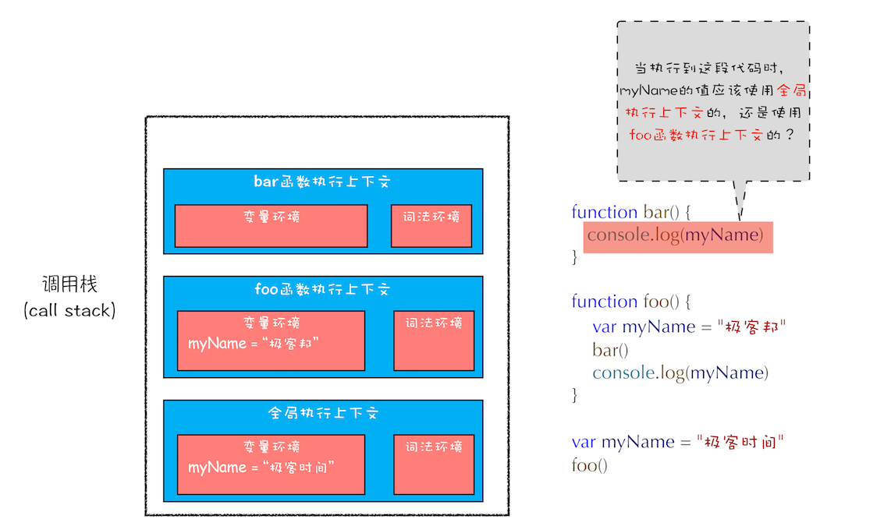
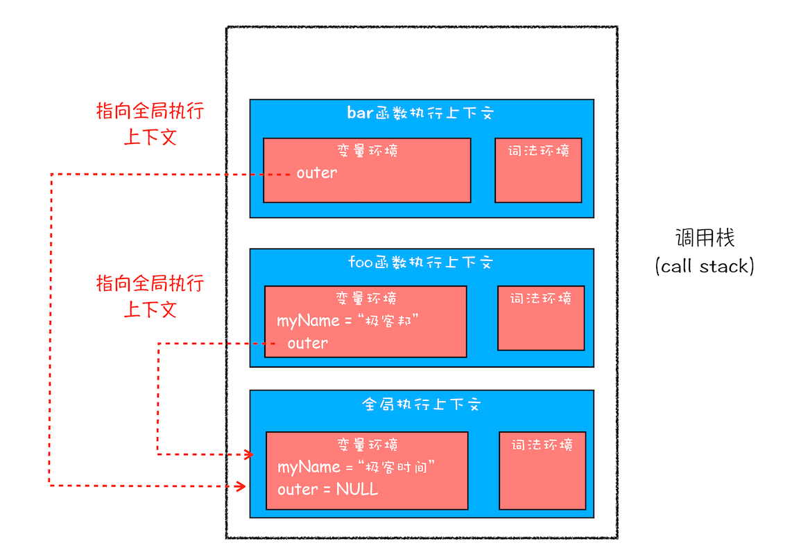
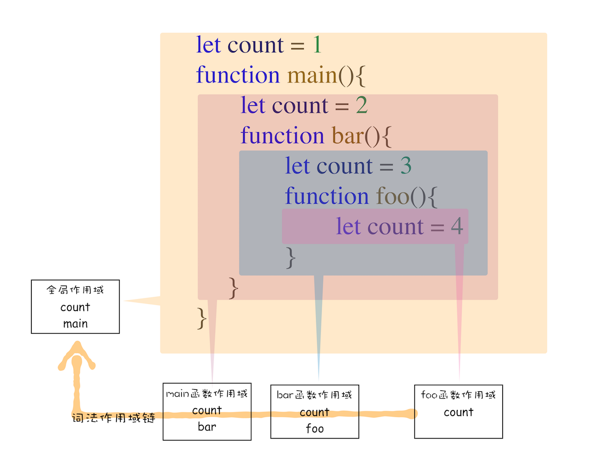
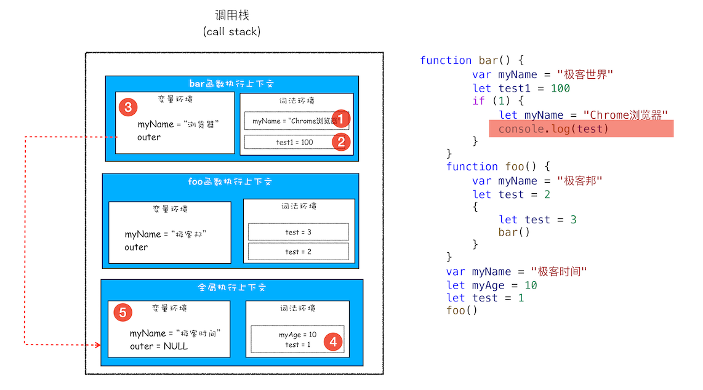
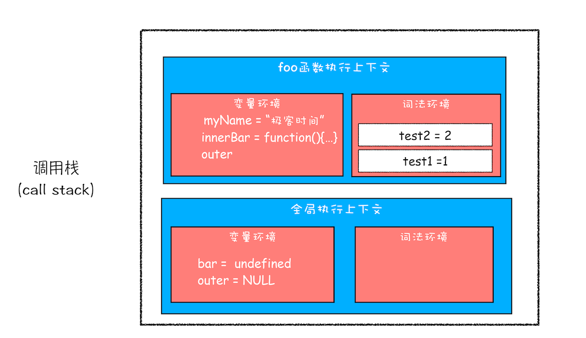
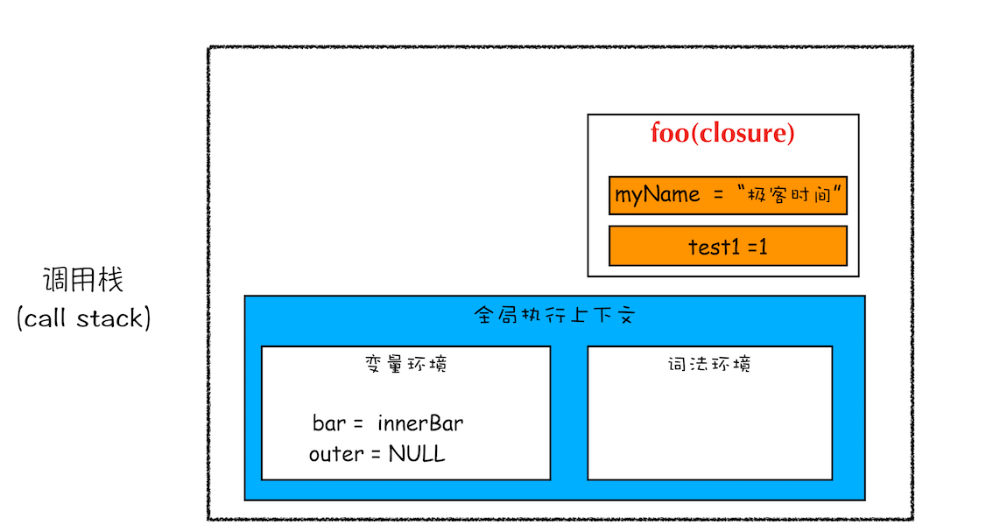
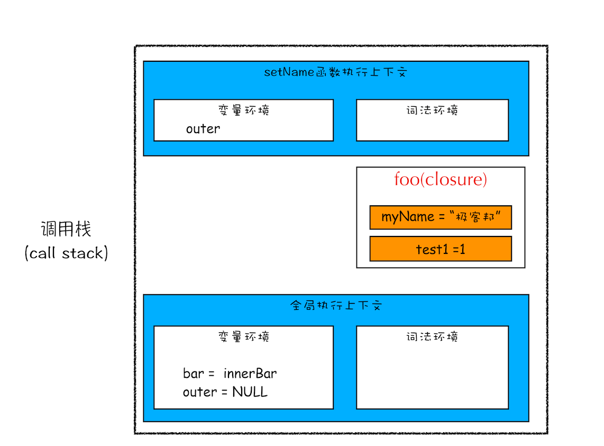
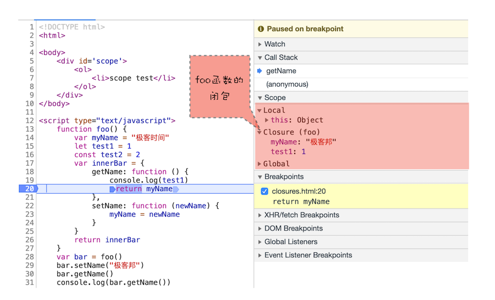

# 10 | 作用域链和闭包 ：代码中出现相同的变量，JavaScript 引擎是如何选择的？


在[上一篇文章](09%20%7C%20%E5%9D%97%E7%BA%A7%E4%BD%9C%E7%94%A8%E5%9F%9F%EF%BC%9Avar%E7%BC%BA%E9%99%B7%E4%BB%A5%E5%8F%8A%E4%B8%BA%E4%BB%80%E4%B9%88%E8%A6%81%E5%BC%95%E5%85%A5let%E5%92%8Cconst%EF%BC%9F.md)中我们讲到了什么是作用域，以及 ES6 是如何通过变量环境和词法环境来同时支持变量提升和块级作用域，在最后我们也提到了如何通过词法环境和变量环境来查找变量，这其中就涉及到**作用域链**的概念。

理解作用域链是理解闭包的基础，而闭包在 JavaScript 中几乎无处不在，同时作用域和作用域链还是所有编程语言的基础。所以，如果你想学透一门语言，作用域和作用域链一定是绕不开的。

那今天我们就来聊聊**什么是作用域链**，并通过作用域链再来讲讲**什么是闭包**。

首先我们来看下面这段代码：

```js
function bar() {
  console.log(myName);
}
function foo() {
  var myName = "极客邦";
  bar();
}
var myName = "极客时间";
foo();
```

你觉得这段代码中的 bar 函数和 foo 函数打印出来的内容是什么？这就要分析下这两段代码的执行流程。

通过前面几篇文章的学习，想必你已经知道了如何通过执行上下文来分析代码的执行流程了。那么当这段代码执行到 bar 函数内部时，其调用栈的状态图如下所示：



<div style="text-align: center; font-size: 12px; color: #999; margin-bottom: 8px;">执行 bar 函数时的调用栈</div>

从图中可以看出，全局执行上下文和 foo 函数的执行上下文中都包含变量 myName，那 bar 函数里面 myName 的值到底该选择哪个呢？

也许你的第一反应是按照调用栈的顺序来查找变量，查找方式如下：

1. 先查找栈顶是否存在 myName 变量，但是这里没有，所以接着往下查找 foo 函数中的变量。
2. 在 foo 函数中查找到了 myName 变量，这时候就使用 foo 函数中的 myName。

如果按照这种方式来查找变量，那么最终执行 bar 函数打印出来的结果就应该是“极客邦”。但实际情况并非如此，如果你试着执行上述代码，你会发现打印出来的结果是“极客时间”。为什么会是这种情况呢？要解释清楚这个问题，那么你就需要先搞清楚作用域链了。

## 作用域链

关于作用域链，很多人会感觉费解，但如果你理解了调用栈、执行上下文、词法环境、变量环境等概念，那么你理解起来作用域链也会很容易。所以很是建议你结合前几篇文章将上面那几个概念学习透彻。

其实在每个执行上下文的变量环境中，都包含了一个外部引用，用来指向外部的执行上下文，我们把这个外部引用称为 **outer**。

当一段代码使用了一个变量时，JavaScript 引擎首先会在“当前的执行上下文”中查找该变量。

比如上面那段代码在查找 myName 变量时，如果在当前的变量环境中没有查找到，那么 JavaScript 引擎会继续在 outer 所指向的执行上下文中查找。为了直观理解，你可以看下面这张图：



<div style="text-align: center; font-size: 12px; color: #999; margin-bottom: 8px;">带有外部引用的调用栈示意图</div>

从图中可以看出，bar 函数和 foo 函数的 outer 都是指向全局上下文的，这也就意味着如果在 bar 函数或者 foo 函数中使用了外部变量，那么 JavaScript 引擎会去全局执行上下文中查找。我们把这个查找的链条就称为**作用域链**。

现在你知道变量是通过作用域链来查找的了，不过还有一个疑问没有解开，foo 函数调用的 bar 函数，那为什么 bar 函数的外部引用是全局执行上下文，而不是 foo 函数的执行上下文？

要回答这个问题，你还需要知道什么是**词法作用域**。这是因为在 JavaScript 执行过程中，其作用域链是由词法作用域决定的。

## 词法作用域

**词法作用域就是指作用域是由代码中函数声明的位置来决定的，所以词法作用域是静态的作用域，通过它就能够预测代码在执行过程中如何查找标识符。**

这么讲可能不太好理解，你可以看下面这张图：



<div style="text-align: center; font-size: 12px; color: #999; margin-bottom: 8px;">词法作用域</div>

从图中可以看出，词法作用域就是根据代码的位置来决定的，其中 main 函数包含了 bar 函数，bar 函数中包含了 foo 函数，因为 JavaScript 作用域链是由词法作用域决定的，所以整个词法作用域链的顺序是：foo 函数作用域—>bar 函数作用域—>main 函数作用域—> 全局作用域。

了解了词法作用域以及 JavaScript 中的作用域链，我们再回过头来看看上面的那个问题：在开头那段代码中，foo 函数调用了 bar 函数，那为什么 bar 函数的外部引用是全局执行上下文，而不是 foo 函数的执行上下文?

这是因为根据词法作用域，foo 和 bar 的上级作用域都是全局作用域，所以如果 foo 或者 bar 函数使用了一个它们没有定义的变量，那么它们会到全局作用域去查找。也就是说，**词法作用域是代码编译阶段就决定好的，和函数是怎么调用的没有关系**。

## 块级作用域中的变量查找

前面我们通过全局作用域和函数级作用域来分析了作用域链，那接下来我们再来看看块级作用域中变量是如何查找的？在编写代码的时候，如果你使用了一个在当前作用域中不存在的变量，这时 JavaScript 引擎就需要按照作用域链在其他作用域中查找该变量，如果你不了解该过程，那就会有很大概率写出不稳定的代码。

我们还是先看下面这段代码：

```js
function bar() {
  var myName = "极客世界";
  let test1 = 100;
  if (1) {
    let myName = "Chrome浏览器";
    console.log(test);
  }
}
function foo() {
  var myName = "极客邦";
  let test = 2;
  {
    let test = 3;
    bar();
  }
}
var myName = "极客时间";
let myAge = 10;
let test = 1;
foo();
```

你可以自己先分析下这段代码的执行流程，看看能否分析出来执行结果。

要想得出其执行结果，那接下来我们就得站在作用域链和词法环境的角度来分析下其执行过程。

在[上篇文章](09%20%7C%20%E5%9D%97%E7%BA%A7%E4%BD%9C%E7%94%A8%E5%9F%9F%EF%BC%9Avar%E7%BC%BA%E9%99%B7%E4%BB%A5%E5%8F%8A%E4%B8%BA%E4%BB%80%E4%B9%88%E8%A6%81%E5%BC%95%E5%85%A5let%E5%92%8Cconst%EF%BC%9F.md)中我们已经介绍过了，ES6 是支持块级作用域的，当执行到代码块时，如果代码块中有 let 或者 const 声明的变量，那么变量就会存放到该函数的词法环境中。对于上面这段代码，当执行到 bar 函数内部的 if 语句块时，其调用栈的情况如下图所示：



<div style="text-align: center; font-size: 12px; color: #999; margin-bottom: 8px;">块级作用域中是如何查找变量的</div>

现在是执行到 bar 函数的 if 语块之内，需要打印出来变量 test，那么就需要查找到 test 变量的值，其查找过程我已经在上图中使用序号 1、2、3、4、5 标记出来了。

下面我就来解释下这个过程。首先是在 bar 函数的执行上下文中查找，但因为 bar 函数的执行上下文中没有定义 test 变量，所以根据词法作用域的规则，下一步就在 bar 函数的外部作用域中查找，也就是全局作用域。

至于单个执行上下文中如何查找变量，我在[上一篇文章](09%20%7C%20%E5%9D%97%E7%BA%A7%E4%BD%9C%E7%94%A8%E5%9F%9F%EF%BC%9Avar%E7%BC%BA%E9%99%B7%E4%BB%A5%E5%8F%8A%E4%B8%BA%E4%BB%80%E4%B9%88%E8%A6%81%E5%BC%95%E5%85%A5let%E5%92%8Cconst%EF%BC%9F.md)中已经做了介绍，这里就不重复了。

## 闭包

了解了作用域链，接着我们就可以来聊聊闭包了。关于闭包，理解起来可能会是一道坎，特别是在你不太熟悉 JavaScript 这门语言的时候，接触闭包很可能会让你产生一些挫败感，因为你很难通过理解背后的原理来彻底理解闭包，从而导致学习过程中似乎总是似懂非懂。最要命的是，JavaScript 代码中还总是充斥着大量的闭包代码。

但理解了变量环境、词法环境和作用域链等概念，那接下来你再理解什么是 JavaScript 中的闭包就容易多了。这里你可以结合下面这段代码来理解什么是闭包：

```js
function foo() {
  var myName = "极客时间";
  let test1 = 1;
  const test2 = 2;
  var innerBar = {
    getName: function () {
      console.log(test1);
      return myName;
    },
    setName: function (newName) {
      myName = newName;
    },
  };
  return innerBar;
}
var bar = foo();
bar.setName("极客邦");
bar.getName();
console.log(bar.getName());
```

首先我们看看当执行到 foo 函数内部的 return innerBar 这行代码时调用栈的情况，你可以参考下图：



<div style="text-align: center; font-size: 12px; color: #999; margin-bottom: 8px;">执行到 return bar 时候的调用栈</div>

从上面的代码可以看出，innerBar 是一个对象，包含了 getName 和 setName 的两个方法（通常我们把对象内部的函数称为方法）。你可以看到，这两个方法都是在 foo 函数内部定义的，并且这两个方法内部都使用了 myName 和 test1 两个变量。

**根据词法作用域的规则，内部函数 getName 和 setName 总是可以访问它们的外部函数 foo 中的变量**，所以当 innerBar 对象返回给全局变量 bar 时，虽然 foo 函数已经执行结束，但是 getName 和 setName 函数依然可以使用 foo 函数中的变量 myName 和 test1。所以当 foo 函数执行完成之后，其整个调用栈的状态如下图所示：



<div style="text-align: center; font-size: 12px; color: #999; margin-bottom: 8px;">闭包的产生过程</div>

从上图可以看出，foo 函数执行完成之后，其执行上下文从栈顶弹出了，但是由于返回的 setName 和 getName 方法中使用了 foo 函数内部的变量 myName 和 test1，所以这两个变量依然保存在内存中。这像极了 setName 和 getName 方法背的一个专属背包，无论在哪里调用了 setName 和 getName 方法，它们都会背着这个 foo 函数的专属背包。

之所以是**专属**背包，是因为除了 setName 和 getName 函数之外，其他任何地方都是无法访问该背包的，我们就可以把这个背包称为 foo 函数的**闭包**。

好了，现在我们终于可以给闭包一个正式的定义了。**在 JavaScript 中，根据词法作用域的规则，内部函数总是可以访问其外部函数中声明的变量，当通过调用一个外部函数返回一个内部函数后，即使该外部函数已经执行结束了，但是内部函数引用外部函数的变量依然保存在内存中，我们就把这些变量的集合称为闭包。比如外部函数是 foo，那么这些变量的集合就称为 foo 函数的闭包**。

那这些闭包是如何使用的呢？当执行到 bar.setName 方法中的 myName = "极客邦"这句代码时，JavaScript 引擎会沿着“当前执行上下文–>foo 函数闭包–> 全局执行上下文”的顺序来查找 myName 变量，你可以参考下面的调用栈状态图：



<div style="text-align: center; font-size: 12px; color: #999; margin-bottom: 8px;">执行 bar 时调用栈状态</div>

从图中可以看出，setName 的执行上下文中没有 myName 变量，foo 函数的闭包中包含了变量 myName，所以调用 setName 时，会修改 foo 闭包中的 myName 变量的值。

同样的流程，当调用 bar.getName 的时候，所访问的变量 myName 也是位于 foo 函数闭包中的。
你也可以通过“开发者工具”来看看闭包的情况，打开 Chrome 的“开发者工具”，在 bar 函数任意地方打上断点，然后刷新页面，可以看到如下内容：



<div style="text-align: center; font-size: 12px; color: #999; margin-bottom: 8px;">开发者工具中的闭包展示</div>

从图中可以看出来，当调用 bar.getName 的时候，右边 Scope 项就体现出了作用域链的情况：Local 就是当前的 getName 函数的作用域，Closure(foo) 是指 foo 函数的闭包，最下面的 Global 就是指全局作用域，从“Local–>Closure(foo)–>Global”就是一个完整的作用域链。

所以说，你以后也可以通过 Scope 来查看实际代码作用域链的情况，这样调试代码也会比较方便。

## 闭包是怎么回收的

理解什么是闭包之后，接下来我们再来简单聊聊闭包是什么时候销毁的。因为如果闭包使用不正确，会很容易造成内存泄漏的，关注闭包是如何回收的能让你正确地使用闭包。

通常，如果引用闭包的函数是一个全局变量，那么闭包会一直存在直到页面关闭；但如果这个闭包以后不再使用的话，就会造成内存泄漏。

如果引用闭包的函数是个局部变量，等函数销毁后，在下次 JavaScript 引擎执行垃圾回收时，判断闭包这块内容如果已经不再被使用了，那么 JavaScript 引擎的垃圾回收器就会回收这块内存。

所以在使用闭包的时候，你要尽量注意一个原则：**如果该闭包会一直使用，那么它可以作为全局变量而存在；但如果使用频率不高，而且占用内存又比较大的话，那就尽量让它成为一个局部变量**。

关于闭包回收的问题本文只是做了个简单的介绍，其实闭包是如何回收的还牵涉到了 JavaScript 的垃圾回收机制，而关于垃圾回收，后续章节我会再为你做详细介绍的。

## 总结

好了，今天的内容就讲到这里，下面我们来回顾下今天的内容：

- 首先，介绍了什么是作用域链，我们把通过作用域查找变量的链条称为作用域链；作用域链是通过词法作用域来确定的，而词法作用域反映了代码的结构。

* 其次，介绍了在块级作用域中是如何通过作用域链来查找变量的。

- 最后，又基于作用域链和词法环境介绍了到底什么是闭包。

通过展开词法作用域，我们介绍了 JavaScript 中的作用域链和闭包；通过词法作用域，我们分析了在 JavaScript 的执行过程中，作用域链是已经注定好了，比如即使在 foo 函数中调用了 bar 函数，你也无法在 bar 函数中直接使用 foo 函数中的变量信息。

因此理解词法作用域对于你理解 JavaScript 语言本身有着非常大帮助，比如有助于你理解下一篇文章中要介绍的 this。另外，理解词法作用域对于你理解其他语言也有很大的帮助，因为它们的逻辑都是一样的。

## 思考时间

今天留给你的思考题是关于词法作用域和闭包，我修改了上面那段产生闭包的代码，如下所示：

```js
var bar = {
  myName: "time.geekbang.com",
  printName: function () {
    console.log(myName);
  },
};
function foo() {
  let myName = "极客时间";
  return bar.printName;
}
let myName = "极客邦";
let _printName = foo();
_printName();
bar.printName();
```

在上面这段代码中有三个地方定义了 myName，分析这段代码，你觉得这段代码在执行过程中会产生闭包吗？最终打印的结果是什么？

<!-- var bar = {
myName:"time.geekbang.com",
printName: function () {
console.log(myName)
}
}
function foo() {
let myName = " 极客时间 "
return bar.printName
}
let myName = " 极客邦 "
let _printName = foo()
_printName()
bar.printName()
全局执行上下文：
变量环境：
Bar=undefined
Foo= function
词法环境：
myname = undefined
_printName = undefined
开始执行：
bar ={myname: "time.geekbang.com", printName: function(){...}}
myName = " 极客邦 "
_printName = foo() 调用foo函数，压执行上下文入调用栈
foo函数执行上下文：
变量环境： 空
词法环境： myName=undefined
开始执行：
myName = " 极客时间 "
return bar.printName
开始查询变量bar， 查找当前词法环境（没有）->查找当前变量环境（没有） -> 查找outer词法环境（没有）-> 查找outer语法环境（找到了）并且返回找到的值
pop foo的执行上下文
_printName = bar.printName
printName（）压bar.printName方法的执行上下文入调用栈
bar.printName函数执行上下文：
变量环境： 空
词法环境： 空
开始执行：
console.log(myName)
开始查询变量myName， 查找当前词法环境（没有）->查找当前变量环境（没有） -> 查找outer词法环境（找到了）
打印" 极客邦 "
pop bar.printName的执行上下文
bar.printName() 压bar.printName方法的执行上下文入调用栈
bar.printName函数执行上下文：
变量环境： 空
词法环境： 空
开始执行：
console.log(myName)
开始查询变量myName， 查找当前词法环境（没有）->查找当前变量环境（没有） -> 查找outer词法环境（找到了）
打印" 极客邦 "
pop bar.printName的执行上下文
作者回复: 分析步骤很详细 👍


许童童
2019-08-27
思考题：
这道题其实是个障眼法，只需要确定好函数调用栈就可以很轻松的解答，调用了foo()后，返回的是bar.printName，后续就跟foo函数没有关系了，所以结果就是调用了两次bar.printName()，根据词法作用域，结果都是“极客邦”，也不会形成闭包。
闭包还可以这样理解：当函数嵌套时，内层函数引用了外层函数作用域下的变量，并且内层函数在全局作用域下可访问时，就形成了闭包。
作者回复: 分析的没问题


pyhhou
2019-08-27
思考题，最后输出的都是 “极客邦”，这里不会产生函数闭包，解释如下：
1. bar 不是一个函数，因此 bar 当中的 printName 其实是一个全局声明的函数，bar 当中的 myName 只是对象的一个属性，也和 printName 没有联系，如果要产生联系，需要使用 this 关键字，表示这里的 myName 是对象的一个属性，不然的话，printName 会通过词法作用域链去到其声明的环境，也就是全局，去找 myName
2. foo 函数返回的 printName 是全局声明的函数，因此和 foo 当中定义的变量也没有任何联系，这个时候 foo 函数返回 printName 并不会产生闭包
作者回复: 分析的没问题 很赞


李艺轩
2019-09-04
关于闭包的概念：
老师提出的概念：内部函数引用外部函数的变量的集合。
高级程序设计中的概念：闭包是指有权访问另一个函数作用域中的变量的函数。
MDN上的概念：闭包是函数和声明该函数的词法环境的组合。
所以到底哪个是对的。。MDN = 老师 + 高程
作者回复: 很高兴终于有人提这个问题了，我的观点是不要太纠结于概念，因为如何定义闭包不会影响到实际的使用，了解闭包是如何产生的，这才是本质的东西。

共 7 条评论

51

李懂
2019-08-27
本来对这篇文章充满期待,看完后还是有很多疑惑
又翻看了一下小红书
有以下疑问:
1. 最后的分析图是不是有问题,全局上下文中变量环境怎么会有myName
foo上下文中的innerBar是对象,用了函数?
2.闭包是存在调用栈里的,现在的模块化存在大量闭包,那不是调用栈底部存在大量闭包
很容易栈溢出吧
3.看了下chrome中函数对应的[[Scopes]]是个List集合包含了闭包模块,这个是不是文章中的outer
4.闭包是包含了整个变量环境和词法环境,还是只是包含用到的变量
展开
作者回复: 第一个我的疏忽，图明天改正过来。
第二个问题：当闭包函数执行结束之后，执行上下文都从栈中弹出来，只不过被内部函数引用的变量不会被垃圾回收，这块内容要到讲v8 GC那节来讲了。
第三个没明白意思
第四个是 只包含用到的变量，这是因为在返回内部函数时，JS引擎会提前分析闭包内部函数的词法环境，有引用的外部变量都不会被gc回收。


常金
2020-02-20
只需记住一句话，作用域是由代码中函数声明的位置来决定的

早起不吃虫
2019-08-27
作为一名前端虽然这些都是早已熟悉的，但是老师讲的确实是好呀，深入浅出，逻辑清晰，期待后面的课程！
作者回复: 我争取把每篇内容讲的通俗易懂，不过这相当有挑战。


Morty
2021-04-14
根据标准，outer 属于词法环境：https://262.ecma-international.org/11.0/#sec-lexical-environments
A Lexical Environment consists of an Environment Record and a possibly null reference to an outer Lexical Environment.


9

hzj.
2019-08-27
首先两个函数都会打印 : 极客邦
社区中对闭包的定义: 函数执行产生私有作用域, 函数内部返回一个调用的函数, 由于外部会拿到内部函数的返回值, 所以内部函数不会被垃圾回收, 这个私有作用域就是闭包.
闭包的作用有两点: 1. 保护私有变量 2. 维持内部私有变量的状态
但是在 sicp (计算机程序的构造与解释) 中认为: 只要函数调用, 那么就会产生闭包.
所以, 我认为是会产生闭包的
_printName() 输出 极客邦, 因为 _printName拿到了bar.printName, 打印上面的 myName即可.
bar.printName() 输出 极客邦, 因为会直接打印全局的 myName.
最后, 只有在 foo() 函数中有 log, 才会输出 "极客时间", 因为 这个值是在 foo 函数的私有作用域中的!!!
作者回复: 分析的没问题，你把闭包的概念外延扩大也没问题，分析思路很赞


gigot
2019-10-30
var a=0;
if(true){
a = 1;
function a(){};
a=21;
console.log(a)
}
console.log(a)
老师，在 chrome 中，这里的 if 块语句有 a 函数，形成块级作用域了，所以函数 a 的声明被提升到 a = 1 之前；但是接下执行 function a() {} 的时候，全局的 a 的值却改变成 1 了， 导致最终输出为 21 和 1。想问下老师，这里面全局 a 是怎么改变的

oc7
2019-09-04
function foo() {
var myName = " 极客时间 "
let test1 = 1
const test2 = 2
var innerBar = {
getName:function(){
console.log(test1)
return myName
},
setName:function(newName){
myName = newName
}
}
return innerBar
}
var bar = foo()
bar.setName(" 极客邦 ")
bar.getName()
console.log(bar.getName())
有个问题没搞明白
在return innerBar的时候 bar.setName(" 极客邦 ")和bar.getName()这两个函数还没有执行 为什么会执行词法作用域的分析 之前不是说只有函数调用时才创建这个函数的执行作用域和可执行代码
作者回复: 这是预分析过程，主要是查看内部函数是否引用了外部作用域变量，用来判断是否要创建闭包，所以预分析过程并不是编译过程！


忘忧草的约定
2019-08-29
老师我想请教一个问题：函数执行上下文是在函数执行前的编译阶段存入执行栈的、那么执行上下文中的outer也是在编译阶段通过分析函数声明的位置来赋值的吗？
作者回复: 是的 编译阶段就确定了

共 3 条评论

6

Andy Jiang
2019-10-11
Local–>Closure(foo)–>Global，是不是表示setName执行时的执行上下文中的outer是指向闭包的？闭包中是否有outer指向全局执行上下文？

ChaoZzz
2019-08-27
不会产生闭包，函数在被创建的时候它的作用域链就已经确定了，所以不论是直接调用bar对象中的printName方法还是在foo函数中返回的printName方法他们的作用域链都是[自身的AO, 全局作用域]，自身的AO中没有myName就到全局中找，找到了全局作用域中的myName = ' 极客邦 '，所以两次打印都是“极客邦”啦~
作者回复: 分析没问题，不过es6已经不用ao了，这块知识可以更新下了


YBB
2019-09-18
有几个问题，还想请老师解惑：
1. 返回的内部函数在运行时，由于其外部函数的执行上下文已经出栈，其执行上下文中的outer指向何处？
2. 如果函数嵌套产生多个闭包，是否也是类似于作用域链一样的机制，提供内部函数按序在闭包中查找变量？

Marvin
2019-08-27
请问
console.log(a)
{
function a(){}
}
为何会log一个undefined？目测function的变量提升会受到块的影响，这是标准浏览器的特性造成的，还是IE6时代就是这样呢？
展开
作者回复:
这个问题我在前面回答过一次了，重新贴下：
ES规定函数只不能在块级作用域中声明，
function foo(){
if(true){
console.log('hello world');
function g(){ return true; }
}
}
也就是说，上面这行代码执行会报错，但是个大浏览器都没有遵守这个标准。
接下来到了ES6了，ES6明确支持块级作用域，ES6规定块级作用域内部声明的函数，和通过let声明变量的行为类似。
规定的是理想的，但是还要照顾实现，要是完全按照let的方式来修订，会影响到以前老的代码，所以为了向下兼容，个大浏览器基本是按照下面的方式来实现的：
function foo(){
if(true){
console.log('hello world');
var g = function(){return true;}
}
}
这就解释了你的疑问，不过还是不建议在块级作用域中定义函数，很多时候，简单的才是最好的。

共 4 条评论

3

Geek_21be37
2021-07-03
我觉得讲的有问题。闭包内部函数词法环境里的外部引用，是在外部函数执行时候创建的。
而不是js全局编译时候产生

Geek_East
2019-12-08
如果从定义拓展来看，可不可以说闭包是在作用域层面的，因为对象本身并不构成作用域，所以最后留的问题，其实是产生了闭包，不过变量是来自于global scope的。

ytd
2019-08-27
不会产生闭包，都打印极客邦。printName函数定义时的执行上下文是全局，所以会在全局词法环境和变量环境下找myName。
作者回复: 嗯，词法作用域是关键


mfist
2019-08-27
1. _printName是一个全局函数，执行的话 不会访问到内部变量。输出全局变量的myName 极客邦
2. bar.printName 同样输出是极客邦
随着专栏的推进，发现看一遍文章的时间一直在增长。发现了很多的知识盲区，很多内容只是知道，不知道底层原理。
今日得到：作用域链如何选择，闭包如何形成
作者回复: 加油，词法作用域影响到作用域链，这点很关键 -->
