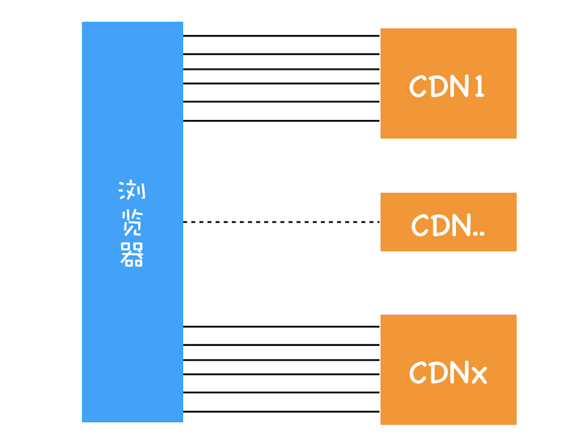
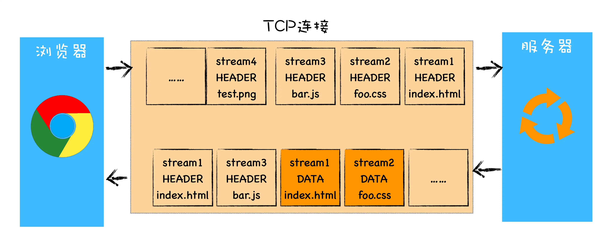
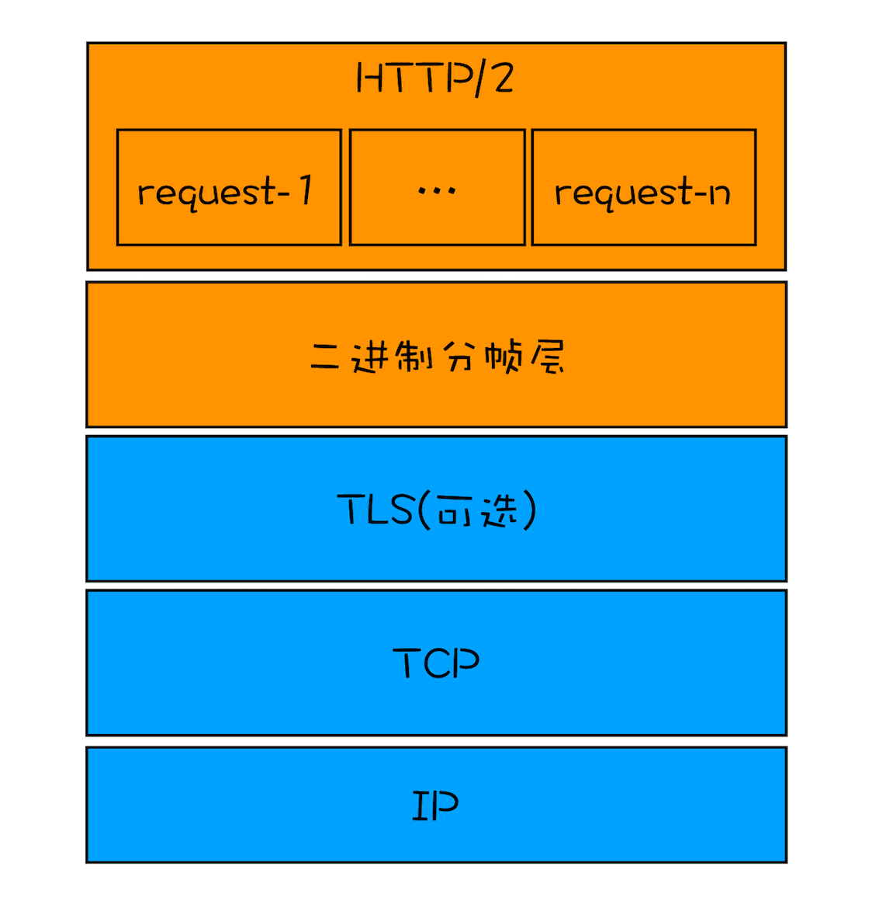

# 30｜HTTP/2：如何提升网络速度？

<audio preload="none" controls loop style="width: 100%;">
  <source src="../mp3/30｜HTTP2：如何提升网络速度？.mp3" type="audio/mpeg">
  
你的浏览器不支持HTML5音频，你可以<a href="../mp3/30｜HTTP2：如何提升网络速度？.mp3">下载</a>这个音频文件

</audio>

上一篇文章我们聊了 HTTP/1.1 的发展史，虽然 HTTP/1.1 已经做了大量的优化，但是依然存在很多性能瓶颈，依然不能满足我们日益变化的新需求，所以就有了我们今天要聊的 HTTP/2。

本文我们依然从需求的层面来谈，先分析 HTTP/1.1 存在哪些问题，然后再来分析 HTTP/2 是如何解决这些问题的。

我们知道 HTTP/1.1 为网络效率做了大量的优化，最核心的有如下三种方式：

1. 增加了持久连接；

2. 浏览器为每个域名最多同时维护 6 个 TCP 持久连接；

3. 使用 CDN 的实现域名分片机制。

通过这些方式就大大提高了页面的下载速度，你可以通过下图来直观感受下：

HTTP/1.1 的资源下载方式

在该图中，引入了 CDN，并同时为每个域名维护 6 个连接，这样就大大减轻了整个资源的下载时间。这里我们可以简单计算下：如果使用单个 TCP 的持久连接，下载 100 个资源所花费的时间为 100 * n * RTT；若通过上面的技术，就可以把整个时间缩短为 100 * n * RTT/(6 * CDN 个数)。从这个计算结果来看，我们的页面加载速度变快了不少。

## HTTP/1.1 的主要问题

虽然 HTTP/1.1 采取了很多优化资源加载速度的策略，也取得了一定的效果，但是 HTTP/1.1**对带宽的利用率却并不理想**，这也是 HTTP/1.1 的一个核心问题。

**带宽是指每秒最大能发送或者接收的字节数**。我们把每秒能发送的最大字节数称为**上行带宽**，每秒能够接收的最大字节数称为**下行带宽**。

之所以说 HTTP/1.1 对带宽的利用率不理想，是因为 HTTP/1.1 很难将带宽用满。比如我们常说的 100M 带宽，实际的下载速度能达到 12.5M/S，而采用 HTTP/1.1 时，也许在加载页面资源时最大只能使用到 2.5M/S，很难将 12.5M 全部用满。

之所以会出现这个问题，主要是由以下三个原因导致的。

**第一个原因，TCP 的慢启动。**

一旦一个 TCP 连接建立之后，就进入了发送数据状态，刚开始 TCP 协议会采用一个非常慢的速度去发送数据，然后慢慢加快发送数据的速度，直到发送数据的速度达到一个理想状态，我们把这个过程称为慢启动。

你可以把每个 TCP 发送数据的过程看成是一辆车的启动过程，当刚进入公路时，会有从 0 到一个稳定速度的提速过程，TCP 的慢启动就类似于该过程。

慢启动是 TCP 为了减少网络拥塞的一种策略，我们是没有办法改变的。

而之所以说慢启动会带来性能问题，是因为页面中常用的一些关键资源文件本来就不大，如 HTML 文件、CSS 文件和 JavaScript 文件，通常这些文件在 TCP 连接建立好之后就要发起请求的，但这个过程是慢启动，所以耗费的时间比正常的时间要多很多，这样就推迟了宝贵的首次渲染页面的时长了。

**第二个原因，同时开启了多条 TCP 连接，那么这些连接会竞争固定的带宽**。

你可以想象一下，系统同时建立了多条 TCP 连接，当带宽充足时，每条连接发送或者接收速度会慢慢向上增加；而一旦带宽不足时，这些 TCP 连接又会减慢发送或者接收的速度。比如一个页面有 200 个文件，使用了 3 个 CDN，那么加载该网页的时候就需要建立 6 * 3，也就是 18 个 TCP 连接来下载资源；在下载过程中，当发现带宽不足的时候，各个 TCP 连接就需要动态减慢接收数据的速度。

这样就会出现一个问题，因为有的 TCP 连接下载的是一些关键资源，如 CSS 文件、JavaScript 文件等，而有的 TCP 连接下载的是图片、视频等普通的资源文件，但是多条 TCP 连接之间又不能协商让哪些关键资源优先下载，这样就有可能影响那些关键资源的下载速度了。

**第三个原因，HTTP/1.1 队头阻塞的问题**。

通过[上一篇文章]()，我们知道在 HTTP/1.1 中使用持久连接时，虽然能公用一个 TCP 管道，但是在一个管道中同一时刻只能处理一个请求，在当前的请求没有结束之前，其他的请求只能处于阻塞状态。这意味着我们不能随意在一个管道中发送请求和接收内容。

这是一个很严重的问题，因为阻塞请求的因素有很多，并且都是一些不确定性的因素，假如有的请求被阻塞了 5 秒，那么后续排队的请求都要延迟等待 5 秒，在这个等待的过程中，带宽、CPU 都被白白浪费了。

在浏览器处理生成页面的过程中，是非常希望能提前接收到数据的，这样就可以对这些数据做预处理操作，比如提前接收到了图片，那么就可以提前进行编解码操作，等到需要使用该图片的时候，就可以直接给出处理后的数据了，这样能让用户感受到整体速度的提升。

但队头阻塞使得这些数据不能并行请求，所以队头阻塞是很不利于浏览器优化的。

## HTTP/2 的多路复用

前面我们分析了 HTTP/1.1 所存在的一些主要问题：慢启动和 TCP 连接之间相互竞争带宽是由于 TCP 本身的机制导致的，而队头阻塞是由于 HTTP/1.1 的机制导致的。

那么该如何去解决这些问题呢？

虽然 TCP 有问题，但是我们依然没有换掉 TCP 的能力，所以我们就要想办法去规避 TCP 的慢启动和 TCP 连接之间的竞争问题。

基于此，HTTP/2 的思路就是一个域名只使用一个 TCP 长连接来传输数据，这样整个页面资源的下载过程只需要一次慢启动，同时也避免了多个 TCP 连接竞争带宽所带来的问题。

另外，就是队头阻塞的问题，等待请求完成后才能去请求下一个资源，这种方式无疑是最慢的，所以 HTTP/2 需要实现资源的并行请求，也就是任何时候都可以将请求发送给服务器，而并不需要等待其他请求的完成，然后服务器也可以随时返回处理好的请求资源给浏览器。

所以，HTTP/2 的解决方案可以总结为：**一个域名只使用一个 TCP 长连接和消除队头阻塞问题**。可以参考下图：

HTTP/2 的多路复用

该图就是 HTTP/2 最核心、最重要且最具颠覆性的**多路复用机制**。从图中你会发现每个请求都有一个对应的 ID，如 stream1 表示 index.html 的请求，stream2 表示 foo.css 的请求。这样在浏览器端，就可以随时将请求发送给服务器了。

服务器端接收到这些请求后，会根据自己的喜好来决定优先返回哪些内容，比如服务器可能早就缓存好了 index.html 和 bar.js 的响应头信息，那么当接收到请求的时候就可以立即把 index.html 和 bar.js 的响应头信息返回给浏览器，然后再将 index.html 和 bar.js 的响应体数据返回给浏览器。之所以可以随意发送，是因为每份数据都有对应的 ID，浏览器接收到之后，会筛选出相同 ID 的内容，将其拼接为完整的 HTTP 响应数据。

HTTP/2 使用了多路复用技术，可以将请求分成一帧一帧的数据去传输，这样带来了一个额外的好处，就是当收到一个优先级高的请求时，比如接收到 JavaScript 或者 CSS 关键资源的请求，服务器可以暂停之前的请求来优先处理关键资源的请求。

## 多路复用的实现

现在我们知道为了解决 HTTP/1.1 存在的问题，HTTP/2 采用了多路复用机制，那 HTTP/2 是怎么实现多路复用的呢？你可以先看下面这张图：

HTTP/2 协议栈

从图中可以看出，HTTP/2 添加了一个二进制分帧层，那我们就结合图来分析下 HTTP/2 的请求和接收过程。

- 首先，浏览器准备好请求数据，包括了请求行、请求头等信息，如果是 POST 方法，那么还要有请求体。

* 这些数据经过二进制分帧层处理之后，会被转换为一个个带有请求 ID 编号的帧，通过协议栈将这些帧发送给服务器。

- 服务器接收到所有帧之后，会将所有相同 ID 的帧合并为一条完整的请求信息。

* 然后服务器处理该条请求，并将处理的响应行、响应头和响应体分别发送至二进制分帧层。

- 同样，二进制分帧层会将这些响应数据转换为一个个带有请求 ID 编号的帧，经过协议栈发送给浏览器。

* 浏览器接收到响应帧之后，会根据 ID 编号将帧的数据提交给对应的请求。

从上面的流程可以看出，**通过引入二进制分帧层，就实现了 HTTP 的多路复用技术**。

[上一篇文章]()我们介绍过，HTTP 是浏览器和服务器通信的语言，在这里虽然 HTTP/2 引入了二进制分帧层，不过 HTTP/2 的语义和 HTTP/1.1 依然是一样的，也就是说它们通信的语言并没有改变，比如开发者依然可以通过 Accept 请求头告诉服务器希望接收到什么类型的文件，依然可以使用 Cookie 来保持登录状态，依然可以使用 Cache 来缓存本地文件，这些都没有变，发生改变的只是传输方式。这一点对开发者来说尤为重要，这意味着我们不需要为 HTTP/2 去重建生态，并且 HTTP/2 推广起来会也相对更轻松了。

## HTTP/2 其他特性

通过上面的分析，我们知道了多路复用是 HTTP/2 的最核心功能，它能实现资源的并行传输。多路复用技术是建立在二进制分帧层的基础之上。其实基于二进制分帧层，HTTP/2 还附带实现了很多其他功能，下面我们就来简要了解下。

### 1. 可以设置请求的优先级

我们知道浏览器中有些数据是非常重要的，但是在发送请求时，重要的请求可能会晚于那些不怎么重要的请求，如果服务器按照请求的顺序来回复数据，那么这个重要的数据就有可能推迟很久才能送达浏览器，这对于用户体验来说是非常不友好的。

为了解决这个问题，HTTP/2 提供了请求优先级，可以在发送请求时，标上该请求的优先级，这样服务器接收到请求之后，会优先处理优先级高的请求。

### 2. 服务器推送

除了设置请求的优先级外，HTTP/2 还可以直接将数据提前推送到浏览器。你可以想象这样一个场景，当用户请求一个 HTML 页面之后，服务器知道该 HTML 页面会引用几个重要的 JavaScript 文件和 CSS 文件，那么在接收到 HTML 请求之后，附带将要使用的 CSS 文件和 JavaScript 文件一并发送给浏览器，这样当浏览器解析完 HTML 文件之后，就能直接拿到需要的 CSS 文件和 JavaScript 文件，这对首次打开页面的速度起到了至关重要的作用。

### 3. 头部压缩

无论是 HTTP/1.1 还是 HTTP/2，它们都有请求头和响应头，这是浏览器和服务器的通信语言。HTTP/2 对请求头和响应头进行了压缩，你可能觉得一个 HTTP 的头文件没有多大，压不压缩可能关系不大，但你这样想一下，在浏览器发送请求的时候，基本上都是发送 HTTP 请求头，很少有请求体的发送，通常情况下页面也有 100 个左右的资源，如果将这 100 个请求头的数据压缩为原来的 20%，那么传输效率肯定能得到大幅提升。

## 总结

好了，今天就介绍这里，下面我来总结下本文的主要内容。

我们首先分析了影响 HTTP/1.1 效率的三个主要因素：TCP 的慢启动、多条 TCP 连接竞争带宽和队头阻塞。

接下来我们分析了 HTTP/2 是如何采用多路复用机制来解决这些问题的。多路复用是通过在协议栈中添加二进制分帧层来实现的，有了二进制分帧层还能够实现请求的优先级、服务器推送、头部压缩等特性，从而大大提升了文件传输效率。

HTTP/2 协议规范于 2015 年 5 月正式发布，在那之后，该协议已在互联网和万维网上得到了广泛的实现和部署。从目前的情况来看，国内外一些排名靠前的站点基本都实现了 HTTP/2 的部署。使用 HTTP/2 能带来 20%～60% 的效率提升，至于 20% 还是 60% 要看优化的程度。总之，我们也应该与时俱进，放弃 HTTP/1.1 和其性能优化方法，去“拥抱”HTTP/2。

## 思考时间

虽然 HTTP/2 解决了 HTTP/1.1 中的队头阻塞问题，但是 HTTP/2 依然是基于 TCP 协议的，而 TCP 协议依然存在数据包级别的队头阻塞问题，那么你觉得 TCP 的队头阻塞是如何影响到 HTTP/2 性能的呢？

<!-- 滇西之王
2019-10-12
在tcp层 Tls层以上的数据都是tcp层的数据，tcp层对每个数据包都有编号，分为1，2，3 .... tcp保证双向稳定可靠的传输，如果2包数据丢失，1号包和3号包来了，那么在超时重传时间还没有收到2编号数据包，服务端会发送2号数据包，客服端收到之后，发出确认，服务端才会继续发送其他数据，客服端数据才会呈现给上层应用层，这样tcp层的阻塞就发生了

Geek_1e6198
2020-08-06
刚出去面试就被问到了,而且很多都是老师这个专栏下的问题 让我怀疑是不是面试官刚看过这个

moss
2019-10-17
老师好，采用了HTTP/2之后，雪碧图是不是彻底不需要了呢？而且多张图片变成雪碧图后，多张图片大小加和都没有一张雪碧图大，那是不是雪碧图反而让传输更慢了呢？
作者回复: http/2是没必要用雪碧图了

成楠Peter
2019-10-12
TCP的队头阻塞，TCP传输过程中也是把一份数据分为多个数据包的。当其中一个数据包没有按照顺序返回，接收端会一直保持连接等待数据包返回，这时候就会阻塞后续请求。
共 1 条评论

12

焦糖大瓜子
2020-06-02
HTTP/2请求是如何设置请求的优先级？

小智
2019-10-24
浏览器是如何判断选择http1，http1.1，http2的。对应的部署是不是也要有回退机制，比如检测到浏览器不支持http2，就返回http1的模式？

安思科
2019-10-12
前几天，http3已经在chrome和curl试用，使用UDP试图解决对头阻塞问题。

Chao
2019-10-12
由于多路复用，反而产生队头阻塞时， 影响比http1.1更为巨大。
在目前TCP下解决这个问题还是很困难的
共 1 条评论

4

CMS
2020-01-13
能不能再详细讲一下：使用 CDN 的实现域名分片机制。

LEON
2019-12-26
老师http2 是不是必须要使用https? 如果不用https可以吗？

hao-kuai
2021-12-24
1. HTTP 0.9 到 HTTP 1.0 是功能增强
2. HTTP 1.0 到 HTTP 1.1 是性能优化
3. HTTP 1.1 到 HTTP 2.1 是性能优化及顺带功能增强
4. 再次遇到可暂停可恢复增量任务调度，相信以后还会遇到：V8的垃圾回收老生代区域算法、HTTP/2多路复用技术、React的Fiber调度算法

六个周
2022-04-12
Chrome有个机制，同一个域名同时最多只能建立6个TCP连接，若此刻同时有10个请求发生。则4个会进入TCP队列进行排队。
然后在HTTP/1.1中增加了持久性连接方法，一个TCP上可以传输多个HTTP请求。
结合这两句话，有点懵逼了，一个TCP上可以传输多个HTTP请求这句话该怎么理解呢？
意思是不是说，在访问一个网站的时候，浏览器提供了6个TCP管道，然后你这个网站同时有十个请求发生，那么六个进入了这个TCP管道，还有四个在排队，当六个中有一个结束之后，然后四个排队中的出来一个，然后又用这个管道，但是这个时候，这个管道就不用在此建立TCP连接了，也就是说一个TCP上可以传输多个HTTP请求，是这个意思吗？求老师，大神们指点啊，在这里的理解上有点出不来了。
共 1 条评论


追风筝的人
2020-02-25
Http2 优点 多路复用 ，二进制流传输数据， Hpack算法头部字段压缩，服务器主动推送，请求优先级的设置，部分解决了队头阻塞，原因是基于TCP协议传输，Http3 基于QUIC协议下的UDP协议，解决了队头阻塞。

晓东
2020-01-15
同一个域名用一个tcp解决了慢启动的问题，并且tcp带宽的竞争也少了6倍。但是本来可以6个tcp同时下载同一个域名的资源，现在只能用一个tcp了，我这个理解对么？

-_-|||
2019-12-16
HTTP/2 下浏览器获取的所有请求数据都会经过 "二进制分帧层" 吗?
作者回复: 是的

痴人指路
2022-01-19
http2中，浏览器短时间内发送多个请求是 一起被二进制分帧层处理吗？还是一个个的被处理发送？然后服务器收到诸多请求后再返回？这里我理解的不是很明白。
看老师文中内容，感觉是多个请求会一起被分帧层处理然后都发送到服务器，服务器收到了分帧层发过来的全部内容，再组合拆分成不同请求



唯唯喏
2022-01-15
如果只有一个TCP连接，它会占满带宽，滑动窗口最大化，但是包本身有序，tcp层面也会出现队头阻塞，是这样吧。

Du小强🍪
2021-09-02
我不理解这里所说的并行发送是可以同时发送还是可以不用等待发送，但发送时还是以顺序发送

Alan He
2021-03-05
HTTP2的多路复用解决了同一个TCP连接下可以并发请求，浏览器本身单域名的TCP连接数是有限制的，比如6个，那么每一个TCP连接又可以并发多个请求，这个并发的请求数量有限制吗？

lerman
2021-01-15
请教一下，如果用了两个web server，前一个web server做负载均衡，支持HTTP/2，后一个web server是实际执行任务的服务器，支持HTTP/1.1，这种情况下，请求在客户端和服务器端是使用什么协议呢？谢谢！


←
29 | HTTP/1：HTTP性能优化
31｜HTTP/3：甩掉TCP、TLS 的包袱，构建高效网络
→ -->