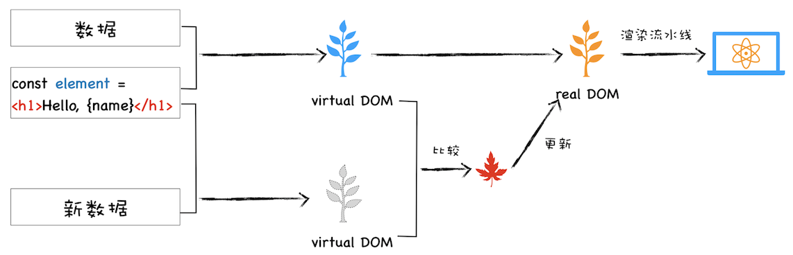
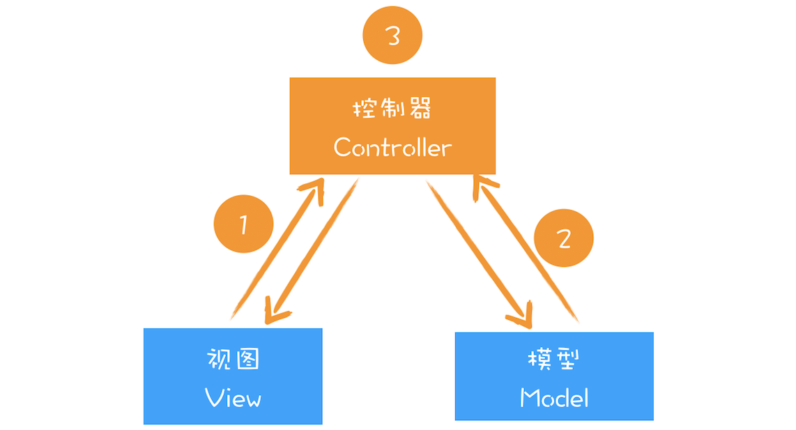
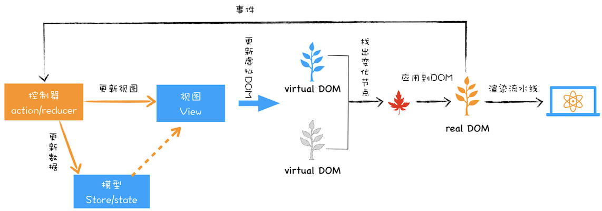

# 26 | 虚拟DOM：虚拟DOM和实际的DOM有何不同？

<audio preload="none" controls loop style="width: 100%;">
  <source src="../mp3/26-虚拟DOM：虚拟DOM和实际的DOM有何不同？.mp3" type="audio/mpeg">
  
你的浏览器不支持HTML5音频，你可以<a href="../mp3/26-虚拟DOM：虚拟DOM和实际的DOM有何不同？.mp3">下载</a>这个音频文件

</audio>

虚拟 DOM 是最近非常火的技术，两大著名前端框架 React 和 Vue 都使用了虚拟 DOM，所以我觉得非常有必要结合浏览器的工作机制对虚拟 DOM 进行一次分析。当然了，React 和 Vue 框架本身所蕴含的知识点非常多，而且也不是我们专栏的重点，所以在这里我们还是把重心聚焦在虚拟 DOM 上。

在本文我们会先聊聊 DOM 的一些缺陷，然后在此基础上介绍虚拟 DOM 是如何解决这些缺陷的，最后再站在双缓存和 MVC 的视角来聊聊虚拟 DOM。理解了这些会让你对目前的前端框架有一个更加底层的认识，这也有助于你更好地理解这些前端框架。

## DOM 的缺陷

通过前面一系列文章的学习，你对 DOM 的生成过程应该已经有了比较深刻的理解，并且也知道了通过 JavaScript 操纵 DOM 是会影响到整个渲染流水线的。另外，DOM 还提供了一组 JavaScript 接口用来遍历或者修改节点，这套接口包含了 getElementById、removeChild、appendChild 等方法。

比如，我们可以调用document.body.appendChild(node)往 body 节点上添加一个元素，调用该 API 之后会引发一系列的连锁反应。首先渲染引擎会将 node 节点添加到 body 节点之上，然后触发样式计算、布局、绘制、栅格化、合成等任务，我们把这一过程称为**重排**。除了重排之外，还有可能引起**重绘**或者**合成**操作，形象地理解就是“**牵一发而动全身**”。另外，对于 DOM 的不当操作还有可能引发**强制同步布局**和**布局抖动**的问题，这些操作都会大大降低渲染效率。因此，对于 DOM 的操作我们时刻都需要非常小心谨慎。

当然，对于简单的页面来说，其 DOM 结构还是比较简单的，所以以上这些操作 DOM 的问题并不会对用户体验产生太多影响。但是对于一些复杂的页面或者目前使用非常多的单页应用来说，其 DOM 结构是非常复杂的，而且还需要不断地去修改 DOM 树，每次操作 DOM 渲染引擎都需要进行重排、重绘或者合成等操作，因为 DOM 结构复杂，所生成的页面结构也会很复杂，对于这些复杂的页面，执行一次重排或者重绘操作都是非常耗时的，这就给我们带来了真正的性能问题。

所以我们需要有一种方式来减少 JavaScript 对 DOM 的操作，这时候虚拟 DOM 就上场了。

## 什么是虚拟 DOM

在谈论什么是虚拟 DOM 之前，我们先来看看虚拟 DOM 到底要解决哪些事情。

- 将页面改变的内容应用到虚拟 DOM 上，而不是直接应用到 DOM 上。

* 变化被应用到虚拟 DOM 上时，虚拟 DOM 并不急着去渲染页面，而仅仅是调整虚拟 DOM 的内部状态，这样操作虚拟 DOM 的代价就变得非常轻了。

- 在虚拟 DOM 收集到足够的改变时，再把这些变化一次性应用到真实的 DOM 上。

基于以上三点，我们再来看看什么是虚拟 DOM。为了直观理解，你可以参考下图：

虚拟 DOM 执行流程

该图是我结合 React 流程画的一张虚拟 DOM 执行流程图，下面我们就结合这张图来分析下虚拟 DOM 到底怎么运行的。

- **创建阶段**。首先依据 JSX 和基础数据创建出来虚拟 DOM，它反映了真实的 DOM 树的结构。然后由虚拟 DOM 树创建出真实 DOM 树，真实的 DOM 树生成完后，再触发渲染流水线往屏幕输出页面。

* **更新阶段**。如果数据发生了改变，那么就需要根据新的数据创建一个新的虚拟 DOM 树；然后 React 比较两个树，找出变化的地方，并把变化的地方一次性更新到真实的 DOM 树上；最后渲染引擎更新渲染流水线，并生成新的页面。

既然聊到虚拟 DOM 的更新，那我们就不得不聊聊最新的 **React Fiber 更新机制**。通过上图我们知道，当有数据更新时，React 会生成一个新的虚拟 DOM，然后拿新的虚拟 DOM 和之前的虚拟 DOM 进行比较，这个过程会找出变化的节点，然后再将变化的节点应用到 DOM 上。

这里我们重点关注下比较过程，最开始的时候，比较两个虚拟 DOM 的过程是在一个递归函数里执行的，其**核心算法是 reconciliation**。通常情况下，这个比较过程执行得很快，不过当虚拟 DOM 比较复杂的时候，执行比较函数就有可能占据主线程比较久的时间，这样就会导致其他任务的等待，造成页面卡顿。为了解决这个问题，React 团队重写了 reconciliation 算法，新的算法称为 Fiber reconciler，之前老的算法称为 Stack reconciler。

在前面[《20 | async/await：使用同步的方式去写异步代码》]()那篇文章中我们介绍了协程，其实协程的另外一个称呼就是 Fiber，所以在这里我们可以把 Fiber 和协程关联起来，那么所谓的 Fiber reconciler 相信你也很清楚了，就是在执行算法的过程中出让主线程，这样就解决了 Stack reconciler 函数占用时间过久的问题。至于具体的实现过程在这里我就不详细分析了，如果感兴趣的话，你可以自行查阅相关资料进行学习。

了解完虚拟 DOM 的大致执行流程，你应该也就知道为何需要虚拟 DOM 了。不过以上都从单纯的技术视角来分析虚拟 DOM 的，那接下来我们再从双缓存和 MVC 模型这两个视角来聊聊虚拟 DOM。

### 1. 双缓存

在开发游戏或者处理其他图像的过程中，屏幕从前缓冲区读取数据然后显示。但是很多图形操作都很复杂且需要大量的运算，比如一幅完整的画面，可能需要计算多次才能完成，如果每次计算完一部分图像，就将其写入缓冲区，那么就会造成一个后果，那就是在显示一个稍微复杂点的图像的过程中，你看到的页面效果可能是一部分一部分地显示出来，因此在刷新页面的过程中，会让用户感受到界面的闪烁。

而使用双缓存，可以让你先将计算的中间结果存放在另一个缓冲区中，等全部的计算结束，该缓冲区已经存储了完整的图形之后，再将该缓冲区的图形数据一次性复制到显示缓冲区，这样就使得整个图像的输出非常稳定。

在这里，你可以把虚拟 DOM 看成是 DOM 的一个 buffer，和图形显示一样，它会在完成一次完整的操作之后，再把结果应用到 DOM 上，这样就能减少一些不必要的更新，同时还能保证 DOM 的稳定输出。

### 2. MVC 模式

到这里我们了解了虚拟 DOM 是一种类似双缓存的实现。不过如果站在技术角度来理解虚拟缓存，依然不能全面理解其含义。那么接下来我们再来看看虚拟 DOM 在 MVC 模式中所扮演的角色。

在各大设计模式当中，MVC 是一个非常重要且应用广泛的模式，因为它能将数据和视图进行分离，在涉及到一些复杂的项目时，能够大大减轻项目的耦合度，使得程序易于维护。

关于 MVC 的基础结构，你可以先参考下图：

MVC 基础结构

通过上图你可以发现，MVC 的整体结构比较简单，由模型、视图和控制器组成，其**核心思想就是将数据和视图分离**，也就是说视图和模型之间是不允许直接通信的，它们之间的通信都是通过控制器来完成的。通常情况下的通信路径是视图发生了改变，然后通知控制器，控制器再根据情况判断是否需要更新模型数据。当然还可以根据不同的通信路径和控制器不同的实现方式，基于 MVC 又能衍生出很多其他的模式，如 MVP、MVVM 等，不过万变不离其宗，它们的基础骨架都是基于 MVC 而来。

所以在分析基于 React 或者 Vue 这些前端框架时，我们需要先重点把握大的 MVC 骨架结构，然后再重点查看通信方式和控制器的具体实现方式，这样我们就能从架构的视角来理解这些前端框架了。比如在分析 React 项目时，我们可以把 React 的部分看成是一个 MVC 中的视图，在项目中结合 Redux 就可以构建一个 MVC 的模型结构，如下图所示：

基于 React 和 Redux 构建 MVC 模型

在该图中，我们可以把虚拟 DOM 看成是 MVC 的视图部分，其控制器和模型都是由 Redux 提供的。其具体实现过程如下：

- 图中的控制器是用来监控 DOM 的变化，一旦 DOM 发生变化，控制器便会通知模型，让其更新数据；

* 模型数据更新好之后，控制器会通知视图，告诉它模型的数据发生了变化；

- 视图接收到更新消息之后，会根据模型所提供的数据来生成新的虚拟 DOM；

* 新的虚拟 DOM 生成好之后，就需要与之前的虚拟 DOM 进行比较，找出变化的节点；

- 比较出变化的节点之后，React 将变化的虚拟节点应用到 DOM 上，这样就会触发 DOM 节点的更新；

* DOM 节点的变化又会触发后续一系列渲染流水线的变化，从而实现页面的更新。

在实际工程项目中，你需要学会分析出这各个模块，并梳理出它们之间的通信关系，这样对于任何框架你都能轻松上手了。

## 总结

好了，今天就介绍到这里，下面我来总结下本文的主要内容。

首先我们分析了直接操作 DOM 会触发渲染流水线的一系列反应，如果对 DOM 操作不当的话甚至还会触发强制同步布局和布局抖动的问题，这也是我们在操作 DOM 时需要非常小心谨慎的原因。

在此分析的基础上，我们介绍了虚拟 DOM 是怎么解决直接操作 DOM 所带来的问题以及 React Fiber 更新机制。

要聊前端框架，就绕不开设计模式，所以接下来我们又从双缓存和 MVC 角度分析了虚拟 DOM。双缓存是一种经典的思路，应用在很多场合，能解决页面无效刷新和闪屏的问题，虚拟 DOM 就是双缓存思想的一种体现。而基于 MVC 的设计思想也广泛地渗透到各种场合，并且基于 MVC 又衍生出了很多其他模式（如 MVP、MVVM 等），不过万变不离其宗，它们的基础骨架都是基于 MVC 而来。站在 MVC 视角来理解虚拟 DOM 能让你看到更为“广阔的世界”。

## 思考时间

今天留给你的思考题是：虚拟 DOM 都解决了哪些问题？

<!-- 1. 频繁更新dom引起的性能问题
2. 将真实DOM和js操作解耦，减少js操作dom复杂性。
老师答疑的时候可以介绍下react的fiber吗？感觉李老师的文章通俗易懂，很受益（网上文章分析参差不齐的）
今日总结：
为什么会出现虚拟DOM？javascript直接操作DOM可能会引起重排 重绘等操作（强制同步布局和布局抖动）引起性能问题。这是需要一个中间层来优化dom的操作（批量更新dom，优化更新dom细节），虚拟DOM就呼之欲出了。之后从双缓存和MVC模型的角度来解析了虚拟DOM。

虚拟DOM的出现根本意义上不是为了解决 js 频繁操作DOM而引起的性能问题，因为如果通过 js 来操作DOM，那么无论用什么方式，多少动作都需要执行，虚拟DOM并没有减少操作。虚拟DOM的意义在于改变了开发模式，之前是需要手动管理DOM，数据和DOM操作糅合在一起，开发效率低下；之后是使用框架/库自动管理DOM，数据驱动DOM的更新，只需要关注数据的变化即可。但是这会遇到一个问题，就是当数据改变时，框架需要更新全部的DOM吗？显然这是不可接受的，js 操作DOM的代价很高，所以当数据变化时并不直接对DOM进行更新，而是先对应在虚拟DOM上，通过与之前的虚拟DOM进行比较，确定需要更新的变动，然后在对应在真实的DOM上。

老师，我用js文件里面操作dom原生操作，不也是这个js文件执行完，也就是所有的dom原生操作都做完，才统一渲染页面么？我觉得虚拟dom只是对比innerHtml更有优势，并且屏蔽了原生的操作，可以使更多人来使用数据驱动视图，而不必要去操作麻烦的原生操作，就从效率来说，虚拟dom肯定比原生的差啊，虚拟dom对比完了，不还是得调用原生的操作么？他至少比原生多了diff算法的时间，麻烦老师解答下，提了挺多问题了，老师有空看一下

主要还是解决频繁操作DOM引起页面响应慢的问题。
虚拟DOM就是一个JS对象，通过diff算法比较新老DOM树的差别，来达到最小化局部更新的目的。
其本质不过是用JS的运算性能的消耗来换取操作DOM的性能消耗。

说虚拟 DOM 解决的问题，那一定应该是和 DOM 存在什么问题来进行比较吧？
DOM 存在的问题：
- 对 DOM 进行操作时往往会引起重排、重绘
- 编写不当的代码操作 DOM 还会引起强制布局和布局抖动
- 复杂的页面往往会频繁的操作 DOM
虚拟 DOM 对此的优势：
虚拟 DOM 最终当然也会产生重排、重绘等操作，但是由于虚拟 DOM 对 真实 DOM 的预解析和变化搜集的双缓存机制，使得操作 DOM 的频率会明显的降低。
操作 DOM 的频率降低同样会使得强制同步布局和布局抖动得到一定的优化。
这个是我对于虚拟 DOM 的优势的理解，如果有什么不对的，还望指正。

老师，为什么 React 的 Fiber 不用 async/await 来实现呢？

似乎大家都没有提到一点，虚拟dom可以实现跨端，如React Native

老师，文中的虚拟Dom收集到足够的变化是什么意思？会不会导致页面的响应变慢？

读完文章之后，感觉虚拟DOM技术和DOM碎片（createDocumentFragment）很像，都是提供缓存的策略。

老师，你好。我有两个小疑问：
1.就是说到新算法的时候，使用协程说让出主线程。前面课程里说道线程同一时刻只能有一个协程能执行，这里说的协程如果还属于主线程的话，我理解的依然会卡主线程，如果不属于相当于新开线程来执行diff算法。请问我是不是哪里理解错了？
2.就是分析React更新dom，第一步说监听DOM的变化，后面又说React变化的虚拟DOM同步更新到实际DOM，触发DOM的更新。我理解第一步应该是监听虚拟DOM变更函数调用，但是这样由于示例图又不一样了，如果是实际DOM的变化都已经变化了就没后面什么事了吧？

基于 React 和 Redux 构建 MVC 模型的配图中，控制器是不是不能直接改变视图？因为 redux 模型是单向数据流吧

由于真实的DOM结构是非常庞大且复杂的，因此可以采用js对象来描述真实的DOM结构，这就是虚拟DOM，并且当数据更新后，需要更新视图，根据新的数据生成一个新的虚拟DOM，然后基于新的虚拟DOM，跟旧的虚拟DOM进行比较，找出更新的部分，改造旧的虚拟DOM，再讲虚拟DOM转化成真实DOM，再一次性插入到视图节点中。这样子通过避免重复操作DOM元素，牺牲js的运算消耗，但是在如今高CPU的计算机处理性能下，这点消耗可以忽略，从而提高视图渲染的性能

频繁DOM操作是非常消耗浏览器性能的，虚拟DOM核心还是将批量DOM操作后的变化一次性更新到浏览器。

文中"在虚拟 DOM 收集到足够的改变时，再把这些变化一次性应用到真实的 DOM 上。"这句话我不赞同，虚拟DOM最中也是将对比出不的不同点一次一次调用原生API更新DOM，并不能实现“一次性”应用到真实DOM
虚拟DOM从来不是为了解决性能问题，而是现代框架为实现mvvm，解放开发人员生产力做的一种折中的方案。

我理解只要不在页面上插入删除节点或者对dom元素的几何信息进行改变就不会触发重排重绘，就算我使用虚拟dom我在虚拟dom中增加节点依然会触发重排才对,而且我如果在页面上只想改变dom元素中某个文字，我直接操作dom明显来的更快,使用虚拟dom反而要去经过对比计算,效率明显不如前者,虚拟dom主要是提高开发效率的同时提供过得去的性能,在最初,改变dom中的内容需要手动获取dom对元素更改,使用虚拟dom只需要关心数据变化,这样使得开发效率有所提升,并且虚拟dom还可以应用在移动端,如果追求性能虚拟dom应该不是最优选择

在vue中使用document.getElementbyId获得的是虚拟dom还是真实dom呢
-->
