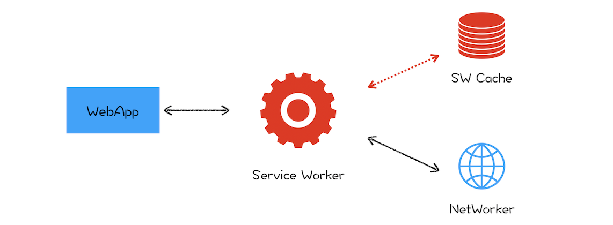

# 27 | 渐进式网页应用（PWA）：它究竟解决了 Web 应用的哪些问题？

<audio preload="none" controls loop style="width: 100%;">
  <source src="../mp3/27-渐进式网页应用（PWA）：它究竟解决了Web应用的哪些问题？.mp3" type="audio/mpeg">
  
你的浏览器不支持HTML5音频，你可以<a href="../mp3/27-渐进式网页应用（PWA）：它究竟解决了Web应用的哪些问题？.mp3">下载</a>这个音频文件

</audio>

在专栏开篇词中，我们提到过浏览器的三大进化路线：

- 第一个是应用程序 Web 化；

* 第二个是 Web 应用移动化；

- 第三个是 Web 操作系统化；

其中，第二个 Web 应用移动化是 Google 梦寐以求而又一直在发力的一件事，不过对于移动设备来说，前有本地 App，后有移动小程序，想要浏览器切入到移动端是相当困难的一件事，因为浏览器的运行性能是低于本地 App 的，并且 Google 也没有类似微信或者 Facebook 这种体量的用户群体。

但是要让浏览器切入到移动端，让其取得和原生应用同等待遇可是 Google 的梦想，那该怎么做呢？

这就是我们本节要聊的 PWA。那什么是 PWA？PWA 又是以什么方式切入到移动端的呢？

PWA，全称是 Progressive Web App，翻译过来就是渐进式网页应用。根据字面意思，它就是“渐进式 +Web 应用”。对于 Web 应用很好理解了，就是目前我们普通的 Web 页面，所以 PWA 所支持的首先是一个 Web 页面。至于“渐进式”，就需要从下面两个方面来理解。

- 站在 Web 应用开发者来说，PWA 提供了一个渐进式的过渡方案，让 Web 应用能逐步具有本地应用的能力。采取渐进式可以降低站点改造的代价，使得站点逐步支持各项新技术，而不是一步到位。

* 站在技术角度来说，PWA 技术也是一个渐进式的演化过程，在技术层面会一点点演进，比如逐渐提供更好的设备特性支持，不断优化更加流畅的动画效果，不断让页面的加载速度变得更快，不断实现本地应用的特性。

从这两点可以看出来，PWA 采取的是非常一个缓和的渐进式策略，不再像以前那样激进，动不动就是取代本地 App、取代小程序。与之相反，而是要充分发挥 Web 的优势，渐进式地缩短和本地应用或者小程序的距离。

那么 Web 最大的优势是什么呢？我认为是自由开放，也正是因为自由和开放，所以大家就很容易对同一件事情达成共识，达成共识之后，一套代码就可以运行在各种设备之上了，这就是跨平台，这也恰恰是本地应用所不具备的。而对于小程序，倒是可以实现跨平台，但要让各家达成共识，目前来看，似乎还是非常不切实际的。

所以我给 PWA 的定义就是：**它是一套理念，渐进式增强 Web 的优势，并通过技术手段渐进式缩短和本地应用或者小程序的距离**。基于这套理念之下的技术都可以归类到 PWA。

那今天我们就主要来聊聊 PWA 主要采用了哪些技术手段来缩短它和本地应用或者小程序的距离。

## Web 应用 VS 本地应用

那相对于本地应用，Web 页面到底缺少了什么？

- 首先，Web 应用缺少离线使用能力，在离线或者在弱网环境下基本上是无法使用的。而用户需要的是沉浸式的体验，在离线或者弱网环境下能够流畅地使用是用户对一个应用的基本要求。

* 其次，Web 应用还缺少了消息推送的能力，因为作为一个 App 厂商，需要有将消息送达到应用的能力。

- 最后，Web 应用缺少一级入口，也就是将 Web 应用安装到桌面，在需要的时候直接从桌面打开 Web 应用，而不是每次都需要通过浏览器来打开。

**针对以上 Web 缺陷，PWA 提出了两种解决方案：通过引入 Service Worker 来试着解决离线存储和消息推送的问题，通过引入 manifest.json 来解决一级入口的问题**。下面我们就来详细分析下 Service Worker 是如何工作的。

## 什么是 Service Worker

我们先来看看 Service Worker 是怎么解决离线存储和消息推送的问题。

其实在 Service Worker 之前，WHATWG 小组就推出过用 App Cache 标准来缓存页面，不过在使用过程中 App Cache 所暴露的问题比较多，遭到多方吐槽，所以这个标准最终也只能被废弃了，可见一个成功的标准是需要经历实践考量的。

所以在 2014 年的时候，标准委员会就提出了 Service Worker 的概念，它的主要思想是在页面和网络之间增加一个拦截器，用来缓存和拦截请求。整体结构如下图所示：

Service Worker 结构示意图

在没有安装 Service Worker 之前，WebApp 都是直接通过网络模块来请求资源的。安装了 Service Worker 模块之后，WebApp 请求资源时，会先通过 Service Worker，让它判断是返回 Service Worker 缓存的资源还是重新去网络请求资源。一切的控制权都交由 Service Worker 来处理。

## Service Worker 的设计思路

现在我们知道 Service Worker 的主要功能就是拦截请求和缓存资源，接下来我们就从 Web 应用的需求角度来看看 Service Worker 的设计思路。

### 1. 架构

通过前面**页面循环系统**的分析，我们已经知道了 JavaScript 和页面渲染流水线的任务都是在页面主线程上执行的，如果一段 JavaScript 执行时间过久，那么就会阻塞主线程，使得渲染一帧的时间变长，从而让用户产生卡顿的感觉，这对用户来说体验是非常不好的。

为了避免 JavaScript 过多占用页面主线程时长的情况，浏览器实现了 Web Worker 的功能。Web Worker 的目的是让 JavaScript 能够运行在页面主线程之外，不过由于 Web Worker 中是没有当前页面的 DOM 环境的，所以在 Web Worker 中只能执行一些和 DOM 无关的 JavaScript 脚本，并通过 postMessage 方法将执行的结果返回给主线程。所以说在 Chrome 中， Web Worker 其实就是在渲染进程中开启的一个新线程，它的生命周期是和页面关联的。

**“让其运行在主线程之外”就是 Service Worker 来自 Web Worker 的一个核心思想**。不过 Web Worker 是临时的，每次 JavaScript 脚本执行完成之后都会退出，执行结果也不能保存下来，如果下次还有同样的操作，就还得重新来一遍。所以 Service Worker 需要在 Web Worker 的基础之上加上储存功能。

另外，由于 Service Worker 还需要会为多个页面提供服务，所以还**不能把 Service Worker 和单个页面绑定起来**。在目前的 Chrome 架构中，Service Worker 是运行在浏览器进程中的，因为浏览器进程生命周期是最长的，所以在浏览器的生命周期内，能够为所有的页面提供服务。

### 2. 消息推送

**消息推送也是基于 Service Worker 来实现的**。因为消息推送时，浏览器页面也许并没有启动，这时就需要 Service Worker 来接收服务器推送的消息，并将消息通过一定方式展示给用户。关于消息推送的细节这里我们就不详述了，如果你感兴趣的话可以自行搜索相关资料去学习。

### 3. 安全

基于 Web 应用的业务越来越多了，其安全问题是不可忽视的，所以在设计 Service Worker 之初，安全问题就被提上了日程。
关于安全，其中最为核心的一条就是 HTTP。我们知道，HTTP 采用的是明文传输信息，存在被窃听、被篡改和被劫持的风险，在项目中使用 HTTP 来传输数据无疑是“裸奔”。所以在设计之初，就考虑对 Service Worker 采用 HTTPS 协议，因为采用 HTTPS 的通信数据都是经过加密的，即便拦截了数据，也无法破解数据内容，而且 HTTPS 还有校验机制，通信双方很容易知道数据是否被篡改。关于 HTTPS 协议，我们会在最后的安全模块详细介绍。

所以要使站点支持 Service Worker，首先必要的一步就是要将站点升级到 HTTPS。

除了必须要使用 HTTPS，Service Worker 还需要同时支持 Web 页面默认的安全策略，诸如同源策略、内容安全策略（CSP）等，关于这些，后续我们也会详细介绍。

## 总结

好了，今天就介绍到这里，下面我来总结下本文的主要内容。

我们先分析了 PWA，它是由很多技术组成的一个理念，其核心思想是**渐进式**。对于开发者，它提供了非常温和的方式，让开发者将普通的站点逐步过渡到 Web 应用。对于技术本身而言，它是渐进式演进，逐渐将 Web 技术发挥到极致的同时，也逐渐缩小和本地应用的差距。在此基础上，我们又分析了 PWA 中的 Service Worker 的设计思路。

另外，PWA 还提供了 manifest.json 配置文件，可以让开发者自定义桌面的图标、显示名称、启动方式等信息，还可以设置启动画面、页面主题颜色等信息。关于 manifest.json 的配置还是比较简单的，详细使用教程网上有很多，这里我就不做介绍了。
添加桌面标、增加离线缓存、增加消息推送等功能是 PWA 走向设备的必备功能，但我认为真正决定 PWA 能否崛起的还是底层技术，比如页面渲染效率、对系统设备的支持程度、WebAssembly 等，而这些技术也在渐进式进化过程中。所以未来如何，我们拭目以待。

## 思考时间

预测未来最好的方式是理解现在，那么今天我留给你的思考题是：你觉得 PWA 能进入移动设备吗？

<!--
小黑彪Geek_070fb4
2019-10-08
感觉机会不大：首先这个东西需要浏览器的支持，苹果方面因该有顾虑，绕过审核直接上线；其次这个东西在国内推进也是困难重重，各大厂商定制化系统，再就是谷歌的东西太容易被墙；最后这个没有商业化的闭环，不能为开发者提供用户资源等，很难和国内BAT小程序和快应用等抗衡。 总之，前途堪忧。

Taopoppy
2019-10-06
老师，后面来一门前端优化的课程，和这个课就搭上了

neohope
2020-07-16
如果要达到浏览器通吃的目标，除了老师文中讲的这三点（消息通知，离线存储，一级入口），浏览器还有几个问题需要解决：
1、硬件操作能力
2、系统底层调用能力
3、执行效率
4、沙箱管理能力
其中：
1硬件操作和2系统底层调用，现在一般用hybrid方式来解决，纯浏览器暂时没有好的方案
3执行效率，有两方面，一个是期待浏览器不断变强（比如OpenGL支持），一个是Web Assembly可以期待一下
4沙箱问题（网站隔离、用户隔离），现在并没有看到很好的解决方案
另外，我一直以来的另一个问题是，现在浏览器其实已经很复杂了，如果封装很多的系统功能到浏览器里面，那最终和Android/IOS有什么区别呢，除了开发语言？是否会向这个方向发展呢？

mfist
2019-10-06
如果PWA能够从操作系统（andriod）层面切入应该会和当前的快应用、小程序分一杯羹。技术之间是互相学习和进步的，未来技术可能会趋同，找到一个浏览器应用（pwa）、大流量应用（微信、支付宝的小程序）、手机厂商（快应用）都满意的方案


7

William
2019-10-05
已经进入了呀，现在安卓各大应用商店很对应用都有提供快应用。免安装，无广告，用完即走

小蛋糕
2020-02-13
对于 PC 机来说的话：
我记得 google 有发行一个 chrome OS 的笔记本电脑，其给人的感觉就是一个电脑就是一个浏览器。
那么如果这个 chrome OS 能够得到很好的普及的话，也算是为 PWA 的发展道路铺开了一个非常不错的基础设施。
对于 chrome OS 的未来的话，我个人还是抱有一定的好感的，毕竟电信行业的发展还是很快速的，所以未来的应用网络传输可能越来越快速。
另外 WebAssembly 的发展也让人期待，未来一些相对底层的操作可以委托给 WebAssembly 来实现。
对于移动设备的话：
目前看起来并不乐观，如果 chrome OS 也能覆盖移动设备的话就另当别论了。

宇宙全栈
2019-10-05
我觉得 PWA 从商业角度和技术角度来看都没有足够的优势进入移动端，因为目前移动端的商业生态已经成熟，并且小程序技术和 Flutter 技术已经抢占了先机。商业上，目前的移动端生态已经成熟，iOS 会阻止 PWA 破坏它的生态，就像阻止小程序一样。Android 生态中，如果 Google 如果能把 Android 变成直接支持 PWA 的操作系统，可能会有一些帮助，但是帮助不大。技术上，微信等各大超级 App 都已经使用了小程序技术，也就是说小程序技术已经抢占了先机。另外，Flutter 技术也在进入移动端，所以 PWA 在技术上的竞争太激烈。

大前端洞见
2020-03-08
通过一种说法，Web应用PWA技术等未能快速发展起来，很大的一部分原因是商业利益影响的。因为PWA应用起来了，会给APP和其他应用带来打击，各厂商为了保证利益，对PWA这种技术都会实行冷漠和阻拦的方式。比如苹果公司，是最不愿意PWA能发展起来的，苹果公司也不会积极的配合这方面技术的推进。


1

Cris
2019-10-22
老师，能否透露下您看好pwa的理由？

再学习
2019-10-09
作为新一代“浏览器”，国内有小程序，国外有PWA。
认为在国外PWA会发展的不错，国内因为用户对微信的依赖，可能还是小程序发展的更好。

柒月
2019-10-05
可以的。我觉得后面整个移动设备的系统就是一个浏览器。
好处的话就像现在的小程序，不用下载安装，随用随走。
难点的话一个是用户体验，流畅性方面。另一个的话就是跟手机底层硬件的交互能力了。

Chin 是我啊
2022-10-05 来自北京
三年了，PWA 并没有进入移动设备



是天才...
2021-06-02
web应用是披着羊皮的狼

sh
2020-05-24
web的一大缺点是离线能力 离开网络就啥也没了

Roy
2020-04-28
除了要解决使用场景和本地app一样外，还需要说服开发者各大公司加入，形成生态。

王晓蘅
2020-04-02
有一个疑问，小程序这样的技术，算不算是PWA的一种应用呢？消息提醒的部分其实通过公众号推送的，其实是分离。
PWA在国外的app出现的比较多，使用体验肯定是比不上原生的，但是基本功能是可以实现的，就是给对应的底层用户使用的。



李艺轩
2019-12-17
前面说【web应用就是普通的web页面】，后面说【让普通站点逐步过渡到web应用】，那么普通站点和普通web页面有什么区别？
作者回复: 这个算我表示不严谨，第二句的本意是让传统页面过渡到Web应用。
这里传统的web页面也就是那些没有使用web新特性的页面。

陈十二
2019-12-13
目前不看好，可以关注下相关信息，PWA 在能力更新方面很慢，目前来看离跨平台替代部分原生应用还有很长的路要走

Geek_b63d98
2019-10-09
instgram twitter webpackdocumention -->
