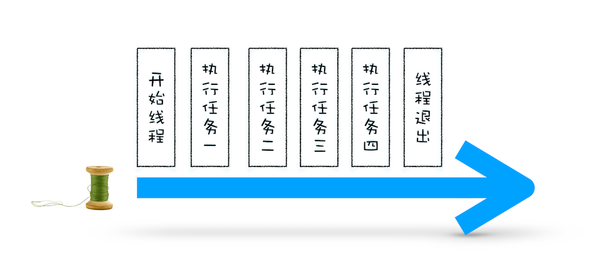
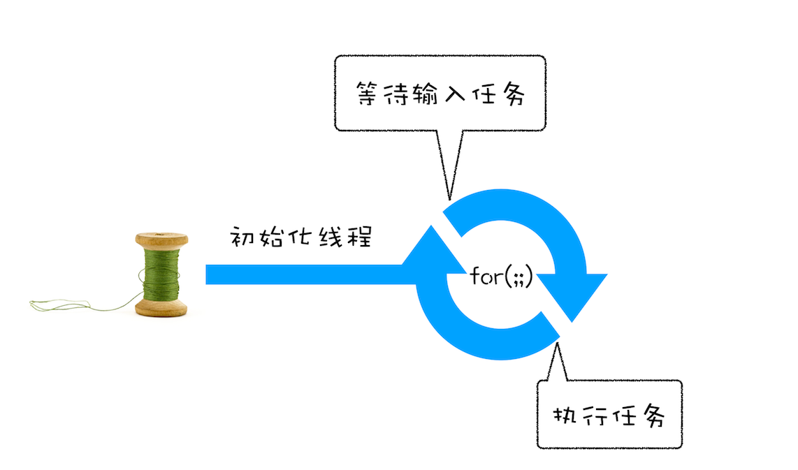
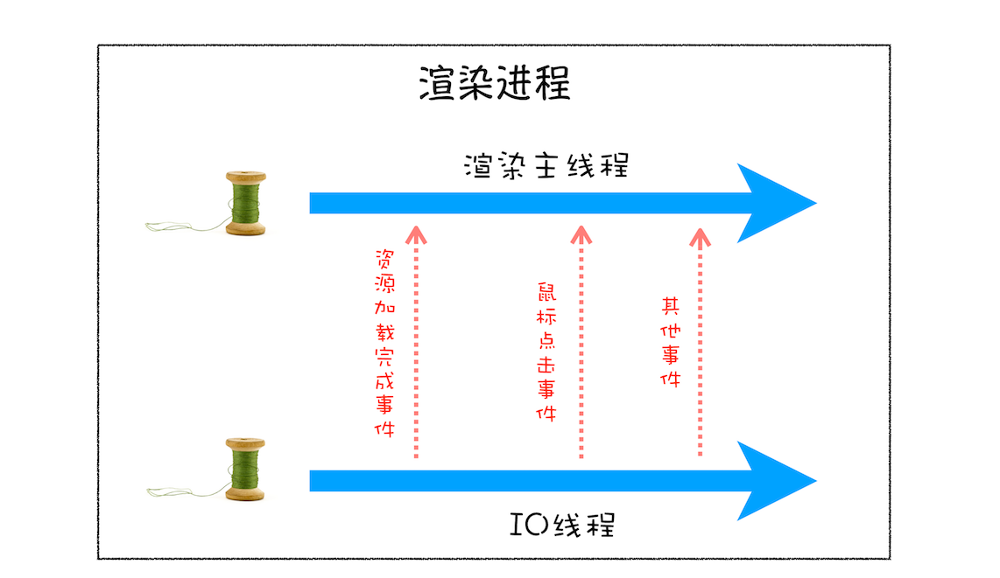
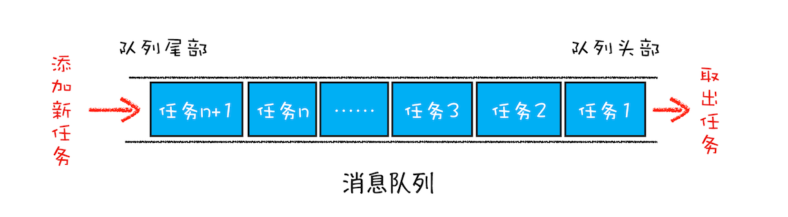
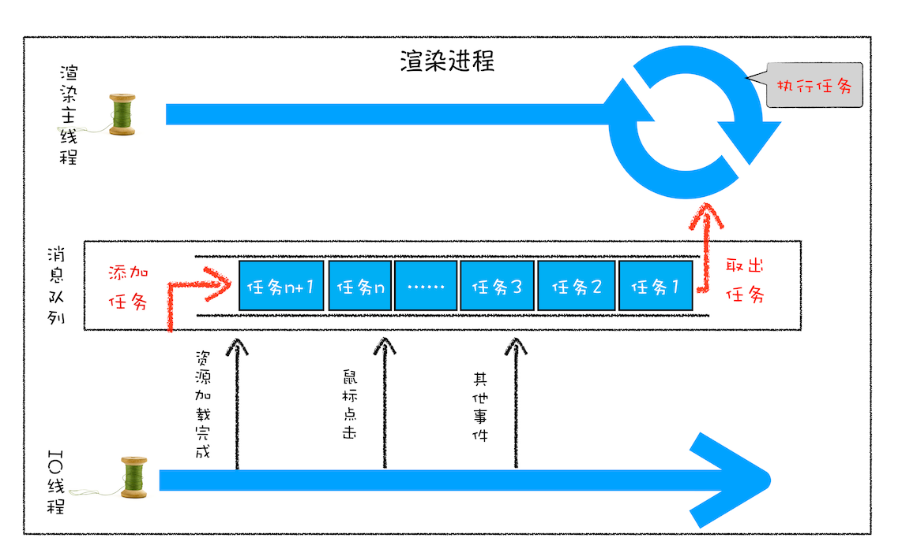
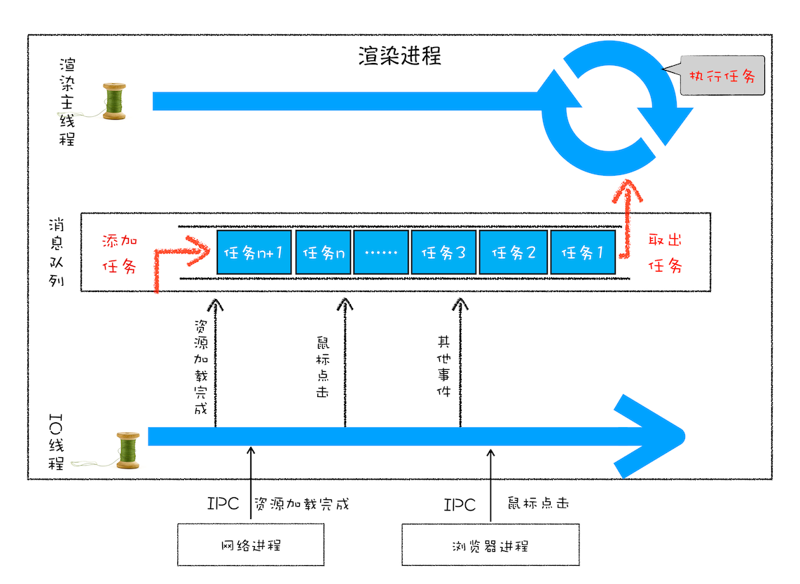
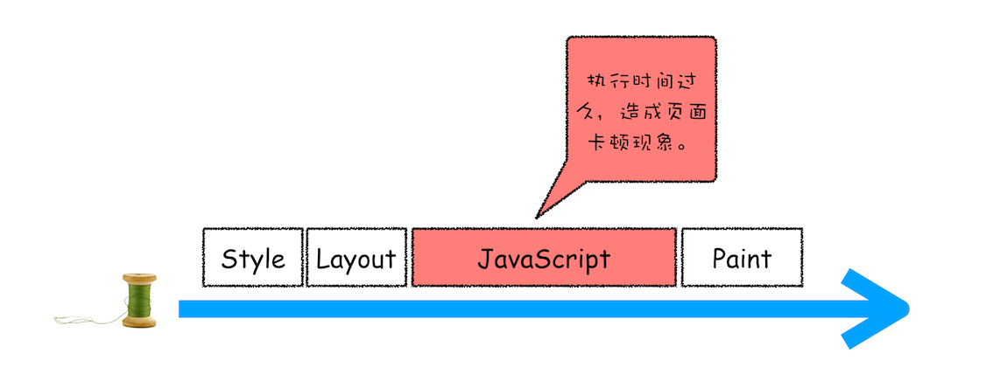
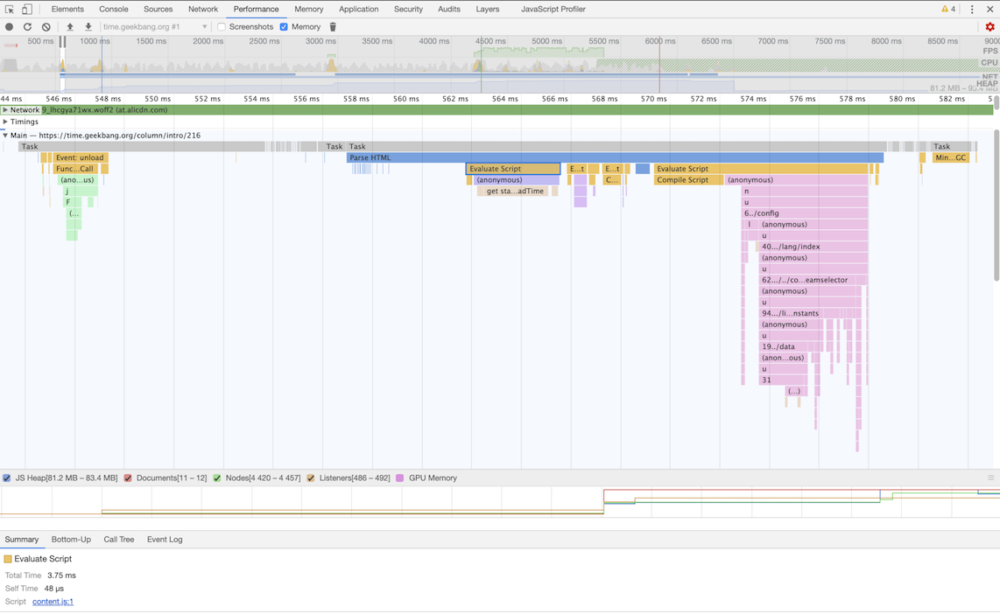

# 15 | 消息队列和事件循环：页面是怎么“活”起来的？


<audio preload="none" controls loop style="width: 100%;">
  <source src="../mp3/15-消息队列和事件循环：页面是怎么“活”起来的？.mp3" type="audio/mpeg">
  <!-- 如果浏览器不支持，则会呈现下面内容 -->
  <p>你的浏览器不支持HTML5音频，你可以<a href="../mp3/15-消息队列和事件循环：页面是怎么“活”起来的？.mp3">下载</a>这个音频文件</p>
</audio>

前面我们讲到了每个渲染进程都有一个主线程，并且主线程非常繁忙，既要处理 DOM，又要计算样式，还要处理布局，同时还需要处理 JavaScript 任务以及各种输入事件。要让这么多不同类型的任务在主线程中有条不紊地执行，这就需要一个系统来统筹调度这些任务，这个统筹调度系统就是我们今天要讲的消息队列和事件循环系统。

在写这篇文章之前，我翻阅了大量的资料，却发现没有一篇文章能把消息循环系统给讲清楚的，所以我决定用一篇文章来专门介绍页面的事件循环系统。事件循环非常底层且非常重要，学会它能让你理解页面到底是如何运行的， 所以在本篇文章中，我们会将页面的事件循环给梳理清楚、讲透彻。

为了能让你更加深刻地理解事件循环机制，我们就从最简单的场景来分析，然后带你一步步了解浏览器页面主线程是如何运作的。

需要说明的是，文章中的代码我会采用 C++ 来示范。如果你不熟悉 C++，也没有关系，这里并没有涉及到任何复杂的知识点，只要你了解 JavaScript 或 Python，你就会看懂。

## 使用单线程处理安排好的任务

我们先从最简单的场景讲起，比如有如下一系列的任务：

- 任务 1：1+2

* 任务 2：20/5

- 任务 3：7\*8

* 任务 4：打印出任务 1、任务 2、任务 3 的运算结果

现在要在一个线程中去执行这些任务，通常我们会这样编写代码：

```c++
void MainThread(){
 int num1 = 1+2; //任务1
 int num2 = 20/5; //任务2
 int num3 = 7*8; //任务3
 print("最终计算的值为:%d,%d,%d",num1,num2,num3)； //任务4
}
```

在上面的执行代码中，我们把所有任务代码按照顺序写进主线程里，等线程执行时，这些任务会按照顺序在线程中依次被执行；等所有任务执行完成之后，线程会自动退出。可以参考下图来直观地理解下其执行过程：



<div style="text-align: center; font-size: 12px; color: #999; margin-bottom: 8px;">第一版：线程的一次执行</div>

## 在线程运行过程中处理新任务

但并不是所有的任务都是在执行之前统一安排好的，大部分情况下，新的任务是在线程运行过程中产生的。比如在线程执行过程中，又接收到了一个新的任务要求计算“10+2”，那上面那种方式就无法处理这种情况了。

**要想在线程运行过程中，能接收并执行新的任务，就需要采用事件循环机制**。我们可以通过一个 for 循环语句来监听是否有新的任务，如下面的示例代码：

```c++
//GetInput
//等待用户从键盘输入一个数字，并返回该输入的数字
int GetInput(){
 int input_number = 0;
 cout<<"请输入一个数:";
 cin>>input_number;
 return input_number;
}
//主线程(Main Thread)
void MainThread(){
 for(;;){
 int first_num = GetInput()；
 int second_num = GetInput()；
 result_num = first_num + second_num;
 print("最终计算的值为:%d",result_num)；
 }
}
```

相较于第一版的线程，这一版的线程做了两点改进。

**第一点引入了循环机制**，具体实现方式是在线程语句最后添加了一个 for 循环语句，线程会一直循环执行。

**第二点是引入了事件**，可以在线程运行过程中，等待用户输入的数字，等待过程中线程处于暂停状态，一旦接收到用户输入的信息，那么线程会被激活，然后执行相加运算，最后输出结果。
通过引入事件循环机制，就可以让该线程“活”起来了，我们每次输入两个数字，都会打印出两数字相加的结果，你可以结合下图来参考下这个改进版的线程：



<div style="text-align: center; font-size: 12px; color: #999; margin-bottom: 8px;">第二版：在线程中引入事件循环</div>

## 处理其他线程发送过来的任务

上面我们改进了线程的执行方式，引入了事件循环机制，可以让其在执行过程中接受新的任务。不过在第二版的线程模型中，所有的任务都是来自于线程内部的，如果另外一个线程想让主线程执行一个任务，利用第二版的线程模型是无法做到的。

那下面我们就来看看其他线程是如何发送消息给渲染主线程的，具体形式你可以参考下图：



<div style="text-align: center; font-size: 12px; color: #999; margin-bottom: 8px;">渲染进程线程之间发送任务</div>

从上图可以看出，渲染主线程会频繁接收到来自于 IO 线程的一些任务，接收到这些任务之后，渲染进程就需要着手处理，比如接收到资源加载完成的消息后，渲染进程就要着手进行 DOM 解析了；接收到鼠标点击的消息后，渲染主线程就要开始执行相应的 JavaScript 脚本来处理该点击事件。

那么如何设计好一个线程模型，能让其能够接收其他线程发送的消息呢？

一个通用模式是使用**消息队列**。在解释如何实现之前，我们先说说什么是消息队列，可以参考下图：



从图中可以看出，**消息队列是一种数据结构，可以存放要执行的任务**。它符合队列“**先进先出**”的特点，也就是说**要添加任务的话，添加到队列的尾部；要取出任务的话，从队列头部去取**。

有了队列之后，我们就可以继续改造线程模型了，改造方案如下图所示：



<div style="text-align: center; font-size: 12px; color: #999; margin-bottom: 8px;">第三版线程模型：队列 + 循环</div>

从上图可以看出，我们的改造可以分为下面三个步骤：

1. 添加一个消息队列；

2. IO 线程中产生的新任务添加进消息队列尾部；

3. 渲染主线程会循环地从消息队列头部中读取任务，执行任务。

有了这些步骤之后，那么接下来我们就可以**按步骤使用代码来实现第三版的线程模型**。

首先，构造一个队列。当然，在本篇文章中我们不需要考虑队列实现的细节，只是构造队列的接口：

```c++
class TaskQueue{
 public:
 Task takeTask(); //取出队列头部的一个任务
 void pushTask(Task task); //添加一个任务到队列尾部
};
```

接下来，改造主线程，让主线程从队列中读取任务：

```c++
TaskQueue task_queue；
void ProcessTask();
void MainThread(){
 for(;;){
 Task task = task_queue.takeTask();
 ProcessTask(task);
 }
}
```

在上面的代码中，我们添加了一个消息队列的对象，然后在主线程的 for 循环代码块中，从消息队列中读取一个任务，然后执行该任务，主线程就这样一直循环往下执行，因此只要消息队列中有任务，主线程就会去执行。

主线程的代码就这样改造完成了。这样改造后，主线程执行的任务都全部从消息队列中获取。所以如果有其他线程想要发送任务让主线程去执行，只需要将任务添加到该消息队列中就可以了，添加任务的代码如下：

```c++
Task clickTask;
task_queue.pushTask(clickTask)
```

由于是多个线程操作同一个消息队列，所以在添加任务和取出任务时还会加上一个同步锁，这块内容你也要注意下。

## 处理其他进程发送过来的任务

通过使用消息队列，我们实现了线程之间的消息通信。在 Chrome 中，跨进程之间的任务也是频繁发生的，那么如何处理其他进程发送过来的任务？你可以参考下图：



<div style="text-align: center; font-size: 12px; color: #999; margin-bottom: 8px;">跨进程发送消息</div>

从图中可以看出，**渲染进程专门有一个 IO 线程用来接收其他进程传进来的消息**，接收到消息之后，会将这些消息组装成任务发送给渲染主线程，后续的步骤就和前面讲解的“处理其他线程发送的任务”一样了，这里就不再重复了。

## 消息队列中的任务类型

现在你知道页面主线程是如何接收外部任务的了，那接下来我们再来看看消息队列中的任务类型有哪些。你可以参考下 Chromium 的官方源码，这里面包含了很多内部消息类型，如输入事件（鼠标滚动、点击、移动）、微任务、文件读写、WebSocket、JavaScript 定时器等等。
除此之外，消息队列中还包含了很多与页面相关的事件，如 JavaScript 执行、解析 DOM、样式计算、布局计算、CSS 动画等。

以上这些事件都是在主线程中执行的，所以在编写 Web 应用时，你还需要衡量这些事件所占用的时长，并想办法解决单个任务占用主线程过久的问题。

## 如何安全退出

当页面主线程执行完成之后，又该如何保证页面主线程能够安全退出呢？Chrome 是这样解决的，确定要退出当前页面时，页面主线程会设置一个退出标志的变量，在每次执行完一个任务时，判断是否有设置退出标志。

如果设置了，那么就直接中断当前的所有任务，退出线程，你可以参考下面代码：

```c++
TaskQueue task_queue；
void ProcessTask();
bool keep_running = true;
void MainThread(){
 for(;;){
 Task task = task_queue.takeTask();
 ProcessTask(task);
 if(!keep_running) //如果设置了退出标志，那么直接退出线程循环
 break;
 }
}
```

## 页面使用单线程的缺点

上面讲述的就是页面线程的循环系统是如何工作的，那接下来，我们继续探讨页面线程的一些特征。

通过上面的介绍，你应该清楚了，页面线程所有执行的任务都来自于消息队列。消息队列是“先进先出”的属性，也就是说放入队列中的任务，需要等待前面的任务被执行完，才会被执行。鉴于这个属性，就有如下两个问题需要解决。

**第一个问题是如何处理高优先级的任务。**

比如一个典型的场景是监控 DOM 节点的变化情况（节点的插入、修改、删除等动态变化），然后根据这些变化来处理相应的业务逻辑。一个通用的设计的是，利用 JavaScript 设计一套监听接口，当变化发生时，渲染引擎同步调用这些接口，这是一个典型的观察者模式。

不过这个模式有个问题，因为 DOM 变化非常频繁，如果每次发生变化的时候，都直接调用相应的 JavaScript 接口，那么这个当前的任务执行时间会被拉长，从而导致**执行效率的下降**。

如果将这些 DOM 变化做成异步的消息事件，添加到消息队列的尾部，那么又会影响到监控的实时性，因为在添加到消息队列的过程中，可能前面就有很多任务在排队了。

这也就是说，如果 DOM 发生变化，采用同步通知的方式，会影响当前任务的**执行效率**；如果采用异步方式，又会影响到**监控的实时性**。

那该如何权衡**效率**和**实时性**呢？

针对这种情况，微任务就应用而生了，下面我们来看看微任务是如何权衡效率和实时性的。

通常我们把消息队列中的任务称为**宏任务**，每个宏任务中都包含了一个**微任务队列**，在执行宏任务的过程中，如果 DOM 有变化，那么就会将该变化添加到微任务列表中，这样就不会影响到宏任务的继续执行，因此也就解决了执行效率的问题。

等宏任务中的主要功能都直接完成之后，这时候，渲染引擎并不着急去执行下一个宏任务，而是执行当前宏任务中的微任务，因为 DOM 变化的事件都保存在这些微任务队列中，这样也就解决了实时性问题。

**第二个是如何解决单个任务执行时长过久的问题。**

因为所有的任务都是在单线程中执行的，所以每次只能执行一个任务，而其他任务就都处于等待状态。如果其中一个任务执行时间过久，那么下一个任务就要等待很长时间。可以参考下图：



<div style="text-align: center; font-size: 12px; color: #999; margin-bottom: 8px;">单个任务执行时间过久</div>

从图中你可以看到，如果在执行动画过程中，其中有个 JavaScript 任务因执行时间过久，占用了动画单帧的时间，这样会给用户制造了卡顿的感觉，这当然是极不好的用户体验。针对这种情况，JavaScript 可以通过回调功能来规避这种问题，也就是让要执行的 JavaScript 任务滞后执行。至于浏览器是如何实现回调功能的，我们在后面的章节中再详细介绍。

## 实践：浏览器页面是如何运行的

有了上面的基础知识之后，我们最后来看看浏览器的页面是如何运行的。
你可以打开开发者工具，点击“Performance”标签，选择左上角的“start porfiling and load page”来记录整个页面加载过程中的事件执行情况，如下图所示：



<div style="text-align: center; font-size: 12px; color: #999; margin-bottom: 8px;">Performance 页面</div>

从图中可以看出，我们点击展开了 Main 这个项目，其记录了主线程执行过程中的所有任务。图中灰色的就是一个个任务，每个任务下面还有子任务，其中的 Parse HTML 任务，是把 HTML 解析为 DOM 的任务。值得注意的是，在执行 Parse HTML 的时候，如果遇到 JavaScript 脚本，那么会暂停当前的 HTML 解析而去执行 JavaScript 脚本。

至于 Performance 工具，在后面的章节中我们还会详细介绍，在这里你只需要建立一个直观的印象就可以了。

## 总结

好了，今天就讲到这里，下面我来总结下今天所讲的内容。

- 如果有一些确定好的任务，可以使用一个单线程来按照顺序处理这些任务，这是第一版线程模型。

* 要在线程执行过程中接收并处理新的任务，就需要引入循环语句和事件系统，这是第二版线程模型。

- 如果要接收其他线程发送过来的任务，就需要引入消息队列，这是第三版线程模型。
- 如果其他进程想要发送任务给页面主线程，那么先通过 IPC 把任务发送给渲染进程的 IO 线程，IO 线程再把任务发送给页面主线程。

* 消息队列机制并不是太灵活，为了适应效率和实时性，引入了微任务。

基于消息队列的设计是目前使用最广的消息架构，无论是安卓还是 Chrome 都采用了类似的任务机制，所以理解了本篇文章的内容后，你再理解其他项目的任务机制也会比较轻松。

## 思考时间

今天给你留的思考题是：结合消息队列和事件循环，你认为微任务是什么？引入微任务能带来什么优势呢？

<!-- 老师，我感觉最近学起来很迷茫。我本身是非计算机专业的，转行前端将近一年，也能照搬代码去干活，但是总感觉很多东西不通，整个就是一个闭塞的状态，于是我把今年的目标定为恶补计算机基础知识，然后我就找计算机网络方面的知识，浏览器方面的，也包括您的这个专栏，并且也结合着极客时间另外一个关于http的专栏，感觉看的时候好像是懂了（其实我也知道也只是停留在我这个知识层面的“懂了”），会有那种原来平时工作时候他们说的那些概念是这样的意思，也会觉得曾经觉得很难得东西，一下子就通了的感觉，但是另一边我又发现一个问题就是看到现在，像之前专栏讲的我就忘了，平时打通的点也都没有太多印象。我有点迷茫了，我不知道是不是因为我实操太少了，平时遇到的问题太少，所以在学这些的时候会印象不深刻。难道我现在应该把更多的精力放在框架的使用，不停的写代码，而不是基础上吗？
作者回复: 首先我的观点是工作和知识体系的构建都是重要的，这两者向铺相成。
所以学习过程也是停不下来的，基础知识的学习不要间断。
工作是实践的好机会，但是在工作中你涉及到内容通常会限定在一个很窄的领域，要想通过工作拓宽自己的知识边界，那该如何突破呢？
我是这样做：
把工作中的项目看成是一个探险游戏，游戏中有你熟悉的领域，也有你不熟悉的领域，通常你所做的工作都是在你最熟悉的领域。
不过我还会做另外一件事，就是把游戏地图画出来，画地图的过程也就是全面熟悉项目架构的过程，其中可能涉及到很多你不熟悉的领域，然后你要做的事逐步拓宽这张地图！
当然人的精力是有限的，所以搭建知识架构很重要，然后再找几个领域深耕。


易儿易
2019-09-08
宏任务是开会分配的工作内容，微任务是工作过程中被临时安排的内容，可以这么比喻吗？
作者回复: 这个比喻形象


拖鞋

2019-09-16
老师请教个问题 用CSS3实现动画是不是不会影响主线程，和用JS实现动画会影响主线程，这个说法对么
作者回复: 是这样的，部分css3的动画效果是在合成线程上实现的，不需要主线程介入，所以省去了重拍和重绘的过程，这就大大提升了渲染效率。
JavaScript都是在在主线程上执行的，所以JavaScript的动画需要主线程的参与，所以效率会大打折扣！


阿桐
2019-09-22
老师，为什么说页面是单线程架构？
默认情况下每个标签页都会配套一个渲染进程，而一个渲染进程里不是有主线程、合成线程、IO线程等多个线程吗
是因为【排版引擎 blink】 和【JavaScript引擎 v8】都工作在渲染进程的主线程上并且是互斥的，基于这点说页面是单线程架构？
作者回复: 是的，他们都是在渲染进程的主线程上工作，所以同时只能执行一个。
比如v8除了在主线程上执行JavaScript代码之外，还会在主线程上执行垃圾回收，所以执行垃圾回收时停止主线程上的所有任务，我们把垃圾回收这个特性叫着全停顿。



43

052D-131
2020-03-21
早就了解宏任务和微任务的区别了，但这篇文章让我一下子明白了微任务的来龙去脉，有拨云见日之感。

mfist
2019-09-07
微任务的本质结合消息队列和事件循环我理解：当事件循环接受到消息时候，判断是否是优先级高的任务，选择插入消息队列的位置不同，进而影响消息执行的顺序。
很期待通过js回调方式解决一次执行很长js带来的页面卡顿的问题。
今日总结
为了应对渲染进程主线程繁琐的任务（DOM解析、样式计算、布局、处理js任务、各种输入事件），引入了消息队列和事件循环系统。
从任务的复杂度逐渐增加，循序渐进的分析每种场景的处理方式。
1. 单线程处理安排好的同步任务
2. 引入事件循环接受新的任务
3. 引入消息队列处理其他进程发来的任务
4. 引入宏任务和微任务解决任务优先级的问题
5. 通过Js回调功能解决单个js任务执行时间过长的问题。
作者回复: 你对微任务的理解还是有些偏差的！
每个宏任务都有一个微任务列表，在宏任务的执行过程中产生微任务会被添加到改列表中，等宏任务快执行结束之后，会执行微认为列表，所以微任务依然运行在当前宏任务的执行环境中，这个特性会导致宏任务和微任务有一些本质上的区别！我们后面再介绍，你可以重点关注下。


六个周
2019-11-25
由于是多个线程操作同一个消息队列，所以在添加任务和取出任务时还会加上一个同步锁。
请问老师，JS执行不是单线程的吗？为什么这里会说是由多个线程操作同一个队列？
作者回复: 这里提到的任务是指浏览器所以需要处理的任务！
浏览器是基于多进程+多线程架构的，所以多进程通讯（IPC）和多线程同步的问题！
因为JavaScript引擎是运行在渲染进程的主线程上的，所以我们说JavaScript是单线程执行的！


鹿一君
2020-06-01
这是目前买的几个课里面讲的最好和最认真的
共 2 条评论

25

蚂蚁内推+v
2019-12-20
老师，请问浏览器的事件循环和js event loop是一回事吗？
作者回复: JavaScript没有自己循环系统，它依赖的就是浏览器的循环系统，也就是渲染进程提供的循环系统！
所以可以说是一回事


L-Chris
2020-05-14
事件循环的本质是for循环，循环不会一直迭代导致主线程卡主吗？
作者回复: 不会，实际过程中采用系统级中断机制，也就是有事件时，线程才会被激活，没事件时，线程就会被挂起


Rapheal
2019-09-08
老师，可以请问下：渲染进程的主线程和V8执行机主线程是同一个线程吗？一个渲染进程有几个线程，分别有啥作用？
作者回复: 主要有IO线程，用开负责和其它进程IPC通信的，然后主线程主要跑页面的！
V8是在主线程上执行的，因为dom操作啥的都是在主线程上执行的。
当然还有其它很多辅助线程，比如预解析DOM的线程，垃圾回收也有一些辅助线程。


趁你还年轻233
2020-06-13
宏任务是开会时PM定好的需求，微任务是开发过程中PM新加的加急需求。
假设一场迭代会议定下来3个宏任务，在开发第2个宏任务到60%进度的时候，PM新提了一些小的微任务。执行时间可以表示为：第2个宏任务完成之后---[执行新加入的微任务]---第3个宏任务开始之前。


11

花儿与少年

2019-09-08
宿主发起的任务是宏任务 如点击事件，settimeout 进消息队列；js引擎发起的任务是微任务如promise

GY
2019-09-25
非常疑惑，几个问题希望能解答一下
1.我在查阅一些资料，是这么描述的，渲染进程主要有GUI渲染渲染线程，JS引擎线程，事件触发线程，定时触发器线程。而本文一直在讲主线程，那么主线程到底是什么？是独立于这几个线程吗，还是这几个线程中的某一个
2.您在回答提问中，有提到了IO线程，以及辅助线程，这些又是什么？我在网上查不到比较好的回答
3.比较好奇window.onload的是如何执行的，js引擎执行到这段代码时，不会立即执行，那么会将这段代码怎么处理，什么时候执行，当他被触发时，是作为宏任务进入消息队列还是微任务进入微任务队列，还是其他的方式？
4.我该如何理解任务，因为我在测试一个HTML文件中出现多个script标签且都包含一段setTimeout，前面的script中的setTimeout函数，有时会先于后面的script块执行，那么我应该怎么理解这个过程，他并不是按照 第一个script标签中代码编译--执行--setTimeout进入消息队列--微任务执行--第二个script标签编译--执行--setTimeout进入消息队列--微任务执行.....--从消息队列取出第1个script标签中的setTImeout执行--从消息队列取出第2个script标签中的setTImeout执行
展开

得闲读书
2019-09-07
老师，所以，事件循环其实是监听执行任务的循环机制吗？而每一个执行任务都存档在消息队列里面，这些统称为宏任务，微任务是执行宏任务中遇到的异步操作吧，就是异步代码，如promise,settimeout任务。执行宏任务遇到异步任务先将其放入微任务列表，等该宏任务执行一遍后再执行该宏任务的微任务列表，我这样理解对吗？
作者回复: 第一个理解没错，事件循环系统就是在监听并执行消息队列中的任务！
第二个理解也没问题，不过promise触发的微任务，settimeout触发的是宏任务！


阿段
2019-09-19
每一个宏任务都有一个微任务队列？还是整个任务队列有一个微任务队列？
作者回复: 每个宏任务都有微任务队列

共 3 条评论

6

斯塔克
2021-09-11
面试官：讲一下浏览器的事件循环
事件其实就是一系列的任务，比如网络进程负责调度资源加载、渲染进程负责调度DOM解析、styleSheet生成、布局计算等，但由于浏览器只有一个主线程，而且在线程运行过程中可能产生新的任务，这时候就需要一种机制，能够不断的加入任务和执行任务。这就是事件循环系统。而加入任务的地方就是消息队列
之所以叫消息队列，我们分别从消息和队列来理解。
消息：每个渲染进程都有一个IO线程用来接受其他进程（比如网络进程等）传来的消息，这些消息便是未来（这个未来可以是一个很短的瞬间，如果当前任务不多、计算量不多）要执行的任务。
队列：这是一种数据结构，任务的调度符合队列‘先进先出’的特点，先进去的任务，拥有优先执行权，后进去的任务要等前面的任务执行完成后（完成 = 当前循环宏任务 + 对应微任务 2种任务都清空）。

朱维娜🍍
2019-09-11
在渲染进程里面，除了I/O线程，其他线程也会往消息队列中添加任务，是吗？
作者回复: 有啊，比如渲染过程就有合成线程，解析DOM过程中还有预解析线程，这些现场都会和主线程有交互的


阿桐
2019-09-07
老师，专栏中有段内容我看了几遍还是似懂非懂，您方便举个例子再给我说说吗？
“比如一个典型的场景是监控 DOM 节点的变化情况（节点的插入、修改、删除等动态变化），然后根据这些变化来处理相应的业务逻辑。一个通用的设计的是，利用 JavaScript 设计一套监听接口，当变化发生时，渲染引擎同步调用这些接口，这是一个典型的观察者模式。
不过这个模式有个问题，因为 DOM 变化非常频繁，如果每次发生变化的时候，都直接调用相应的 JavaScript 接口，那么这个当前的任务执行时间会被拉长，从而导致执行效率的下降。”
作者回复: 这个我会在微任务那节详细分析 -->
