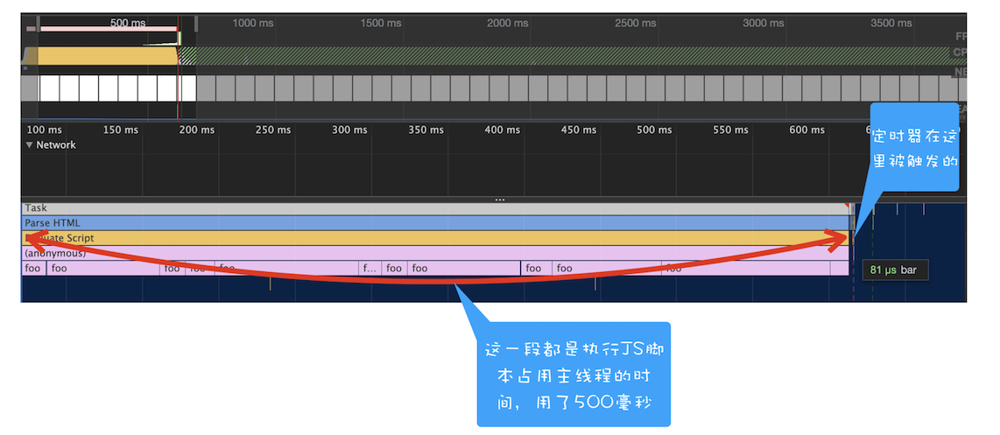
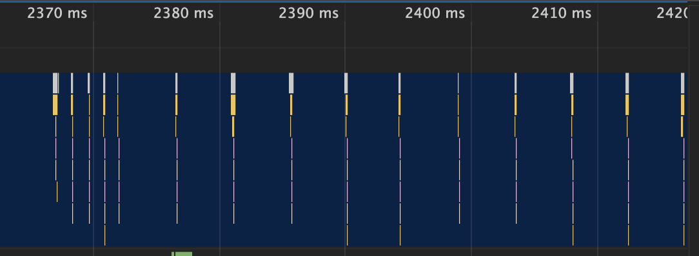

# 16 | WebAPI：setTimeout 是如何实现的？


<audio preload="none" controls loop style="width: 100%;">
  <source src="../mp3/16-WebAPI：setTimeout是如何实现的？.mp3" type="audio/mpeg">
  <!-- 如果浏览器不支持，则会呈现下面内容 -->
  <p>你的浏览器不支持HTML5音频，你可以<a href="../mp3/16-WebAPI：setTimeout是如何实现的？.mp3">下载</a>这个音频文件</p>
</audio>

在[上一篇文章](15%20|%20消息队列和事件循环：页面是怎么“活”起来的？.md)中我们介绍了页面中的事件和消息队列，知道了**浏览器页面是由消息队列和事件循环系统来驱动的**。

那在接下来的两篇文章中，我会通过 **setTimeout** 和 **XMLHttpRequest** 这两个 WebAPI 来介绍事件循环的应用。这两个 WebAPI 是两种不同类型的应用，比较典型，并且在 JavaScript 中的使用频率非常高。你可能觉得它们太简单、太基础，但有时候恰恰是基础简单的东西才最重要，了解它们是如何工作的会有助于你写出更加高效的前端代码。

本篇文章主要介绍的是 **setTimeout**。其实说起 setTimeout 方法，从事开发的同学想必都不会陌生，它就是一个**定时器，用来指定某个函数在多少毫秒之后执行**。它会返回一个整数，表示定时器的编号，同时你还可以通过该编号来取消这个定时器。下面的示例代码就演示了定时器最基础的使用方式：

```js
function showName() {
  console.log("极客时间");
}
var timerID = setTimeout(showName, 200);
```

执行上述代码，输出的结果也很明显，通过 setTimeout 指定在 200 毫秒之后调用 showName 函数，并输出“极客时间”四个字。

简单了解了 setTimeout 的使用方法后，那接下来我们就来看看浏览器是如何实现定时器的，然后再介绍下定时器在使用过程中的一些注意事项。

## 浏览器怎么实现 setTimeout

要了解定时器的工作原理，就得先来回顾下之前讲的事件循环系统，我们知道渲染进程中所有运行在主线程上的任务都需要先添加到消息队列，然后事件循环系统再按照顺序执行消息队列中的任务。下面我们来看看那些典型的事件：

- 当接收到 HTML 文档数据，渲染引擎就会将“解析 DOM”事件添加到消息队列中，

* 当用户改变了 Web 页面的窗口大小，渲染引擎就会将“重新布局”的事件添加到消息队列中。

- 当触发了 JavaScript 引擎垃圾回收机制，渲染引擎会将“垃圾回收”任务添加到消息队列中。

* 同样，如果要执行一段异步 JavaScript 代码，也是需要将执行任务添加到消息队列中。

以上列举的只是一小部分事件，这些事件被添加到消息队列之后，事件循环系统就会按照消息队列中的顺序来执行事件。

所以说要执行一段异步任务，需要先将任务添加到消息队列中。不过通过定时器设置回调函数有点特别，它们需要在指定的时间间隔内被调用，但消息队列中的任务是按照顺序执行的，所以为了保证回调函数能在指定时间内执行，你不能将定时器的回调函数直接添加到消息队列中。

那么该怎么设计才能让定时器设置的回调事件在规定时间内被执行呢？你也可以思考下，如果让你在消息循环系统的基础之上加上定时器的功能，你会如何设计？

在 Chrome 中除了正常使用的消息队列之外，还有另外一个消息队列，这个队列中维护了需要延迟执行的任务列表，包括了定时器和 Chromium 内部一些需要延迟执行的任务。所以当通过 JavaScript 创建一个定时器时，渲染进程会将该定时器的回调任务添加到延迟队列中。

如果感兴趣，你可以参考 Chromium 中关于队列部分的源码。

源码中延迟执行队列的定义如下所示：

```md
DelayedIncomingQueue delayed_incoming_queue;
```

当通过 JavaScript 调用 setTimeout 设置回调函数的时候，渲染进程将会创建一个回调任务，包含了回调函数 showName、当前发起时间、延迟执行时间，其模拟代码如下所示：

```c++
struct DelayTask{
 int64 id；
 CallBackFunction cbf;
 int start_time;
 int delay_time;
};
DelayTask timerTask;
timerTask.cbf = showName;
timerTask.start_time = getCurrentTime(); //获取当前时间
timerTask.delay_time = 200;//设置延迟执行时间
```

创建好回调任务之后，再将该任务添加到延迟执行队列中，代码如下所示：

```
delayed_incoming_queue.push(timerTask)；
```

现在通过定时器发起的任务就被保存到延迟队列中了，那接下来我们再来看看消息循环系统是怎么触发延迟队列的。
我们可以来完善上一篇文章中消息循环的代码，在其中加入执行延迟队列的代码，如下所示：

```c++
void ProcessTimerTask(){
 //从delayed_incoming_queue中取出已经到期的定时器任务
 //依次执行这些任务
}
TaskQueue task_queue；
void ProcessTask();
bool keep_running = true;
void MainTherad(){
 for(;;){
 //执行消息队列中的任务
 Task task = task_queue.takeTask();
 ProcessTask(task);

 //执行延迟队列中的任务
 ProcessDelayTask()
 if(!keep_running) //如果设置了退出标志，那么直接退出线程循环
 break;
 }
}
```

从上面代码可以看出来，我们添加了一个 **ProcessDelayTask 函数**，该函数是专门用来处理延迟执行任务的。这里我们要重点关注它的执行时机，在上段代码中，处理完消息队列中的一个任务之后，就开始执行 ProcessDelayTask 函数。

ProcessDelayTask 函数会根据发起时间和延迟时间计算出到期的任务，然后依次执行这些到期的任务。等到期的任务执行完成之后，再继续下一个循环过程。通过这样的方式，一个完整的定时器就实现了。

设置一个定时器，JavaScript 引擎会返回一个定时器的 ID。那通常情况下，当一个定时器的任务还没有被执行的时候，也是可以取消的，具体方法是调用 clearTimeout 函数，并传入需要取消的定时器的 ID。如下面代码所示：

```js
clearTimeout(timer_id);
```

其实浏览器内部实现取消定时器的操作也是非常简单的，就是直接从 delayed_incoming_queue 延迟队列中，通过 ID 查找到对应的任务，然后再将其从队列中删除掉就可以了。

## 使用 setTimeout 的一些注意事项

现在你应该知道在浏览器内部定时器是如何工作的了。不过在使用定时器的过程中，如果你不了解定时器的一些细节，那么很有可能掉进定时器的一些陷阱里。所以接下来，我们就来讲解一下在使用定时器过程中存在的那些陷阱。

### 1. 如果当前任务执行时间过久，会影响定时器任务的执行

在使用 setTimeout 的时候，有很多因素会导致回调函数执行比设定的预期值要久，其中一个就是当前任务执行时间过久从而导致定时器设置的任务被延后执行。我们先看下面这段代码：

```js
function bar() {
  console.log("bar");
}
function foo() {
  setTimeout(bar, 0);
  for (let i = 0; i < 5000; i++) {
    let i = 5 + 8 + 8 + 8;
    console.log(i);
  }
}
foo();
```

这段代码中，在执行 foo 函数的时候使用 setTimeout 设置了一个 0 延时的回调任务，设置好回调任务后，foo 函数会继续执行 5000 次 for 循环。

通过 setTimeout 设置的回调任务被放入了消息队列中并且等待下一次执行，这里并不是立即执行的；要执行消息队列中的下个任务，需要等待当前的任务执行完成，由于当前这段代码要执行 5000 次的 for 循环，所以当前这个任务的执行时间会比较久一点。这势必会影响到下个任务的执行时间。

你也可以打开 Performance 来看看其执行过程，如下图所示：



<div style="text-align: center; font-size: 12px; color: #999; margin-bottom: 8px;">长任务导致定时器被延后执行</div>

从图中可以看到，执行 foo 函数所消耗的时长是 500 毫秒，这也就意味着通过 setTimeout 设置的任务会被推迟到 500 毫秒以后再去执行，而设置 setTimeout 的回调延迟时间是 0。

### 2. 如果 setTimeout 存在嵌套调用，那么系统会设置最短时间间隔为 4 毫秒

也就是说在定时器函数里面嵌套调用定时器，也会延长定时器的执行时间，可以先看下面的这段代码：

```js
function cb() {
  setTimeout(cb, 0);
}
setTimeout(cb, 0);
```

上述这段代码你有没有看出存在什么问题？
你还是可以通过 Performance 来记录下这段代码的执行过程，如下图所示：



<div style="text-align: center; font-size: 12px; color: #999; margin-bottom: 8px;">循环嵌套调用 setTimeout</div>

上图中的竖线就是定时器的函数回调过程，从图中可以看出，前面五次调用的时间间隔比较小，嵌套调用超过五次以上，后面每次的调用最小时间间隔是 4 毫秒。之所以出现这样的情况，是因为在 Chrome 中，定时器被嵌套调用 5 次以上，系统会判断该函数方法被阻塞了，如果定时器的调用时间间隔小于 4 毫秒，那么浏览器会将每次调用的时间间隔设置为 4 毫秒。下面是 Chromium 实现 4 毫秒延迟的代码，你可以看下：

```c++
static const int kMaxTimerNestingLevel = 5;
// Chromium uses a minimum timer interval of 4ms. We'd like to go
// lower; however, there are poorly coded websites out there which do
// create CPU-spinning loops. Using 4ms prevents the CPU from
// spinning too busily and provides a balance between CPU spinning and
// the smallest possible interval timer.
static constexpr base::TimeDelta kMinimumInterval = base::TimeDelta::FromMilliseconds(4);
```

```c++
base::TimeDelta interval_milliseconds =
 std::max(base::TimeDelta::FromMilliseconds(1), interval);
 if (interval_milliseconds < kMinimumInterval &&
 nesting_level_ >= kMaxTimerNestingLevel)
 interval_milliseconds = kMinimumInterval;
 if (single_shot)
 StartOneShot(interval_milliseconds, FROM_HERE);
 else
 StartRepeating(interval_milliseconds, FROM_HERE);
```

所以，一些实时性较高的需求就不太适合使用 setTimeout 了，比如你用 setTimeout 来实现 JavaScript 动画就不是一个很好的主意。

### 3. 未激活的页面，setTimeout 执行最小间隔是 1000 毫秒

除了前面的 4 毫秒延迟，还有一个很容易被忽略的地方，那就是未被激活的页面中定时器最小值大于 1000 毫秒，也就是说，如果标签不是当前的激活标签，那么定时器最小的时间间隔是 1000 毫秒，目的是为了优化后台页面的加载损耗以及降低耗电量。这一点你在使用定时器的时候要注意。

### 4. 延时执行时间有最大值

除了要了解定时器的回调函数时间比实际设定值要延后之外，还有一点需要注意下，那就是 Chrome、Safari、Firefox 都是以 32 个 bit 来存储延时值的，32bit 最大只能存放的数字是 2147483647 毫秒，这就意味着，如果 setTimeout 设置的延迟值大于 2147483647 毫秒（大约 24.8 天）时就会溢出，那么相当于延时值被设置为 0 了，这导致定时器会被立即执行。你可以运行下面这段代码：

```js
function showName() {
  console.log("极客时间");
}
var timerID = setTimeout(showName, 2147483648); //会被理解调用执行
```

运行后可以看到，这段代码是立即被执行的。但如果将延时值修改为小于 2147483647 毫秒的某个值，那么执行时就没有问题了。

### 5. 使用 setTimeout 设置的回调函数中的 this 不符合直觉

如果被 setTimeout 推迟执行的回调函数是某个对象的方法，那么该方法中的 this 关键字将指向全局环境，而不是定义时所在的那个对象。这点在前面介绍 this 的时候也提过，你可以看下面这段代码的执行结果：

```js
var name = 1;
var MyObj = {
  name: 2,
  showName: function () {
    console.log(this.name);
  },
};
setTimeout(MyObj.showName, 1000);
```

这里输出的是 1，因为这段代码在编译的时候，执行上下文中的 this 会被设置为全局 window，如果是严格模式，会被设置为 undefined。

那么该怎么解决这个问题呢？通常可以使用下面这两种方法。

第一种是将 MyObj.showName 放在匿名函数中执行，如下所示：

```js
//箭头函数
setTimeout(() => {
  MyObj.showName();
}, 1000);
//或者function函数
setTimeout(function () {
  MyObj.showName();
}, 1000);
```

第二种是使用 bind 方法，将 showName 绑定在 MyObj 上面，代码如下所示：

```js
setTimeout(MyObj.showName.bind(MyObj), 1000);
```

## 总结

好了，今天我们就介绍到这里，下面我来总结下今天的内容。

- 首先，为了支持定时器的实现，浏览器增加了延时队列。

* 其次，由于消息队列排队和一些系统级别的限制，通过 setTimeout 设置的回调任务并非总是可以实时地被执行，这样就不能满足一些实时性要求较高的需求了。

- 最后，在定时器中使用过程中，还存在一些陷阱，需要你多加注意。

通过分析和讲解，你会发现函数 setTimeout 在时效性上面有很多先天的不足，所以对于一些时间精度要求比较高的需求，应该有针对性地采取一些其他的方案。

## 思考时间

今天我们介绍了 setTimeout，相信你现在也知道它是怎么工作的了，不过由于使用 setTimeout 设置的回调任务实时性并不是太好，所以很多场景并不适合使用 setTimeout。比如你要使用 JavaScript 来实现动画效果，函数 requestAnimationFrame 就是个很好的选择。

那么今天留给你的作业是：你需要网上搜索了解下 requestAnimationFrame 的工作机制，并对比 setTimeout，然后分析出 requestAnimationFrame 实现的动画效果比 setTimeout 好的原因。

<!--
使用 requestAnimationFrame 不需要设置具体的时间，由系统来决定回调函数的执行时间，requestAnimationFrame 里面的回调函数是在页面刷新之前执行，它跟着屏幕的刷新频率走，保证每个刷新间隔只执行一次，内如果页面未激活的话，requestAnimationFrame 也会停止渲染，这样既可以保证页面的流畅性，又能节省主线程执行函数的开销

Angus
2019-09-10
我没有太理解这个异步延迟队列，既然是队列，但好像完全不符合先进先出的特点。在每次执行完任务队列中的一个任务之后都会去执行那些已经到期的延迟任务，这些延迟的任务具体是如何取出的呢。
作者回复: 我文章说是队列，为了和消息队列统一起来，不然表述起来有点拗口。
其实是一个hashmap结构，等到执行这个结构的时候，会计算hashmap中的每个任务是否到期了，到期了就去执行，直到所有到期的任务都执行结束，才会进入下一轮循环！


mfist
2019-09-11
requestAnimationFrame 提供一个原生的API去执行动画的效果，它会在一帧（一般是16ms）间隔内根据选择浏览器情况去执行相关动作。
setTimeout是在特定的时间间隔去执行任务，不到时间间隔不会去执行，这样浏览器就没有办法去自动优化。
今日得到
浏览器的页面是通过消息队列和事件循环系统来驱动的。settimeout的函数会被加入到延迟消息队列中，
等到执行完Task任务之后就会执行延迟队列中的任务。然后分析几种场景下面的setimeout的执行方式。
1. 如果执行一个很耗时的任务，会影响延迟消息队列中任务的执行
2. 存在嵌套带调用时候，系统会设置最短时间间隔为4s（超过5层）
3. 未激活的页面，setTimeout最小时间间隔为1000ms
4. 延时执行时间的最大值2147483647，溢出会导致定时器立即执行
5. setTimeout设置回调函数this会是回调时候对应的this对象，可以使用箭头函数解决
作者回复: 回答的很棒，raf是按照系统刷新的节奏调用的！


moss
2019-09-18
这一节学习到了不少setTimeout的知识。不过关于消息队列我有不同的理解。
1. 关于任务优先级。whatwg标准里，“An event loop has one or more task queues”。消息队列其实不算是队列，因为有很多个task queue。“a task queue is a set of tasks”。每一个task queue才是一个队列。而对于每一个task queue里的task，其task source是一致的，或者说不同的task source会被推入到不同的task queue。就是规范里说的“every task source must be associated with a specific task queue”。而task sources都有哪些呢？比如DOM操作，UI事件，网络事件等。这个setTimout应该也算是一种task source吧？会放到专门的队列里。上一轮事件循环结束后，会先选择一个高优先级的task queue，然后取出task queue的第一个task，也因此而有了事件的优先级，老师将的延时队列我有点不太知道怎么融入我现有的知识体系。
2. “重新布局”是task吗？
老师说“重新布局”的事件会被放到消息队列。我的理解是task -> microtask -> update the rendering。当然不是每次循环都走渲染过程，因为每次循环都特别快不可能每次都走一次渲染，浏览器会遵循17ms一桢的原则走一次update the rendering，其中rAF也在此阶段执行，也是老师题目里rAF更流畅的原因。而重新布局也是在update the rendering阶段执行的，resize和onscroll都是在update the rendering阶段。标准里在update the rendering阶段，会有“run the resize steps”，“run the scroll steps”，这也是为啥scrolling自带节流效果最多17ms触发一次回调的原因，所以我认为连续事件（resize，scroll）既然都不是task -> microtask -> update the rendering里的task，而是update the rendering阶段，应该不会推送到某一个task queue才对。
作者回复: 第一个问题我在18节也回答过了，一个是标准，一个是实现，标准定义了很多队列，而浏览器只实现了一个普通队列和一个延时队列！
第二个问题，你说的那个update the randering就是说rAF吧？rAF是用户调用的，重新布局是渲染引擎自动安排的任务，必然要放到消息队列中！
滚动一般默认都是在合成线程里面完成的，这种都没用到主线程

共 8 条评论

18

l1shu
2019-10-22
为什么有些文章说渲染进程中有一个定时器线程用来计时的 到时间后会把回调函数塞到消息队列 而没有提到延迟队列这个说法 求老师解答

Helios
2019-09-11
请问老师不是说settimeout属于宏任务不，不应该属于在上节课讲的消息队列中么
怎么这次有跑到延时队列中了呢，这两个队列有什么关系呢，延时队列也分宏任务和微任务？

吴海燕
2020-05-22
老师有空的时候能否画一个包含延时队列和微任务，宏任务，消息队列关系运行图

淡
2019-09-17
老师，你好。
请问微任务的执行是在延迟队列任务执行之前吗？
作者回复: 没有之前之后啊，延时队列里面是宏任务，普通的消息队列里面也是宏任务，微任务是在宏任务快要执行结束之前执行的！

共 6 条评论

10

Zzzrd
2019-12-19
看完还是很迷惑：
1. setTimeout是宏任务，宏任务应该放在消息队列中，文中说是放在延迟队列中，为什么？延迟队列和消息队列的区别是什么？
2. 延迟队列的任务是在当前宏任务执行完之后执行，微任务队列是在当前宏任务将要结束时执行对吗？
作者回复: 延迟队列也是宏任务，实际上blink维护了很多不同优先级的队列，这些队列里面都是宏任务
微任务是在宏任务执行过程中的某个时间点执行的，通常是在宏任务快要结束的时候执行


Djan Unchained
2019-10-25
requestAnimationFrame 也是在主线程上执行吗？如果当前任务执行时间过久，也会导致 requestAnimationFrame 被延后执行吗？
作者回复: 是的，raf的回调函数也是在主线程上执行的，如果其中的一个回调函数执行过久，会影响到其他的任务的


Wlt
2019-10-28
老师，您好，延迟队列和消息队列是什么关系，怎么配合工作的？
作者回复: 延迟消息队列主要是放一些定时执行的任务，如JavaScript设置定时器的回调，还有浏览器内部的一些定时回调任务！ 这类任务需要等到指定时间间隔之后才会被执行！
而正常的消息队列中的任务只会按照顺序执行，执行完上个任务接着执行下个任务，不需要关系时间间隔！


李懂
2019-09-10
1.执行延迟队列的任务，是一次循环只取出一个，还是检查只要时间到了，就执行？
2.微任务是在宏任务里的，是执行完一个宏任务，就去执行宏任务里面的微任务？
作者回复: 比如有五个定时的任务到期了,那么会分别把这个五个定时器的任务执行掉，再开始下次循环过程！
chromium中，当执行一个宏任务时，才会创建微任务队列，等遇到checkpoint时就会执行微任务！

共 3 条评论

8

4!!
2020-01-31
传入requestAnimationFrame的回调并不会添加到消息队列或延迟队列中，传入requestAnimationFrame的回调会在页面下次重绘之前被调用，可以保证动画更实时准确。与setTimeout相比还有几个优点：1.当页面不可见或未被激活时，requestAnimationFrame的回调不会被调用；2.requestAnimationFrame的循环调用会有个自动节流处理，使得动画足够流畅，而函数不被过于频繁调用。

穿秋裤的男孩
2020-04-16
评论好多说延迟队列得，其实就是一个定时器线程吧，定时器线程负责计时，到点了就把回掉push到消息队列中。

Cris
2020-01-03
老师，您这里未激活的页面是什么意思？
作者回复: 就是后台页面，比如你在浏览器中打开了多个标签，除了你当前操作的页面，其他的标签页都是后台页面


晓东
2019-12-18
老师，对processDelayTask这块有个疑惑。这里会把所有的到期任务都执行完才会开始下一个while循环吗？
作者回复: 是的



3

纪年
2019-11-23
如果 setTimeout 设置的延迟值大于 2147483647 毫秒时就会溢出，这导致定时器会被立即执行。
问题：这里的立即执行其实是不是相当于setTimeout（fun, 0）的意思？
作者回复: 是的，说立即执行的确有点不准确哈，这个我来优化下说法！


follaw
2019-11-14
系统如何筛选出到期的任务，如果有10000个呢，是循环一万次？这个系统内部怎么处理的呢？
作者回复: 每次执行完一个任务后，都会计算下是否有定时器的任务到期


以武会友-刘华强
2020-04-14
怎么优化setTimeout 时间值不准的问题呢？

-_-|||
2019-12-06
'32bit 最大只能存放的数字是 2147483647 毫秒',最大能存放的数字不是2^32-1吗？4294967295，为什么是 2147483647 毫秒
作者回复: 因为要一位表示正负数啊 -->
