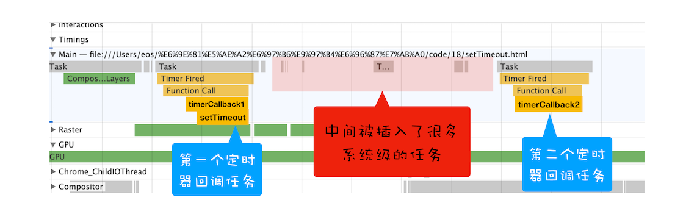
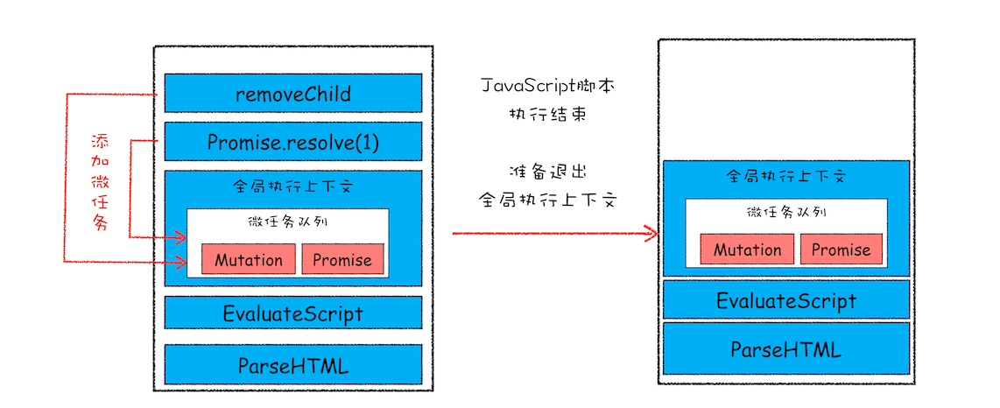
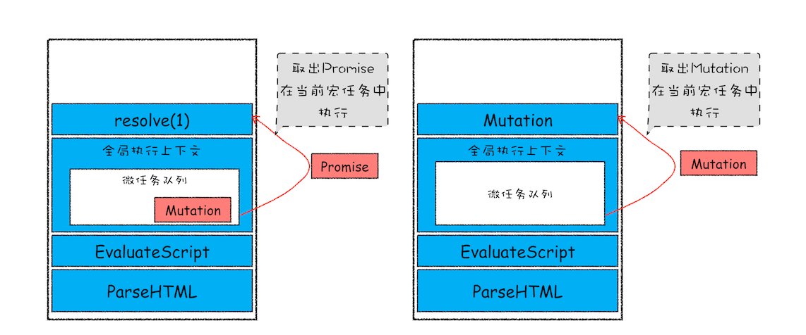

# 18 | 宏任务和微任务：不是所有任务都是一个待遇


<audio preload="none" controls loop style="width: 100%;">
  <source src="../mp3/18-宏任务和微任务：不是所有任务都是一个待遇.mp3" type="audio/mpeg">
  <!-- 如果浏览器不支持，则会呈现下面内容 -->
  <p>你的浏览器不支持HTML5音频，你可以<a href="../mp3/18-宏任务和微任务：不是所有任务都是一个待遇.mp3">下载</a>这个音频文件</p>
</audio>

在前面几篇文章中，我们介绍了消息队列，并结合消息队列介绍了两种典型的 WebAPI——**setTimeout** 和 **XMLHttpRequest**，通过这两个 WebAPI 我们搞清楚了浏览器的消息循环系统是怎么工作的。不过随着浏览器的应用领域越来越广泛，消息队列中这种粗时间颗粒度的任务已经不能胜任部分领域的需求，所以又出现了一种新的技术——**微任务。微任务可以在实时性和效率之间做一个有效的权衡**。

从目前的情况来看，微任务已经被广泛地应用，基于微任务的技术有 MutationObserver、Promise 以及以 Promise 为基础开发出来的很多其他的技术。所以微任务的重要性也与日俱增，了解其底层的工作原理对于你读懂别人的代码，以及写出更高效、更具现代的代码有着决定性的作用。

有微任务，也就有宏任务，那这二者到底有什么区别？它们又是如何相互取长补短的？

## 宏任务

前面我们已经介绍过了，页面中的大部分任务都是在主线程上执行的，这些任务包括了：

- 渲染事件（如解析 DOM、计算布局、绘制）；

* 用户交互事件（如鼠标点击、滚动页面、放大缩小等）；

- JavaScript 脚本执行事件；

* 网络请求完成、文件读写完成事件。

为了协调这些任务有条不紊地在主线程上执行，页面进程引入了消息队列和事件循环机制，渲染进程内部会维护多个消息队列，比如延迟执行队列和普通的消息队列。然后主线程采用一个 for 循环，不断地从这些任务队列中取出任务并执行任务。我们把这些消息队列中的任务称为**宏任务**。

消息队列中的任务是通过事件循环系统来执行的，这里我们可以看看在 WHATWG 规范中是怎么定义事件循环机制的。

由于规范需要支持语义上的完备性，所以通常写得都会比较啰嗦，这里我就大致总结了下 WHATWG 规范定义的大致流程：

- 先从多个消息队列中选出一个最老的任务，这个任务称为 oldestTask；

* 然后循环系统记录任务开始执行的时间，并把这个 oldestTask 设置为当前正在执行的任务；

- 当任务执行完成之后，删除当前正在执行的任务，并从对应的消息队列中删除掉这个 oldestTask；

* 最后统计执行完成的时长等信息。

以上就是消息队列中宏任务的执行过程，通过前面的学习，相信你也很熟悉这套执行流程了。

宏任务可以满足我们大部分的日常需求，不过如果有对时间精度要求较高的需求，宏任务就难以胜任了，下面我们就来分析下为什么宏任务难以满足对时间精度要求较高的任务。

前面我们说过，页面的渲染事件、各种 IO 的完成事件、执行 JavaScript 脚本的事件、用户交互的事件等都随时有可能被添加到消息队列中，而且添加事件是由系统操作的，JavaScript 代码不能准确掌控任务要添加到队列中的位置，控制不了任务在消息队列中的位置，所以很难控制开始执行任务的时间。为了直观理解，你可以看下面这段代码：

```html
<!DOCTYPE html>
<html>
  <body>
    <div id="demo">
      <ol>
        <li>test</li>
      </ol>
    </div>
  </body>
  <script type="text/javascript">
    function timerCallback2() {
      console.log(2);
    }
    function timerCallback() {
      console.log(1);
      setTimeout(timerCallback2, 0);
    }
    setTimeout(timerCallback, 0);
  </script>
</html>
```

在这段代码中，我的目的是想通过 setTimeout 来设置两个回调任务，并让它们按照前后顺序来执行，中间也不要再插入其他的任务，因为如果这两个任务的中间插入了其他的任务，就很有可能会影响到第二个定时器的执行时间了。

但实际情况是我们不能控制的，比如在你调用 setTimeout 来设置回调任务的间隙，消息队列中就有可能被插入很多系统级的任务。你可以打开 Performance 工具，来记录下这段任务的执行过程，也可参考文中我记录的图片：



<div style="text-align: center; font-size: 12px; color: #999; margin-bottom: 8px;">Performance 记录</div>

setTimeout 函数触发的回调函数都是宏任务，如图中，左右两个黄色块就是 setTimeout 触发的两个定时器任务。

现在你可以重点观察上图中间浅红色区域，这里有很多一段一段的任务，这些是被渲染引擎插在两个定时器任务中间的任务。试想一下，如果中间被插入的任务执行时间过久的话，那么就会影响到后面任务的执行了。

所以说宏任务的时间粒度比较大，执行的时间间隔是不能精确控制的，对一些高实时性的需求就不太符合了，比如后面要介绍的监听 DOM 变化的需求。

## 微任务

在理解了宏任务之后，下面我们就可以来看看什么是微任务了。在上一篇文章中，我们介绍过异步回调的概念，其主要有两种方式。

**第一种是把异步回调函数封装成一个宏任务，添加到消息队列尾部，当循环系统执行到该任务的时候执行回调函数**。这种比较好理解，我们前面介绍的 setTimeout 和 XMLHttpRequest 的回调函数都是通过这种方式来实现的。

**第二种方式的执行时机是在主函数执行结束之后、当前宏任务结束之前执行回调函数，这通常都是以微任务形式体现的**。

那这里说的微任务到底是什么呢？

**微任务就是一个需要异步执行的函数，执行时机是在主函数执行结束之后、当前宏任务结束之前**。

不过要搞清楚微任务系统是怎么运转起来的，就得站在 V8 引擎的层面来分析下。

我们知道当 JavaScript 执行一段脚本的时候，V8 会为其创建一个全局执行上下文，在创建全局执行上下文的同时，V8 引擎也会在内部创建一个**微任务队列**。顾名思义，这个微任务队列就是用来存放微任务的，因为在当前宏任务执行的过程中，有时候会产生多个微任务，这时候就需要使用这个微任务队列来保存这些微任务了。不过这个微任务队列是给 V8 引擎内部使用的，所以你是无法通过 JavaScript 直接访问的。

也就是说每个宏任务都关联了一个微任务队列。那么接下来，我们就需要分析两个重要的时间点——微任务产生的时机和执行微任务队列的时机。

我们先来看看微任务是怎么产生的？在现代浏览器里面，产生微任务有两种方式。

第一种方式是使用 MutationObserver 监控某个 DOM 节点，然后再通过 JavaScript 来修改这个节点，或者为这个节点添加、删除部分子节点，当 DOM 节点发生变化时，就会产生 DOM 变化记录的微任务。

第二种方式是使用 Promise，当调用 Promise.resolve() 或者 Promise.reject() 的时候，也会产生微任务。

通过 DOM 节点变化产生的微任务或者使用 Promise 产生的微任务都会被 JavaScript 引擎按照顺序保存到微任务队列中。

好了，现在微任务队列中有了微任务了，那接下来就要看看微任务队列是何时被执行的。

通常情况下，在当前宏任务中的 JavaScript 快执行完成时，也就在 JavaScript 引擎准备退出全局执行上下文并清空调用栈的时候，JavaScript 引擎会检查全局执行上下文中的微任务队列，然后按照顺序执行队列中的微任务。**WHATWG 把执行微任务的时间点称为检查点**。当然除了在退出全局执行上下文式这个检查点之外，还有其他的检查点，不过不是太重要，这里就不做介绍了。

如果在执行微任务的过程中，产生了新的微任务，同样会将该微任务添加到微任务队列中，V8 引擎一直循环执行微任务队列中的任务，直到队列为空才算执行结束。也就是说在执行微任务过程中产生的新的微任务并不会推迟到下个宏任务中执行，而是在当前的宏任务中继续执行。

为了直观地理解什么是微任务，你可以参考下面我画的示意图（由于内容比较多，我将其分为了两张）：




<div style="text-align: center; font-size: 12px; color: #999; margin-bottom: 8px;">微任务添加和执行流程示意图</div>

该示意图是在执行一个 ParseHTML 的宏任务，在执行过程中，遇到了 JavaScript 脚本，那么就暂停解析流程，进入到 JavaScript 的执行环境。从图中可以看到，全局上下文中包含了微任务列表。

在 JavaScript 脚本的后续执行过程中，分别通过 Promise 和 removeChild 创建了两个微任务，并被添加到微任务列表中。接着 JavaScript 执行结束，准备退出全局执行上下文，这时候就到了检查点了，JavaScript 引擎会检查微任务列表，发现微任务列表中有微任务，那么接下来，依次执行这两个微任务。等微任务队列清空之后，就退出全局执行上下文。

以上就是微任务的工作流程，从上面分析我们可以得出如下几个**结论**：

- 微任务和宏任务是绑定的，每个宏任务在执行时，会创建自己的微任务队列。

* 微任务的执行时长会影响到当前宏任务的时长。比如一个宏任务在执行过程中，产生了 100 个微任务，执行每个微任务的时间是 10 毫秒，那么执行这 100 个微任务的时间就是 1000 毫秒，也可以说这 100 个微任务让宏任务的执行时间延长了 1000 毫秒。所以你在写代码的时候一定要注意控制微任务的执行时长。

- 在一个宏任务中，分别创建一个用于回调的宏任务和微任务，无论什么情况下，微任务都早于宏任务执行。

## 监听 DOM 变化方法演变

现在知道了微任务是怎么工作的，那接下来我们再来看看微任务是如何应用在 MutationObserver 中的。MutationObserver 是用来监听 DOM 变化的一套方法，而监听 DOM 变化一直是前端工程师一项非常核心的需求。

比如许多 Web 应用都利用 HTML 与 JavaScript 构建其自定义控件，与一些内置控件不同，这些控件不是固有的。为了与内置控件一起良好地工作，这些控件必须能够适应内容更改、响应事件和用户交互。因此，Web 应用需要**监视 DOM 变化并及时地做出响应**。

虽然监听 DOM 的需求是如此重要，不过早期页面并没有提供对监听的支持，所以那时要观察 DOM 是否变化，唯一能做的就是轮询检测，比如使用 setTimeout 或者 setInterval 来定时检测 DOM 是否有改变。这种方式简单粗暴，但是会遇到两个问题：如果时间间隔设置过长，DOM 变化响应不够及时；反过来如果时间间隔设置过短，又会浪费很多无用的工作量去检查 DOM，会让页面变得低效。

直到 2000 年的时候引入了 Mutation Event，Mutation Event 采用了**观察者的设计模式**，当 DOM 有变动时就会立刻触发相应的事件，这种方式属于同步回调。

采用 Mutation Event 解决了实时性的问题，因为 DOM 一旦发生变化，就会立即调用 JavaScript 接口。但也正是这种实时性造成了严重的性能问题，因为每次 DOM 变动，渲染引擎都会去调用 JavaScript，这样会产生较大的性能开销。比如利用 JavaScript 动态创建或动态修改 50 个节点内容，就会触发 50 次回调，而且每个回调函数都需要一定的执行时间，这里我们假设每次回调的执行时间是 4 毫秒，那么 50 次回调的执行时间就是 200 毫秒，若此时浏览器正在执行一个动画效果，由于 Mutation Event 触发回调事件，就会导致动画的卡顿。

也正是因为使用 Mutation Event 会导致页面性能问题，所以 Mutation Event 被反对使用，并逐步从 Web 标准事件中删除了。

为了解决了 Mutation Event 由于同步调用 JavaScript 而造成的性能问题，从 DOM4 开始，推荐使用 MutationObserver 来代替 Mutation Event。MutationObserver API 可以用来监视 DOM 的变化，包括属性的变化、节点的增减、内容的变化等。

那么相比较 Mutation Event，MutationObserver 到底做了哪些改进呢？

首先，MutationObserver 将响应函数改成异步调用，可以不用在每次 DOM 变化都触发异步调用，而是等多次 DOM 变化后，**一次触发异步调用**，并且还会使用一个数据结构来记录这期间所有的 DOM 变化。这样即使频繁地操纵 DOM，也不会对性能造成太大的影响。

我们通过异步调用和减少触发次数来缓解了性能问题，那么如何保持消息通知的及时性呢？如果采用 setTimeout 创建宏任务来触发回调的话，那么实时性就会大打折扣，因为上面我们分析过，在两个任务之间，可能会被渲染进程插入其他的事件，从而影响到响应的实时性。

这时候，**微任务**就可以上场了，在每次 DOM 节点发生变化的时候，渲染引擎将变化记录封装成微任务，并将微任务添加进当前的微任务队列中。这样当执行到检查点的时候，V8 引擎就会按照顺序执行微任务了。

综上所述， MutationObserver 采用了“**异步 + 微任务**”的策略。

- 通过**异步**操作解决了同步操作的**性能问题**；

* 通过**微任务**解决了**实时性的问题**。

## 总结

好了，今天就介绍到这里，下面我来总结下今天的内容。

首先我们回顾了宏任务，然后在宏任务的基础之上，我们分析了异步回调函数的两种形式，其中最后一种回调的方式就是通过微任务来实现的。

接下来我们详细分析了浏览器是如何实现微任务的，包括微任务队列、检查点等概念。

最后我们介绍了监听 DOM 变化技术方案的演化史，从轮询到 Mutation Event 再到最新使用的 MutationObserver。MutationObserver 方案的核心就是采用了微任务机制，有效地权衡了实时性和执行效率的问题。

## 思考时间

下篇文章我会从 Promise 产生的动机角度来分析 Promise，这需要一定的 Promise 基础，所以今天留给你的作业是搞清楚 Promise 的工作原理，弄清楚下面这段代码的输出结果，并解释其原因。

```js
function executor(resolve, reject) {
  let rand = Math.random();
  console.log(1);
  console.log(rand);
  if (rand > 0.5) resolve();
  else reject();
}
var p0 = new Promise(executor);
var p1 = p0.then((value) => {
  console.log("succeed-1");
  return new Promise(executor);
});
var p3 = p1.then((value) => {
  console.log("succeed-2");
  return new Promise(executor);
});
var p4 = p3.then((value) => {
  console.log("succeed-3");
  return new Promise(executor);
});
p4.catch((error) => {
  console.log("error");
});
console.log(2);
```

<!-- 买过不少专栏，每一篇都紧跟并且会反复看的目前只有这一个。一方面懒另一方面是好的系统性的学习资料不多，所以以前很少关注偏底层原理性的东西，所以这个专栏学习起来是既收获满满有时也不乏一额头问号。
这里有 2 个问题想向老师请教，希望老师百忙之中能抽空解答一下，多谢多谢。
1、之前讲过，在循环系统的一个循环中，先从消息队列头部取出一个任务执行，该任务执行完后，再去延迟队列中找到所有的过期任务依次执行完。那前面这句话和本篇文章的这句话好像有矛盾："先从多个消息队列中选出一个最老的任务，这个任务称为 oldestTask"
2、”通常情况下，在当前宏任务中的 JavaScript 快执行完成时，也就在 JavaScript 引擎准备退出全局执行上下文并清空调用栈的时候，JavaScript 引擎会检查全局执行上下文中的微任务队列，然后按照顺序执行队列中的微任务。“
在页面生存周期内，全局执行上下文只有一份并且会一直存在调用栈中，只有当页面被关闭的时候全局执行上下文才会消失。页面都快关闭了，把全局执行上下文中的微任务队列中的任务都执行一遍，好像也没啥意义。系统应该不会做没有意义的事情，所以应该是我对全局执行上下文的某处理解有问题，但我又自查不到。
作者回复:
非常高兴你能提出这些问题。
你有这两个疑问很正常，说明你看得很仔细，之所以你会感到疑惑，主要是我在写作过程中偷懒了。
我先来解答你的第一个问题：
第一段话是WHATWG标准定义的，在WHATWG规范，定义了在主线程的循环系统中，可以有多个消息队列，比如鼠标事件的队列，IO完成消息队列，渲染任务队列，并且可以给这些消息队列排优先级。
但是在浏览器实现的过程中，目前只有一个消息队列，和一个延迟执行队列。
一个是规范，一个是实现，主要我没有在文中强调这点，所以你会产生的这样的疑问。
关于第二个问题解释起来就比较复杂了，涉及到来了V8是怎么执行的了，专栏中的"全局执行上下文"我没有深入分析。所以我偷懒了，把两个稍微有点不同的概念都称为了“全局执行上下文”，要解释清楚这个问题还要牵涉到V8的一个底层逻辑，既然你提出来了，那我就打算在课程结束后，通过加餐的形式来开一讲，讲清楚了这个还能额外地理解 Realm 概念。


man-moonth
2019-09-14
错误和缺失之处烦请老师指正：
1. 执行`p0 = new Promise(executor)`，立即调用`executor()`。依次打印`1`和`rand`，根据`rand > 0.5`判断执行`resolve()`还是`reject()`，分别决定了p0的状态为fufilled（成功）还是rejected(失败)。
2. 继续往下执行`p1 = p0.then()`、`p3 = p1.then()`、`p4 = p3.then()`、`p4.catch()`，`p0.then()`、`p1.then()`、`p3.then()`、`p4.catch()`等依次推入微任务队列，p1、p3、p4的状态变为pending(初始状态)。此处p4添加了`catch()`方法，若p4也有`then()`方法，那么推入队列的就是`p4.then().catch()`。
3. 执行`console.log(2)`。宏任务执行完毕。
4. 从微任务队列中取出`p0.then()`。如果p0的状态为fufilled，那么执行`p0.then()`：打印`succeed-1`，然后执行`new Promise(executor)`，完毕后p1的状态转为fufilled/rejected；如果p0的状态为rejected，则不执行`p0.then()`，p1的状态置为rejected。
5. 继续从微任务队列取出`p1.then()`、`p3.then()`，他们的处理方式与第3步同理。
6. 取出`p4.catch()`，如果p4的状态为rejected，那么执行`p4.catch()`，否则啥也不做。结束。

splm
2019-10-16
前面的课程举过说过，正常任务会被放在消息队列中，延时任务会放在延时消息队列中，还举过一段代码，任务循环会不断的从消息队列中取任务，并执行，也会不断的判断延时任务是否到期需要执行。但在这节课里面却说延迟任务会追加到消息队列末尾，听说去就像普通任务和延迟任务都在一起，只是延迟任务被追加到末尾。究竟有几个消息队列，普通和延迟队列是真实存在还是只是概念区分，实际两种任务都保存在一块。

花儿与少年

2019-09-17
提问: Mutation Event的回调 是同步的吗？如果是同步的，引擎是怎么做到的？
同步代码执行的时候，还能插入其他代码(mutation 回调)？
作者回复: 要理解这个就得讲观察者模式了，不过展开又是一篇文章，我到时候加餐的时候再来结合观察者模式来讲这个。

共 2 条评论

8

一步

2019-09-15
老师，我看文章的图展示，微任务队列只存在全局执行上下文中吗？ 如果一个微任务是在一个函数执行上下文中产生了，也会保存到全局执行上下文中的微队列中吗？

Jankin
2020-07-27
。。。老师，记录学习的话，写博客可以引用您的话之类的吗。。会注明作者和链接的

ytd
2019-09-14
执行过程：
从第10行开始：
1，创建promise赋值，打印1 rand
2，执行log语句，打印2
3，如果rand > 0.5，promise被resolve，打印success，并返回新的promse赋值
然后重复类似步骤1、3、4
4，否则如果rand <= 0.5 promise reject，然后p1、p2、p3、p4都分别被赋值为一个新的被reject的promise，最后在p4.catch中reject状态被捕获，打印error

Matt
2020-05-31
我是这样理解的，setTimeout代码被执行后，延迟队列中会添加一个延迟任务。当一个宏任务被执行完后，渲染主线程会去检查延迟队列中是否有到达触发时间的延迟任务，如果有，则将其从延迟任务队列中清除，并在宏任务队列中添加一个待执行的任务（setTimeout的回调函数）。所以两个setTimout任务中间才有可能插入其他的系统任务。
共 1 条评论

4

HoSalt
2020-04-10
老师，通过控制面板中修改的样式是不是不会触发MutationObserver？
作者回复: 不会，因为没有出发js，这个微任务是v8触发的


coder
2019-12-22
对于文中一处有疑虑：
“第一种是把异步回调函数封装成一个宏任务，添加到消息队列尾部，当循环系统执行到该任务的时候执行回调函数。这种比较好理解，我们前面介绍的 setTimeout 和 XMLHttpRequest 的回调函数都是通过这种方式来实现的。”
第16讲提到了，setTimeout里的延迟任务，是存在一个延迟队列中的。我看精选留言部分老师的回答，提到这个延迟队列实际上是一个hashmap，那么setTimeout的实现还是加到队尾，等到前面的都出队，才执行到这个任务的吗？
展开
作者回复: setTimeout因为是定时任务，设定的时间间隔没有到是不会执行，由此需要一个单独的模块来保存定时器的消息，你可以通过该模块取出到期的任务，我们把这个模块叫延时队列，Chrome内部用了个hashmap保存数据，然后又写了取出到期的任务的策略！
通常情况下，是当渲染主线程在执行完一个正常的任务之后，再判断该模块中是否有到期的任务，如果有取出来执行！


locke
2019-10-17
文中“第一种是把异步回调函数封装成一个宏任务，添加到消息队列尾部”，setTimeout－－不是添加到消息队列尾部吧，不应该延迟队列吗？

Andy Jiang
2019-10-15
之前讲过，在循环系统的一个循环中，先从消息队列头部取出一个任务执行，该任务执行完后，再去延迟队列中找到所有的过期任务依次执行完。消息队列头部取出的任务执行完毕后，会先检查微任务队列么？检查微任务队列，然后再去延迟队列中找过期任务执行？
共 1 条评论

2

sundy
2022-02-02
JavaScript 脚本执行事件；请问指的是什么

james
2020-06-09
1. 执行上下文栈（调用栈）: 全局执行上下文+函数执行上下文（executor）
2. new Promise中接收的参数是一个立即执行函数，属于同步任务，因此会立即执行，打印出1和随机数，如果随机数>0.5，则让这个Promise变为成功态(fulfilled), 否则变为失败态(rejected),执行完成后，再依次执行下面的代码，js引擎扫描到p1、p3、p4以及p4.catch四个方法，这些都是基于前一个Promise做的状态来执行的，会产生微任务，因此会被推入到当前宏任务的微任务队列中，最后面是一句同步代码：console.log(2)，会立即执行打印2，到这里，当前宏任务的所有同步代码全部执行完，JavaScript 引擎就会检查微任务列表，发现微任务列表中有微任务(4个Promise微任务待执行)，那么接下来，依次执行这四个微任务。等微任务队列清空之后，就退出全局执行上下文。

王妍
2020-05-18
首先执行同步代码，
promise的构造函数是同步执行的，所以先执行executor。
打印1，
打印rand，
之后看生成的随机数是不是大于0.5。
这里假设每一次都大于0.5.
因为大于0.5，将p0的then回调加入到微任务队列中。
然后同步执行到console.log(2),
打印2
这是宏任务执行结束，开始执行微任务队列的内容。
打印“succeed-1”
然后同步执行executor。
打印1
打印rand
然后因为大于0.5，将p1的then回调加入到微任务队列中。
这是一个微任务执行完成，接下来执行刚刚加入的微任务。
打印"succeed-2"
然后同步执行executor
打印1
打印rand
。。。
如果过程中某一步产生的随机数小于0.5，则将error回调加入微任务，打印error。中止。

夏了夏天
2019-12-18
老师，我有个疑惑，主线程读取消息队列里的任务的时机是「系统调用栈」的任务执行完毕时还是「JS的调用栈」执行完毕时？
作者回复: js只不是任务的一个过程，这里讲的都是C++层面的，所以也可以说是系统调用栈。
具体的你可以看看加餐5



1

splm
2019-10-16
延迟任务队列是真实存在的还是只是一个定义，实际上就是追加普通宏任务队列后面或者被添加到微任务中的任务集？

任振鹏
2019-10-14
调用栈：全局执行上下文 -> executor函数执行上下文
先执行宏任务队列：
先打印1， rand，返回一个promiss，executor函数执行上下文出栈，执行全局上下文的微任务队列加入pomiss在打印2
然后执行微任务队列：遇到reject 打印error 结束， 否则：打印succeed-1，然后executor函数执行上下文进栈，继续上面步骤。直至reject结束
不知道上面的分析对不对， 希望老师解答下。

蓝配鸡

2019-09-25
迟到交作业：
思考题的结果大致如下
1
rand
2
——————-分割线————————-
从这里开始主函数结束， 微任务队列里有一个reject或者resolve
如果是reject：
输出 error，由于微任务队列已空， 退出当前宏任务
如果是resolve：
执行then里的回掉函数
输出 succeed-1
并再一次创建一个promise， 当执行executor的时候会再一次往微任务队列里添加任务.
循环♻️
展开

小智
2019-09-19
反复读了几次，还是有很多疑问，不同于最初的几篇文章，这里的理论偏多，希望能有更多的案例结合理论分析，才能进一步验证心中理解的
作者回复: 嗯。后面有疑问正常，理论偏多，而且篇幅之间的依赖性比较强。可以把你的问题列出来，答疑的时候我会结合实际列子来分析。 -->
