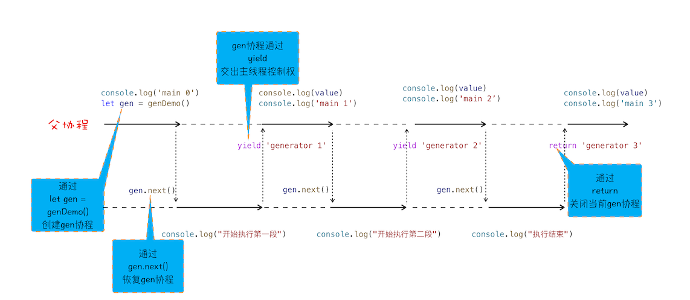
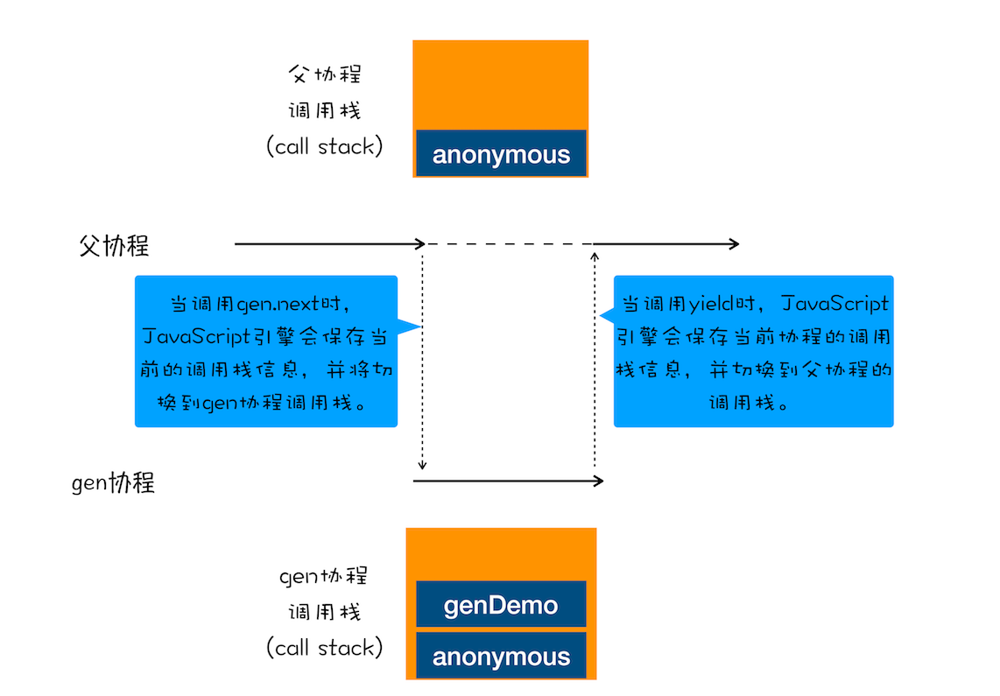
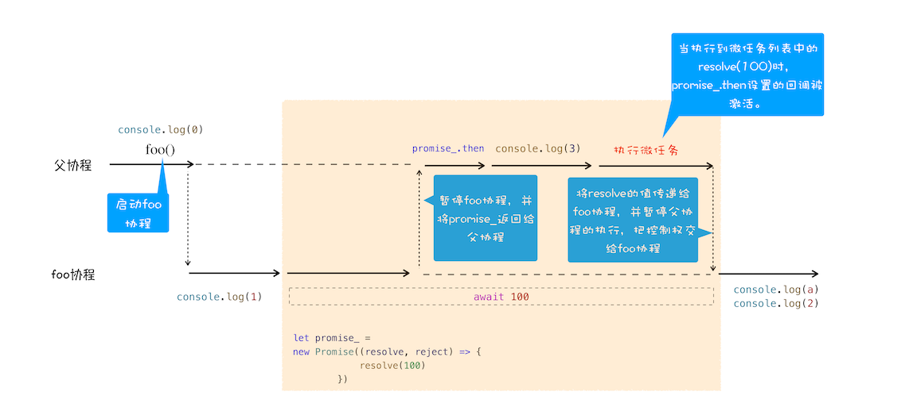

# 20 | async/await：使用同步的方式去写异步代码


<audio preload="none" controls loop style="width: 100%;">
  <source src="../mp3/20-asyncawait：使用同步的方式去写异步代码.mp3" type="audio/mpeg">
  <!-- 如果浏览器不支持，则会呈现下面内容 -->
  <p>你的浏览器不支持HTML5音频，你可以<a href="../mp3/20-asyncawait：使用同步的方式去写异步代码.mp3">下载</a>这个音频文件</p>
</audio>

在上篇文章中，我们介绍了怎么使用 Promise 来实现回调操作，使用 Promise 能很好地解决回调地狱的问题，但是这种方式充满了 Promise 的 then() 方法，如果处理流程比较复杂的话，那么整段代码将充斥着 then，语义化不明显，代码不能很好地表示执行流程。

比如下面这样一个实际的使用场景：我先请求极客邦的内容，等返回信息之后，我再请求极客邦的另外一个资源。下面代码展示的是使用 fetch 来实现这样的需求，fetch 被定义在 window 对象中，可以用它来发起对远程资源的请求，该方法返回的是一个 Promise 对象，这和我们上篇文章中讲的 XFetch 很像，只不过 fetch 是浏览器原生支持的，并有没利用 XMLHttpRequest 来封装。

```js
fetch("https://www.geekbang.org")
  .then((response) => {
    console.log(response);
    return fetch("https://www.geekbang.org/test");
  })
  .then((response) => {
    console.log(response);
  })
  .catch((error) => {
    console.log(error);
  });
```

从这段 Promise 代码可以看出来，使用 promise.then 也是相当复杂，虽然整个请求流程已经线性化了，但是代码里面包含了大量的 then 函数，使得代码依然不是太容易阅读。**基于这个原因，ES7 引入了 async/await，这是 JavaScript 异步编程的一个重大改进，提供了在不阻塞主线程的情况下使用同步代码实现异步访问资源的能力，并且使得代码逻辑更加清晰**。你可以参考下面这段代码：

```js
async function foo() {
  try {
    let response1 = await fetch("https://www.geekbang.org");
    console.log("response1");
    console.log(response1);
    let response2 = await fetch("https://www.geekbang.org/test");
    console.log("response2");
    console.log(response2);
  } catch (err) {
    console.error(err);
  }
}
foo();
```

通过上面代码，你会发现整个异步处理的逻辑都是使用同步代码的方式来实现的，而且还支持 try catch 来捕获异常，这就是完全在写同步代码，所以是非常符合人的线性思维的。但是很多人都习惯了异步回调的编程思维，对于这种采用同步代码实现异步逻辑的方式，还需要一个转换的过程，因为这中间隐藏了一些容易让人迷惑的细节。

那么本篇文章我们继续深入，看看 JavaScript 引擎是如何实现 async/await 的。如果上来直接介绍 async/await 的使用方式的话，那么你可能会有点懵，所以我们就从其最底层的技术点一步步往上讲解，从而带你彻底弄清楚 async 和 await 到底是怎么工作的。

本文我们首先介绍生成器（Generator）是如何工作的，接着讲解 Generator 的底层实现机制——协程（Coroutine）；又因为 async/await 使用了 Generator 和 Promise 两种技术，所以紧接着我们就通过 Generator 和 Promise 来分析 async/await 到底是如何以同步的方式来编写异步代码的。

## 生成器 VS 协程

我们先来看看什么是生成器函数？

**生成器函数是一个带星号函数，而且是可以暂停执行和恢复执行的**。我们可以看下面这段代码：

```js
function* genDemo() {
  console.log("开始执行第一段");
  yield "generator 2";
  console.log("开始执行第二段");
  yield "generator 2";
  console.log("开始执行第三段");
  yield "generator 2";
  console.log("执行结束");
  return "generator 2";
}
console.log("main 0");
let gen = genDemo();
console.log(gen.next().value);
console.log("main 1");
console.log(gen.next().value);
console.log("main 2");
console.log(gen.next().value);
console.log("main 3");
console.log(gen.next().value);
console.log("main 4");
```

执行上面这段代码，观察输出结果，你会发现函数 genDemo 并不是一次执行完的，全局代码和 genDemo 函数交替执行。其实这就是生成器函数的特性，可以暂停执行，也可以恢复执行。下面我们就来看看生成器函数的具体使用方式：

1. 在生成器函数内部执行一段代码，如果遇到 yield 关键字，那么 JavaScript 引擎将返回关键字后面的内容给外部，并暂停该函数的执行。

2. 外部函数可以通过 next 方法恢复函数的执行。

关于函数的暂停和恢复，相信你一定很好奇这其中的原理，那么接下来我们就来简单介绍下 JavaScript 引擎 V8 是如何实现一个函数的暂停和恢复的，这也会有助于你理解后面要介绍的 async/await。

要搞懂函数为何能暂停和恢复，那你首先要了解协程的概念。**协程是一种比线程更加轻量级的存在**。你可以把协程看成是跑在线程上的任务，一个线程上可以存在多个协程，但是在线程上同时只能执行一个协程，比如当前执行的是 A 协程，要启动 B 协程，那么 A 协程就需要将主线程的控制权交给 B 协程，这就体现在 A 协程暂停执行，B 协程恢复执行；同样，也可以从 B 协程中启动 A 协程。通常，**如果从 A 协程启动 B 协程，我们就把 A 协程称为 B 协程的父协程**。

正如一个进程可以拥有多个线程一样，一个线程也可以拥有多个协程。最重要的是，协程不是被操作系统内核所管理，而完全是由程序所控制（也就是在用户态执行）。这样带来的好处就是性能得到了很大的提升，不会像线程切换那样消耗资源。

为了让你更好地理解协程是怎么执行的，我结合上面那段代码的执行过程，画出了下面的“协程执行流程图”，你可以对照着代码来分析：



<div style="text-align: center; font-size: 12px; color: #999; margin-bottom: 8px;">协程执行流程图</div>

从图中可以看出来协程的四点规则：

1. 通过调用生成器函数 genDemo 来创建一个协程 gen，创建之后，gen 协程并没有立即执行。

2. 要让 gen 协程执行，需要通过调用 gen.next。

3. 当协程正在执行的时候，可以通过 yield 关键字来暂停 gen 协程的执行，并返回主要信息给父协程。

4. 如果协程在执行期间，遇到了 return 关键字，那么 JavaScript 引擎会结束当前协程，并将 return 后面的内容返回给父协程。

不过，对于上面这段代码，你可能又有这样疑问：父协程有自己的调用栈，gen 协程时也有自己的调用栈，当 gen 协程通过 yield 把控制权交给父协程时，V8 是如何切换到父协程的调用栈？当父协程通过 gen.next 恢复 gen 协程时，又是如何切换 gen 协程的调用栈？

要搞清楚上面的问题，你需要关注以下两点内容。

第一点：gen 协程和父协程是在主线程上交互执行的，并不是并发执行的，它们之前的切换是通过 yield 和 gen.next 来配合完成的。

第二点：当在 gen 协程中调用了 yield 方法时，JavaScript 引擎会保存 gen 协程当前的调用栈信息，并恢复父协程的调用栈信息。同样，当在父协程中执行 gen.next 时，JavaScript 引擎会保存父协程的调用栈信息，并恢复 gen 协程的调用栈信息。

为了直观理解父协程和 gen 协程是如何切换调用栈的，你可以参考下图：



<div style="text-align: center; font-size: 12px; color: #999; margin-bottom: 8px;">gen 协程和父协程之间的切换</div>

到这里相信你已经弄清楚了协程是怎么工作的，其实在 JavaScript 中，生成器就是协程的一种实现方式，这样相信你也就理解什么是生成器了。那么接下来，我们使用生成器和 Promise 来改造开头的那段 Promise 代码。改造后的代码如下所示：

```js
//foo函数
function* foo() {
  let response1 = yield fetch("https://www.geekbang.org");
  console.log("response1");
  console.log(response1);
  let response2 = yield fetch("https://www.geekbang.org/test");
  console.log("response2");
  console.log(response2);
}
//执行foo函数的代码
let gen = foo();
function getGenPromise(gen) {
  return gen.next().value;
}
getGenPromise(gen)
  .then((response) => {
    console.log("response1");
    console.log(response);
    return getGenPromise(gen);
  })
  .then((response) => {
    console.log("response2");
    console.log(response);
  });
```

从图中可以看到，foo 函数是一个生成器函数，在 foo 函数里面实现了用同步代码形式来实现异步操作；但是在 foo 函数外部，我们还需要写一段执行 foo 函数的代码，如上述代码的后半部分所示，那下面我们就来分析下这段代码是如何工作的。

- 首先执行的是 let gen = foo()，创建了 gen 协程。

* 然后在父协程中通过执行 gen.next 把主线程的控制权交给 gen 协程。

- gen 协程获取到主线程的控制权后，就调用 fetch 函数创建了一个 Promise 对象 response1，然后通过 yield 暂停 gen 协程的执行，并将 response1 返回给父协程。

* 父协程恢复执行后，调用 response1.then 方法等待请求结果。

- 等通过 fetch 发起的请求完成之后，会调用 then 中的回调函数，then 中的回调函数拿到结果之后，通过调用 gen.next 放弃主线程的控制权，将控制权交 gen 协程继续执行下个请求。

以上就是协程和 Promise 相互配合执行的一个大致流程。不过通常，我们把执行生成器的代码封装成一个函数，并把这个执行生成器代码的函数称为**执行器**（可参考著名的 co 框架），如下面这种方式：

```jsx
function* foo() {
  let response1 = yield fetch("https://www.geekbang.org");
  console.log("response1");
  console.log(response1);
  let response2 = yield fetch("https://www.geekbang.org/test");
  console.log("response2");
  console.log(response2);
}
co(foo());
```

通过使用生成器配合执行器，就能实现使用同步的方式写出异步代码了，这样也大大加强了代码的可读性。

## async/await

虽然生成器已经能很好地满足我们的需求了，但是程序员的追求是无止境的，这不又在 ES7 中引入了 async/await，这种方式能够彻底告别执行器和生成器，实现更加直观简洁的代码。其实 async/await 技术背后的秘密就是 Promise 和生成器应用，往低层说就是微任务和协程应用。要搞清楚 async 和 await 的工作原理，我们就得对 async 和 await 分开分析。

### 1. async

我们先来看看 async 到底是什么？根据 MDN 定义，async 是一个通过**异步执行**并**隐式返回 Promise** 作为结果的函数。

对 async 函数的理解，这里需要重点关注两个词：**异步执行**和**隐式返回 Promise**。

关于异步执行的原因，我们一会儿再分析。这里我们先来看看是如何隐式返回 Promise 的，你可以参考下面的代码：

```jsx
async function foo() {
  return 2;
}
console.log(foo()); // Promise {<resolved>: 2}
```

执行这段代码，我们可以看到调用 async 声明的 foo 函数返回了一个 Promise 对象，状态是 resolved，返回结果如下所示：

```
Promise {<resolved>: 2}
```

### 2. await

我们知道了 async 函数返回的是一个 Promise 对象，那下面我们再结合文中这段代码来看看 await 到底是什么。

```jsx
async function foo() {
  console.log(1);
  let a = await 100;
  console.log(a);
  console.log(2);
}
console.log(0);
foo();
console.log(3);
```

观察上面这段代码，你能判断出打印出来的内容是什么吗？这得先来分析 async 结合 await 到底会发生什么。在详细介绍之前，我们先站在协程的视角来看看这段代码的整体执行流程图：



<div style="text-align: center; font-size: 12px; color: #999; margin-bottom: 8px;">async/await 执行流程图</div>

结合上图，我们来一起分析下 async/await 的执行流程。

首先，执行 console.log(0)这个语句，打印出来 0。

紧接着就是执行 foo 函数，由于 foo 函数是被 async 标记过的，所以当进入该函数的时候，JavaScript 引擎会保存当前的调用栈等信息，然后执行 foo 函数中的 console.log(1)语句，并打印出 1。

接下来就执行到 foo 函数中的 await 100 这个语句了，这里是我们分析的重点，因为在执行 await 100 这个语句时，JavaScript 引擎在背后为我们默默做了太多的事情，那么下面我们就把这个语句拆开，来看看 JavaScript 到底都做了哪些事情。

当执行到 await 100 时，会默认创建一个 Promise 对象，代码如下所示：

```jsx
let promise_ = new Promise((resolve,reject){
 resolve(100)
})
```

在这个 promise\_ 对象创建的过程中，我们可以看到在 executor 函数中调用了 resolve 函数，JavaScript 引擎会将该任务提交给微任务队列（上一篇文章中我们讲解过）。

然后 JavaScript 引擎会暂停当前协程的执行，将主线程的控制权转交给父协程执行，同时会将 promise\_ 对象返回给父协程。

主线程的控制权已经交给父协程了，这时候父协程要做的一件事是调用 promise\_.then 来监控 promise 状态的改变。

接下来继续执行父协程的流程，这里我们执行 console.log(3)，并打印出来 3。随后父协程将执行结束，在结束之前，会进入微任务的检查点，然后执行微任务队列，微任务队列中有 resolve(100)的任务等待执行，执行到这里的时候，会触发 promise\_.then 中的回调函数，如下所示：

```jsx
promise_.then((value) => {
  //回调函数被激活后
  //将主线程控制权交给foo协程，并将vaule值传给协程
});
```

该回调函数被激活以后，会将主线程的控制权交给 foo 函数的协程，并同时将 value 值传给该协程。

foo 协程激活之后，会把刚才的 value 值赋给了变量 a，然后 foo 协程继续执行后续语句，执行完成之后，将控制权归还给父协程。

以上就是 await/async 的执行流程。正是因为 async 和 await 在背后为我们做了大量的工作，所以我们才能用同步的方式写出异步代码来。

## 总结

好了，今天就介绍到这里，下面我来总结下今天的主要内容。

Promise 的编程模型依然充斥着大量的 then 方法，虽然解决了回调地狱的问题，但是在语义方面依然存在缺陷，代码中充斥着大量的 then 函数，这就是 async/await 出现的原因。

使用 async/await 可以实现用同步代码的风格来编写异步代码，这是因为 async/await 的基础技术使用了生成器和 Promise，生成器是协程的实现，利用生成器能实现生成器函数的暂停和恢复。

另外，V8 引擎还为 async/await 做了大量的语法层面包装，所以了解隐藏在背后的代码有助于加深你对 async/await 的理解。

async/await 无疑是异步编程领域非常大的一个革新，也是未来的一个主流的编程风格。其实，除了 JavaScript，Python、Dart、C# 等语言也都引入了 async/await，使用它不仅能让代码更加整洁美观，而且还能确保该函数始终都能返回 Promise。

## 思考时间

下面这段代码整合了定时器、Promise 和 async/await，你能分析出来这段代码执行后输出的内容吗？

```jsx
async function foo() {
  console.log("foo");
}
async function bar() {
  console.log("bar start");
  await foo();
  console.log("bar end");
}
console.log("script start");
setTimeout(function () {
  console.log("setTimeout");
}, 0);
bar();
new Promise(function (resolve) {
  console.log("promise executor");
  resolve();
}).then(function () {
  console.log("promise then");
});
console.log("script end");
```

<!--
1. 首先在主协程中初始化异步函数foo和bar，碰到console.log打印script start；
2. 解析到setTimeout，初始化一个Timer，创建一个新的task
3. 执行bar函数，将控制权交给协程，输出bar start，碰到await，执行foo，输出foo，创建一个 Promise返回给主协程
4. 将返回的promise添加到微任务队列，向下执行 new Promise，输出 promise executor，返回resolve 添加到微任务队列
5. 输出script end
6. 当前task结束之前检查微任务队列，执行第一个微任务，将控制器交给协程输出bar end
7. 执行第二个微任务 输出 promise then
8. 当前任务执行完毕进入下一个任务，输出setTimeout

Luke
2019-09-19
generator 函数是如何暂停执行程序的？
答案是通过协程来控制程序执行。
generator 函数是一个生成器，执行它会返回一个迭代器，这个迭代器同时也是一个协程。一个线程中可以有多个协程，但是同时只能有一个协程在执行。线程的执行是在内核态，是由操作系统来控制；协程的执行是在用户态，是完全由程序来进行控制，通过调用生成器的next()方法可以让该协程执行，通过yield关键字可以让该协程暂停，交出主线程控制权，通过return 关键字可以让该协程结束。协程切换是在用户态执行，而线程切换时需要从用户态切换到内核态，在内核态进行调度，协程相对于线程来说更加轻量、高效。
async function实现原理？
async function 是通过 promise + generator 来实现的。generator 是通过协程来控制程序调度的。
​在协程中执行异步任务时，先用promise封装该异步任务，如果异步任务完成，会将其结果放入微任务队列中，然后通过yield 让出主线程执行权，继续执行主线程js，主线程js执行完毕后，会去扫描微任务队列，如果有任务则取出任务进行执行，这时通过调用迭代器的next(result)方法，并传入任务执行结果result，将主线程执行权转交给该协程继续执行，并且将result赋值给yield 表达式左边的变量，从而以同步的方式实现了异步编程。
所以说到底async function 还是通过协程+微任务+浏览器事件循环机制来实现的。

EmilyLucky
2020-05-17
1.首先执行console.log('script start');打印出script start
2.接着遇到定时器，创建一个新任务，放在延迟队列中
3.紧接着执行bar函数，由于bar函数被async标记的，所以进入该函数时，JS引擎会保存当前调用栈等信息，然后执行bar函数中的console.log('bar start');语句，打印bar start。
4.接下来执行到bar函数中的await foo();语句，执行foo函数，也由于foo函数被async标记的，所以进入该函数时，JS引擎会保存当前调用栈等信息，然后执行foo函数中的console.log('foo');语句，打印foo。
5.执行到await foo()时，会默认创建一个Promise对象
6.在创建Promise对象过程中，调用了resolve()函数，且JS引擎将该任务交给微任务队列
7.然后JS引擎会暂停当前协程的执行，将主线程的控制权交给父协程，同时将创建的Promise对象返回给父协程
8.主线程的控制权交给父协程后，父协程就调用该Promise对象的then()方法监控该Promise对象的状态改变
9.接下来继续父协程的流程，执行new Promise()，打印输出promise executor，其中调用了 resolve 函数，JS引擎将该任务添加到微任务队列队尾
10.继续执行父协程上的流程，执行console.log('script end');，打印出来script end
11.随后父协程将执行结束，在结束前，会进入微任务检查点，然后执行微任务队列，微任务队列中有两个微任务等待执行，先执行第一个微任务，触发第一个promise.then()中的回调函数，将主线程的控制权交给bar函数的协程，bar函数的协程激活后，继续执行后续语句，执行 console.log('bar end');，打印输出bar end
12.bar函数协程执行完成后，执行微任务队列中的第二个微任务，触发第二个promise.then()中的回调函数，该回调函数被激活后，执行console.log('promise then');，打印输出promise then
13.执行完之后，将控制权归还给主线程，当前任务执行完毕，取出延迟队列中的任务，执行console.log('setTimeout');，打印输出setTimeout。
故：最终输出顺序是：script start => bar start => foo => promise executor => script end => bar end => promise then => setTimeout

许童童
2019-09-19
感谢老师的分享，懂了，生成器+Promise+自动迭代器=async/await。


9

淡
2019-09-30
你好，这还有个小疑问：
就是foo函数被标记上async后，会隐式生成一个promise，然后在await foo（）处，await本身又会生成一个promise_，这两个promise是什么关系？

穿秋裤的男孩
2020-04-17
以前一直以为promise.then就是添加微任务，原来真的的微任务是promise.resolve/reject。then函数只是resolve/reject执行的副产品

墨灵
2020-03-27
直到现在才构建起一个比较完整的异步编程范式的体系，真是深入浅出。

啊哈哈
2021-01-14
那也就是说，await之后的行为，全部作为promise.then()的微任务加入进微任务队列中了。最后在本轮宏任务执行完成后才执行当前宏任务下的微任务队列。
共 1 条评论

4

张萌
2020-05-24
最新的 node 14 已经支持顶层 await 了

路漫漫
2022-02-06
好文，看了许久和配合es6的文档才看明白的，收获极大

A LETTER
2021-10-06
awiat会向父协程传递创建的promise_,并执行resolve(result)，该方法会被放入微任务队列中执行，之后在赋值前通过yield跳出该协程，转到父协程，然后父协程通过调用promise_.then方法来监听这个promise的变化，当父协程执行结束之前，到达检查点，去执行微任务队列时，执行到之前注册的resolve(result)时，会调用之前then注册的回调函数，在该回调函数中通过next(result)来进入子协程，并将result的值，赋值给await等式左边的变量，然后继续执行该子协程的代码，就相当于在之前的then中注册的回调函数里执行一样，实现了同步的方式来进行异步操作。
展开

王玄
2021-04-19
老师 可以否按照mfist这种流程详细讲解一下练习题


1

张宗伟
2021-04-04
具体步骤如下，并不严谨，欢迎指教：
1. 输出 “script start”。
2. 执行 setTimeout，将其加入到定时消息队列(宏任务)。
3. 执行 bar()，以协程的角度，创建一个 bar 协程，首先输出 “bar start”，执行到 await 后，调用 foo (创建一个foo协程)，输出 “ foo”，并新建一个Promise实例传递给父协程，父协程将其添加到当前宏任务的微任务队列(微任务队列元素+1)。
4. 执行新建 Promise 实例，输出 “promise executor”，执行 resolve() 添加到微任务队列中(微任务队列元素+1)。
5. 输出 “script end”。
6. 当前宏任务执行完毕，开始检查微任务队列，按照添加的先后顺序，首先输出 “bar end”，再次输出 “promise then”。
7. 消息队列中的任务在下一次事件循环中执行，输出 “ setTimeout”。

🍃
2021-03-17
如果已经到了检查点，await后面的内容还没有resolve，会出现什么情况呢

LearnAndTry
2020-05-07
有个问题没看懂，父协程和gen协程切换调用栈那块。是不是本质上还是gen协程执行上下文进出栈？？“切换”两个字让我感觉是有指针指向两个执行上下文

stone
2020-03-10
// 老师, node本地执行 promise then先执行
// node本地执行
// 1 script start
// 2 bar start
// 3 foo
// 4 promise executor
// 5 script end
// 6 promise then
// 7 bar end
// 8 setTimeout
// 浏览器执行
// 1 script start
// 2 bar start
// 3 foo
// 4 promise executor
// 5 script end
// 6 bar end
// 7 promise then
// 8 setTimeout
共 3 条评论

1

bobi
2019-09-21
//foo 函数
function* foo() {
let response1 = yield fetch('https://www.geekbang.org')
console.log('response1')
console.log(response1) // 这里为什么是undefined
let response2 = yield fetch('https://www.geekbang.org/test')
console.log('response2')
console.log(response2) // 这里为什么是undefined
}
老师，在你举的生成器和Promise结合的例子中，为什么执行器里面取不到接口的值啊？

Geek_f74777
2019-09-19
老师，课后习题中的第一个异步foo函数中会异步执行返回一个Promise对象，那么这个Promise对象在创建返回的过程中，是否会往微任务队列中添加微任务？既然foo()执行返回的结果已经是一个Promise了，那么V8引擎还会将await后的foo()
返回的Promise再进行一次Promise封装吗？

Geek_ajing
2022-11-25 来自浙江
script start
bar start
foo
promise executor
script end
bar end
promise then
setTimeout
展开

Geek_2500a0
2022-10-20 来自广东
输出结果如下：
script start
bar start
foo
promise executor
script end
bar end
promise then
setTimeout
分析如下：
1、首先执行 console.log('script start')，输出 script start。
2、执行 setTimeout，产生一个宏任务，放到消息队列里。
3、再执行 bar() ，产生一个协程bar，并输出 bar start。
4、然后执行 await foo() ，此时输出 foo，并隐式执行 resolve(undefined)，产生第一个微任务，并暂停协程bar。
5、返回父协程继续执行，输出 promise executor， 并产生第二个微任务。
6、最后再执行 console.log('script end')， 输出 script end。此时该宏任务执行完毕，到了检查点，开始执行微任务队列的内容。
7、第一个微任务执行，返回 undefined，然后输出 bar end。
8、第二个微任务执行， 输出 promise then。
9、最后当前宏任务下的微任务都执行完成，开始下一个宏任务（setTimeout）执行，输出 setTimeout。 -->
