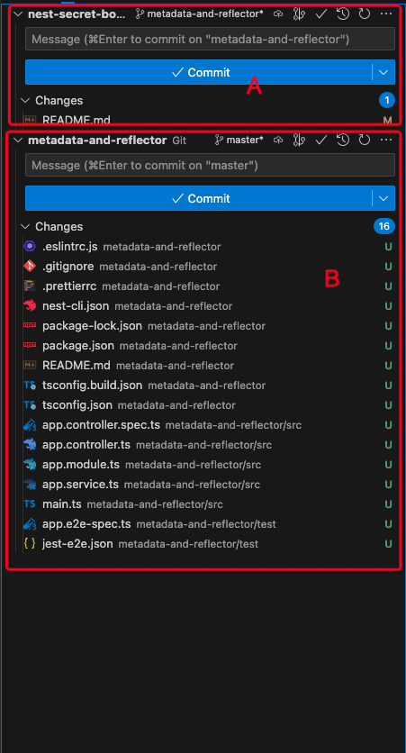

# 文件目录变动，Git 未检测到

分支 A 下的项目文件目录无法被检测到 Git 检测到，但是 Git 为该文件目录生成了新的分支监控，如下图所示：

A 区域为原分支，B 区域是新文件目录的分支，如果提交 B 区域的变更，Git 会生成新的远程仓库，而不是提交到 A 的仓库

解决方法：
&emsp;&emsp;**找到 B 目录下的 .git 文件，然后删除即可**

1. 可以查看是否存在 .git 文件

   

2. `rm -rf .git` 删除文件

   
