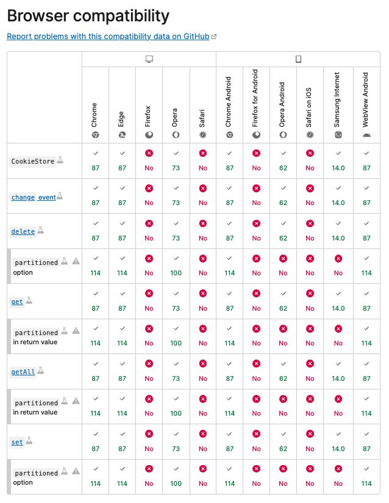

# 【滴滴】如何删除一个 Cookie

通过把该 cookie 的过期时间改为已过去的时间即可删除成功。具体可以通过操作两个字段来完成。

1. max-age：将要过期的最大秒数，设置为 -1 即可删除。

2. expires：将要过期的绝对时间，存储到 cookies 中需要通过 date.toUTCString() 处理，设置为过期时间即可删除。

如下：

```js
document.cookie = "a=3; max-age=-1";
```

下面是控制台操作步骤，可以实践一下：

```js
> document.cookie
< ""

> document.cookie = 'a=3'
< "a=3"

> document.cookie
< "a=3"

// 把该字段的 max-age 设置为 -1
> document.cookie = 'a=3; max-age=-1'
< "a=3; max-age=-1"

// 删除成功
> document.cookie
< ""
```

同时，也可以看一下最新关于 cookie 操作的 API：[CookieStore API](https://developer.mozilla.org/en-US/docs/Web/API/CookieStore)，使用其中的 cookieStore.delete(name) 删除某个 cookie（注意一下 cookieStore 各浏览器的兼容性）


