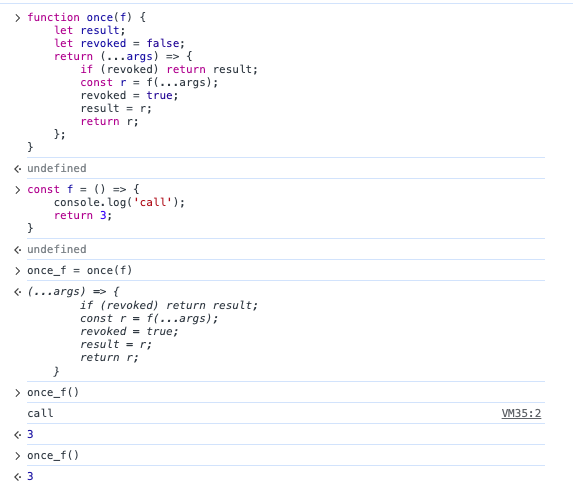

# 【头条】实现一个 once 函数，记忆返回结果只执行一次

类似于 lodash.once

**实现如下：**

```js
function once(f) {
    let result;
    let revoked = false;
    return (...args) => {
        if (revoked) return result;
        const r = f(...args);
        revoked = true;
        result = r;
        return r;
    };
}
```

**测试如图：**



[once](https://npm.devtool.tech/once)是社区使用最广泛的一个库，代码实现与上大同小异，然而每月下载量可达上亿，比 vue/react/angular 三者一个月的下载量加起来还要高一倍
