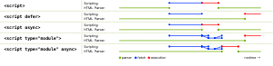

# 【美团】异步加载 JS 脚本时，async 与 defer 有何区别

> _以下图片获取自 whatwg 的规范，详情参考[原文](https://html.spec.whatwg.org/multipage/scripting.html#the-script-element)_



在*正常情况下*，即 `<script>` 没有任何额外属性标记的情况下，有几点共识：

1. JS 的脚本分为 **「加载、解析、执行」** 几个步骤，简单对应到图中就是 `fetch`（加载）和 `execution`（解析并执行）

2. **JS 的脚本加载（fetch）且执行（execution）会阻塞 DOM 的渲染**，因此 JS 一般放到最后

而 `defer` 与 `async` 的区别如下：

-   相同点：**异步加载（fetch）**
-   不同点：
    -   async 加载（fetch）完成后立即执行（execution），因此可能会阻塞 DOM 解析
    -   defer 加载（fetch）完成后延迟到 DOM 解析完成后才会执行（execution），但会在事件 `DOMContentLoaded` 之前

#### 拓展

当以下 `index.js` 加载时，属性是 `async` 与 `defer` 时，输出有何不同？

**index.html**

```html
<!DOCTYPE html>
<html lang="en">
    <head>
        <meta charset="UTF-8" />
        <meta name="viewport" content="width=device-width, initial-scale=1.0" />
        <title>Document</title>
    </head>

    <body>
        <script src="./defer.js" defer></script>
        <script src="./async.js" async></script>
        <script>
            console.log("Start");
            document.addEventListener("DOMContentLoaded", () => {
                console.log("DCL");
            });
        </script>
    </body>
</html>
```

**defer.js**

```js
console.log("Defer Script");
```

**async.js**

```js
console.log("Async Script");
```

答：defer 总是在 `DCL` 之前输出，但是 async 有可能在之前也可能在之后

即 `Start` => `Defer Script` => `DCL`, `Async Script` 是脱离 DOM 的，和加载自身文件的大小有关，文件小，加载快，然后执行；文件大，加载慢，然后执行。与 `DOMContentLoaded` 事件关系不确定。但 `JS` 脚本都是 `Load` 事件之前加载并执行完毕的，`Load` 事件是兜底事件。
