# 常用网址

 

## 软件测试

#### [2023软件测试学习路线图](https://bbs.itheima.com/forum.php?mod=viewthread&tid=405757&ordertype=1)

#### [黑马程序员软件测试学习路线图（2023官方完整版）](https://yun.itheima.com/subject/testmap/index.html)

## 博客网站

#### [ChoDocs](https://chodocs.cn/)

> **Front-end learning document collection**
> 一站式前端内容网站，包括学习路线、知识体系

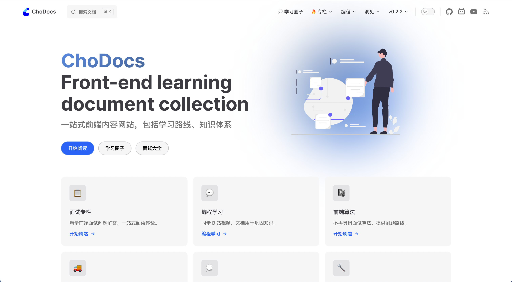

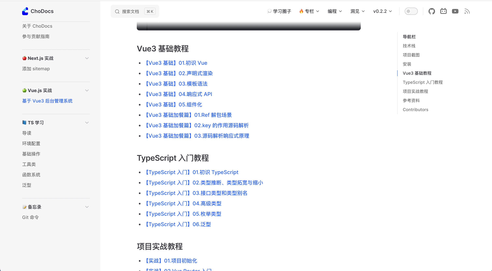

#### [Sysuke's Blog](https://www.sysuke.com/fe/frameWork/)

> Sysuke's 的博客，学习

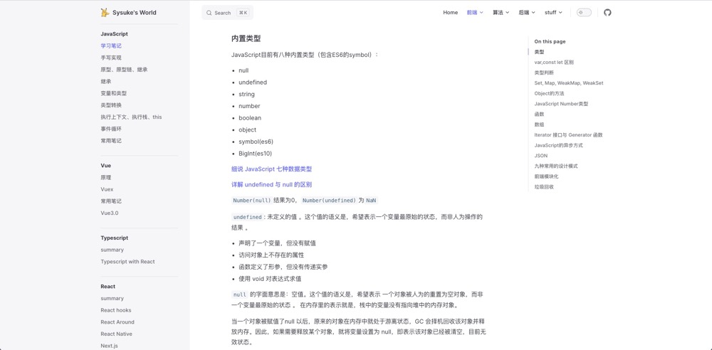

#### [LeeZhian Blog](https://www.leezhian.com/)

> LeeZhian Blog
> 记录前端的学习笔记，分享前端的知识

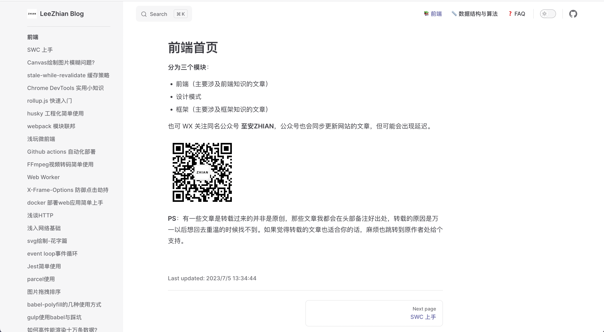

#### [冴羽的博客](https://github.com/alphawq/Blog_yayu)

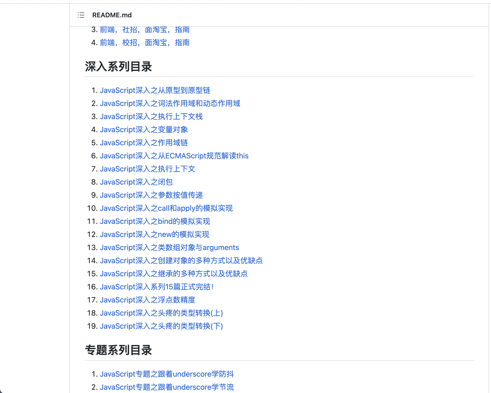

#### [程序员 poetry's Blog](https://blog.poetries.top/)

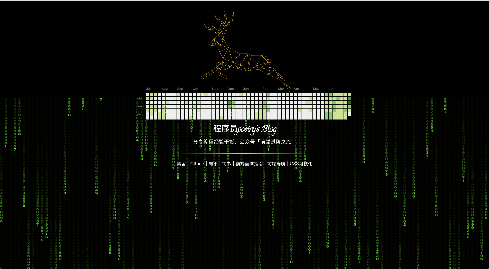

#### [A Yue's Blog](https://zyue.wiki/blog)

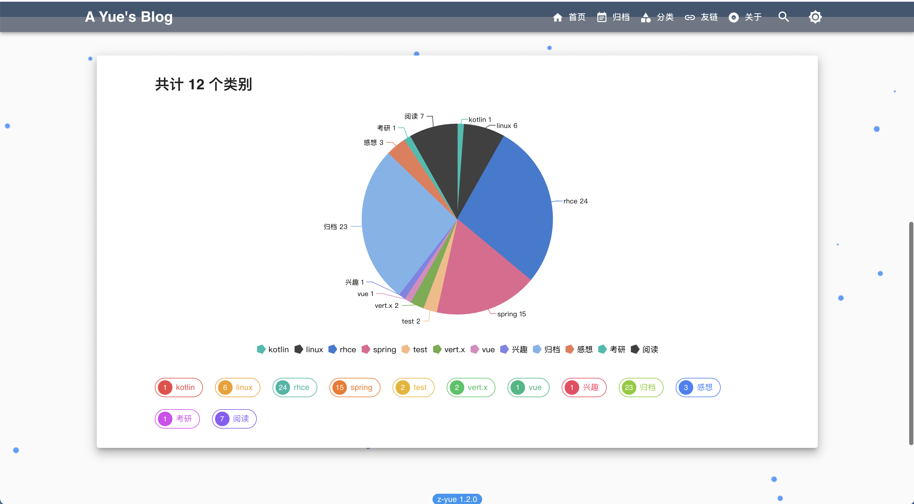

#### [雪月书韵茶香](https://www.xysycx.cn/)

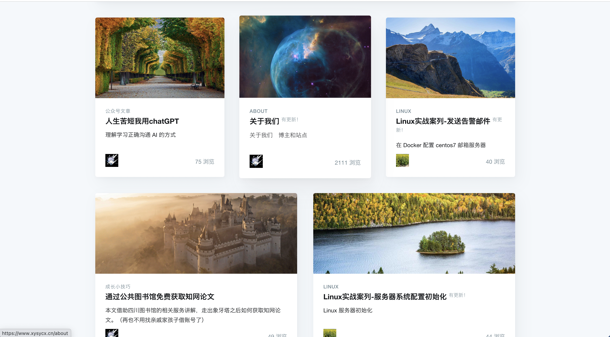

## 博客文章

#### [将 React 作为 UI 运行时](https://overreacted.io/zh-hans/react-as-a-ui-runtime/)

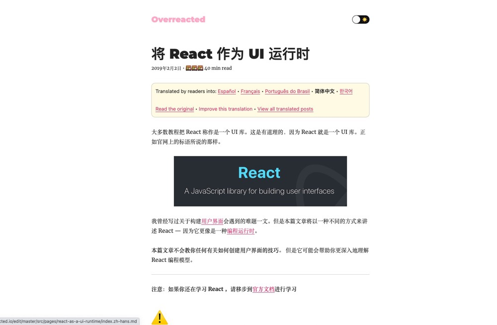

#### [基于 vitepress 的博客网站通过 valine 实现评论功能](https://wulisensen.vercel.app/blog/valine.html)

## 书籍

#### [重构改善既有代码的设计第 2 版](https://book-refactoring2.ifmicro.com/)

## 源码解读

#### [逐行剖析 Vue.js 源码](https://nlrx-wjc.github.io/Learn-Vue-Source-Code/)

## 教程

#### [ES6 入门教程](https://es6.ruanyifeng.com/)

#### [Nginx 极简教程](https://github.com/dunwu/nginx-tutorial)

## 其他

#### [Markdown 代码块编程语言清单](https://coding.net/help/docs/ci/lint/markdown-code-lang.html)

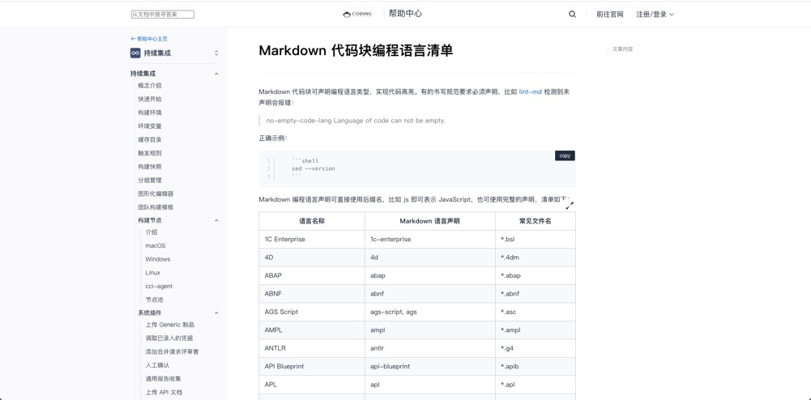

#### [Markdown 语法](https://keatonlao.gitee.io/a-study-note-for-markdown/syntax/)

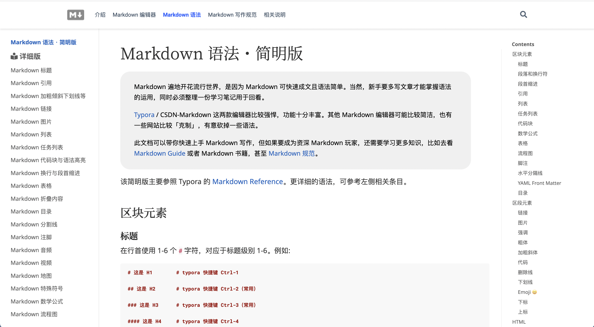

#### [Markdown 超级教程](https://publish.obsidian.md/csj-obsidian/0+-+Obsidian/Markdown/Markdown%E8%B6%85%E7%BA%A7%E6%95%99%E7%A8%8B+Obsidian%E7%89%88)

#### [CSS Inspiration -- CSS 灵感](https://chokcoco.github.io/CSS-Inspiration/#/)

> 展示了各种 css 效果

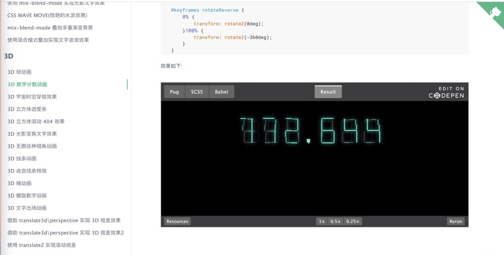

#### [visualization-collection](https://github.com/hepengwei/visualization-collection)

> 一个专注于前端视觉效果的集合应用，包含 CSS 动效、Canvas 动画、人工智能应用等上百个案例（持续更新）

##### 在线体验(PC 端)

-   体验地址：http://hepengwei.cn

*   Vue 版本：https://github.com/hepengwei/visualization-collection-vue

##### 应用展示(部分效果)

#### [Google Map Demo](https://tutorialzine.com/2015/04/first-webapp-react)

#### [turnjs4](http://www.turnjs.com/)

#### [探索前端工程化，开发前端组件库](https://juejin.cn/post/7151961741776125989)

#### [手摸手，带你用 vue 撸后台 系列一(基础篇)](https://juejin.cn/post/6844903476661583880)

#### [vue-element-admin 博客管理后台](https://github.com/PanJiaChen/vue-element-admin)

#### [Vue + Element UI 实现权限管理系统](https://blog.csdn.net/xifengxiaoma/article/details/92839201)

#### 渡一

[前端课程目录](https://duyiedu.yuque.com/hghs2q/ybli0a/bwdrtf?)

[前端课程规划与指导](https://duyiedu.yuque.com/hghs2q/qh565e/iz2enk?#WMnM)

#### [DEV-Edu gitee 仓库](https://gitee.com/dev-edu/projects)

#### [极客时间已完结课程限时免费阅读](https://freegeektime.com/posts/)

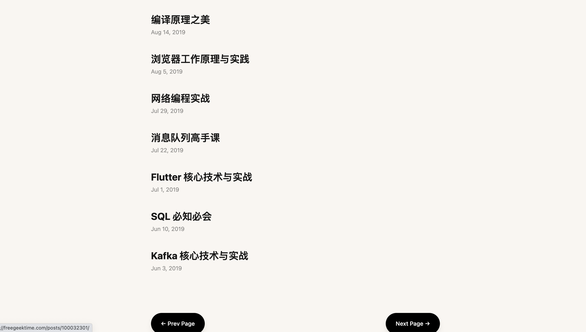

## ChatGPT 网址

-   https://chat.forefront.ai/

*   https://chat.chatgptdemo.net/

## 前端题库

#### [web 前端面试 - 面试官系列](https://vue3js.cn/interview/)

#### [flaticon](https://www.flaticon.com/)

> 矢量图标和贴纸 - PNG、SVG、EPS、PSD 和 CSS

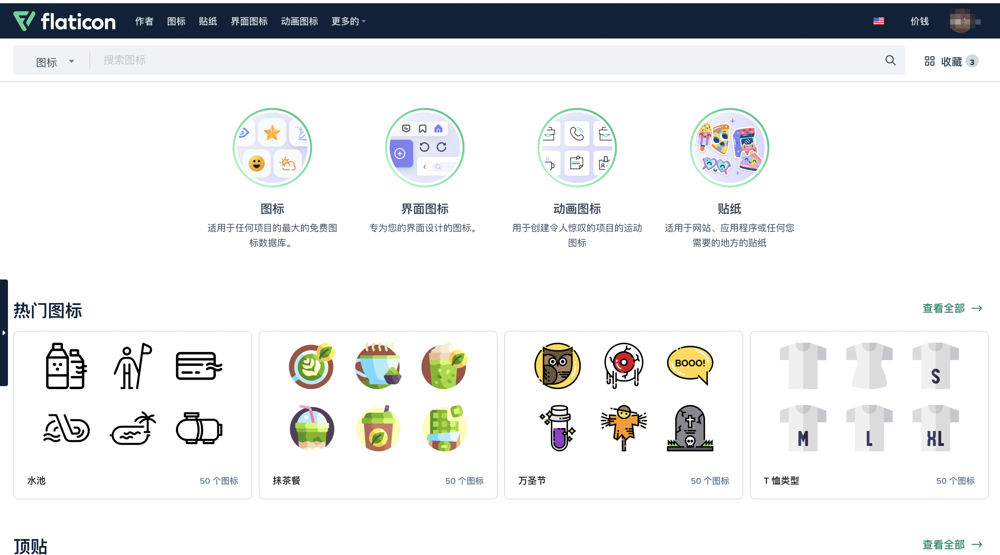
