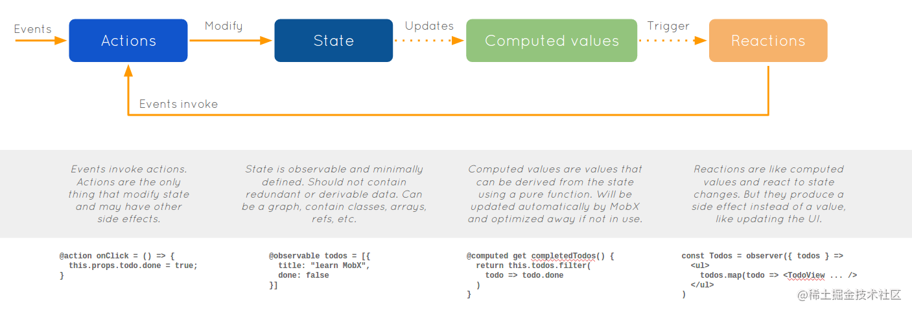
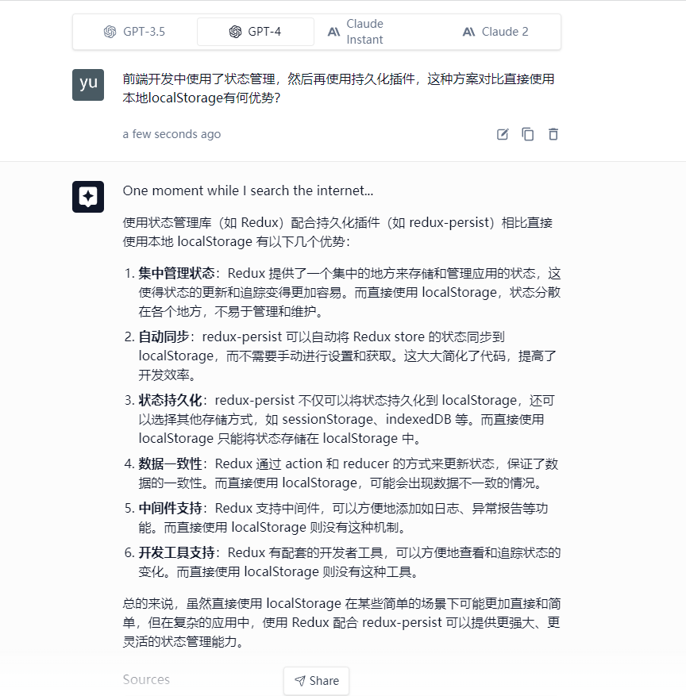

有哪些状态管理工具可以使用

1. redux

[redux](https://redux.js.org/)

Redux
要介绍 Redux，我们就不得不谈到 Flux 了:

> Flux is the application architecture that Facebook uses for building client-side web applications.It's more of a pattern rather than a formal framework
> Flux 是 Facebook 用来开发客户端-服务端 web 应用程序的应用架构，它更多是一种架构模式，而非一个特定框架。

而 Redux 更多的是遵循 Flux 模式的一种实现，是一个 JavaScript 库，它关注点主要是以下几方面：

1. Action：一个 JavaScript 对象，描述动作相关信息，主要包含 type 属性和 payload 属性：

   1. type：action 类型；
   2. payload：负载数据；

2. Reducer：定义应用状态如何响应不同动作（action），如何更新状态；

3. Store：管理 action 和 reducer 及其关系的对象，主要提供以下功能：

   1. 维护应用状态并支持访问状态（getState()）；
   2. 支持监听 action 的分发，更新状态（dispatch(action)）；
   3. 支持订阅 store 的变更（subscribe(listener)）；

4. 异步流：由于 Redux 所有对 store 状态的变更，都应该通过 action 触发，异步任务（通常都是业务或获取数据任务）也不例外，而为了不将业务或数据相关的任务混入 React 组件中，就需要使用其他框架配合管理异步任务流程，如 `redux-thunk`，`redux-saga` 等；

5. useContext

6. [zustand](https://github.com/pmndrs/zustand): 一个轻量、现代的状态管理库

> Zustand 是由 Jotai 和 React springs 的开发人员构建的快速且可扩展的状态管理解决方案, Zustand 以简单被大家所知, 它使用 hooks 来管理状态无需样板代码

`"Zustand" 只是德语的"state"`

有很多的流行 React 状态管理工具, 但一下是您更喜欢使用 Zustand 的一些原因

- 更少的样板代码
- Zustand 只在 state 的值改变时渲染组件, 通常可以处理状态的改变而无需渲染代码
- 状态管理通过简单定义的操作进行集中和更新, 在这方面和 Redux 类似, 但是又和 Redux 不太类似, Redux 开发必须创建 reducer、action、dispatch 来处理状态, Zustand 让它变得更加容易
- 使用 hooks 来管理 states, Hooks 在 react 中很流行, 因此是一个很受欢迎的状态管理库
- Zustand 使用简单使用和简单实现的代码
- 通过消除使用 `Context Provides` 从而使代码更短、更易读

更多参考[Zustand: 一个轻量、现代的状态管理库](https://juejin.cn/post/7134633741774749710)

4. [mobx](https://mobx.js.org/README.html)

状态管理库，无论是 Redux，还是 Mobx 这些，其本质都是为了解决状态管理混乱，无法有效同步的问题，它们都支持：

1. 统一维护管理应用状态；

2. 某一状态只有一个可信数据来源（通常命名为 store，指状态容器）；

3. 操作更新状态方式统一，并且可控（通常以 action 方式提供更新状态的途径）；

4. 支持将 store 与 React 组件连接，如 `react-redux`，`mobx-react`；通常使用状态管理库后，我们将 React 组件从业务上划分为两类：

   1. 容器组件（Container Components）：负责处理具体业务和状态数据，将业务或状态处理函数传入展示型组件；
   2. 展示型组件（Presentation Components）：负责展示视图，视图交互回调内调用传入的处理函数；

Mobx 和 Redux 都是 JavaScript 应用状态管理库，都适用于 React，Angular，VueJs 等框架或库，而不是局限于某一特定 UI 库。

Mobx 是一个透明函数响应式编程（Transparently Functional Reactive Programming，TFRP）的状态管理库，它使得状态管理简单可伸缩：

> Anything that can be derived from the application state, should be derived. Automatically.
> 任何起源于应用状态的数据应该自动获取。

其原理如图：

1. Action：定义改变状态的动作函数，包括如何变更状态；

2. Store：集中管理模块状态（State）和动作（action）；

3. Derivation（衍生）：从应用状态中派生而出，且没有任何其他影响的数据，我们称为 derivation（衍生），衍生在以下情况下存在：

   1. 用户界面；

   2. 衍生数据；

      衍生主要有两种：

      1. Computed Values（计算值）：计算值总是可以使用纯函数（pure function）从当前可观察状态中获取；

      2. Reactions（反应）：反应指状态变更时需要自动发生的副作用，这种情况下，我们需要实现其读写操作；

更多参考[你需要 Mobx 还是 Redux？](https://juejin.cn/post/6844903562095362056)

4. rtk

5. [Jumpsuit](https://js.org/?jumpsuit)

6. [Alt.js](http://alt.js.org/)

