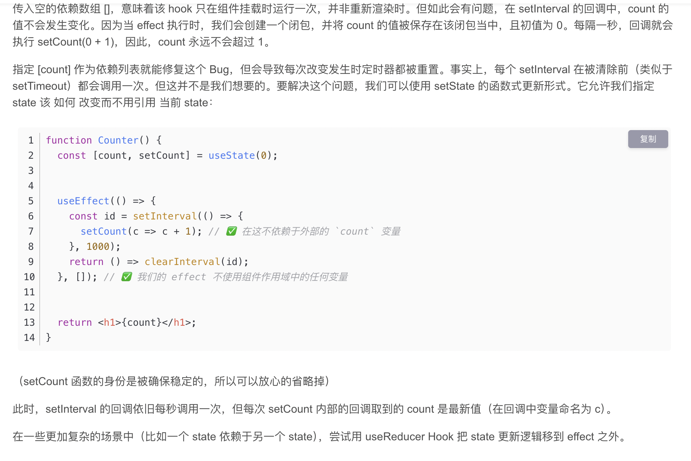
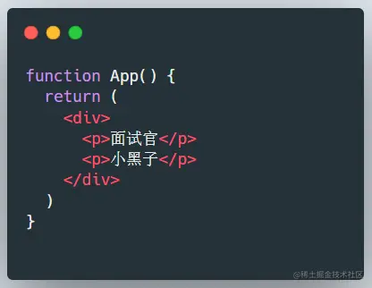
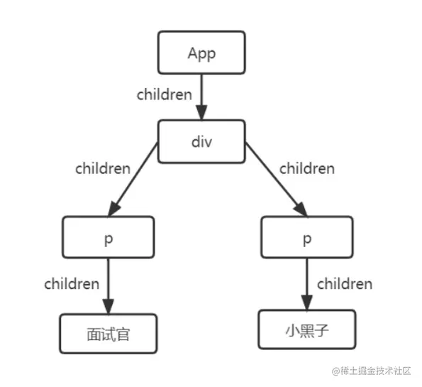
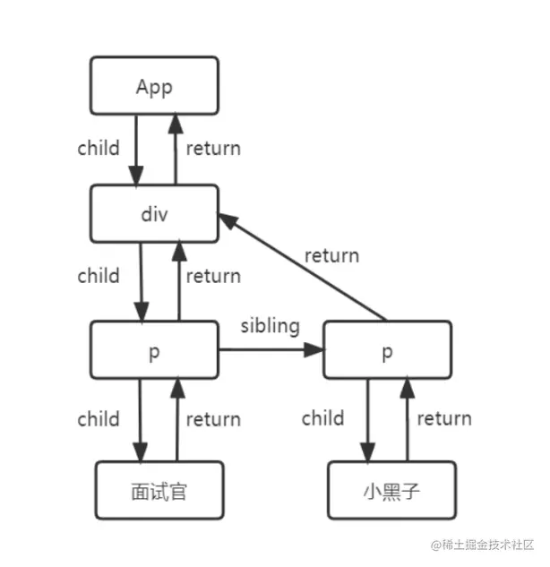
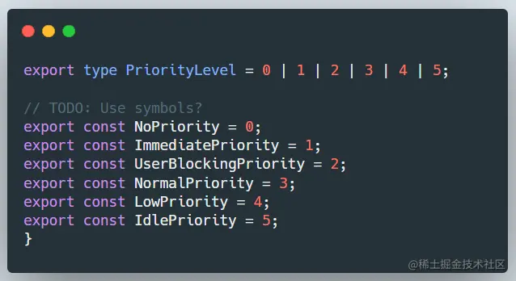

# 3 月 4 号面试题

## 1. 前端判断数据类型的方法有哪些

JS 数据类型：

string、number、boolean、undefined、null、symbol、bigint、object

7 种基本数据类型：string、number、boolean、undefined、null、symbol、bigint，存储在栈中，存取方式是先进后出。

引用数据类型 对象（Object）类型包括：数组（Array）、函数（Function）、还有两个特殊的对象：正则（RegExp）和日期（Date），存储在堆中，按优先级排序，优先级可以按照大小来规定。

### 1. typeof

可以用来确定一个值的基本数据类型，返回一个表示数据类型的字符串。数组、对象、null 都会判断为 object，其他类型正确判断。

**注意**：`typeof null` 返回“object”是历史遗留问题。

### 2. instanceof

只能正确判断引用数据类型，不能判断基本数据类型。

instanceof 可以用来测试一个对象在其原型链中是否存在一个构造函数的 prototype 属性。

### 3. constructor

constructor 有两个作用：一是判断数据类型（可以判断全部类型），二是对象实例通过 constructor 对象访问它的构造函数。

需要注意的是，如果创建一个对象来改变它的原型，constructor 就不能用来判断数据类型了。

```js
const Fn = function () {};

Fn.prototype = new Array();

const f = new Fn();

console.log(Fn.constructor === Function); // true
console.log(f.constructor === Fn); // false
console.log(f.constructor === Array); // true
```

解析：`f.constructor` 也即`f.__proto__.constructor`，
**实例对象的`__proto__`指向其构造函数的原型对象 prototype**。
故`f.__proto__`等价于 `Fn.prototype`，
所以`f.__proto__.constructor === Fn.prototype.constructor` `Fn.prototype`是`Array`的实例对象
实例对象的`constructor`属性指向构造函数本身
所以`Fn.prototype.constructor === Array`

其实就是`new Array()`得到的对象覆盖了原来的`Fn.prototype`，所以`Fn.prototype.constructor`不再指向`Fn`，而是指向了`Array`

### 4. Object.prototype.toString.call()

Object.prototype.toString.call() 是使用 Object 对象的原型方法 toString 来判断数据类型

扩展：同样是检测对象 obj 调用 toString 方法，obj.toString() 的结果和 Object.prototype.toString.call(obj)的结果不一样，这是为什么？

这是因为 toString 是 Object 的原型方法，而**Array、function 等类型作为 Object 的实例，都重写了 toString 方法**。不同的对象类型调用 toString 方法时，根据原型链的知识，调用的是对应的重写之后的 toString 方法（function 类型返回内容为函数体的字符串，Array 类型返回元素组成的字符串），而不会去调用 Object 上原型 toString 方法（返回对象的具体类型），所以采用 obj.toString()不能得到其对象类型，只能将 obj 转换为字符串类型；因此，在想要得到对象的具体类型时，应该调用 Object 原型上的 toString 方法。

### 补充提问：typeof 和 instanceof 的区别

1. 返回值类型不一样：typeof 返回一个表示数据类型的字符串，instanceof 返回一个布尔值，表示是否为指定类的实例。

2. 判断范围和精确性不一样：typeof 对基本数据类型判断较精确，但是对引用类型无法进一步区分。对于对象、数组、null 会判断成 object。instanceof 判断引用类型更精确，无法判断基本数据类型。instanceof 是通过指定类实例来判断的，但是基本数据类型是没有对象的，无法通过类实例来进行判断。因为实例是一个对象或函数创建的，是引用类型。

### 补充提问：typeof 为什么判断 null 时会判断成 object（自己补充）

在 JS 第一个版本之后，所有值都存储在 32 位的单元中，每个单元包含一个小的**类型标签（1-3 bits）**以及当前要存储值的真实数据。类型标签存储在每个单位的低位中，共有 5 种数据类型：

```js
000: object     - 当前存储的数据指向一个对象
  1: int        - 当前存储的数据是一个 31 位的有符号整数
010: double     - 当前存储的数据指向一个双精度的浮点数
100: string     - 当前存储的数据指向一个字符串
110: boolean    - 当前存储的数据是布尔值
```

如果最低位是 1，则类型标签标志位的长度只有 1 位；如果最低位是 0，则类型标签标志位的长度占 3 位，为存储其他四种数据类型提供了额外两个 bit 的长度。

有两种特殊数据类型：

-   undefined 的值是(-2^30)(一个超出整数范围的数字)
-   null 的值是机器码 NULL 指针（null 指针的值全是 0）

那么也就是说，null 的 类型标签也是 000，和 Object 的类型标签一样，所以会被判定为 Object。

## 2. 防抖和节流

### 防抖

防抖是指用户事件被触发 n 秒后执行回调逻辑，如果在这 n 秒内，事件再次被触发，则重新计时。换言之，程序只执行最后一次触发事件，以此来优化性能。

应用场景：

-   搜索框输入的时候，用户输入 1-9，不加防抖页面会渲染 9 次。加上防抖之后，页面渲染一次即可。
-   防止多次提交按钮，只执行最后一次提交

实现代码：

```js
const debounce = (fn, delay) => {
    let timer = null;
    return (...args) => {
        clearTimeout(timer); // 先清除定时器
        timer = setTimeout(() => {
            // 然后设置定时器，执行回调逻辑
            fn(args);
        }, delay);
    };
};
```

### 节流

节流是指当用户遇到连续用户事件时，以 n 秒为间隔进行阻断，目的是减少同一时间段内连续事件的触发频率，以此来提升性能。

应用场景：

-   拖拽场景：固定时间内执行一次，防止超高频次触发位置变动
-   缩放场景：监控浏览器 resize（调整浏览器窗口大小，触发 resize 事件）
-   动画场景：避免短时间内多次触发动画引发性能问题

实现代码：

```js
const trottle = (fn, delay) => {
    let timer = null;
    return function (...args) {
        if (timer) return; // timer 存在，说明已经执行了回调函数，暂时不再执行
        timer = setTimeout(() => {
            // 先执行回调逻辑，再清除定时器
            fn(args);
            clearTimeout(timer);
            timer = null;
        }, delay);
    };
};
```

## 3. 深拷贝

1. JSON.parse(JSON.stringify(obj))
    - 遇到 undefined 和函数会报错；
    - 对象里面 key 为 Symbol、值为 undefined、值为函数，都会被忽略；
    - 对象里面值为 NaN、值为 Infinity 会变成 null。
2. js 工具库 lodash.cloneDeep(obj)
3. 递归复制

```js
const deepClone = (obj) => {
    if (typeof obj !== 'object' || obj === null) {
        return obj;
    }
    let result;
    if (Array.isArray(obj)) {
        result = [];
        for (let i = 0; i < obj.length; i++) {
            result.push(deepClone(obj[i]));
        }
    } else if (obj instanceof Set) {
        result = new Set([...obj]);
    } else if (obj instanceof Map) {
        result = new Map([...obj]);
    } else {
        result = {};
        Reflect.ownKeys(obj).forEach((key) => {
            result[key] = deepClone(obj[key]);
        });
    }
    return result;
};
```

4. Object.assign({}, obj)
    - 只深拷贝第一层

> 扩展：
> JSON.parse 和 JSON.stringify 还可以用于删除对象属性

## 4. 前端跨域

### 什么时候发生跨域

跨域是由于浏览器的同源策略所导致的，是发生在**页面**到**服务端**请求的过程中

### 怎么解决跨域

#### 1. Nginx 反向代理（可以使用 docker 开镜像）

> 使用 Nginx 充当代理服务器，分发请求到目标服务器

```js
server {
    listen      5000;
    server_name 127.0.0.1;

    location / {
        proxy_pass http://127.0.0.1:3000;
        proxy_set_header Host $host;
        proxy_set_header X-Real-IP $remote_addr;
        proxy_set_header X-Forwarded-For $proxy_add_x_forwarded_for;
    }

    location /api {
        proxy_pass http://127.0.0.1:4000;
        proxy_set_header Host $host;
        proxy_set_header X-Real-IP $remote_addr;
        proxy_set_header X-Forwarded-For $proxy_add_x_forwarded_for;
    }
}
```

#### 2. 搭建 BFF 层来解决跨域问题（Node 环境）

使用中间件 koa-cors
Koa-cors 是基于 node-cors 开发的 Koa CORS 中间件。
安装

```js
npm install koa-cors --save
```

使用

```js
var koa = require('koa');
var route = require('koa-route');
var cors = require('koa-cors');
var app = koa();

app.use(cors());

app.use(
    route.get('/', function () {
        this.body = { msg: 'Hello World!' };
    })
);

app.listen(3000);
```

> Node.js 同域部署页面，搭建 BFF 层，服务对服务请求

```js
const KoaRouter = require('koa-router');
const router = new KoaRouter();

router.post('/api/task', async (ctx, next) => {
    const res = await axios.post('http://127.0.0.1:4000/api/task');
    ctx.body = res.data;
});

app.use(router.routes());
app.use(router.allowedMethos());
```

##### 延伸问题：引入 BFF 层有什么好处

BFF 全称 `Backend For Frontend`，一般是指在前端与服务器端搭建一层由前端维护的 Node Server 服务。

其好处有：

-   **数据处理**。对数据进行校验、清洗及格式化，使得数据与前端更契合。
-   **数据聚合**。后端无需处理大量的表连接工作，第三方接口聚合工作，业务逻辑简化为各个资源的增删改查，由 BFF 层聚合各个资源的数据，后端可集中处理性能问题、监控问题、消息队列等。
-   **权限前移**。在 BFF 层统一认证鉴权，后端无需做权限校验，后端可直接部署在集群内网，无需向外网暴露服务，减少了后端复杂度。

其坏处是：

-   引入复杂度。新的 BFF 服务需要一套基础设施的支持，如日志、异常、部署、监控等。

#### 3. 设置 CORS 头部字段

> 服务器端配置 CORS 策略，可以允许指定源（协议、域名、端口）的请求，设置`Access-Control-Allow-Origin`

CORS 是一种基于 HTTP 头的跨域解决方案，它允许服务器指定哪些域可以访问其资源。通过在响应头中添加 Access-Control-Allow-Origin 标签，服务器可以允许指定域的请求访问其资源。CORS 支持多种 HTTP 请求方法，包括 GET、POST、PUT、DELETE 等。

```js
Access-Control-Allow-Origin: http://api.bob.com  // 允许跨域的源地址
Access-Control-Allow-Methods: GET, POST, PUT // 服务器支持的所有跨域请求的方法
Access-Control-Allow-Headers: X-Custom-Header  // 服务器支持的所有头信息字段
Access-Control-Allow-Credentials: true   // 表示是否允许发送Cookie
Access-Control-Max-Age: 1728000  // 用来指定本次预检请求的有效期，单位为秒
```

#### 4. iframe 通讯

> 通过在主页嵌入一个隐藏的 iframe，将目标页面加载到 iframe 中，并通过在主页面和 iframe 页面之间使用 `postMessage()` 方法进行消息传递，从而实现跨域的数据交换。

## 5. Cookie 和 localStorage

### 项目中的登录是用什么来存储 token 的

cookie

用户在浏览器输入账号密码，发送登录请求，服务端收到请求后，从数据库拿取数据来判断账号密码是否正确。在正确的情况下，服务器在向浏览器返回登录结果的时候，会生成一个 cookie，并且在 Http Response Header 中 Set-Cookie。这样，当浏览器再次向服务端发送请求时，都会同步的带上 cookie，cookie 会附带在每个 Http 请求上。

生成机制有两种：

1. 服务端生成，在 Http Response Header 中 Set-Cookie（GoCart 项目中使用的）

2. 客户端生成，通过 document.cookie 设置

### cookie 和 Web Storage（localStorage、sessionStorage）的区别

Cookie 设置初衷是用于**维持 HTTP 状态**，不用于存储数据，因此 cookie 有以下缺点：

1. 大小限制：每个 cookie 项只能存储 **4K** 数据
2. 性能浪费：cookie 附带在 http 请求上，数据量过大，会导致每个 http 请求非常庞大，会很消耗流量和带宽。

Web Storage **专注存储**

localStorage

-   特点：以域名维度，浏览器的**持久化存储**方案，在域名下一直存在，即使关闭会话窗口或浏览器，除非主动清理，否则永久存在；
-   大小：每个项可以存储 **5M** 的数据
-   接口：同步接口，会阻塞线程

sessionStorage

-   特点：以域名维度，浏览器基于**会话级别的存储方案**，它只有在当前会话窗口存储的数据才可以读取到，一旦关闭当前页面或新开一个窗口，之前存储的数据就获取不到了。刷新页面不会删除数据。
-   大小：每个项可以存储 **5M** 的数据
-   接口：同步接口，阻塞线程

IndexedDB

-   特点：以域名维度，网页只能访问自身域名下的存储的数据，不能跨域访问。不仅可以存储字符串，还可以存储二进制数据。
-   大小：每个项至少可以存储 **250M** 或无上限的数据
-   接口：异步接口，可以防止大量数据的读写拖慢网页的表现。
-   支持事务：不会出现只改写一部分数据的情况，出现失败，会回滚到事务发生之前的状态。

## 6. React 常用的 Hooks

**1. useState**

用于在函数组件中添加状态。状态（state）是变化的数据，是组件甚至前端应用的核心。useState 有传入值和函数两种参数，返回的 setState 也有传入值和函数两种参数。

```js
// 传入值
const [state, setState] = useState(0);
// 传入函数
const [num, setNum] = useState(() => {
    let a = 1,
        b = 2;
    return a + b;
});

setState(1);
setNum((state) => state + 1); // 函数的参数是上一次的 state
```

**2. useEffect**

用于在函数组件中执行副作用操作，例如 数据获取、订阅或手动更改 React 组件的 DOM 等。副作用 effect 函数是在渲染之外额外执行的一些逻辑。它是根据第二个参数的依赖数组是否变化来决定是否执行 effect，可以返回一个清理函数，会在组件卸载前执行或每次使用更改的依赖项重新渲染之前运行。

执行时机：在渲染结束之后

```js
useEffect(() => {
    let timer = setTimeout(() => {
        console.log(num);
    }, 5000);
    return () => {
        // 清理函数
        clearTimeout(timer);
    };
}, [num]); // 如果不传第二个参数时，每次都会执行；传递第二个参数时，第二个参数有变化时执行
```

3. useLayoutEffect

和 useEffect 差不多，但是 useEffect 的 effect 函数是异步执行的，所以可能中间有次渲染会闪屏。而 useLayoutEffect 是同步执行的，所以不会闪屏，但如果计算量大可能会导致掉帧，阻塞渲染。所以，仅当在浏览器渲染之前运行效果至关重要时才需要此功能，例如：在用户看到工具提示之前测量和定位工具提示。（只有在关键时刻需要在用户看到之前运行你的 Effect 时才需要使用它，例如，在显示提示工具提示之前测量和定位位置。）

4. useInsertionEffect

回调函数会在 commit 阶段的 Mutation 子阶段同步执行，与 useLayoutEffect 的区别在于执行的时候无法访问 DOM 的引用。这个 Hook 是专门为 CSS-in-JS 库插入全局的 style 元素而设计。

**5. useReducer**

用于在函数组件中管理复杂的状态逻辑。它接受一个 reducer 函数和一个初始状态值作为参数，并返回一个包含当前状态和一个更新状态的 dispatch 函数的数组。使用 useReducer 可以更好地组织和管理状态更新逻辑，特别是在处理多个状态变量或执行异步操作时。

封装一些修改状态的逻辑到 reducer，通过 action 触发。当修改深层对象的时候，创建新对象比较麻烦，可以结合 immer 来解决。

**6. useRef**

可以保存 dom 引用或其他内容，通过`.current`来取，改变它的内容不会触发重新渲染。

返回一个可变的 ref 对象，其.current 属性被初始化为传入的参数。返回的 ref 对象在组件的整个生命周期内保持不变。这对于管理 DOM 对象、定时器或其他需要在组件生命周期内保持引用的值很有用。

7. forwardRef + useImperativeHandle

通过 forwardRef 可以从子组件转发 ref 到父组件。如果想自定义 ref 内容可以使用 useImperativeHandle 来实现。

**8. useContext**

用于在函数组件中访问 React 的 Context API。它接受一个 Context 对象作为参数，并返回该 Context 的当前值。这样，你可以在函数组件中使用 Context，而无需手动传递 props。

**9. memo + useMemo + useCallback**

memo 包裹的组件只有在 props 变化的时候才会重新渲染，useMemo、useCallback 可以防止 props 不必要的变化，两者一般是结合使用。不过当用来缓存计算结果等场景的时候，也可以单独使用 useMemo、useCallback。

useMemo 返回一个记忆化的值，该值只在依赖项数组发生变化时才会重新计算。这对于避免重复计算和提高性能很有用。

useCallback 返回一个记忆化的版本的回调函数，该回调函数在依赖项数组发生变化时才会更新。这对于防止不必要的渲染和提高性能很有用。

### 补充提问：说一说 useEffect 和 useLayoutEffect 的区别

在 React 中，用于定义有副作用因变量的 Hook 有：

-   useEffect：回调函数会**在 commit 阶段完成后异步执行**，所以不会阻塞视图渲染
-   useLayoutEffect：回调函数会**在 commit 阶段的 Layout 子阶段同步执行**，一般用于执行 DOM 相关的操作。所以如果计算量大可能会导致掉帧，阻塞渲染。

所以 useLayoutEffect 会比 useEffect 先执行。

每一个 effect 会与当前 FC 其他的 effect 形成环状链表，连接方式为单向环状链表。

其中 useEffect 工作流程可以分为：

-   声明阶段
-   调度阶段
-   执行阶段

useLayoutEffect 的工作流程可以分为：

-   声明阶段
-   执行阶段

之所以 useEffect 会比 useLayoutEffect 多一个阶段，就是因为 useEffect 的回调函数会在 commit 阶段完成后异步执行，因此需要经历调度阶段。

### 补充提问：关于 useEffect 的依赖问题



## 7. 虚拟 DOM

**虚拟 DOM 是什么？**

虚拟 DOM 最早是由 React 团队提出来的，这是一种编程思想，指的是针对真实 UI DOM 的一种描述能力。
在 React 中，使用了 JS 对象来描述真实的 DOM 结构。虚拟 DOM 和 JS 对象之间的关系：前者是一种思想，后者是一种思想的具体实现。

### 虚拟 DOM 的优势

使用虚拟 DOM 主要有两个方面的优势：

1. 相较于 DOM 的体积优势和速度优势
2. 多平台渲染的抽象能力

#### 1. 相较于 DOM 的体积优势和速度优势

-   JS 层面的计算速度要比 DOM 层面的计算快得多
    -   DOM 对象最终被浏览器渲染出来之前，浏览器会有很多工作要做（浏览器渲染原理）
    -   DOM 对象上面的属性非常多
-   虚拟 DOM 发挥优势的时机主要体现在更新阶段，相比较 innerHTML 要将已有的 DOM 节点全部销毁，虚拟 DOM 能够做到针对 DOM 节点做最小程度的修改

#### 2. 多平台渲染的抽象能力

-   浏览器、Node.js 宿主环境使用 ReactDOM 包
-   Native 宿主环境使用 ReactNative 包
-   Canvas、SVG 或者 VML（IE8）宿主环境使用 ReactArt 包
-   ReactTest 包用于渲染出 JS 对象，可以很方便的测试“不隶属于任何宿主环境的通用功能”

在 React 中通过 JSX 来描述 UI，JSX 仅仅是一个语法糖，会被 Babel 编译为 createElement 方法的调用。该方法调用之后会返回一个 JS 对象，该对象就是虚拟 DOM 对象，官方更倾向于称之为一个 React 元素。

### 虚拟 DOM 的意义（来自哲玄）：

1. **减少实际的 DOM 操作**：通过比较新旧虚拟 DOM 树的差异，React 可以确定需要更新的部分，并生成最小化的 DOM 操作序列。这样可以减少实际的 DOM 操作，从而提高性能。

2. **批量更新**：React 会将所有的更新都收集起来，等到下次渲染的时候，一次性的更新 DOM。从而避免了频繁的 DOM 操作，提高了性能。

3. **跨平台的兼容性**：虚拟 DOM 是一个轻量级的 JavaScript 对象，可以在不同的平台上运行，例如浏览器、移动设备和服务器。这使得 React 可以在多个环境中使用相同的代码和逻辑。

4. **更好的开发体验**：虚拟 DOM 使得开发者可以使用类似于 HTML 的标记语言来描述 UI，而不需要直接操作 DOM。这简化了开发过程，并提供了更好的开发体验。

## 8. React diff 算法

```js
// diff 算法是一种用于比较新旧虚拟 DOM 树的差异的算法，目标是找出需要更新的部分，并生成一个最小化的 DOM 操作序列。
```

diff 计算发生在更新阶段，当第一次渲染完成后，就会产生 Fiber 树，再次渲染的时候（更新），就会拿新的 JSX 对象（vdom）和旧的 FiberNode 节点进行一个对比，再决定如何来产生新的 FiberNode，它的目标是尽可能的复用已有的 Fiber 节点。这个就是 diff 算法。

在 React 中整个 diff 分为单节点 diff 和多节点 diff。

所谓单节点是指新的节点为单一节点，但是旧节点的数量是不一定的。

单节点 diff 是否能够复用遵循如下的顺序：

1. 判断 key 是否相同

-   如果更新前后均未设置 key，则 key 均为 null，也属于相同的情况
-   如果 key 相同，进入步骤 2
-   如果 key 不同，则无需判断 type，结果为不能复用（有兄弟节点还会去遍历兄弟节点）

2. 如果 key 相同，再判断 type 是否相同

-   如果 type 相同，那么就复用
-   如果 type 不同，则无法复用（并且兄弟节点也一并标记为删除）

多节点 diff 会分为两轮遍历：

第一轮遍历会从前往后进行遍历，存在以下三种情况：

-   如果新旧子节点的 key 和 type 都相同，说明可以复用
-   如果新旧子节点的 key 相同，但是 type 不同，这个时候就会根据 ReactElement 来生成一个全新的 fiber，旧的 fiber 被放入到 deletions 数组里面，回头统一删除。但是注意，此时遍历并不会终止
-   如果新旧子节点的 key 和 type 都不相同，结束遍历

如果第一轮遍历被提前终止了，那么意味着还有新的 JSX 元素或者旧的 FiberNode 没有被遍历，因此会采用第二轮遍历去处理。

第二轮遍历会遇到三种情况：

-   只剩下旧子节点：将旧的子节点添加到 deletions 数组里面直接删除（删除的情况）
-   只剩下新的 JSX 元素：根据 ReactElement 元素来创建 FiberNode 节点（新增的情况）
-   新旧子节点都有剩余：会将剩余的 FiberNode 节点放入一个 map 里面，遍历剩余的新的 JSX 元素，然后从 map 中去寻找能够复用的 FiberNode 节点，如果能够找到，就拿来复用（移动的情况）
    如果不能找到，就新增。然后如果剩余的 JSX 元素都遍历完了，map 结构中还有剩余的 Fiber 节点，就将这些 Fiber 节点添加到 deletions 数组里面，之后统一做删除操作。

整个 diff 算法最核心的就是两个字“复用”。

React 不使用双端 diff 的原因：

由于双端 diff 需要向前查找节点，但每个 FiberNode 节点上都没有反向指针，即前一个 FiberNode 通过 sibling 属性指向后一个 FiberNode，只能从前往后遍历，而不能反过来，因此该算法无法通过双端搜索来进行优化。
React 想看下现在用这种方式能走多远，如果这种方式不理想，以后再考虑实现双端 diff。React 认为对于列表反转和需要进行双端搜索的场景是少见的，所以在这一版的实现中，先不对 bad case 做额外的优化。

## 9. 说说对 Fiber 架构的理解？解决了什么问题？

### 问题

JavaScript 引擎和页面渲染引擎两个线程是互斥的，当其中一个线程执行时，另一个线程只能挂起等待

如果 JavaScript 线程长时间地占用了主线程，那么渲染层面的更新就不得不长时间地等待，界面长时间不更新，会导致页面响应度变差，用户可能会感觉到卡顿

而这也正是 React 15 的 Stack Reconciler 所面临的问题，当 React 在渲染组件时，从开始到渲染完成整个过程是一气呵成的，无法中断

如果组件较大，那么 js 线程会一直执行，然后等到整棵 VDOM 树计算完成后，才会交给渲染的线程

这就会导致一些用户交互、动画等任务无法立即得到处理，导致卡顿的情况

### 是什么

React Fiber 对 React 做出了一个重大改变与优化，是对 React 核心算法的一次重新实现。React Fiber 在 React v16 版本发布。

在 react 中，主要做了以下的操作：

-   为每个任务增加了优先级，React 可以根据任务的优先级动态的调整任务的执行顺序。优先级高的任务可以中断优先级低的任务，后续再重新执行优先级低的任务（可中断）
-   增加了异步任务，调用 requestIdleCallback api，浏览器空闲的时候执行（可增量）
-   FiberNode 作为一种架构：在 React v15 以及之前的版本中，Reconciler 采用的是递归的方式，因此被称之为 Stack Reconciler，到了 React v16 版本之后，引入了 Fiber，Reconciler 也从 Stack Reconciler 变为了 Fiber Reconciler，各个 FiberNode 之间通过链表的形式串联了起来。

从架构角度来看，Fiber 是对 React 核心算法（即调和过程）的重写

Fiber 架构的优点：

-   避免了阻塞主线程，可以中断任务，让主线程去做其他事情
-   可以增量更新，可以中断任务，让主线程去做其他事情
-   可以并发渲染，将任务拆分成多个小任务，并发执行（可增量）
-   可以暂停任务，让主线程去做其他事情

从编码角度来看，Fiber 是 React 内部所定义的一种数据结构，它是 Fiber 树结构的节点单位，也就是 React 16 新架构下的虚拟 DOM

一个 fiber 就是一个 JavaScript 对象，包含了元素的信息、该元素的更新操作队列、类型，其数据结构如下：

```ts
type Fiber = {
    // 用于标记fiber的WorkTag类型，主要表示当前fiber代表的组件类型如FunctionComponent、ClassComponent等
    tag: WorkTag;
    // ReactElement里面的key
    key: null | string;
    // ReactElement.type，调用`createElement`的第一个参数
    elementType: any;
    // The resolved function/class/ associated with this fiber.
    // 表示当前代表的节点类型
    type: any;
    // 表示当前FiberNode对应的element组件实例
    stateNode: any;

    // 指向他在Fiber节点树中的`parent`，用来在处理完这个节点之后向上返回
    return: Fiber | null;
    // 指向自己的第一个子节点
    child: Fiber | null;
    // 指向自己的兄弟结构，兄弟节点的return指向同一个父节点
    sibling: Fiber | null;
    index: number;

    ref:
        | null
        | (((handle: mixed) => void) & { _stringRef: ?string })
        | RefObject;

    // 当前处理过程中的组件props对象
    pendingProps: any;
    // 上一次渲染完成之后的props
    memoizedProps: any;

    // 该Fiber对应的组件产生的Update会存放在这个队列里面
    updateQueue: UpdateQueue<any> | null;

    // 上一次渲染的时候的state
    memoizedState: any;

    // 一个列表，存放这个Fiber依赖的context
    firstContextDependency: ContextDependency<mixed> | null;

    mode: TypeOfMode;

    // Effect
    // 用来记录Side Effect
    effectTag: SideEffectTag;

    // 单链表用来快速查找下一个side effect
    nextEffect: Fiber | null;

    // 子树中第一个side effect
    firstEffect: Fiber | null;
    // 子树中最后一个side effect
    lastEffect: Fiber | null;

    // 代表任务在未来的哪个时间点应该被完成，之后版本改名为 lanes
    expirationTime: ExpirationTime;

    // 快速确定子树中是否有不在等待的变化
    childExpirationTime: ExpirationTime;

    // fiber的版本池，即记录fiber更新过程，便于恢复
    alternate: Fiber | null;
};
```

### 如何解决

Fiber 把渲染更新过程拆分成多个子任务，每次只做一小部分，做完看是否还有剩余时间，如果有继续下一个任务；如果没有，挂起当前任务，将时间控制权交给主线程，等主线程不忙的时候在继续执行

即可以中断与恢复，恢复后也可以复用之前的中间状态，并给不同的任务赋予不同的优先级，其中每个任务更新单元为 React Element 对应的 Fiber 节点

实现的上述方式的是 requestIdleCallback 方法

window.requestIdleCallback()方法将在浏览器的空闲时段内调用的函数排队。这使开发者能够在主事件循环上执行后台和低优先级工作，而不会影响延迟关键事件，如动画和输入响应

首先 React 中任务切割为多个步骤，分批完成。在完成一部分任务之后，将控制权交回给浏览器，让浏览器有时间再进行页面的渲染。等浏览器忙完之后有剩余时间，再继续之前 React 未完成的任务，是一种合作式调度。

该实现过程是基于 Fiber 节点实现，作为静态的数据结构来说，每个 Fiber 节点对应一个 React element，保存了该组件的类型（函数组件/类组件/原生组件等等）、对应的 DOM 节点等信息。

作为动态的工作单元来说，每个 Fiber 节点保存了本次更新中该组件改变的状态、要执行的工作。

每个 Fiber 节点有个对应的 React element，多个 Fiber 节点根据如下三个属性构建一颗树：

```js
// 指向父级Fiber节点
this.return = null;
// 指向子Fiber节点
this.child = null;
// 指向右边第一个兄弟Fiber节点
this.sibling = null;
```

通过这些属性就能找到下一个执行目标

## 10. Fiber 架构

- Fiber 是 React 中一种新的架构，它用于实现增量式的、可中断的虚拟 DOM diff 过程。Fiber 的目标是改进 React 的性能和用户体验，使得 React 应用程序更加流畅和响应。

- 在 React 的旧版本中，虚拟 DOM diff 过程是一个递归的过程，它会一直执行直到完成，期间无法中断。这可能会导致长时间的 JavaScript 执行，从而阻塞主线程，造成页面的卡顿和不流畅的用户体验。

- 为了解决这个问题， React 引入了 Fiber 架构。Fiber 将整个虚拟 DOM diff 过程分为多个小任务，每个任务称为一个 Fiber 节点。这些 Fiber 节点被组织成一个树状结构，称为 Fiber 树。

- Fiber 树可以被中断和恢复，这意味着在执行 Fiber 树的 diff 过程时，可以在任意时刻中断当前任务，并优先执行其他任务。这样可以使得应用程序更加灵活地响应用户的交互和其他优先级的任务，提高性能和响应性。

- 通过 Fiber 架构， React 可以根据任务的优先级动态地调整任务的执行顺序，从而更好地控制 JavaScript 的执行。这使得 React 应用程序可以在不阻塞主线程的情况下进行虚拟 DOM diff，减少页面的卡顿和提高用户体验。

- 总而言之， Fiber 是 React 中一种新的架构，用于实现增量式的、可中断的虚拟 DOM diff 过程。
它通过将 diff 过程分为多个小任务，并根据优先级动态地调整任务的执行顺序，提高 React 应用程序的性能和响应性。

## 11. Fiber 架构

### 有了解过 Fiber 吗，讲一下你对 Fiber 的理解？

在 v16 之前，React 的渲染流程是，JSX -> render function -> VDOM。
v16 之后，React 的渲染流程变成了，JSX -> render function -> VDOM -> Fiber。
很显然，使用 Fiber 就相当于是把虚拟 DOM 多转换了一次,举个例子：


虚拟 DOM 结构是这样的：


转换成 Fiber 之后结构是这样的：


其中 child 指向子节点，return 指向父节点，sibling 指向的是下一个兄弟节点。
这样就形成了一个链表树的结构，在遍历的时候就可以采用循环的方式去遍历。

### 那什么是并发模式呢，有什么作用？

并发在服务端一般针对的是请求，高并发是指大量请求在短时间内打到服务器上，造成性能瓶颈。

而在 React 里，并发指的是触发 setState 的事件，一次 setState 就是一次更新，如果在短时间内触发了多次 setState，就会出现并发问题。

如果一次 setState 的耗时很长，在一帧之内还没有更新完，那么就会让用户感觉卡顿。

而由于 React 的更新机制效率比较低，在一些极端场景中，可能会出现耗时长的更新任务，为了解决极端场景的性能瓶颈问题，React 设计了并发模式。

总结一句话就是：并发模式是用来解决 React 自身更新性能差的问题。

### React 的更新性能不好，原因是什么呢？

主要有两方面的原因：

1. 一是在 v16 之前，React 更新时的 diff 是“无脑 diff”，由于 React 内部并不知道具体哪些组件需要更新，所以 setState 时会将整颗虚拟 DOM 树进行比对，说直白点就是一竿子捅到底，这样会导致很多不必要的更新计算，影响到性能。即便 React 提供了包括 shouldComponentUpdate、memo 等 API 让开发者去手动优化，在复杂场景依然会出现过度更新的情况。而 Vue 由于采用了响应式的依赖收集，在状态改变时就已经知道哪些组件需要更新，只需要通知到对应的组件，在组件内部做 diff 算法，更新粒度会小很多，所以 Vue 压根就不需要 shouldComponentUpdate 也能表现很好。

2. 第二个原因是 JSX 过于自由，在编译时能做的静态优化比较有限，这也导致 React 在性能上不如 Vue。

### 讲讲为什么 Fiber 要设计成链表树的结构？

是为了实现可中断更新，因为并发模式要求将任务拆成一段一段，每完成一小段就去看看一帧内的时间还够不够，不够的话就先暂停，让优先级更高的用户事件先响应，等到浏览器空闲了再去执行暂停了的任务。

而由于 Fiber 树是一颗链表树，它不仅记录着父子上下级关系，还记录着前后的顺序，相当于遍历每个节点的顺序都被记录了下来，所以即便中断了，也可以在之后恢复。

### 讲讲优先级是怎么回事？

刚刚不是讲到可中断更新嘛，为了实现低优先级任务给高优先级任务让步，React 弄了一套优先级机制，并且实现了一套任务调度，有点类似于实现了属于 React 自己的事件循环机制。（不得不说 React 玩得可真花，而且这里面还用到了二进制和小顶堆的知识。）

具体来说就是，React 的 Scheduler 给任务的优先级划分成 5 个级别（Nopriprity 除外）：


除了 0 之外，数字越小的优先级越高。ImmediatePriority 是最高优先级，用于表示紧急任务，主要是一些离散型事件，像用户点击和输入，以及开发者手动标记的高优先级任务。

其次是 UserBlockingPriority，主要是一些连续型事件，比如 scroll，drag，mouseover，这些虽然也是事件但相对点击和输入来说并不那么紧急。

另外 NormalPriority 是普通优先级，LowPriority 低优先级，IdlePriority 是空闲优先级，优先级最低。

至于怎么判断具体任务属于哪个优先级，React 另外弄了一套 Lane 优先级的机制，使用二进制来表示优先级，然后在运行时会将 Lane 优先级转换成 Scheduler 优先级。

而关于 Lane 优先级里面具体的实现细节，今天我就不讲了，如果我能进入你们公司，再单独开个分享会讲讲吧。

### 并发模式有实际的应用场景吗？

有，但不多。因为前端的绝大多数场景，并不会触及到 React 的性能瓶颈，对于前端来说，纯 CPU 计算的性能损耗甚至远不及一次 DOM 操作，而 React 的可中断更新，只能中断纯计算，并不能中断 DOM 操作。
我这里举一些并发模式可能会起作用的场景：

1. 游戏应用：游戏应用有频繁的交互，并发模式可以用来提升交互体验。当然，很多场景其实也可以用防抖和节流来优化。

2. 地图应用：地图应用往往有大量的数据渲染，会带来复杂的计算，开启并发模式能起到一定优化作用。

3. 机器学习应用：比如用 Tesorflow.js 开发浏览器人工智能。因为机器学习的计算大多是 CPU 密集型的且计算量繁大，理论上也是并发模式的适用场景之一。
