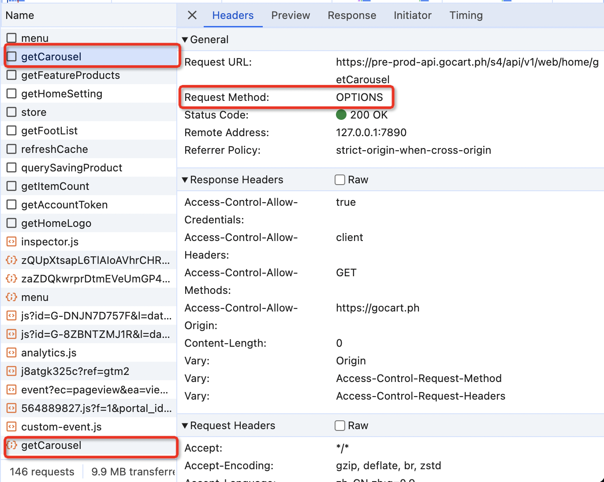
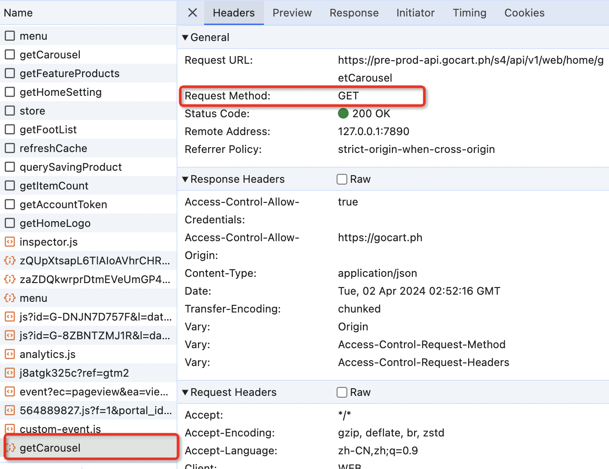

# 4 月 1 号面试题

## 1. 自我介绍

## 2. 链表

链表是物理存储单元上非连续的、非顺序的存储结构，它是由一个个结点，通过指针联系起来的，其中每个结点包括了数据和指针。

算法可以使用快慢指针，快指针一次走两步，慢指针一次走一步，如果快慢指针相遇，说明有环。

数组是连续的、顺序的

## 3. 跨域几次请求

**两次请求**

#### 第一次是 OPTIONS 请求



在发生正式请求之前，先发送一次预检请求，通过预检请求来检测实际请求是否可以被服务器接受。只要是带了自定义 header 头的跨域请求，都需要发生一次预检请求。浏览器会根据 OPTIONS 请求的响应结果来决定是否继续发送真实请求进行跨域资源请求。

触发预检请求的条件：

1. 产生了复杂请求
   相对的是简单请求，简单请求的定义：

    - 请求方法是 GET、HEAD 或者 POST，请求方法是 POST 的时候，Content-Type 必须是 application/x-www-form-urlencoded、multipart/form-data 或者 text/plain 之一，或者没有 Content-Type。
    - 请求没有自定义 HTTP 头（在实际项目开发中，一般需要将用户信息或者登陆的 token 放在 header 头中，传递给后端，用于用户信息验证，这种就属于 自定义 HTTP 头）

    所以，复杂请求是指 请求方法不是 GET、HEAD 或者 POST，或者请求头中包含自定义 HTTP 头的请求。

2. 发生了跨域

#### 第二次是简单（GTE、HEAD 或满足简单请求条件的 POST）请求



## 4. 什么是同源策略

同源策略是一种约定，是浏览器最核心也最基本的安全功能。在浏览器中，允许某个网页脚本访问另一个网页的数据，但前提是必须同源（即协议、域名、端口号都相同）。
目的：保护用户信息安全，防止恶意的网站窃取数据。
限制范围：

## 5. get 和 post 的区别

-   get 在浏览器回退时是无害的，而 post 会再次发送请求，get 请求可以直接在浏览器中访问，支持刷新和后退，而 post 不能直接在浏览器访问，刷新后数据要重新发送。

-   get 产生的 url 地址可以被标记（Bookmark），而 post 不可以

-   get 请求会被浏览器主动缓存，而 post 不会，除非主动设置

-   get 请求参数会被完整保留在浏览器的历史记录中，而 post 中的参数不会被保留

-   get 请求只能进行 url 编码，而 post 支持多种编码方式

-   get 只接受 ASCII 字符，而 post 没有限制

-   get 参数通过 url 传递，post 参数放在 body 上

-   **get 请求在 url 中传送的参数是有长度限制的，而 post 没有**
    get 的参数约定俗成的放在 url 的 query 中，而 url 是有长度限制的。关于 url 的长度，http 协议本身也没有对 get 或 post 做过多的限制，只是浏览器和服务端分别做了不同程度的限制。浏览器 IE 限制是 2048 个字符，Chrome 限制在 2M，其他浏览器也各有各的限制，但一般比 IE 大。为什么做这个限制呢？原因是服务端解析一个字符串的时候，需要分配内存，而 url 必须作为一个整体去看待，没有办法分块处理，就必须预先分配一块足够大的内存来存储 url。如果 url 太长或者并发量高的话，就很容易挤爆服务器的内存。为了解决这个性能问题，所以各端对 url 都做了不同程度的限制。这个就是 get 请求数据有上限的底层原因。

-   **get 比 post 更不安全，因为参数直接暴露在 url 上，所以不能用来传递敏感信息**
    在 http 协议上 get 和 post 本质上只是请求方式的不同，协议并没有做过多的限制，只是从规范上大家约定俗成更倾向于把 get 请求的参数放到 query 中，把 post 请求的参数放到 body 上，这样相当于 get 请求的参数直接放到了 url 上，如果中间带有密码信息，直观上会显得并不那么安全。
    但其实对于网络安全的角度而言，query 和 body 上的参数都是明文的，http 本身就是不安全的协议，请求在任何一个网络节点被劫持，内容都是透明的。get 和 post 只是请求方式的不同，本身并不对安全起作用。
    真正要做到安全需要双端加密，如 https 双端加密后，即使在任何网络节点截取到了包，也截取不了内容，这才是本质上的安全。

## 6. cookie 和 session

Cookie（HTTP Cookie）和 Session（会话）都是用于在 Web 应用程序中维护状态和用户身份的两种不同机制：

#### 1. 存储位置

-   Cookie：Cookie 是存储在客户端（通常是用户的浏览器）中的小段文本数据。浏览器会在每次请求中自动发送 Cookie 到服务器，以便服务器可以识别用户。
-   Session：Session 数据通常存储在服务器上，而不是在客户端。服务器为每个用户创建一个唯一的会话，然后在服务器上存储会话数据。

#### 2. 持久性

-   Cookie：Cookie 可以具有持久性，可以设置过期时间。如果没有设置过期时间，Cookie 将成为会话 Cookie，存在于用户关闭浏览器前的会话期间。
-   Session：会话数据通常存在于用户活动的会话期间，一旦会话结束（用户退出登录或关闭浏览器），会话数据通常会被删除。

#### 3. 安全性

-   Cookie：Cookie 数据存储在客户端，可能会被用户篡改或窃取。因此，敏感信息通常不应该存储在 Cookie 中，或者应该进行加密。
-   Session：Session 数据存储在服务器上，客户端不可见，因此通常更安全，特别适合存储敏感信息。

#### 4. 服务器负担

-   Cookie：服务器不需要维护 Cookie 的状态，因为他们存储在客户端。每次请求中都包含 Cookie，服务器只需要验证 Cookie 的有效性。
-   Session：服务器需要维护会话数据，这可能增加服务器的负担，尤其是在大型应用程序中。

#### 5. 跨多个页面：

-   Cookie：Cookie 可以被跨多个页面和不同子域各项共享，这使得它们适用于用户跟踪和跨多个页面的数据传递。
-   Session：会话数据通常只在单个会话期间可用，而不容易在不同会话之间共享。

#### 6. 无需登录状态

-   Cookie：Cookie 可以在用户未登录的情况下使用，例如用于购物车或用户首选项。
-   Session：会话通常与用户的身份验证和登录状态相关，需要用户登录后才能创建和访问会话。

## 7. umi 的封装

Umi.js 封装了一系列功能和工具，旨在简化 React 应用的开发流程，提升开发效率。以下列举了一些 Umi 的重要封装：

路由系统：

配置式路由：Umi 采用配置文件（如 routes.ts 或 umi/router.ts）来定义路由，支持嵌套路由、动态路由参数、异步加载、权限控制等高级功能。
约定式路由：遵循特定文件夹结构和命名约定，自动生成路由配置，简化路由管理。
数据流管理：

Dva：默认集成了 Dva 状态管理库，提供易于使用的 Model 概念，实现状态管理、副作用操作（side effects）和数据流控制。
UI 组件库：

Ant Design：与 Ant Design UI 库深度集成，提供丰富的企业级 UI 组件，支持主题定制和样式调整。
微前端：

Qiankun：内置 Qiankun 微前端解决方案，支持子应用的注册、加载、隔离和生命周期管理，便于构建大型、复杂的企业级应用。
构建与部署：

Webpack：封装了 Webpack 配置，简化构建流程，提供一键编译、热更新、代码分割、Tree Shaking 等优化。
FaaS 支持：与 Serverless Functions（如阿里云函数计算、腾讯云 SCF 等）无缝对接，简化云函数的开发和部署。
插件系统：

插件市场：拥有丰富的官方和社区插件，涵盖代码风格检查、国际化、SEO 优化、统计分析、Mock 数据、性能监控等多个方面，通过简单的配置即可添加所需功能。
开发工具：

CLI 命令：提供一系列命令行工具，如创建项目、启动开发服务器、构建生产环境、代码生成等。
开发辅助：内建支持 TypeScript、ESLint、Prettier 等开发工具，确保代码质量和一致性。
企业级特性：

多环境配置：支持灵活的环境变量配置，便于在不同环境下切换 API 接口、资源配置等。
权限管理：提供基础的权限控制机制，可以配合路由和业务逻辑实现角色权限分配。
国际化（i18n）：内置国际化支持，方便进行多语言应用的开发。
总之，Umi.js 通过对路由、数据流、UI 组件、微前端、构建工具、插件系统、开发工具以及一系列企业级特性的封装，为开发者构建 React 应用提供了一站式的解决方案。这些封装极大地降低了开发门槛，提升了开发效率，尤其适合于中大型企业级项目。

## 8. umi 全局状态管理

在 Umi.js 中，全局状态管理通常依托于其默认集成的 Dva.js 库实现。Dva 借鉴了 Redux 的思想，但在使用上进行了简化，提供了 Model 的概念，以便更易于管理全局状态。以下是如何在 Umi 项目中进行全局状态管理的步骤和要点：

1. 创建 Model

全局状态管理的关键在于定义和管理 Model。Model 是一个 JavaScript 对象，包含了状态(state)、改变状态的操作(reducers)以及可能涉及异步操作的副作用函数(effects)。在 Umi 项目中，通常在 src/models 目录下创建新的 Model 文件（如 counter.js）：

```jsx
// src/models/counter.js
export default {
    namespace: 'counter', // 命名空间，用于区分不同Model
    state: { count: 0 }, // 初始状态

    reducers: {
        increment(state, { payload }) {
            return { ...state, count: state.count + payload };
        },
        decrement(state) {
            return { ...state, count: state.count - 1 };
        },
    },

    effects: {
        *asyncIncrement({ payload }, { call, put }) {
            const response = yield call(api.increment, payload);
            yield put({ type: 'increment', payload: response.data });
        },
    },
};
```

2. 连接 Model 与组件

为了在 React 组件中使用全局状态，需要通过 connect 高阶函数将 Model 与组件关联起来。connect 接收两个函数作为参数，分别用于指定哪些状态和操作应该被映射到组件的 props 上：

```jsx
import { connect } from 'umi';
import CounterComponent from './CounterComponent';

const mapStateToProps = (state) => ({
    count: state.counter.count,
});

const mapDispatchToProps = (dispatch) => ({
    onIncrement: (amount) =>
        dispatch({ type: 'counter/increment', payload: amount }),
    onDecrement: () => dispatch({ type: 'counter/decrement' }),
});

export default connect(mapStateToProps, mapDispatchToProps)(CounterComponent);
```

3. 使用 Model 数据和操作

在经过 connect 处理后的组件中，可以直接通过 props 访问全局状态和调用操作方法：

```jsx
// CounterComponent.js
function CounterComponent({ count, onIncrement, onDecrement }) {
    return (
        <div>
            <p>Count: {count}</p>
            <button onClick={() => onIncrement(1)}>+</button>
            <button onClick={onDecrement}>-</button>
        </div>
    );
}
```

4. 全局状态查询与订阅

除了通过 connect 在组件中使用全局状态外，还可以直接使用 useModel Hook（仅限函数组件）或 getModel 方法（在任何地方）来查询或订阅全局状态：

```jsx
// 使用 useModel Hook（函数组件）
import { useModel } from 'umi';

function AnotherComponent() {
    const [count, { increment }] = useModel('counter');
    // ...
}

// 使用 getModel 方法（任意位置）
import { getModel } from 'umi';

const counterModel = getModel('counter');

console.log(counterModel.getState().count); // 查询状态
counterModel.dispatch({ type: 'increment', payload: 1 }); // 发起操作
```

5. 异步数据加载与处理

Dva 通过 effects 处理异步操作。在 effects 中，可以使用 call、put、select 等方法来调用异步 API、触发其他 Model 的 reducer 或查询当前状态。如上述 asyncIncrement 效果所示。

6. 模型聚合与分发

Umi 中所有的 Model 都会被自动收集并在全局范围内可用。如果需要将某些状态或操作分发到特定范围（如某个路由下的组件），可以使用 modelExtend 方法或在路由配置中指定 models 字段。

7. 状态持久化

对于需要持久化的状态，可以使用诸如`redux-persist`

## 9. axios

axios 是一个流行的 JavaScript HTTP 库，用于在浏览器和 Node.js 环境中发送网络请求。在实际项目中，对其进行封装是为了提供更符合项目需求、易于管理和扩展的请求处理方式。封装 axios 通常包括以下内容：

-   基础配置：

设置通用的请求基 URL、超时时间、请求头（如认证信息、Content-Type 等）、代理设置等。
可能会根据不同环境（如开发、生产）设定不同的配置项。

-   请求/响应拦截器：

添加请求拦截器，在发送请求前统一处理，如自动附加 JWT 令牌、添加请求 ID、转换请求数据格式等。
添加响应拦截器，对返回的响应进行统一处理，如检查状态码、处理异常、提取或转换数据、处理 API 错误消息等。

-   错误处理：

统一捕获网络错误、超时错误、解析错误等，转化为项目内部的错误类型或提示信息。
可能会结合全局状态管理（如 Redux、Vuex）存储和清除错误状态，或触发全局通知（如 Toastr、Message 组件）显示错误信息。

-   请求方法封装：

封装 GET、POST、PUT、DELETE 等 HTTP 方法，简化调用方式，隐藏细节如请求类型、数据序列化等。
可能会根据项目需求添加额外的请求方法，如批量操作、上传下载等特殊场景。

-   自动派生 URL：

根据给定的资源名称和可能的 ID，自动拼接成完整的 API 请求 URL，简化 API 调用。

-   Token 管理：

自动处理登录状态验证，如在请求头中携带 JWT token，以及在 token 过期时刷新 token 或引导用户重新登录。

-   类型安全：

如果项目使用 TypeScript，封装时可能会添加类型定义，确保请求和响应数据的类型安全。

-   缓存机制：

实现请求结果的缓存策略，如基于 LRU 算法的本地缓存、ETag/Last-Modified 条件请求等，以减少不必要的网络请求。

-   日志记录：

记录请求的详细信息（如 URL、请求参数、响应状态、耗时等），用于调试、监控和分析。

-   适配器模式：

采用适配器模式设计，允许轻松更换底层 HTTP 库（如从 axios 换成 fetch），而不影响上层调用。
封装后的 axios 实例或请求函数库，为项目提供了统一、便捷且具有项目特色的网络请求接口，增强了代码的可维护性和一致性。这样的封装不仅可以减少重复代码，还能更好地应对项目需求变化和后期维护。

## 10. 三次握手和四次挥手的原因

TCP 协议的三次握手和四次挥手是 TCP 协议中的重要概念，用于建立连接和关闭连接。

### TCP 三次握手

#### 三次握手的目的

三次握手其实是指建立一个 TCP 连接时，需要客户端和服务器总共发送 3 个包。

主要作用就是为了确认双方的接收能力和发送能力是否正常，指定初始化序列号为后面的可靠性传送做准备。

#### 三次握手的过程

-   **第一次握手（SYN）**：
    客户端给服务端发送一个 SYN（同步）标志的 TCP 包，该包包含一个随机生成的初始化序列号（ISN）。
    这表示客户端希望与服务端建立一个连接，并且指定来一个用于数据传输的起始序号。
    此时客户端处于 SYN_SENT 状态。

    -   **作用**：客户端发送网络包，服务端接收到了，这样服务端就能得到结论：客户端的发送能力和服务端的接收能力都是正常的。

-   **第二次握手（SYN + ACK）**：
    服务端接收到客户端的 SYN 包后，它会回应一个带有 SYN 和 ACK（客户端 ISN + 1，确认）标志的 TCP 包，这个响应包不仅确认了接收到的 SYN，还包含了服务端的初始化序列号。
    这两个序列号表示了双方用于传输数据的初始顺序。
    此时服务端处于 SYN_RCVD 状态。

    -   **作用**：服务端发送包，客户端接收到了。客户端可以得到结论：服务端的接收和发送能力，客户端的接收和发送能力都是正常的。但此时，服务端还不知道客户端的接收能力是否正常。

-   **第三次握手（ACK）**：
    客户端接收到服务端的响应后，它会发送一个带有 ACK（服务端 ISN + 1） 标志的 TCP 包，表示对服务端的响应已经收到。
    至此，连接建立完成，双方可以开始进行数据传输。
    此时客户端处于 ESTABLISHED 状态。服务端接收到 ACK 报文后，也处于 ESTABLISHED 状态。

    -   **作用**：客户端发送包，服务端接收到了。此时，服务端可以得到结论：客户端的接收、发送能力，服务端自身的接收、发送能力都是正常的。

#### 为什么不是两次握手

如果是两次握手，发送端可以确定自己的发送和接收能力都是正常的，但是接收端只能确定自己的接收能力和发送端的发送能力是正常的，无法确定自己发送的包发送端是否能正常接收。
并且两次握手的话，客户端有可能因为网络阻塞等原因会发送多个请求报文，延时到达的请求又会与服务端建立连接，从而浪费服务端的资源。

### 四次挥手

#### 四次挥手的目的

终止连接

#### 四次挥手的过程

-   **第一次挥手（FIN）**：
    客户端发送一个 FIN（结束）标志的 TCP 包，该包中指定一个序列号，表示终止请求，断开连接。
    此时，客户端处于 FIN_WAIT1 状态，停止发送数据，等待服务端的确认。

-   **第二次挥手（FIN + ACK）**：
    服务端收到 FIN 之后，会回应一个带有 FIN 和 ACK 标志的包给客户端，表示已经收到客户端的报文了。
    此时，服务端处于 CLOSE_WAIT 状态。

-   **第三次挥手（FIN）**：
    服务端将剩余数据发送完毕，没有数据需要发送了，此时，服务端也想断开连接了，就和第一次挥手一样，给客户端发送一个 FIN 报文，且指定一个序列号。表示服务端停止发送数据，准备断开连接。
    此时，服务端处于 LAST_ACK 状态。

-   **第四次挥手（FIN + ACK）**：
    客户端收到 FIN 之后，发送带有 FIN 和 ACK 标志的包给服务端，表示客户端接收到服务端断开连接的信息了，客户端开始断开连接。
    此时，客户端处于 TIME_WAIT 状态。
    等待一段时间后，客户端进入 CLOSED 状态。服务端接收到 ACK 报文后，也进入 CLOSED 状态

#### 四次挥手的原因

服务端在接收到客户端断开连接的 FIN 报文后，并不会立即关闭连接，而是先发送一个 ACK 包告诉先客户端接收到关闭连接的请求。只有当服务端的所有数据发送完毕之后，才会发送 FIN 报文断开连接，因此需要四次挥手。
（服务端收到客户端断开连接的请求，知道客户端没有请求了，但是服务端的数据可能还没发送完成。所以前两次挥手确认客户端发送完毕，后两次挥手确认服务端数据发送完毕）

## 11. 怎么部署项目

## 12. antd 受控组件和非受控组件

我们对某个组件状态的掌控，它的值是否只能由用户设置，而不能通过代码控制

value 和 onChange 来实现受控组件

## 13. react 中怎么进行兄弟组件通信

## 14. input 框的怎么变得受控

```jsx
const [value, setValue] = useState('');
const onChange = (e) => {
    setValue(e.target.value);
};

<input value={value} onChange={onChange} />
```